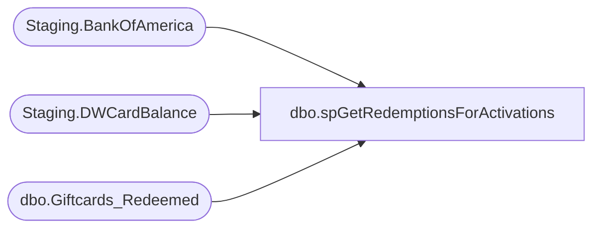

# dbo.spGetRedemptionsForActivations

**Database:** SOX  
**Server:** papamart  

## Architecture Diagram



## Table Dependencies

| Referenced Table |
|---|
| Staging.BankOfAmerica |
| Staging.DWCardBalance |
| dbo.Giftcards_Redeemed |

## Stored Procedure Code

```sql
-- =============================================================================================================
-- Name: [spGetRedemptionsForActivations]
--
-- Description:	
--		Generate Redemptions for more Activations

--
-- Revision History
--		Name:			Date:			Comments:
--		Brian Byas		8/17/2016		created
-- =============================================================================================================

CREATE PROCEDURE [dbo].[spGetRedemptionsForActivations]
@asOfDateKey int
AS

DECLARE @Source AS varchar(10);
SET @Source = 'VLA' + CAST(@asOfDateKey AS varchar);
--SET @Source = 'VLA' + CAST(@asOfDateKey AS varchar)+'-1';  -- Used This On 4/6/2023 because we had to reprocess Fiscal Year 2022 due to FiServ Incomplete Data


INSERT INTO dw.dbo.Giftcards_Redeemed
	(	Store_Key,
		transaction_id,
		Date_key,
		redemption_amount,
		discount_amount,
		giftcard_no,
		currency_key,
		MID,
		SOURCE,
		activation_discount_amount,
		daysSinceLastActivation)
	SELECT
		-1 AS store_key,
		-1 AS transaction_id,
		@asOfDateKey AS date_key,
		b.balance AS redemption_amount,
		0 AS discount_amount,
		b.GiftCardNumber AS giftcard_no,
		b.CurrencyKey AS currency_key,
		b.MID AS MID,
		@Source AS [SOURCE],
		b.ActivationDiscountAmount AS activation_discount_amount,
		@asofDateKey - b.date_key AS daysSinceLastActivation
	FROM
		Staging.DWCardBalance b WITH (NOLOCK)
		LEFT JOIN Staging.BankOfAmerica gb WITH (NOLOCK)
			ON b.GiftCardNumber = gb.CardNumber
	WHERE
		gb.CardNumber IS NULL
		AND b.Balance > 0
```

