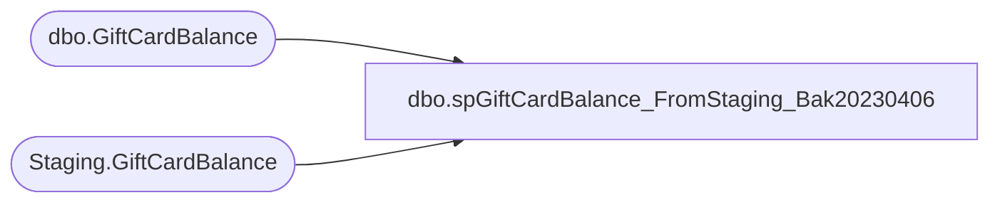

# dbo.spGiftCardBalance_FromStaging_Bak20230406

**Database:** SOX  
**Server:** papamart  

## Architecture Diagram



## Table Dependencies

| Referenced Table |
|---|
| dbo.GiftCardBalance |
| Staging.GiftCardBalance |

## Stored Procedure Code

```sql
-- =============================================================================================================
-- Name: spGiftCardBalance_FromStaging
--
-- Description:	
--		Insert Stage Data into SOX.dbo.GiftCardBalance from Staging Tables 

--
-- Revision History
--		Name:			Date:			Comments:
--		Brian Byas		8/17/2016		created
-- =============================================================================================================
CREATE PROCEDURE [dbo].[spGiftCardBalance_FromStaging_Bak20230406]
@AuditQuarter int,
@AuditQuarterKey int,
@AuditYear int

AS
BEGIN
	
	

--*************************************************************************
--******** Insert Stage Data into SOX.dbo.GiftCardBalance *******
--*************************************************************************

INSERT INTO SOX.dbo.GiftCardBalance
SELECT	
	@AuditQuarterKey AS AuditQuarterKey,
	mstr.CardNumber AS CardNumber,
	mstr.ActivationMid AS ActivationMID,
	mstr.ActivationStore AS ActivationStore,
	mstr.ActivationAmount AS ActivationAmount,
	mstr.RedemptionAmount AS RedemptionAmount,
	mstr.ReloadAmount AS ReloadAmount,
	mstr.AdjustedAmount AS AdjustedAmount,
	mstr.ServiceFeeAmount AS ServiceFeeAmount,
	mstr.OutstandingBalance AS OutstandingBalance,
	mstr.ActivationDate AS ActivationDate
FROM
	(SELECT
			LTRIM(RTRIM(stg.ActivationMid)) AS ActivationMid,
			stg.ActivationStore,
			LTRIM(RTRIM(stg.CardNumber)) AS CardNumber,
			CAST(CASE
				WHEN stg.ActivationAmount LIKE '%(%' THEN '-' + REPLACE(REPLACE(stg.ActivationAmount, ')', ''), '(', '')
				ELSE stg.ActivationAmount
			END AS money) AS ActivationAmount,

			CAST(CASE
				WHEN stg.RedemptionAmount LIKE '%(%' THEN '-' + REPLACE(REPLACE(stg.RedemptionAmount, ')', ''), '(', '')
				ELSE stg.RedemptionAmount
			END AS money) AS redemptionAmount,

			CAST(CASE
				WHEN stg.ReloadAmount LIKE '%(%' THEN '-' + REPLACE(REPLACE(stg.ReloadAmount, ')', ''), '(', '')
				ELSE stg.ReloadAmount
			END AS money) AS ReloadAmount,

			CAST(CASE
				WHEN stg.AdjustedAmount LIKE '%(%' THEN '-' + REPLACE(REPLACE(stg.AdjustedAmount, ')', ''), '(', '')
				ELSE stg.AdjustedAmount
			END AS money) AS AdjustedAmount,

			CAST(CASE
				WHEN stg.ServiceFeeAmount LIKE '%(%' THEN '-' + REPLACE(REPLACE(stg.ServiceFeeAmount, ')', ''), '(', '')
				ELSE stg.ServiceFeeAmount
			END AS money) AS ServiceFeeAmount,

			CAST(CASE
				WHEN stg.OutstandingBalance LIKE '%(%' THEN '-' + REPLACE(REPLACE(stg.OutstandingBalance, ')', ''), '(', '')
				ELSE stg.OutstandingBalance
			END AS money) AS OutstandingBalance,
			CAST(stg.ActivationDate AS datetime) AS ActivationDate
		FROM
			SOX.Staging.GiftCardBalance stg
		WHERE 
			1 = 1
			AND ISNUMERIC(stg.CardNumber) = 1
			AND stg.AuditQuarterKey=@AuditQuarterKey) mstr
			
			
		ORDER BY CardNumber ASC


END
```

