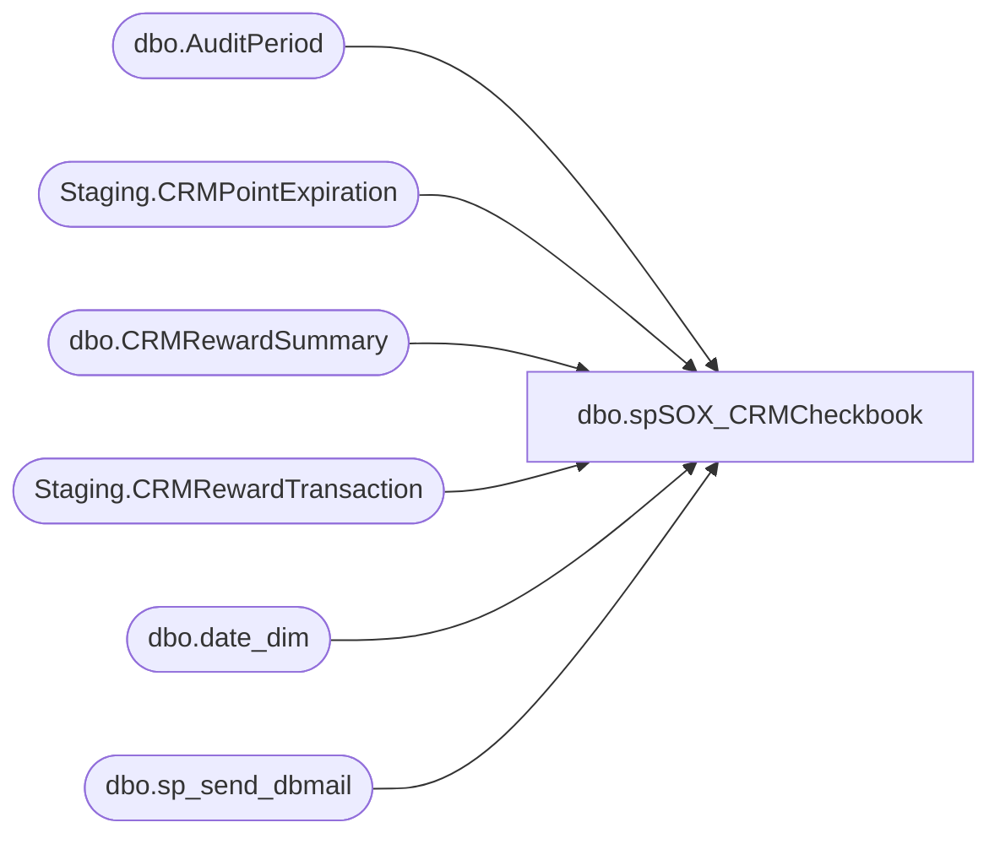

# dbo.spSOX_CRMCheckbook

**Database:** SOX  
**Server:** papamart  

## Architecture Diagram



## Table Dependencies

| Referenced Table |
|---|
| dbo.AuditPeriod |
| Staging.CRMPointExpiration |
| dbo.CRMRewardSummary |
| Staging.CRMRewardTransaction |
| dbo.date_dim |
| dbo.sp_send_dbmail |

## Stored Procedure Code

```sql
CREATE proc [dbo].[spSOX_CRMCheckbook] 

as

-- =====================================================================================================
-- Name: spSOX_CRMCheckbook 
--
-- Description: Captures CRM loyalty points data, maintains monthly 'checkbook' to track activity month to month
--				
-- Revision History
--		Name:			Date:			Comments:
--		Dan Tweedie		2017-01-19		Created proc
--		Dan Tweedie		2017-02-27		I put steps 1 and 2 into SSIS, so CRM data is captured and staged on CRM server, then SSIS data flows it to Papamart, then this proc does the final steps on papamart
--      Ian Wallace     2020-02-13		deployed a couple  of changes/fixes:
				--the redeemed query was looking at specific calendar date (last day) for redemption count, but now it is looking transaction dates occurring in the last period range
				--the expired point insert statement was inserting into the current period rows so I added a previous audit key variable for that insert to use 
-- =====================================================================================================


set nocount on
--SSIS has already staged the data to papamart.sox.staging.CRMRewardTransaction and papamart.sox.staging.CRMPointExpiration
declare 
			@FiscalStartKey int,
			@mindate date,
			@maxdate date, 
			@fiscalyear int, 
			@fiscalperiod int,
			@AuditPeriodKey int,
			@FiscalStartKey2 int,		-- added 2/13/2020
			@fiscalyearPrev int,		-- added 2/13/2020
			@fiscalperiodPrev int,		-- added 2/13/2020
			@AuditPeriodKeyPrev int,	-- added 2/13/2020
			@fiscalyearCurr int, 
			@fiscalperiodCurr int,
			@calendardate date,
			@calendardateEnd date;

		with FirstFiscalPeriodDateKeys as
			(
				select min(date_key) MinDateKey
				from dw.dbo.date_dim 
				where cast(actual_date as date) <= cast(getdate() as date)
				group by fiscal_year, fiscal_period
			)
		select @FiscalStartKey = max(date_key)
		from dw.dbo.date_dim dd
		join FirstFiscalPeriodDateKeys dk on dd.date_key = dk.MinDateKey

		select @fiscalyear = max(fiscal_year)
		from dw.dbo.date_dim 
		where date_key < @FiscalStartKey

		select @fiscalperiod = max(fiscal_period)
		from dw.dbo.date_dim 
		where date_key < @FiscalStartKey
		and fiscal_year = @fiscalyear

		select @mindate=StartDate, @maxdate = EndDate
		from SOX.dbo.AuditPeriod 
		WHERE AuditYear=@fiscalyear AND AuditPeriod=@fiscalperiod;

------ new code block added 2/13/2020 to obtain auditPeriodKeyPrev, used in expired points query ---- 
	;with FirstFiscalPeriodDateKeys2 as
			(
				select min(date_key) MinDateKey
				from dw.dbo.date_dim 
				where cast(actual_date as date) < cast(getdate() as date) 
				group by fiscal_year, fiscal_period
			)
		select @FiscalStartKey2 = max(date_key) from dw.dbo.date_dim dd join FirstFiscalPeriodDateKeys2 dk on dd.date_key = dk.MinDateKey		
		select @fiscalyearPrev = max(fiscal_year) from dw.dbo.date_dim where date_key = @FiscalStartKey2
		select @fiscalperiodPrev = max(fiscal_period) from dw.dbo.date_dim where date_key = @FiscalStartKey2 and fiscal_year = @fiscalyearPrev
		SELECT @AuditPeriodKeyPrev=AuditPeriodKey  FROM SOX.dbo.AuditPeriod WHERE AuditYear=@fiscalyearPrev AND AuditPeriod=@fiscalperiodPrev;
--------------------------    END NEW SECTION   --------------------------------------------


-------------------------------- Begin Step 3 -----------------------------
		-- Get AuditPeriodKey for CURRENT MONTH.  We want to sum all points in the stg 
		-- table to find the current balance (or month beginning points) for each country.
		select 
			@fiscalyearCurr = fiscal_year,
			@fiscalperiodCurr = fiscal_period
		from dw.dbo.date_dim 
		where date_key = @FiscalStartKey

		SELECT @AuditPeriodKey=AuditPeriodKey 
		FROM SOX.dbo.AuditPeriod
		WHERE AuditYear=@fiscalyearCurr AND AuditPeriod=@fiscalperiodCurr;

		-- Move data from stage to CRMRewardSummary 
		-- Insert BeginningPointsTotal for current period.  SUM(reward_header.points_posted) equals the total outstanding points.
		INSERT INTO SOX.dbo.CRMRewardSummary (AuditPeriodKey, CountryCode, BeginningPointsTotal, InsertDate, InsertUser)
		SELECT	@AuditPeriodKey, country_code, SUM(points_posted), CAST(GETDATE() AS DATE), 'bab\sqlservices'
		FROM SOX.Staging.CRMRewardTransaction 
		GROUP BY country_code
		ORDER BY country_code;
		-------------------------------- End Step 3 -----------------------------

		-------------------------------- Begin Step 4 ---------------------------
		
		-- Update Earned and Adjusted for previous period
		-- The rows for this period already exist because we inserted the beginning totals last period
		WITH RewardCategoryPoints (AuditPeriodKey, CountryCode, EarnedPointsTotal, AdjustedPointsTotal) AS (
			SELECT	a.AuditPeriodKey, c.country_code,
					SUM(CASE WHEN reward_category='S' THEN points_posted ELSE 0 END),
					SUM(CASE WHEN reward_category='A' THEN points_posted ELSE 0 END)
			FROM SOX.Staging.CRMRewardTransaction c
			INNER JOIN SOX.dbo.AuditPeriod a
				ON a.AuditYear=@fiscalyear
				AND a.AuditPeriod=@fiscalperiod
			WHERE transaction_date BETWEEN @mindate and @maxdate
			GROUP BY a.AuditPeriodKey, c.country_code
			)
		UPDATE s 
		SET		s.EarnedPointsTotal=r.EarnedPointsTotal, 
				s.AdjustedPointsTotal=r.AdjustedPointsTotal,
				s.UpdateDate=CAST(GETDATE() AS DATE),
				s.UpdateUser='bab\sqlservices'
		FROM SOX.dbo.CRMRewardSummary s 
		INNER JOIN RewardCategoryPoints r
			ON r.AuditPeriodKey=s.AuditPeriodKey
			AND r.CountryCode=s.CountryCode;

		-- Get last calendar day of previous period
		-- Redeemed points are given a transaction_date of the last calendar day in the previous fiscal month
		--   i.e. May redemptions have a transaction_date of 4/30
		SET @calendardate = DateAdd(month, @fiscalperiod - 1, 
								DateAdd(Year, @fiscalyear-1900, 0))-1;				-- should no longer be used because of wehere clause replaced below

		select @calendarDateEnd = DateAdd(month, @fiscalperiod,						-- should no longer be used because of wehere clause replaced below
								DateAdd(Year, @fiscalyear-1900, 0)); 

		-- Update Redeemed for previous period
		-- The rows for this period already exist because we inserted the beginning totals last period
		-- Redeemed points are given a transaction_date of the last day in the previous fiscal month
		--   i.e. May redemptions have a transaction_date of 4/30
		WITH RewardCategoryPoints (AuditPeriodKey, CountryCode, RedeemedPointsTotal) AS (
			SELECT	a.AuditPeriodKey, c.country_code,
					SUM(CASE WHEN reward_category='R' THEN -1*points_posted ELSE 0 END)
			FROM SOX.Staging.CRMRewardTransaction c
			INNER JOIN SOX.dbo.AuditPeriod a
				ON a.AuditYear=@fiscalyear
				AND a.AuditPeriod=@fiscalperiod
		--	WHERE transaction_date between @calendardate and @calendardateEnd
			WHERE transaction_date between @mindate and @maxdate
			GROUP BY a.AuditPeriodKey, c.country_code
			)
		UPDATE s 
		SET		s.RedeemedPointsTotal=r.RedeemedPointsTotal
		FROM SOX.dbo.CRMRewardSummary s 
		INNER JOIN RewardCategoryPoints r
			ON r.AuditPeriodKey=s.AuditPeriodKey
			AND r.CountryCode=s.CountryCode;
		-------------------------------- End Step 4 -------------------------------
		
		-------------------------------- Begin Step 5 -----------------------------
		-- Update expired points for previous period.
		-- The rows for this period already exist because we inserted the beginning totals last period
		WITH ExpiredPoints (CountryCode, ExpiredPointsTotal) AS (
			SELECT country_code, SUM(last_no_points_expired)
			FROM SOX.[Staging].[CRMPointExpiration]
			GROUP BY country_code
			)
		UPDATE c
		SET c.ExpiredPointsTotal=e.ExpiredPointsTotal
		FROM SOX.[dbo].[CRMRewardSummary] c
		INNER JOIN ExpiredPoints e
			ON e.CountryCode=c.CountryCode
		--AND AuditPeriodKey=@AuditPeriodKey
		AND AuditPeriodKey=@AuditPeriodKeyPrev    -- new variable to force insert into previous period row
		-------------------------------- End Step 5 -------------------------------

		-------------------------------- Begin Step 6 -----------------------------

		--EXEC PAPAMART.msdb.dbo.sp_start_job @job_name='Execute DOMO Workbench Jobs - Sox.CRMPointsSummary'

		-------------------------------- End Step 6 -----------------------------

		-------------------------------- Begin Step 7  -----------------------------
		exec msdb.dbo.sp_send_dbmail
		@profile_name = 'BIAdmin',
		@recipients = 'FinancialAnalyst@buildabear.com',
		@copy_recipients = 'biadmin@buildabear.com',
		@body = 'The CRM SFS points summary updates have posted to the data warehouse. <br> http://reports.buildabear.com/Reports/Pages/Report.aspx?ItemPath=%2fCRM+Reports%2fCRMRewardSummary&ViewMode=Detail' ,
		@subject= 'The CRM SFS points summary updates have posted to the data warehouse',
		@body_format = 'HTML'
		---------------------------------- End Step 7  -----------------------------
```

