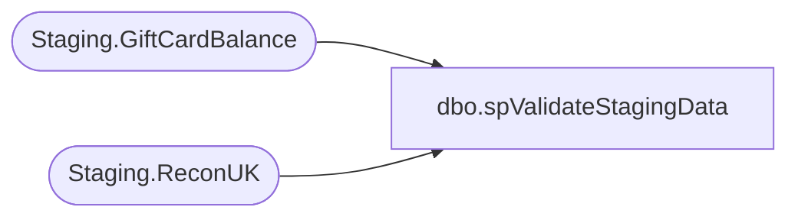

# dbo.spValidateStagingData

**Database:** SOX  
**Server:** papamart  

## Architecture Diagram



## Table Dependencies

| Referenced Table |
|---|
| Staging.GiftCardBalance |
| Staging.ReconUK |

## Stored Procedure Code

```sql
-- =============================================================================================================
-- Name: [spValidateStagingData]
--
-- Description:	
--		Validate UKStaging data Card Counts 

--
-- Revision History
--		Name:			Date:			Comments:
--		Brian Byas		8/17/2016		created
--		Tim Callahan	4/6/2023		Added Logic to Reload Amount field due to garbage data from FiServ
-- =============================================================================================================

CREATE PROCEDURE [dbo].[spValidateStagingData]
@AuditQuarterKey int

AS


TRUNCATE TABLE Staging.ReconUK

INSERT INTO  Staging.ReconUK
SELECT		
		stg.SourceFileName AS FILENAME,	
		stg.ActivationMid,	
		stg.ActivationStore,	
		stg.CardNumber AS CardNumber,	
		CAST(CASE	
			WHEN stg.ActivationAmount LIKE '%(%' THEN '-' + REPLACE(REPLACE(stg.ActivationAmount, ')', ''), '(', '')
			ELSE stg.ActivationAmount
		END AS money) AS ActivationAmount,	
			
		CAST(CASE	
			WHEN stg.RedemptionAmount LIKE '%(%' THEN '-' + REPLACE(REPLACE(stg.RedemptionAmount, ')', ''), '(', '')
			ELSE stg.RedemptionAmount
		END AS money) AS redemptionAmount,	
			
		CAST(CASE	
			WHEN stg.ReloadAmount LIKE '%(%' THEN '-' + REPLACE(REPLACE(stg.ReloadAmount, ')', ''), '(', '')
			when ISNUMERIC(RELOADAMOUNT) = 0  THEN cast (0  as money)  -- Had to Add on n 4/6/2023 Due To Garbage Data from FiServ
			ELSE stg.ReloadAmount
		END AS money) AS ReloadAmount,	
			
		CAST(CASE	
			WHEN stg.AdjustedAmount LIKE '%(%' THEN '-' + REPLACE(REPLACE(stg.AdjustedAmount, ')', ''), '(', '')
			ELSE stg.AdjustedAmount
		END AS money) AS AdjustedAmount,	
			
		CAST(CASE	
			WHEN stg.ServiceFeeAmount LIKE '%(%' THEN '-' + REPLACE(REPLACE(stg.ServiceFeeAmount, ')', ''), '(', '')
			ELSE stg.ServiceFeeAmount
		END AS money) AS ServiceFeeAmount,	
			
		CAST(CASE	
			WHEN stg.OutstandingBalance LIKE '%(%' THEN '-' + REPLACE(REPLACE(stg.OutstandingBalance, ')', ''), '(', '')
			ELSE stg.OutstandingBalance
		END AS money) AS OutstandingBalance,	
		CAST(stg.ActivationDate AS datetime) AS ActivationDate			
	FROM		
		SOX.[Staging].[GiftCardBalance] stg	
	WHERE		
		1 = 1	
		AND ISNUMERIC(stg.CardNumber) = 1	
		AND stg.AuditQuarterKey=@AuditQuarterKey
```

