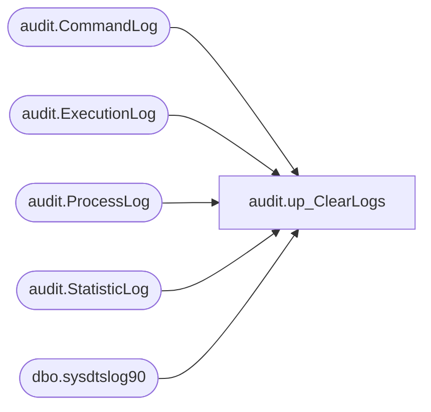

# audit.up_ClearLogs

**Database:** SSISTemplates  
**Server:** papamart  

## Architecture Diagram



## Table Dependencies

| Referenced Table |
|---|
| audit.CommandLog |
| audit.ExecutionLog |
| audit.ProcessLog |
| audit.StatisticLog |
| dbo.sysdtslog90 |

## Stored Procedure Code

```sql
create procedure [audit].[up_ClearLogs]
with execute as caller
as
begin
	set nocount on

	truncate table audit.CommandLog
	truncate table audit.ExecutionLog
	truncate table audit.ProcessLog
	truncate table audit.StatisticLog
	truncate table dbo.sysdtslog90

	set nocount off
end --proc
```

