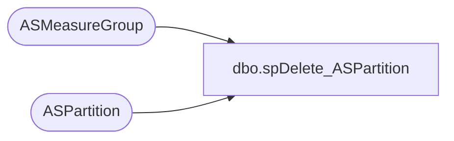

# dbo.spDelete_ASPartition

**Database:** SSISTemplates  
**Server:** papamart  

## Architecture Diagram



## Table Dependencies

| Referenced Table |
|---|
| ASMeasureGroup |
| ASPartition |

## Stored Procedure Code

```sql
CREATE PROCEDURE [dbo].[spDelete_ASPartition]
	-- =============================================================================================================
	-- Name: [dbo].[spDelete_ASPartition]
	--
	-- Description:	Delete partition from the ASPartition Table
	--
	-- Input:	
	--
	-- Output: N/A
	--
	-- Dependencies: 
	--
	-- Revision History
	--		Name:			Date:			Comments:
	--		Gary Murrish	1/7/2014		Created
	-- =============================================================================================================
	@MeasureGroupID varchar(255),
	@PartitionName varchar(255)
AS
BEGIN
	-- SET NOCOUNT ON added to prevent extra result sets from
	-- interfering with SELECT statements.
	SET NOCOUNT ON;


	DECLARE @mgID int
	SET @mgID = (SELECT
			mgID
		FROM
			ASMeasureGroup WITH (NOLOCK)
		WHERE
			ASMeasureGroup.ASMeasureGroupID = @MeasureGroupID)


	DELETE ASPartition
	WHERE SSASPartitionName = @PartitionName
		AND mgID = @mgID

END
```

