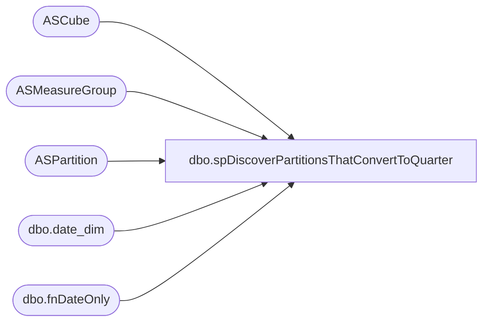

# dbo.spDiscoverPartitionsThatConvertToQuarter

**Database:** SSISTemplates  
**Server:** papamart  

## Architecture Diagram



## Table Dependencies

| Referenced Table |
|---|
| ASCube |
| ASMeasureGroup |
| ASPartition |
| dbo.date_dim |
| dbo.fnDateOnly |

## Stored Procedure Code

```sql
CREATE PROC [dbo].[spDiscoverPartitionsThatConvertToQuarter] 
-- =============================================================================================================
-- Name: [dbo].[spDiscoverPartitionsThatConvertToQuarter]
--
-- Description:	Determines which monthly partitions should be converted from Monthly to Quarterly
--
-- Input:  N/A
--
-- Output: N/A
--
-- Dependencies: 
--
-- Revision History
--		Name:			Date:			Comments:
--		Gary Murrish	7/28/2012		Changed to look out 1 day into the future
--		Gary Murrish	7/24/2012		Created
-- =============================================================================================================
AS
	SET NOCOUNT ON


	DECLARE @asOfDate datetime
	--SET @asOfDate = '6/15/2013'
	SET @asOfDate = dbo.fnDateOnly(GETDATE())


	DECLARE @currFY int
	DECLARE @currFP int

	SELECT
		@currFY = dd.Fiscal_Year,
		@currFP = dd.fiscal_period
	FROM
		dw.dbo.date_dim dd WITH (NOLOCK)
	WHERE
		dd.actual_date = @asOfDate

	-- Subtract 2 months
	SET @currFP = @currFP - 2
	IF @currFP < 1
	BEGIN
		SET @currFY = @currFY - 1
		SET @currFP = @currFP + 12
	END

	-- Get the quarter of that period
	DECLARE @maxMonthDate_Key int
	SELECT
		@maxMonthDate_Key = MAX(date_key)
	FROM
		dw.dbo.date_dim dd WITH (NOLOCK)
	WHERE
		dd.Fiscal_Year = @currFY
		AND dd.fiscal_period = @currFP

	DECLARE @priorQFY int
	DECLARE @priorQFQ int
	SELECT
		@priorQFQ = dd.fiscal_quarter,
		@priorQFY = dd.Fiscal_Year
	FROM
		dw.dbo.date_dim dd WITH (NOLOCK)
	WHERE
		dd.date_key = @maxMonthDate_Key

	-- Subtract 1 from that Quarter
	SET @priorQFQ = @priorQFQ - 1
	IF @priorQFQ < 1
	BEGIN
		SET @priorQFY = @priorQFY - 1
		SET @priorQFQ = @priorQFQ + 4
	END

	-- Get the last day of that quarter
	SELECT
		@maxMonthDate_Key = MAX(date_key)
	FROM
		dw.dbo.date_dim dd WITH (NOLOCK)
	WHERE
		dd.Fiscal_Year = @priorQFY
		AND dd.fiscal_quarter = @priorQFQ


	DECLARE @maxWeek int
	SELECT
		@maxWeek = dd.Fiscal_Year * 100 + dd.fiscal_week
	FROM
		dw.dbo.date_dim dd WITH (NOLOCK)
	WHERE
		dd.date_key = @maxMonthDate_Key


	-- Find the Monthly partitions that should be deleted
	IF OBJECT_ID('tempdb..#tmpToDelete') IS NOT NULL
	BEGIN
		DROP TABLE #tmpToDelete
	END

	SELECT
		a.partid,
		a.SSASPartitionName,
		a.fromDate_Key,
		a.thruDate_Key,
		ag.DESCR,
		ag.mgID,
		a1.DatabaseName,
		a1.SSASCubeName,
		ag.ASMeasureGroupID

	INTO #tmpToDelete
	FROM
		ASPartition a WITH (NOLOCK)
		INNER JOIN ASMeasureGroup ag WITH (NOLOCK)
			ON a.mgID = ag.mgID
		INNER JOIN ASCube a1 WITH (NOLOCK)
			ON ag.CubeID = a1.CubeID
	WHERE
		(ag.normalPartitionFrequency IN ('M', 'MW')
		AND a.thruDate_Key <= @maxMonthDate_Key
		AND a.thruDate_Key - a.fromDate_Key < 45)
	ORDER BY	a.SSASPartitionName,
				ag.DESCR

	-- Determine the quarters calendars needed to replace these.
	DECLARE @minQDate_key int
	DECLARE @maxQDate_key int
	SELECT
		@minQDate_key = MIN(td.fromDate_Key),
		@maxQDate_key = MAX(td.thruDate_Key)
	FROM
		#tmpToDelete td

	IF OBJECT_ID('tempdb..#tmpQuarters') IS NOT NULL
	BEGIN
		DROP TABLE #tmpQuarters
	END

	SELECT
		dd.Fiscal_Year,
		dd.fiscal_quarter,
		MIN(dd.date_key) AS minDate,
		MAX(dd.date_key) AS maxDate,
		MIN(dd.Fiscal_Year * 100 + dd.fiscal_week) AS minWeek,
		MAX(dd.Fiscal_Year * 100 + dd.fiscal_week) AS maxWeek
	INTO #tmpQuarters
	FROM
		dw.dbo.date_dim dd WITH (NOLOCK)
	WHERE
		dd.date_key BETWEEN @minQDate_key AND @maxQDate_key
	GROUP BY	dd.Fiscal_Year,
				dd.fiscal_quarter
	ORDER BY	dd.Fiscal_Year,
				dd.fiscal_quarter

	-- Generate the partitions to be added
	IF OBJECT_ID('tempdb..#tmpToAdd') IS NOT NULL
	BEGIN
		DROP TABLE #tmpToAdd
	END
	SELECT
		x.mgID,
		q.*
	INTO #tmpToAdd
	FROM
		(SELECT
				td.mgID,
				MIN(td.fromDate_Key) AS minDate,
				MAX(td.thruDate_Key) AS maxDate
			FROM
				#tmpToDelete td
			GROUP BY td.mgID) x
		INNER JOIN #tmpQuarters q
			ON x.minDate <= q.maxDate
			AND x.maxDate >= q.minDate
	ORDER BY	x.mgID,
				q.Fiscal_Year,
				q.fiscal_quarter

	-- Create the partition Add information (this comes from spDiscoverPartitionsThatShouldExist)
	SELECT
		'Add' AS ACTION,
		cu.DatabaseName,
		cu.SSASCubeID,
		mg.ASMeasureGroupID,
		CASE
			WHEN LEN(mg.PartitionPrefix) > 0 THEN mg.PartitionPrefix + '_'
			ELSE ''
		END + CAST(ta.Fiscal_Year AS varchar) + '_Q' + RIGHT('00' + CAST(ta.fiscal_quarter AS varchar), 1) AS partitionName,
		REPLACE(REPLACE(mg.SQLText, '$minMonth', ta.minDate), '$maxMonth', ta.maxDate) AS SQLStmt,
		'[Date].[Fiscal].[Fiscal Quarter].&amp;[''' + RIGHT(CAST(ta.Fiscal_Year AS varchar), 2) + ' Q' + RIGHT(CAST(ta.fiscal_quarter AS varchar), 1) + ']' AS mdxPeriod,
		mg.ASDataSourceID,
		CAST(mg.estimatedRows AS varchar) AS estimatedRows,
		mg.aggregationID,
		CAST(ta.minDate AS varchar) AS minDateKey,
		CAST(ta.maxDate AS varchar) AS maxDateKey
	FROM
		#tmpToAdd ta WITH (NOLOCK)
		INNER JOIN ASMeasureGroup mg WITH (NOLOCK)
			ON ta.mgID = mg.mgID
		INNER JOIN ASCube cu WITH (NOLOCK)
			ON cu.CubeID = mg.CubeID
	WHERE
		mg.normalPartitionFrequency = 'M'
	UNION ALL
	SELECT
		'Add' AS ACTION,
		cu.DatabaseName,
		cu.SSASCubeID,
		mg.ASMeasureGroupID,
		CASE
			WHEN LEN(mg.PartitionPrefix) > 0 THEN mg.PartitionPrefix + '_'
			ELSE ''
		END + CAST(ta.Fiscal_Year AS varchar) + '_Q' + RIGHT('00' + CAST(ta.fiscal_quarter AS varchar), 1) AS partitionName,
		REPLACE(REPLACE(mg.SQLText, '$minMonthWeek', ta.minWeek), '$maxMonthWeek', ta.maxWeek) AS SQLStmt,
		'[Date].[Fiscal].[Fiscal Quarter].&amp;[''' + RIGHT(CAST(ta.Fiscal_Year AS varchar), 2) + ' Q' + RIGHT(CAST(ta.fiscal_quarter AS varchar), 1) + ']' AS mdxPeriod,
		mg.ASDataSourceID,
		CAST(mg.estimatedRows AS varchar) AS estimatedRows,
		mg.aggregationID,
		CAST(ta.minDate AS varchar) AS minDateKey,
		CAST(ta.maxDate AS varchar) AS maxDateKey
	FROM
		#tmpToAdd ta WITH (NOLOCK)
		INNER JOIN ASMeasureGroup mg WITH (NOLOCK)
			ON ta.mgID = mg.mgID
		INNER JOIN ASCube cu WITH (NOLOCK)
			ON cu.CubeID = mg.CubeID
	WHERE
		mg.normalPartitionFrequency = 'MW'
	-- Then add in the deletes
	UNION ALL
	SELECT
		'Delete' AS ACTION,
		cu.DatabaseName,
		cu.SSASCubeID,
		mg.ASMeasureGroupID,
		td.SSASPartitionName AS partitionName,
		'' AS SQLStmt,
		'' AS mdxPeriod,
		'' AS ASDataSourceID,
		'' AS estimatedRows,
		'' AS aggregationID,
		CAST(td.fromDate_Key AS varchar) AS minDateKey,
		CAST(td.thruDate_Key AS varchar) AS maxDateKey
	FROM
		#tmpToDelete td WITH (NOLOCK)
		INNER JOIN ASMeasureGroup mg WITH (NOLOCK)
			ON td.mgID = mg.mgID
		INNER JOIN ASCube cu WITH (NOLOCK)
			ON cu.CubeID = mg.CubeID

	ORDER BY	cu.DatabaseName,
				mg.ASMeasureGroupID,
				maxDateKey,
				partitionName
```

