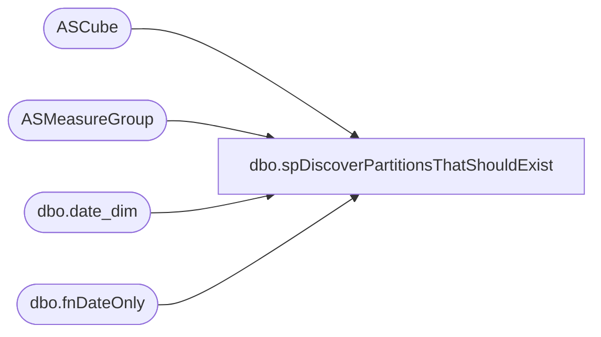

# dbo.spDiscoverPartitionsThatShouldExist

**Database:** SSISTemplates  
**Server:** papamart  

## Architecture Diagram



## Table Dependencies

| Referenced Table |
|---|
| ASCube |
| ASMeasureGroup |
| dbo.date_dim |
| dbo.fnDateOnly |

## Stored Procedure Code

```sql
CREATE PROC [dbo].[spDiscoverPartitionsThatShouldExist] 
	-- =============================================================================================================
	-- Name: [dbo].[spDiscoverPartitionsThatShouldExist]
	--
	-- Description:	Retrieves the partitions which should exist in the Cube in the last 10 days
	--
	-- Input:	Number of days to go back (default 10)
	--
	-- Output: N/A
	--
	-- Dependencies: 
	--
	-- Revision History
	--		Name:			Date:			Comments:
	--		Gary Murrish	7/28/2012		Changed to look out 1 day into the future
	--		Gary Murrish	7/24/2012		Created
	-- =============================================================================================================
	@DaysToGoBack int = 10
AS
	SET NOCOUNT ON

	DECLARE @today AS int
	DECLARE @todayFY AS int
	DECLARE @todayFQ AS int
	DECLARE @todayFP AS int

	SELECT
		@today = date_key,
		@todayFY = Fiscal_Year,
		@todayFQ = fiscal_quarter,
		@todayFP = fiscal_period
	FROM
		dw.dbo.date_dim dd WITH (NOLOCK)
	WHERE
		actual_date = dw.dbo.fnDateOnly(DATEADD(DAY, 1, GETDATE()))

	DECLARE @prior AS int
	DECLARE @priorFY AS int
	DECLARE @priorFQ AS int
	DECLARE @priorFP AS int

	SELECT
		@prior = date_key,
		@priorFY = Fiscal_Year,
		@priorFQ = fiscal_quarter,
		@priorFP = fiscal_period
	FROM
		dw.dbo.date_dim dd WITH (NOLOCK)
	WHERE
		actual_date = dw.dbo.fnDateOnly(DATEADD(DAY, -1 * @DaysToGoBack, GETDATE()))


	-- Build the FQ 
	IF OBJECT_ID('tempdb..#tmpFQ') IS NOT NULL
	BEGIN
		DROP TABLE #tmpFQ
	END


	SELECT
		Fiscal_Year,
		fiscal_quarter,
		MIN(date_key) AS minDate_Key,
		MAX(date_key) AS maxDate_Key
	INTO #tmpFQ
	FROM
		dw.dbo.date_dim dd WITH (NOLOCK)
	WHERE
		Fiscal_Year * 100 + fiscal_quarter >= (@priorFY) * 100 + @priorFQ
		AND Fiscal_Year * 100 + fiscal_quarter <= (@todayFY) * 100 + @todayFQ
	GROUP BY	Fiscal_Year,
				fiscal_quarter
	ORDER BY	Fiscal_Year,
				fiscal_quarter

	-- Build the FP going back one year
	IF OBJECT_ID('tempdb..#tmpFP') IS NOT NULL
	BEGIN
		DROP TABLE #tmpFP
	END
	SELECT
		Fiscal_Year,
		fiscal_period,
		MIN(date_key) AS minDate_Key,
		MAX(date_key) AS maxDate_Key,
		MIN(Fiscal_Year * 100 + fiscal_week) AS minFiscalWeek,
		MAX(Fiscal_Year * 100 + fiscal_week) AS maxFiscalWeek
	INTO #tmpFP
	FROM
		dw.dbo.date_dim dd WITH (NOLOCK)
	WHERE
		Fiscal_Year * 100 + fiscal_period >= (@priorFY) * 100 + @priorFP
		AND Fiscal_Year * 100 + fiscal_period <= (@todayFY) * 100 + @todayFP
	GROUP BY	Fiscal_Year,
				fiscal_period
	ORDER BY	Fiscal_Year,
				fiscal_period

	-- Generate Monthly Partitions
	SELECT
		cu.DatabaseName,
		cu.SSASCubeID,
		mg.ASMeasureGroupID,
		CASE
			WHEN LEN(mg.PartitionPrefix) > 0 THEN mg.PartitionPrefix + '_'
			ELSE ''
		END + CAST(f.Fiscal_Year AS varchar) + '_' + RIGHT('00' + CAST(f.fiscal_period AS varchar), 2) AS partitionName,
		REPLACE(REPLACE(mg.SQLText, '$minMonth', f.minDate_Key), '$maxMonth', f.maxDate_Key) AS SQLStmt,
		'[Date].[Fiscal].[Fiscal Period].&amp;[' + CAST(f.Fiscal_Year AS varchar) + ' ' + RIGHT('00' + CAST(f.fiscal_period AS varchar), 2) + ']' AS mdxPeriod,
		mg.ASDataSourceID,
		CAST(mg.estimatedRows AS varchar) AS estimatedRows,
		mg.aggregationID,
		CAST(f.minDate_key AS varchar) AS minDateKey,
		CAST(f.maxDate_key AS varchar) AS maxDateKey
	FROM
		#tmpFP f
		CROSS JOIN ASMeasureGroup mg WITH (NOLOCK)
		INNER JOIN ASCube cu WITH (NOLOCK)
			ON cu.CubeID = mg.CubeID
	WHERE
		mg.normalPartitionFrequency = 'M'
	UNION ALL
	-- Generate Quarterly partitions
	SELECT
		cu.DatabaseName,
		cu.SSASCubeID,
		mg.ASMeasureGroupID,
		CASE
			WHEN LEN(mg.PartitionPrefix) > 0 THEN mg.PartitionPrefix + '_'
			ELSE ''
		END + CAST(f.Fiscal_Year AS varchar) + '_Q' + RIGHT('00' + CAST(f.fiscal_quarter AS varchar), 1) AS partitionName,
		REPLACE(REPLACE(mg.SQLText, '$minMonth', f.minDate_Key), '$maxMonth', f.maxDate_Key) AS SQLStmt,
		'[Date].[Fiscal].[Fiscal Quarter].&amp;[''' + RIGHT(CAST(f.Fiscal_Year AS varchar), 2) + ' Q' + RIGHT(CAST(f.fiscal_quarter AS varchar), 1) + ']' AS mdxPeriod,
		mg.ASDataSourceID,
		CAST(mg.estimatedRows AS varchar) AS estimatedRows,
		mg.aggregationID,
		CAST(f.minDate_key AS varchar) AS minDateKey,
		CAST(f.maxDate_key AS varchar) AS maxDateKey

	FROM
		#tmpFQ f
		CROSS JOIN ASMeasureGroup mg WITH (NOLOCK)
		INNER JOIN ASCube cu WITH (NOLOCK)
			ON cu.CubeID = mg.CubeID
	WHERE
		mg.normalPartitionFrequency = 'Q'
	UNION ALL
	-- Generate Monthly Partitions based upon Week
	SELECT
		cu.DatabaseName,
		cu.SSASCubeID,
		mg.ASMeasureGroupID,
		CASE
			WHEN LEN(mg.PartitionPrefix) > 0 THEN mg.PartitionPrefix + '_'
			ELSE ''
		END + CAST(f.Fiscal_Year AS varchar) + '_' + RIGHT('00' + CAST(f.fiscal_period AS varchar), 2) AS partitionName,
		REPLACE(REPLACE(mg.SQLText, '$minMonthWeek', f.minFiscalWeek), '$maxMonthWeek', f.maxFiscalWeek) AS SQLStmt,
		'[Date].[Fiscal].[Fiscal Period].&amp;[' + CAST(f.Fiscal_Year AS varchar) + ' ' + RIGHT('00' + CAST(f.fiscal_period AS varchar), 2) + ']' AS mdxPeriod,
		mg.ASDataSourceID,
		CAST(mg.estimatedRows AS varchar) AS estimatedRows,
		mg.aggregationID,
		CAST(f.minDate_key AS varchar) AS minDateKey,
		CAST(f.maxDate_key AS varchar) AS maxDateKey
	FROM
		#tmpFP f
		CROSS JOIN ASMeasureGroup mg WITH (NOLOCK)
		INNER JOIN ASCube cu WITH (NOLOCK)
			ON cu.CubeID = mg.CubeID
	WHERE
		mg.normalPartitionFrequency = 'MW'
```

