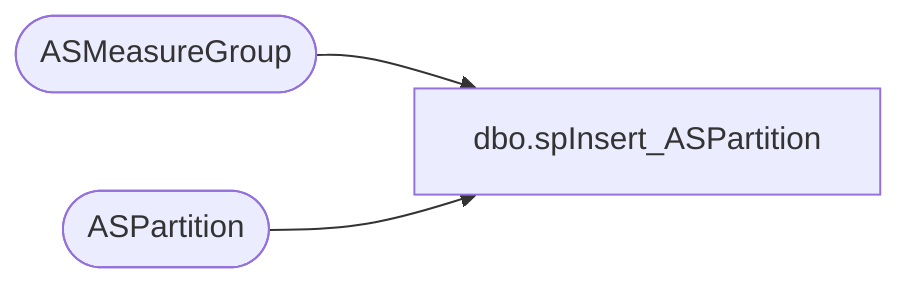

# dbo.spInsert_ASPartition

**Database:** SSISTemplates  
**Server:** papamart  

## Architecture Diagram



## Table Dependencies

| Referenced Table |
|---|
| ASMeasureGroup |
| ASPartition |

## Stored Procedure Code

```sql
CREATE PROCEDURE [dbo].[spInsert_ASPartition]-- Name: [dbo].[spInsert_ASPartition]
--
-- Description:	Insert a newly created partition into the ASPartition Table
--
-- Input:	
--
-- Output: N/A
--
-- Dependencies: 
--
-- Revision History
--		Name:			Date:			Comments:
--		Gary Murrish	7/24/2012		Created
-- =============================================================================================================
    @MeasureGroupID VARCHAR(255),
    @PartitionName  VARCHAR(255),
    @fromDate_Key   INT,
    @thruDate_Key   INT,
    @aggregationID  VARCHAR(255),
    @SQLText        VARCHAR(MAX),
    @estimatedRows  INT,
    @partitionSlice VARCHAR(MAX)
AS
BEGIN
	-- SET NOCOUNT ON added to prevent extra result sets from
	-- interfering with SELECT statements.
	SET NOCOUNT ON;


	DECLARE @mgID INT
	SET @mgID = (
				 SELECT mgID
				 FROM
					 ASMeasureGroup WITH (NOLOCK)
				 WHERE
					 ASMeasureGroup.ASMeasureGroupID = @MeasureGroupID)

	-- See if the partition already exists
	DECLARE @exists INT
	SET @exists = (
				   SELECT partID
				   FROM
					   ASPartition a WITH (NOLOCK)
				   WHERE
					   a.SSASPartitionName = @PartitionName
					   AND a.mgID = @mgID)
	IF @exists IS NULL --AND @mgID IS NOT NULL
	BEGIN
		-- Insert the new record
		INSERT INTO ASPartition (mgID
							   , SSASPartitionName
							   , fromDate_Key
							   , thruDate_Key
							   , aggregationID
							   , SQLText
							   , estimatedRows
							   , PartitionSlice)
		VALUES
			(@mgID, @PartitionName, @fromDate_Key, @thruDate_Key, @aggregationID, @SQLText, @estimatedRows, @partitionSlice)
	END
END
```

