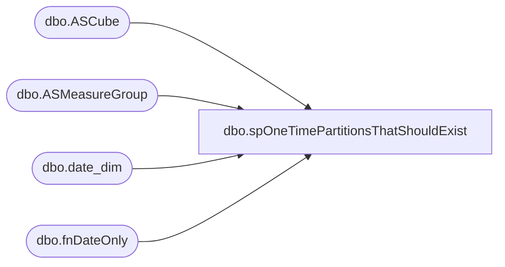

# dbo.spOneTimePartitionsThatShouldExist

**Database:** SSISTemplates  
**Server:** papamart  

## Architecture Diagram



## Table Dependencies

| Referenced Table |
|---|
| dbo.ASCube |
| dbo.ASMeasureGroup |
| dbo.date_dim |
| dbo.fnDateOnly |

## Stored Procedure Code

```sql
CREATE PROC [dbo].[spOneTimePartitionsThatShouldExist]-- =============================================================================================================
-- Name: [dbo].[spOneTimePartitionsThatShouldExist]
--
-- Description:	Retrieves the partitions which should exist in the Cube for a period of time
--
--
-- Output: N/A
--
-- Dependencies: 
--
-- Revision History
--		Name:			Date:			Comments:
--		Gary Murrish	7/28/2012		Changed to look out 1 day into the future
--		Gary Murrish	7/24/2012		Created
-- =============================================================================================================
AS
	SET NOCOUNT ON

DECLARE @minActualDate AS datetime
SET @minActualDate = '12/30/2007'
declare @forMeasureGroupID AS int
SET @forMeasureGroupID = 31


	DECLARE @today AS INT
	DECLARE @todayFY AS INT
	DECLARE @todayFQ AS INT
	DECLARE @todayFP AS INT

	SELECT @today = date_key
		 , @todayFY = fiscal_year
		 , @todayFQ = fiscal_quarter
		 , @todayFP = fiscal_period
	FROM
		dw.dbo.date_dim dd WITH (NOLOCK)
	WHERE
		actual_date = dw.dbo.fnDateOnly(dateadd(DAY, 1, getdate()))

	DECLARE @prior AS INT
	DECLARE @priorFY AS INT
	DECLARE @priorFQ AS INT
	DECLARE @priorFP AS INT

	SELECT @prior = date_key
		 , @priorFY = fiscal_year
		 , @priorFQ = fiscal_quarter
		 , @priorFP = fiscal_period
	FROM
		dw.dbo.date_dim dd WITH (NOLOCK)
	WHERE
		actual_date = @minActualDate


	-- Build the FQ 
	IF object_id('tempdb..#tmpFQ') IS NOT NULL
	BEGIN
		DROP TABLE #tmpFQ
	END


	SELECT fiscal_year
		 , fiscal_quarter
		 , min(date_key) AS minDate_Key
		 , max(date_key) AS maxDate_Key
	INTO
		#tmpFQ
	FROM
		dw.dbo.date_dim dd WITH (NOLOCK)
	WHERE
		fiscal_year * 100 + fiscal_quarter >= (@priorFY) * 100 + @priorFQ
		AND fiscal_year * 100 + fiscal_quarter <= (@todayFY) * 100 + @todayFQ
	GROUP BY
		fiscal_year
	  , fiscal_quarter
	ORDER BY
		fiscal_year
	  , fiscal_quarter

	-- Build the FP going back one year
	IF object_id('tempdb..#tmpFP') IS NOT NULL
	BEGIN
		DROP TABLE #tmpFP
	END
	SELECT fiscal_year
		 , fiscal_period
		 , min(date_key) AS minDate_Key
		 , max(date_key) AS maxDate_Key
		 , min(fiscal_year * 100 + fiscal_week) AS minFiscalWeek
		 , max(fiscal_year * 100 + fiscal_week) AS maxFiscalWeek
	INTO
		#tmpFP
	FROM
		dw.dbo.date_dim dd WITH (NOLOCK)
	WHERE
		fiscal_year * 100 + fiscal_period >= (@priorFY) * 100 + @priorFP
		AND fiscal_year * 100 + fiscal_period <= (@todayFY) * 100 + @todayFP
	GROUP BY
		fiscal_year
	  , fiscal_period
	ORDER BY
		fiscal_year
	  , fiscal_period

	-- Generate Monthly Partitions
	SELECT cu.DatabaseName
		 , cu.SSASCubeID
		 , mg.ASMeasureGroupID
		 , CASE
			   WHEN len(mg.PartitionPrefix) > 0 THEN
				   mg.PartitionPrefix + '_'
			   ELSE
				   ''
		   END + cast(f.fiscal_year AS VARCHAR) + '_' + right('00' + cast(f.fiscal_period AS VARCHAR), 2) AS partitionName
		 , replace(replace(mg.SQLText, '$minMonth', f.minDate_Key), '$maxMonth', f.maxDate_Key) AS SQLStmt
		 , '[Date].[Fiscal].[Fiscal Period].&amp;[' + cast(f.fiscal_year AS VARCHAR) + ' ' + right('00' + cast(f.fiscal_period AS VARCHAR), 2) + ']' AS mdxPeriod
		 , mg.ASDataSourceID
		 , cast(mg.estimatedRows AS VARCHAR) AS estimatedRows
		 , mg.aggregationID
		 , cast(f.minDate_key AS VARCHAR) AS minDateKey
		 , cast(f.maxDate_key AS VARCHAR) AS maxDateKey
	FROM
		#tmpFP f
		CROSS JOIN SSISTemplates.dbo.ASMeasureGroup mg WITH (NOLOCK)
		INNER JOIN SSISTemplates.dbo.ASCube cu WITH (NOLOCK)
			ON cu.cubeID = mg.cubeID
	WHERE
		mg.normalPartitionFrequency = 'M'
		AND mg.mgID = @forMeasureGroupID
	UNION ALL
	-- Generate Quarterly partitions
	SELECT cu.DatabaseName
		 , cu.SSASCubeID
		 , mg.ASMeasureGroupID
		 , CASE
			   WHEN len(mg.PartitionPrefix) > 0 THEN
				   mg.PartitionPrefix + '_'
			   ELSE
				   ''
		   END + cast(f.fiscal_year AS VARCHAR) + '_Q' + right('00' + cast(f.fiscal_quarter AS VARCHAR), 1) AS partitionName
		 , replace(replace(mg.SQLText, '$minMonth', f.minDate_Key), '$maxMonth', f.maxDate_Key) AS SQLStmt
		 , '[Date].[Fiscal].[Fiscal Quarter].&amp;[''' + right(cast(f.fiscal_year AS VARCHAR), 2) + ' Q' + right(cast(f.fiscal_quarter AS VARCHAR), 1) + ']' AS mdxPeriod
		 , mg.ASDataSourceID
		 , cast(mg.estimatedRows AS VARCHAR) AS estimatedRows
		 , mg.aggregationID
		 , cast(f.minDate_key AS VARCHAR) AS minDateKey
		 , cast(f.maxDate_key AS VARCHAR) AS maxDateKey

	FROM
		#tmpFQ f
		CROSS JOIN SSISTemplates.dbo.ASMeasureGroup mg WITH (NOLOCK)
		INNER JOIN SSISTemplates.dbo.ASCube cu WITH (NOLOCK)
			ON cu.cubeID = mg.cubeID
	WHERE
		mg.normalPartitionFrequency = 'Q'
		AND mg.mgID = @forMeasureGroupID
	UNION ALL
	-- Generate Monthly Partitions based upon Week
	SELECT cu.DatabaseName
		 , cu.SSASCubeID
		 , mg.ASMeasureGroupID
		 , CASE
			   WHEN len(mg.PartitionPrefix) > 0 THEN
				   mg.PartitionPrefix + '_'
			   ELSE
				   ''
		   END + cast(f.fiscal_year AS VARCHAR) + '_' + right('00' + cast(f.fiscal_period AS VARCHAR), 2) AS partitionName
		 , replace(replace(mg.SQLText, '$minMonthWeek', f.minFiscalWeek), '$maxMonthWeek', f.maxFiscalWeek) AS SQLStmt
		 , '[Date].[Fiscal].[Fiscal Period].&amp;[' + cast(f.fiscal_year AS VARCHAR) + ' ' + right('00' + cast(f.fiscal_period AS VARCHAR), 2) + ']' AS mdxPeriod
		 , mg.ASDataSourceID
		 , cast(mg.estimatedRows AS VARCHAR) AS estimatedRows
		 , mg.aggregationID
		 , cast(f.minDate_key AS VARCHAR) AS minDateKey
		 , cast(f.maxDate_key AS VARCHAR) AS maxDateKey
	FROM
		#tmpFP f
		CROSS JOIN SSISTemplates.dbo.ASMeasureGroup mg WITH (NOLOCK)
		INNER JOIN SSISTemplates.dbo.ASCube cu WITH (NOLOCK)
			ON cu.cubeID = mg.cubeID
	WHERE
		mg.normalPartitionFrequency = 'MW'
		AND mg.mgID = @forMeasureGroupID
```

