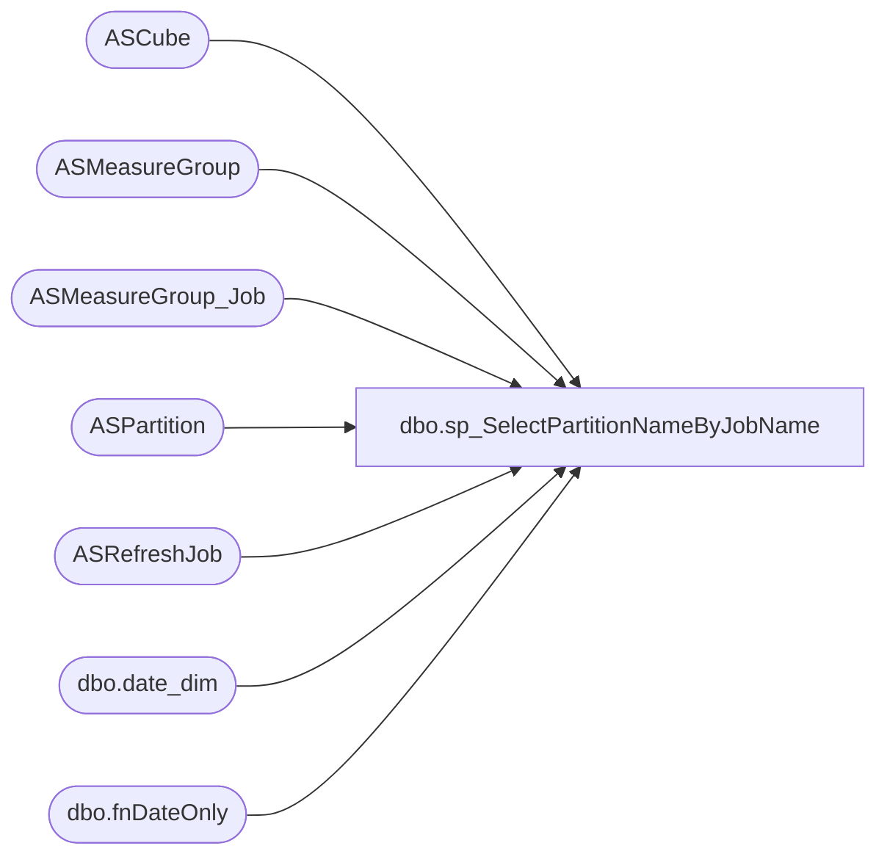

# dbo.sp_SelectPartitionNameByJobName

**Database:** SSISTemplates  
**Server:** papamart  

## Architecture Diagram



## Table Dependencies

| Referenced Table |
|---|
| ASCube |
| ASMeasureGroup |
| ASMeasureGroup_Job |
| ASPartition |
| ASRefreshJob |
| dbo.date_dim |
| dbo.fnDateOnly |

## Stored Procedure Code

```sql
CREATE PROCEDURE [dbo].[sp_SelectPartitionNameByJobName]
(
    @jobName VARCHAR(50)
)
AS
	SELECT Partid
		 , DatabaseName
		 , SSASCubeID
		 , ASMeasureGroupID
		 , SSASPartitionName
		 , fromDate_Key
		 , thruDate_Key
		 , B.[numRefreshDays]
	FROM
		ASCube A WITH (NOLOCK)
		INNER JOIN ASMeasureGroup B
			ON A.cubeID = B.cubeID
		INNER JOIN ASMeasureGroup_Job C
			ON B.mgID = C.mgID
		INNER JOIN ASPartition D
			ON B.mgID = D.mgID
		LEFT OUTER JOIN ASRefreshJob E
			ON C.jobID = E.jobID
	WHERE
		JobName = @jobName
		AND thruDate_Key >= (
							 SELECT date_key
							 FROM
								 dw.dbo.date_dim
							 WHERE
								 actual_date = dateadd(DAY, B.[numRefreshDays] * -1, dw.dbo.fnDateOnly(getdate())))
		AND fromDate_Key <= (
							 SELECT date_key
							 FROM
								 dw.dbo.date_dim
							 WHERE
								 actual_date = dw.dbo.fnDateOnly(getdate()))


	ORDER BY fromDate_Key, partID
```

