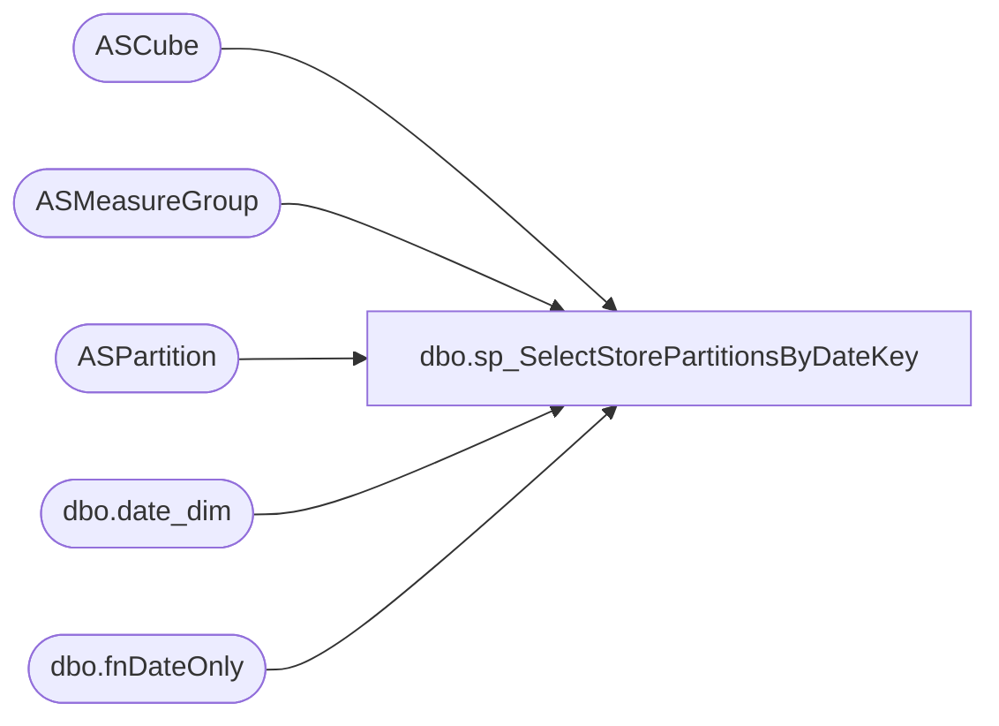

# dbo.sp_SelectStorePartitionsByDateKey

**Database:** SSISTemplates  
**Server:** papamart  

## Architecture Diagram



## Table Dependencies

| Referenced Table |
|---|
| ASCube |
| ASMeasureGroup |
| ASPartition |
| dbo.date_dim |
| dbo.fnDateOnly |

## Stored Procedure Code

```sql
-- This procedure will indicate the partitions which must be reloaded because of Comp Date changes.
-- This is invoked in the SSIS package: Sync Company Store Comps.dtsx

-- Changes:
--	G. Murrish	11/1/2013	Added Giftcards Activated


CREATE PROCEDURE [dbo].[sp_SelectStorePartitionsByDateKey]
(
    @dateKey INT
)
AS
	SELECT Partid
		 , DatabaseName
		 , SSASCubeID
		 , ASMeasureGroupID
		 , SSASPartitionName
		 , fromDate_Key
		 , thruDate_Key
		 , B.[numRefreshDays]
	FROM
		ASCube A WITH (NOLOCK)
		LEFT OUTER JOIN ASMeasureGroup B
			ON A.cubeID = B.cubeID
		LEFT OUTER JOIN ASPartition D
			ON B.mgID = D.mgID
	WHERE
		thruDate_Key >= @dateKey
		AND fromDate_Key <= (
							 SELECT date_key
							 FROM
								 dw.dbo.date_dim
							 WHERE
								 actual_date = dw.dbo.fnDateOnly(getdate()))
		AND B.Descr IN ('Transactions', 'Registrations', 'Registrations Count', 'ShopperTrak', 'Labor', 'Giftcards Activated')
	ORDER BY
		ASMeasureGroupID
	  , fromDate_Key
```

