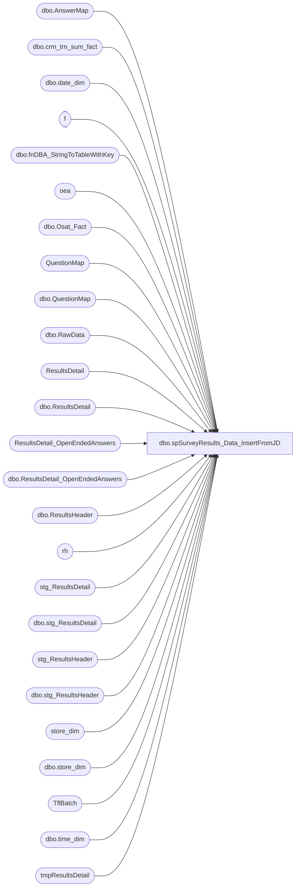

# dbo.spSurveyResults_Data_InsertFromJD

**Database:** SurveyResults  
**Server:** papamart  

## Architecture Diagram



## Table Dependencies

| Referenced Table |
|---|
| dbo.AnswerMap |
| dbo.crm_trn_sum_fact |
| dbo.date_dim |
| f |
| dbo.fnDBA_StringToTableWithKey |
| oea |
| dbo.Osat_Fact |
| QuestionMap |
| dbo.QuestionMap |
| dbo.RawData |
| ResultsDetail |
| dbo.ResultsDetail |
| ResultsDetail_OpenEndedAnswers |
| dbo.ResultsDetail_OpenEndedAnswers |
| dbo.ResultsHeader |
| rh |
| stg_ResultsDetail |
| dbo.stg_ResultsDetail |
| stg_ResultsHeader |
| dbo.stg_ResultsHeader |
| store_dim |
| dbo.store_dim |
| TflBatch |
| dbo.time_dim |
| tmpResultsDetail |

## Stored Procedure Code

```sql
CREATE PROC [dbo].[spSurveyResults_Data_InsertFromJD]
 @SurveyProvider_Key INT
WITH EXECUTE AS 'BAB\SQLServices'
AS

-- =============================================================================================================
-- Name: spSurveyResults_Data_InsertFromJD
--
-- Description:	Populates survey results data into OSAT_fact, ResultsHeader & ResultsDetail from JD working tables
--
-- Output: error logging.
-- 
-- Available actions:
--	@SurveyProvider_Key =  key of who provided the data from dbo.SurveyProvider table
--
-- Dependencies: 
--
-- Revision History
--		Name:			Date:			Comments:
--		Mike Pelikan	10/23/2014		Production
	
 	
/*

*/
-- =============================================================================================================

SET NOCOUNT ON

--DECLARE @SurveyProvider_Key INT
--SET @SurveyProvider_Key = 1

----------------------------------------------------------------------------------------------------
-- Setup Variables
----------------------------------------------------------------------------------------------------

DECLARE @table NVARCHAR(100)

DECLARE @key_column SYSNAME 
SET @key_column = N'RespondentId'

DECLARE @tbl TABLE ( colID INT IDENTITY(1,1) , colName VARCHAR(100), colSize INT)
DECLARE @colNames  NVARCHAR(MAX), @colValues NVARCHAR(MAX), @colMaxSize VARCHAR(4), @sql NVARCHAR(MAX)

DECLARE  @QuestionID VARCHAR(50), @QuestionMap_Key INT, @isNumeric bit

DECLARE @nextID INT, @incrementID INT
SET @incrementID = 25

IF OBJECT_ID('dbo.tmpResultsDetail') IS NULL
	CREATE TABLE tmpResultsDetail (RespondentID nvarchar(25) NOT NULL, [ResultsHeader_Key] [int] NOT NULL,
		[QuestionMap_Key] [int] NOT NULL, [AnswerMap_Key] [int] NOT NULL, [Value] [varchar](100) NULL,
		SubType varchar(50)	)

IF OBJECT_ID('tempdb.dbo.#wrk') IS NULL
	CREATE TABLE #wrk (source CHAR(3), ResultsHeader_Key INT, QuestionMap_Key INT, AnswerMap_Key INT, Value INT )

DECLARE @ResultsDetailOET TABLE (RespondentID nvarchar(25) NOT NULL, [ResultsHeader_Key] [int] NOT NULL,
	[QuestionMap_Key] [int] NOT NULL, [AnswerMap_Key] [int] NOT NULL, [Value] TEXT NULL, SubType varchar(50) )

DELETE FROM TflBatch WHERE EntityName NOT IN (SELECT name from sys.objects where type = 'U')

WHILE (SELECT COUNT(*) FROM TflBatch) > 0
BEGIN
	SELECT TOP 1 @table = EntityName FROM TflBatch  
	IF OBJECT_ID('dbo.RawData') IS NOT NULL DROP TABLE RawData

	SELECT @colNames = N'', @colValues = N'', @sql = N'';

	----------------------------------------------------------------------------------------------------
	-- Rename JunkDrawer table
	----------------------------------------------------------------------------------------------------
	IF OBJECT_ID('dbo.RawData') IS NOT NULL
		DROP TABLE dbo.RawData

	EXEC sp_rename @table, 'RawData'

	----------------------------------------------------------------------------------------------------
	Print 'Clean out staging tables'
	----------------------------------------------------------------------------------------------------
	TRUNCATE TABLE stg_ResultsHeader 
	TRUNCATE TABLE stg_ResultsDetail
	TRUNCATE TABLE tmpResultsDetail
	TRUNCATE TABLE #wrk

	----------------------------------------------------------------------------------------------------
	PRINT 'Insert Header Records into staging'
	----------------------------------------------------------------------------------------------------
	--if the transaction number is not in RawData:
	IF NOT EXISTS(SELECT * FROM sys.columns WHERE name = N'LON0031551' and Object_ID = Object_ID(N'RawData'))
	BEGIN
		INSERT INTO SurveyResults.dbo.stg_ResultsHeader 
		SELECT RespondentId, Date TransactionDate, CPPAUTOB2591041 ResponseDate, -1 TransactionID,  CPPAUTOB2614241 Str_num
		FROM dbo.RawData
	END
	ELSE
	BEGIN
		INSERT INTO SurveyResults.dbo.stg_ResultsHeader 
		SELECT RespondentId, Date TransactionDate, CPPAUTOB2591041 ResponseDate, CASE LEN(LON0031551) WHEN 0 THEN -1 ELSE LON0031551 END TransactionID,  CPPAUTOB2614241 Str_num
		FROM dbo.RawData
	END
	----------------------------------------------------------------------------------------------------
	PRINT 'Insert Details into staging'
	----------------------------------------------------------------------------------------------------
	INSERT INTO @tbl (colName, colSize)
	SELECT name, ISNULL(max_length,0) + ISNULL(precision,0) + ISNULL(scale, 0)
	FROM sys.columns
	WHERE [object_id] = OBJECT_ID('dbo.RawData')
	AND name <> @key_column
		AND NAME NOT IN ('RespondentId', 'Date', 'Time', 'STOREID', 'STORENAME', 'DISTRICTID', 'DISTRICTNAME', 'REGIONID', 
		'REGIONNAME', 'ZONEID', 'ZONENAME', 'CHAINID', 'CHAINNAME', 'STORE_TYPE', 'STORE_AGE', 'STORE_SIZE', 'STORE_SUB_TYPE', 
		'STORE-ID', 'STORE-NAME', 'DISTRICT-ID', 'DISTRICT-NAME', 'REGION-ID', 'REGION-NAME', 'ZONE-ID', 'ZONE-NAME', 
		'CHAIN-ID', 'CHAIN-NAME')
		AND Name NOT LIKE 'Tfl%'
	ORDER BY 2 DESC

	SET @colMaxSize = (SELECT CAST(MAX(colSize) AS VARCHAR(5)) FROM @tbl)

	SELECT @nextID = MIN(colID) FROM @tbl

	WHILE @nextID < (SELECT MAX(colID) FROM @tbl)
	BEGIN 
		SELECT @colNames = '', @colValues= ''

		SELECT @colNames = @colNames + ', ' + colName, @colValues = @colValues + ', ' + colName 
		   + ' = CONVERT(VARCHAR('+@colMaxSize+'), ' + colName + ')'
		FROM @tbl WHERE colID BETWEEN @nextID AND @nextID + @incrementID

		SET @sql = N'
		INSERT INTO SurveyResults.dbo.stg_ResultsDetail
		SELECT RespondentId, QuestionID, Value 
		FROM
		(
		  SELECT ' + @key_column + @colValues + '
		   FROM dbo.RawData
		) AS t
		UNPIVOT
		(
		  Value FOR QuestionID IN (' + STUFF(@colNames, 1, 1, '') + ')
		) AS up
		WHERE Value <> '''';';

		 EXEC (@sql)

		 SET @nextID = @nextID + @incrementID
	END
	
	DELETE FROM SurveyResults.dbo.stg_ResultsDetail
	WHERE QuestionID NOT IN (SELECT ID FROM QuestionMap )

	----------------------------------------------------------------------------------------------------
	PRINT 'Insert OSAT only data into old style OSAT_fact table'
	----------------------------------------------------------------------------------------------------

	IF OBJECT_ID('tempdb..#stg') IS NOT NULL DROP TABLE #stg
	IF OBJECT_ID('tempdb..#osat') IS NOT NULL DROP TABLE #osat

	DECLARE @minDateKey INT, @maxDateKey INT
	SELECT @minDateKey = MIN(sd.date_key), @maxDateKey = max(sd.date_key)
	FROM SurveyResults.dbo.RawData o
	INNER JOIN dw.dbo.date_dim sd ON o.[DATE] = sd.actual_date

	SELECT  s.store_key, cd.date_key AS call_date_key, sd.date_key, t.time_key,
	CASE LTRIM([party type]) WHEN '' THEN 2 ELSE 1 END visit_type_dim_key,
	1 question_dim_key,--only looking at overall satisfaction
	1 calc_type_dim_key, --currently only looking at overall satisfaction
	CASE WHEN ISNULL(LTRIM(o.[Sat - Overall]), '') = '' THEN -999 ELSE o.[Sat - Overall] END raw_score,
	CASE s.country WHEN 'US' THEN 
		CASE WHEN o.[Sat - Overall] > 8 THEN 1
		WHEN ISNULL(LTRIM(o.[Sat - Overall]), '') = '' THEN -999
		ELSE 0 END
	ELSE
		CASE WHEN o.[Sat - Overall] > 7 THEN 1
		WHEN ISNULL(LTRIM(o.[Sat - Overall]), '') = '' THEN -999
		ELSE 0 END
	END calc_score,
	CAST(o.RespondentId AS VARCHAR(30))unique_id, CAST(o.transaction_id AS INT) transaction_id ,
	ISNULL(tsf.CLNSD_GST_ID, -1) CLNSD_GST_ID
	INTO #stg
	FROM
	(
		SELECT CAST([STORE-ID] AS INT) store_id, ENM004591Q00190 [Sat - Overall], [RespondentId], LON0031551 transaction_id, 
		CPPAUTOB2591041 resp_date, 	CPPAUTOB2591741 resp_time, 
		RIGHT('00' + REPLACE(LEFT(CPPAUTOB2591741,2),':',''),2) resp_hr, 
		REVERSE(SUBSTRING(REVERSE(CPPAUTOB2591741),4,2)) resp_minute,
		CAST([DATE] AS DATETIME) actual_date,  AML005315 [party type]
		FROM [SurveyResults].[dbo].[RawData]
	) o
	INNER JOIN dw.dbo.store_dim s ON o.store_id = s.store_id
	INNER JOIN dw.dbo.date_dim cd ON resp_date = cd.actual_date
	INNER JOIN dw.dbo.date_dim sd ON o.actual_date = sd.actual_date
	INNER JOIN dw.dbo.time_dim t ON o.resp_hr = t.[hour] AND o.resp_minute = t.[minute]
	LEFT JOIN dw.dbo.crm_trn_sum_fact tsf ON o.transaction_id = tsf.TDF_TRN_ID;

	--DELETE
	DELETE FROM SurveyResults.dbo.Osat_Fact
	WHERE date_key BETWEEN @minDateKey AND @maxDateKey AND unique_id NOT IN (SELECT [RespondentId] FROM [SurveyResults].[dbo].[RawData]) 
	--UPDATE
	UPDATE f
	SET f.store_key = rd.store_key, f.call_date_key = rd.call_date_key, f.date_key = rd.date_key, f.time_key = rd.time_key, 
	f.visit_type_dim_key = rd.visit_type_dim_key, f.question_dim_key = rd.question_dim_key, f.calc_type_dim_key = rd.calc_type_dim_key, 
	f.raw_score = rd.raw_score, f.calc_score = rd.calc_score, f.transaction_id = rd.transaction_id, f.CLNSD_GST_ID = rd.CLNSD_GST_ID
	FROM SurveyResults.dbo.Osat_Fact f
	INNER JOIN #STG rd ON f.unique_id = rd.unique_id
	WHERE CHECKSUM(f.store_key, f.call_date_key, f.date_key, f.time_key, f.visit_type_dim_key, f.question_dim_key, f.calc_type_dim_key, f.raw_score, f.calc_score, f.unique_id, f.transaction_id, f.CLNSD_GST_ID) <> 
	CHECKSUM(rd.store_key, rd.call_date_key, rd.date_key, rd.time_key, rd.visit_type_dim_key, rd.question_dim_key, rd.calc_type_dim_key, rd.raw_score, rd.calc_score, rd.unique_id, rd.transaction_id, rd.CLNSD_GST_ID)

	--INSERT
	INSERT INTO SurveyResults.dbo.Osat_Fact (store_key, call_date_key, date_key, time_key, visit_type_dim_key, question_dim_key, calc_type_dim_key, raw_score, calc_score, unique_id, transaction_id, CLNSD_GST_ID)
	SELECT store_key, call_date_key, date_key, time_key, visit_type_dim_key, question_dim_key, calc_type_dim_key, raw_score, calc_score, unique_id, transaction_id, CLNSD_GST_ID
	FROM #STG
	WHERE unique_id NOT IN (SELECT unique_id 
	FROM SurveyResults.dbo.Osat_Fact
	WHERE date_key BETWEEN @minDateKey AND @maxDateKey)

	----------------------------------------------------------------------------------------------------
	PRINT 'Insert Header into Production table'
	----------------------------------------------------------------------------------------------------
	UPDATE rh
	SET rh.RespondentID = stg.RespondentID, rh.DATE_KEY_Response = dr.date_key, rh.DATE_KEY_Transaction = dt.date_key, 
	rh.Transaction_ID = stg.Transaction_ID, rh.store_key = ISNULL(s.store_key, -1)
	FROM SurveyResults.dbo.ResultsHeader rh
	INNER JOIN SurveyResults.dbo.stg_ResultsHeader stg ON rh.RespondentID COLLATE SQL_Latin1_General_CP1_CS_AS = stg.RespondentID COLLATE SQL_Latin1_General_CP1_CS_AS
	INNER JOIN dw.dbo.date_dim dr ON stg.Date_Response = dr.Actual_Date
	INNER JOIN dw.dbo.date_dim dt ON stg.Date_Transaction = dt.Actual_Date
	LEFT JOIN dw..store_dim s ON stg.Store_num = s.store_id
	WHERE CHECKSUM(rh.RespondentID, rh.DATE_KEY_Response, rh.DATE_KEY_Transaction, rh.Transaction_ID, rh.store_key) 
	<> CHECKSUM(stg.RespondentID, dr.date_key, dt.date_key, stg.Transaction_ID, ISNULL(s.store_key, -1) )

	INSERT INTO SurveyResults.dbo.ResultsHeader (SurveyProvider_Key, RespondentID, DATE_KEY_Response, DATE_KEY_Transaction, Transaction_ID, store_key)
	SELECT @SurveyProvider_Key, stg.RespondentID, dr.date_key,  dt.date_key, stg.Transaction_ID, ISNULL(s.store_key, -1)
	FROM SurveyResults.dbo.stg_ResultsHeader stg
	INNER JOIN dw.dbo.date_dim dr ON stg.Date_Response = dr.Actual_Date
	INNER JOIN dw.dbo.date_dim dt ON stg.Date_Transaction = dt.Actual_Date
	LEFT JOIN dw..store_dim s ON stg.Store_num = s.store_id
	LEFT JOIN SurveyResults.dbo.ResultsHeader rh ON stg.RespondentID COLLATE SQL_Latin1_General_CP1_CS_AS = rh.RespondentID COLLATE SQL_Latin1_General_CP1_CS_AS
	WHERE rh.RespondentID IS NULL

	--DELETE FROM SurveyResults.dbo.ResultsHeader 
	--FROM SurveyResults.dbo.ResultsHeader rh 
	--LEFT JOIN SurveyResults.dbo.stg_ResultsHeader stg ON rh.RespondentID COLLATE SQL_Latin1_General_CP1_CS_AS = stg.RespondentID COLLATE SQL_Latin1_General_CP1_CS_AS
	--WHERE stg.RespondentID IS NULL

	----------------------------------------------------------------------------------------------------
	PRINT 'Insert Details into production tables'
	----------------------------------------------------------------------------------------------------
	
	--Do FreeForm First
	----------------------------------------------------------------------------------------------------	
	PRINT 'Freeform'

	TRUNCATE TABLE tmpResultsDetail
	DELETE FROM @ResultsDetailOET
	
	INSERT INTO @ResultsDetailOET ( RespondentID, ResultsHeader_Key, QuestionMap_Key, AnswerMap_Key, Value, SubType)
	SELECT  stg.RespondentID, rh.ResultsHeader_Key, qm.QuestionMap_Key, -1, stg.Value, qm.SubType 
	FROM SurveyResults.dbo.ResultsHeader rh
	INNER JOIN SurveyResults.dbo.stg_ResultsDetail stg ON rh.RespondentID COLLATE SQL_Latin1_General_CP1_CS_AS = stg.RespondentID COLLATE SQL_Latin1_General_CP1_CS_AS
	INNER JOIN SurveyResults.dbo.QuestionMap qm ON stg.QuestionID = qm.ID 
	WHERE qm.SubType = 'Freeform'
	
	UPDATE oea
	SET FreeFormText = qry.Value
	FROM ResultsDetail_OpenEndedAnswers oea
	INNER JOIN 
	(
		SELECT rd.ResultsDetail_Key, rd.ResultsHeader_Key, rd.QuestionMap_Key, t.Value 
		FROM @ResultsDetailOET t
		INNER JOIN SurveyResults.dbo.ResultsDetail rd ON t.ResultsHeader_Key = rd.ResultsHeader_Key AND t.QuestionMap_Key = rd.QuestionMap_Key
	) qry ON oea.ResultsDetail_Key = qry.ResultsDetail_Key AND oea.ResultsHeader_Key = qry.ResultsHeader_Key AND oea.QuestionMap_Key = qry.QuestionMap_Key 
	WHERE  CAST(oea.FreeFormText AS VARCHAR(MAX)) <> CAST(qry.Value AS VARCHAR(MAX))

	INSERT INTO SurveyResults.dbo.ResultsDetail(ResultsHeader_Key, QuestionMap_Key, AnswerMap_Key)
	SELECT t.ResultsHeader_Key, t.QuestionMap_Key, t.AnswerMap_Key
	FROM @ResultsDetailOET t
	LEFT JOIN SurveyResults.dbo.ResultsDetail rd ON rd.ResultsHeader_Key = t.ResultsHeader_Key AND rd.QuestionMap_Key = t.QuestionMap_Key AND rd.AnswerMap_Key = t.AnswerMap_Key
	WHERE rd.ResultsHeader_Key IS NULL

	INSERT INTO SurveyResults.dbo.ResultsDetail_OpenEndedAnswers(ResultsDetail_Key, ResultsHeader_Key, QuestionMap_Key, FREEFormText)
	SELECT rd.ResultsDetail_Key, rd.ResultsHeader_Key, t.QuestionMap_Key, t.Value 
	FROM @ResultsDetailOET t
	INNER JOIN SurveyResults.dbo.ResultsDetail rd ON t.ResultsHeader_Key = rd.ResultsHeader_Key AND t.QuestionMap_Key = rd.QuestionMap_Key
	LEFT JOIN SurveyResults.dbo.ResultsDetail_OpenEndedAnswers oea ON rd.ResultsHeader_Key = oea.ResultsHeader_Key AND rd.QuestionMap_Key = oea.QuestionMap_Key
	AND rd.ResultsDetail_Key = oea.ResultsDetail_Key
	WHERE oea.ResultsHeader_Key IS NULL

	--DELETE FROM SurveyResults.dbo.ResultsDetail_OpenEndedAnswers
	--FROM SurveyResults.dbo.ResultsDetail_OpenEndedAnswers oea
	--LEFT JOIN tmpResultsDetail t ON oea.ResultsHeader_Key = t.ResultsHeader_Key AND oea.QuestionMap_Key = t.QuestionMap_Key AND oea.AnswerMap_Key = t.AnswerMap_Key
	--WHERE t.ResultsHeader_Key IS NULL

	DELETE FROM SurveyResults.dbo.stg_ResultsDetail 
	FROM SurveyResults.dbo.stg_ResultsDetail stg 
	INNER JOIN SurveyResults.dbo.QuestionMap qm ON stg.QuestionID = qm.ID 
	WHERE qm.SubType = 'Freeform'
	
	--Do The rest of the questions
	----------------------------------------------------------------------------------------------------
	PRINT 'Nonfreeform and Numeric'	

	WHILE (SELECT COUNT(*) FROM (SELECT TOP 1 * FROM SurveyResults.dbo.stg_ResultsDetail) q) > 0
	BEGIN
		BEGIN TRAN
			SELECT TOP 1 @QuestionID = stg.QuestionID, @QuestionMap_Key = qm.QuestionMap_Key, @isNumeric = CASE qm.SubType WHEN 'Numeric' THEN 1 ELSE 0 END  
			FROM SurveyResults.dbo.stg_ResultsDetail stg 
			INNER JOIN SurveyResults.dbo.QuestionMap qm ON stg.QuestionID = qm.ID 
		
			TRUNCATE TABLE tmpResultsDetail

			IF @isNumeric = 1
			BEGIN
				INSERT INTO tmpResultsDetail ( RespondentID, ResultsHeader_Key, QuestionMap_Key, AnswerMap_Key, Value)
				SELECT  stg.RespondentID, rh.ResultsHeader_Key, qm.QuestionMap_Key, 0, stg.Value
				FROM SurveyResults.dbo.ResultsHeader rh
				INNER JOIN SurveyResults.dbo.stg_ResultsDetail stg ON rh.RespondentID COLLATE SQL_Latin1_General_CP1_CS_AS = stg.RespondentID COLLATE SQL_Latin1_General_CP1_CS_AS
				INNER JOIN SurveyResults.dbo.QuestionMap qm ON stg.QuestionID = qm.ID 
				WHERE stg.QuestionID = @QuestionID

			END
			ELSE
			BEGIN
				INSERT INTO tmpResultsDetail ( RespondentID, ResultsHeader_Key, QuestionMap_Key, AnswerMap_Key, Value)
				SELECT  stg.RespondentID, rh.ResultsHeader_Key, qm.QuestionMap_Key, ISNULL(am.AnswerMap_Key, -2), 
				q.val Value
				FROM SurveyResults.dbo.ResultsHeader rh
				INNER JOIN SurveyResults.dbo.stg_ResultsDetail stg ON rh.RespondentID COLLATE SQL_Latin1_General_CP1_CS_AS = stg.RespondentID COLLATE SQL_Latin1_General_CP1_CS_AS
				INNER JOIN SurveyResults.dbo.QuestionMap qm ON stg.QuestionID = qm.ID 
				CROSS APPLY DBAUtility.dbo.[fnDBA_StringToTableWithKey](stg.RespondentID,stg.Value, '|', 1) q
				LEFT JOIN SurveyResults.dbo.AnswerMap am ON q.val = am.Value AND qm.QuestionMap_Key = am.QuestionMap_Key
				WHERE stg.QuestionID = @QuestionID
			END

			TRUNCATE TABLE #wrk

			INSERT INTO #wrk
			SELECT * FROM
			(
			(   
			SELECT 'new' source, t.ResultsHeader_Key, t.QuestionMap_Key, t.AnswerMap_Key, t.Value FROM tmpResultsDetail t
			EXCEPT
			SELECT 'new' source, rd.ResultsHeader_Key, rd.QuestionMap_Key, rd.AnswerMap_Key, rd.Value  
				FROM ResultsDetail rd WHERE ResultsHeader_Key IN ( SELECT ResultsHeader_Key FROM tmpResultsDetail)
				AND QuestionMap_Key = @QuestionMap_Key
			)  
			UNION ALL
			(   
			SELECT 'bak' source, rd.ResultsHeader_Key, rd.QuestionMap_Key, rd.AnswerMap_Key, rd.Value  
				FROM ResultsDetail rd WHERE ResultsHeader_Key IN ( SELECT ResultsHeader_Key FROM tmpResultsDetail)
				AND QuestionMap_Key = @QuestionMap_Key
			EXCEPT
			SELECT 'bak' source, t.ResultsHeader_Key, t.QuestionMap_Key, t.AnswerMap_Key, t.Value FROM tmpResultsDetail t
			) 
			)qry
			order by 2, 3, 4

			DELETE FROM SurveyResults.dbo.ResultsDetail 
			FROM SurveyResults.dbo.ResultsDetail rd
			INNER JOIN (SELECT * FROM #wrk WHERE source = 'bak') t ON rd.ResultsHeader_Key = t.ResultsHeader_Key AND rd.QuestionMap_Key = t.QuestionMap_Key AND rd.AnswerMap_Key = t.AnswerMap_Key
			
			INSERT INTO SurveyResults.dbo.ResultsDetail(ResultsHeader_Key, QuestionMap_Key, AnswerMap_Key, Value)
			SELECT t.ResultsHeader_Key, t.QuestionMap_Key, t.AnswerMap_Key, t.Value
			FROM (SELECT * FROM #wrk WHERE source = 'new') t
			
			DELETE FROM SurveyResults.dbo.stg_ResultsDetail WHERE QuestionID = @QuestionID
			PRINT @QuestionID
		COMMIT TRAN
	END
	DELETE FROM TflBatch WHERE EntityName = @table
END

--Clean up
TRUNCATE TABLE stg_ResultsHeader 
TRUNCATE TABLE stg_ResultsDetail
TRUNCATE TABLE tmpResultsDetail
TRUNCATE TABLE #wrk
```

