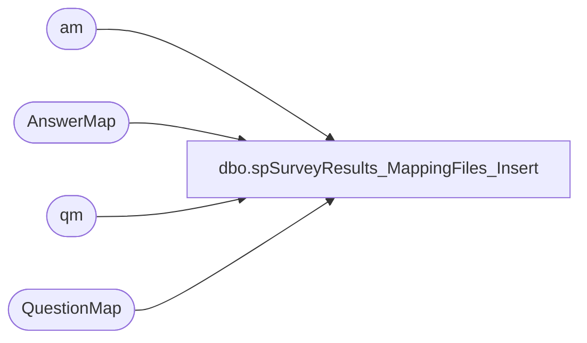

# dbo.spSurveyResults_MappingFiles_Insert

**Database:** SurveyResults  
**Server:** papamart  

## Architecture Diagram



## Table Dependencies

| Referenced Table |
|---|
| am |
| AnswerMap |
| qm |
| QuestionMap |

## Stored Procedure Code

```sql
CREATE PROC [dbo].[spSurveyResults_MappingFiles_Insert]
@SurveyProvider_Key INT
WITH EXECUTE AS 'BAB\SQLServices'
AS

-- =============================================================================================================
-- Name: spSurveyResults_MappingFiles_Insert
--
-- Description:	Populates survey question and answer mapping data into QuestionMap & AnswerMap from files from provider
--
-- Output: error logging.
-- 
-- Available actions:
--	@SurveyProvider_Key =  key of who provided the data from dbo.SurveyProvider table
--
-- Dependencies: 
--
-- Revision History
--		Name:			Date:			Comments:
--		Mike Pelikan	10/23/2014		Production
	
 	
/*

*/
-- =============================================================================================================

--DECLARE @SurveyProvider_Key INT
--SET @SurveyProvider_Key = 1

SET NOCOUNT ON 

DECLARE @FileName VARCHAR(100), @Path VARCHAR(100), @PathFileName VARCHAR(200), 
@FormatFilePath VARCHAR(100), @FormatPathFileName VARCHAR(200), 
@cmdStmt VARCHAR(500), @Filter VARCHAR(10)
DECLARE @files TABLE (fileID  INT IDENTITY(1,1), results varchar(1000))

SET @Path = '\\kermode\FileRepository\GuestSurvey\SurveyResults\'
SET @FormatFilePath = '\\kermode\d$\ETL Executables\GuestSurvey\SurveyResults\'

-------------------------------------------------------------------------------------------
--\ Question Map Load																	/--
-------------------------------------------------------------------------------------------
SET @Filter = 'QMapping'
SET @FormatPathFileName = @FormatFilePath + 'QMapping.fmt'

SET @cmdStmt = 'dir "' + @Path + '*'+ @Filter + '*.txt" /b /A:-D '

INSERT INTO @files EXEC xp_cmdshell @cmdStmt 
DELETE FROM @files WHERE results IS NULL
DELETE FROM @files WHERE results = 'File Not Found'

IF OBJECT_ID('tempdb..##stg_QuestionMap') IS NULL
	CREATE TABLE ##stg_QuestionMap(	
	[Id] [varchar](50) NOT NULL,
	[Column] [varchar](50) NOT NULL,
	[Type] [varchar](50) NOT NULL,
	[SubType] [varchar](50) NOT NULL,
	[Label] [varchar](1000) NOT NULL,
	[Text] [varchar](4000) NOT NULL) 
	
WHILE (SELECT COUNT(*) FROM @files) > 0
BEGIN
	SELECT TOP 1 @FileName = results FROM @files ORDER BY FileID
	SELECT @PathFileName = @Path + @Filename
	
	TRUNCATE TABLE ##stg_QuestionMap

	EXEC ('BULK INSERT ##stg_QuestionMap 
	FROM ''' + @PathFileName + '''
	WITH
	(
	
	FIELDTERMINATOR = ''\t'',
	ROWTERMINATOR = ''\n'',
	FORMATFILE = ''' + @FormatPathFileName + '''
	)
	')

	DELETE FROM ##stg_QuestionMap WHERE ID = 'ID'
	
	UPDATE qm
	SET [ColumnNo] = t.[Column], [Type] = t.[Type], SubType = t.SubType, Label = t.Label, [Text] = t.[Text]
	FROM QuestionMap qm
	INNER JOIN ##stg_QuestionMap t ON qm.ID = t.ID
	WHERE qm.[ColumnNo] <> t.[Column] OR qm.[Type] <> t.[Type] OR qm.SubType <> t.SubType OR qm.Label = t.Label OR qm.[Text] <> t.[Text]

	INSERT INTO QuestionMap 
	SELECT @SurveyProvider_Key, * FROM ##stg_QuestionMap
	WHERE ID NOT IN (SELECT ID FROM QuestionMap)
	
	SET @cmdStmt = 'MOVE "' + @PathFileName + '" "' +  @Path + 'Archive\"' 
	EXEC xp_cmdshell @cmdStmt
	DELETE FROM @files WHERE results = @FileName
END

-------------------------------------------------------------------------------------------
--\ Answer Map Load																		/--
-------------------------------------------------------------------------------------------
SET @Filter = 'AMapping'
SET @FormatPathFileName = @FormatFilePath + 'AMapping.fmt'

SET @cmdStmt = 'dir "' + @Path + '*'+ @Filter + '*.txt" /b /A:-D '

INSERT INTO @files EXEC xp_cmdshell @cmdStmt 
DELETE FROM @files WHERE results IS NULL
DELETE FROM @files WHERE results = 'File Not Found'


IF OBJECT_ID('tempdb..##stg_AnswerMap') IS NULL
	CREATE TABLE ##stg_AnswerMap(	
	[QuestionId] [varchar](50) NOT NULL,
	[AnswerId] [varchar](50) NOT NULL,
	[Value] [varchar](50) NOT NULL,
	[Text] [varchar](4000) NOT NULL) 
	
WHILE (SELECT COUNT(*) FROM @files) > 0
BEGIN
	SELECT TOP 1 @FileName = results FROM @files ORDER BY FileID
	SELECT @PathFileName = @Path + @Filename
	
	TRUNCATE TABLE ##stg_AnswerMap

	EXEC ('BULK INSERT ##stg_AnswerMap 
	FROM ''' + @PathFileName + '''
	WITH
	(
	
	FIELDTERMINATOR = ''\t'',
	ROWTERMINATOR = ''\n'',
	FORMATFILE = ''' + @FormatPathFileName + '''
	)
	')
	
	DELETE FROM ##stg_AnswerMap WHERE QuestionId = 'ID'
	DELETE FROM ##stg_AnswerMap WHERE QuestionId = 'QuestionId'

	UPDATE am
	SET Value = t.Value, Text = t.Text
	FROM AnswerMap am
	INNER JOIN ##stg_AnswerMap t ON am.QuestionID = t.QuestionID AND am.AnswerId = t.AnswerId 
	WHERE am.Value <> t.Value or am.Text <> t.Text

	INSERT INTO AnswerMap
	SELECT @SurveyProvider_Key, ISNULL(qm.QuestionMap_Key, -1), t.QuestionID, t.AnswerID, t.Value , t.Text 
	FROM ##stg_AnswerMap t
	INNER JOIN QuestionMap qm ON t.QuestionID = qm.ID 
	LEFT JOIN AnswerMap am ON am.QuestionID = t.QuestionID AND am.AnswerId = t.AnswerId 
	WHERE am.QuestionID IS NULL
	
	SET @cmdStmt = 'MOVE "' + @PathFileName + '" "' +  @Path + 'Archive\"' 
	EXEC xp_cmdshell @cmdStmt
	DELETE FROM @files WHERE results = @FileName
END
```

