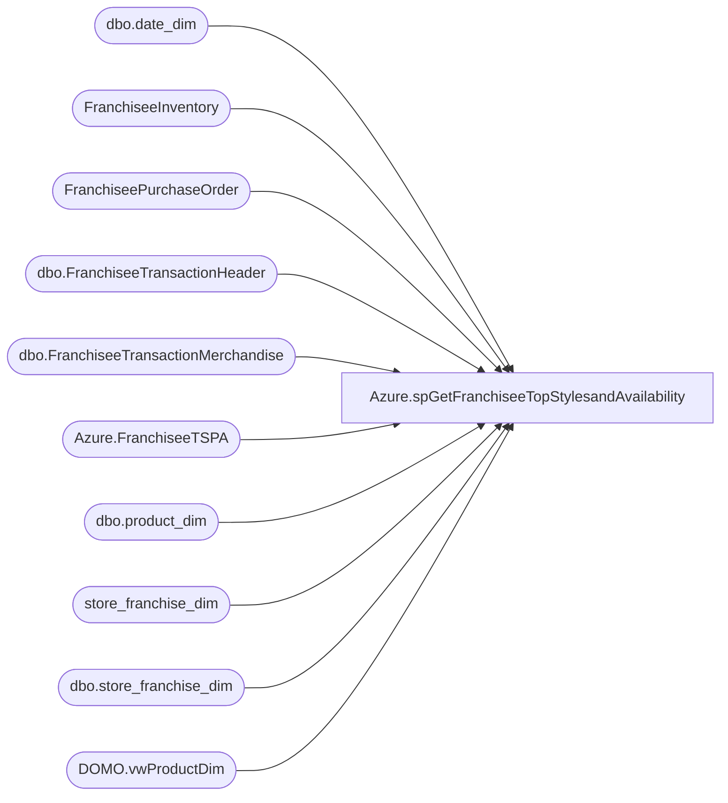

# Azure.spGetFranchiseeTopStylesandAvailability

**Database:** dw  
**Server:** papamart  

## Architecture Diagram



## Table Dependencies

| Referenced Table |
|---|
| dbo.date_dim |
| FranchiseeInventory |
| FranchiseePurchaseOrder |
| dbo.FranchiseeTransactionHeader |
| dbo.FranchiseeTransactionMerchandise |
| Azure.FranchiseeTSPA |
| dbo.product_dim |
| store_franchise_dim |
| dbo.store_franchise_dim |
| DOMO.vwProductDim |

## Stored Procedure Code

```sql
-- =============================================================================================================
-- Name: [DOMO].[spGetFranchiseeTopStylesandAvailability] 
--
-- Description:	Outputs the top styles for franchisees and their avaibility for International Merchandising reports in DOMO
-- Usage:  exec [DOMO].[spGetFranchiseeTopStylesandAvailability] 
-- 
-- Dependencies: 
--
-- Revision History
--		Name:			Date:			Comments:
--		Tim Bytnar		01/03/2018		Initial creation
-- =============================================
CREATE PROCEDURE [Azure].[spGetFranchiseeTopStylesandAvailability] 


AS
BEGIN
Truncate Table Azure.FranchiseeTSPA
	SET NOCOUNT ON;
    Declare @startDate DateTime
	select @startDate = cast(getdate() as date)

	IF (Object_ID('tempdb..#DateDim') IS NOT NULL) DROP TABLE #DateDim
	select 
		ROW_NUMBER() OVER (ORDER BY date_key) as DateId,
		date_key,
		actual_date,
		fiscal_year,
		fiscal_week,
		fiscal_period
	into #DateDim
	from papamart.dw.dbo.date_dim
	where cast(actual_date as date) <= @startDate
	and datename(weekday, actual_date) = 'Saturday' 

	DECLARE	@MerchYearTY int, @MerchYearLY int, @MerchWeek varchar(2), @MerchPeriod varchar(2), @MerchWeekID int, @MerchWeekLW1 int, @MerchWeekLW2 int, @MerchYearLW1 int, @MerchYearLW2 int, @WeekEnding date
	select 
		@MerchYearTY = max(fiscal_year),
		@MerchYearLY = @MerchYearTY - 1
	from #DateDim

	SELECT
		@MerchWeek = right((cast('0' as varchar) + cast(ddtw.fiscal_week as varchar)), 2),
		@MerchPeriod = right((cast('0' as varchar) + cast(ddtw.fiscal_period as varchar)), 2),
		@MerchWeekId = ddtw.DateId,
		@MerchWeekLW1 = ddlw.fiscal_week,
		@MerchYearLW1 = ddlw.fiscal_year,
		@MerchWeekLW2 = ddlw2.fiscal_week,
		@MerchYearLW2 = ddlw2.fiscal_year,
		@WeekEnding = CAST(ddtw.actual_date as Date)
	FROM #DateDim ddtw
	LEFT JOIN #DateDim ddlw
		ON ddtw.DateId -1 = ddlw.DateId
	LEFT JOIN #DateDim ddlw2
		ON ddtw.DateId -2 = ddlw2.DateId
	WHERE ddtw.fiscal_year = @MerchYearTY

	declare 
		@MerchWeekYear int,
		@MerchWeekYearLY int,
		@MerchWeekYearLW1 int,
		@MerchWeekYearLW2 int,
		@MerchWeekYearLW1LY int,
		@MerchWeekYearLW2LY int,
		@MerchWeekYearLYWK1 int,
		@MerchWeekYearLYWKX int,
		@MerchYearPeriod int,
		@MerchYearPeriodN1 int,
		@MerchYearPeriodN2 int,
		@MerchYearPeriodN3 int,
		@MerchYearPeriodN4 int,
		@MerchYearPeriodN5 int


	SELECT @MerchWeekYear = cast(concat(cast(@MerchYearTY as varchar), cast(@MerchWeek as varchar)) as int),
		   @MerchWeekYearLY = cast(concat(cast(@MerchYearTY -1 as varchar), cast(@MerchWeek as varchar)) as int),
		   @MerchWeekYearLW1 = cast(concat(cast(@MerchYearLW1 as varchar), right((cast('0' as varchar) + cast(@MerchWeekLW1 as varchar)),2))as int),
		   @MerchWeekYearLW2 =   cast(concat(cast(@MerchYearLW2 as varchar), right((cast('0' as varchar) + cast(@MerchWeekLW2 as varchar)),2))as int),
		   @MerchWeekYearLW1LY = cast(concat(cast(@MerchYearTY -1 as varchar), right((cast('0' as varchar) + cast(@MerchWeekYearLW1 as varchar)),2))as int),
		   @MerchWeekYearLW2LY = cast(concat(cast(@MerchYearTY -1 as varchar), right((cast('0' as varchar) + cast(@MerchWeekYearLW2 as varchar)),2))as int),
		   @MerchWeekYearLYWK1 = cast(concat(cast(@MerchYearTY -1 as varchar), right((cast('0' as varchar) + cast('01' as varchar)),2))as int),
		   @MerchWeekYearLYWKX = cast(concat(cast(@MerchYearTY -1 as varchar), right((cast('0' as varchar) + cast(@MerchWeek +1 as varchar)),2))as int),
		   @MerchYearPeriod = cast(concat(cast(@MerchYearTY as varchar), right((cast('0' as varchar) + cast(@MerchPeriod as varchar)),2))as int),
		   @MerchYearPeriodN1 = case when cast(@MerchPeriod as varchar) = 12 
								then cast(concat(cast(@MerchYearTY+1 as varchar), right((cast('0' as varchar) + cast('01' as varchar)),2))as int)
								else cast(concat(cast(@MerchYearTY as varchar), right((cast('0' as varchar) + cast(@MerchPeriod+1 as varchar)),2))as int)
							end,
		   @MerchYearPeriodN2 = case when cast(@MerchPeriod as varchar) = 11 
									then cast(concat(cast(@MerchYearTY+1 as varchar), right((cast('0' as varchar) + cast('01' as varchar)),2))as int)
								when cast(@MerchPeriod as varchar) = 12 
									then cast(concat(cast(@MerchYearTY+1 as varchar), right((cast('0' as varchar) + cast('02' as varchar)),2))as int)
								else cast(concat(cast(@MerchYearTY as varchar), right((cast('0' as varchar) + cast(@MerchPeriod+2 as varchar)),2))as int)
							end, 
		   @MerchYearPeriodN3 = case when cast(@MerchPeriod as varchar) = 10
									then cast(concat(cast(@MerchYearTY+1 as varchar), right((cast('0' as varchar) + cast('01' as varchar)),2))as int)
								when cast(@MerchPeriod as varchar) = 11
									then cast(concat(cast(@MerchYearTY+1 as varchar), right((cast('0' as varchar) + cast('02' as varchar)),2))as int)
								when cast(@MerchPeriod as varchar) = 12
									then  cast(concat(cast(@MerchYearTY+1 as varchar), right((cast('0' as varchar) + cast('03' as varchar)),2))as int)
								else cast(concat(cast(@MerchYearTY as varchar), right((cast('0' as varchar) + cast(@MerchPeriod+3 as varchar)),2))as int)
							end,
		   @MerchYearPeriodN4 = case when cast(@MerchPeriod as varchar) = 9
									then cast(concat(cast(@MerchYearTY+1 as varchar), right((cast('0' as varchar) + cast('01' as varchar)),2))as int)
								when cast(@MerchPeriod as varchar) = 10
									then cast(concat(cast(@MerchYearTY+1 as varchar), right((cast('0' as varchar) + cast('02' as varchar)),2))as int)
								when cast(@MerchPeriod as varchar) = 11
									then  cast(concat(cast(@MerchYearTY+1 as varchar), right((cast('0' as varchar) + cast('03' as varchar)),2))as int)
								when cast(@MerchPeriod as varchar) = 12
									then  cast(concat(cast(@MerchYearTY+1 as varchar), right((cast('0' as varchar) + cast('04' as varchar)),2))as int)
								else cast(concat(cast(@MerchYearTY as varchar), right((cast('0' as varchar) + cast(@MerchPeriod+4 as varchar)),2))as int)
							end,
		   @MerchYearPeriodN5 = case when cast(@MerchPeriod as varchar) = 8
									then cast(concat(cast(@MerchYearTY+1 as varchar), right((cast('0' as varchar) + cast('01' as varchar)),2))as int)
								when cast(@MerchPeriod as varchar) = 9
									then cast(concat(cast(@MerchYearTY+1 as varchar), right((cast('0' as varchar) + cast('02' as varchar)),2))as int)
								when cast(@MerchPeriod as varchar) = 10
									then  cast(concat(cast(@MerchYearTY+1 as varchar), right((cast('0' as varchar) + cast('03' as varchar)),2))as int)
								when cast(@MerchPeriod as varchar) = 11
									then  cast(concat(cast(@MerchYearTY+1 as varchar), right((cast('0' as varchar) + cast('04' as varchar)),2))as int)
								when cast(@MerchPeriod as varchar) = 12
									then  cast(concat(cast(@MerchYearTY+1 as varchar), right((cast('0' as varchar) + cast('05' as varchar)),2))as int)
								else cast(concat(cast(@MerchYearTY as varchar), right((cast('0' as varchar) + cast(@MerchPeriod+5 as varchar)),2))as int)
							end


	IF (Object_ID('tempdb..##AllMerchData') IS NOT NULL) DROP TABLE ##AllMerchData
	SELECT	sfd.store_id
			,sfd.country_name
			,ftm.[Style]
			,ftm.[Units]
			,ftm.[Cost]
			,ftm.[GrossSales]
			,ftm.[Discount]
			,ftm.[VAT]
			,ftm.[product_key]
			,ftm.[OriginalDiscount]
			,fth.TransactionID
			,fth.TransactionDateTime
			,fth.StoreID
			,fth.store_key
			,fth.date_key
			,dd.actual_date
			,dd.fiscal_year
			,dd.fiscal_week
	INTO ##AllMerchData
	FROM [dw].[dbo].[FranchiseeTransactionMerchandise] ftm
	LEFT JOIN [dbo].[FranchiseeTransactionHeader] fth
		ON ftm.FranchiseeTransactionHeaderID = fth.FranchiseeTransactionHeaderID
	LEFT JOIN [dbo].[store_franchise_dim] sfd
		ON fth.store_key = sfd.store_key
	LEFT JOIN [dbo].[date_dim] dd
		ON fth.date_key = dd.date_key
	WHERE country_name IS NOT NULL
	
	IF (Object_ID('tempdb..##TotalSoldUnits') IS NOT NULL) DROP TABLE ##TotalSoldUnits
	SELECT country_name
			,fiscal_year
			,fiscal_week
			,Style
			,SUM(Units) as TotalUnits
			,SUM(GrossSales) as TotalGrossSales
			,SUM(Discount) as TotalDiscount
			,SUM(VAT) as TotalVAT
	INTO ##TotalSoldUnits
	FROM ##AllMerchData
	GROUP BY country_name,fiscal_year,fiscal_week,Style


	IF (Object_ID('tempdb..##StoresOnhand') IS NOT NULL) DROP TABLE ##StoresOnhand
	select sfd.country_name, 
		   fi.Franchisee,
		   fi.StoreID,
		   fi.Style,
		   fi.OnHand
	into ##StoresOnhand
	from FranchiseeInventory fi
	INNER JOIN (	SELECT MAX(InventoryDate) as MaxInventoryDate,
						   Franchisee
					FROM FranchiseeInventory
					GROUP BY Franchisee) mid
		ON fi.InventoryDate = mid.MaxInventoryDate AND fi.Franchisee = mid.Franchisee
	LEFT JOIN store_franchise_dim sfd
		ON sfd.store_id = fi.StoreID
	WHERE sfd.country_name IS NOT NULL

	IF (Object_ID('tempdb..##StoreCounts') IS NOT NULL) DROP TABLE ##StoreCounts
	SELECT country_name,
		   COUNT(*) as Count
	INTO ##StoreCounts
	FROM store_franchise_dim
	GROUP BY country_name

	IF (Object_ID('tempdb..##RankedStylesByWeeks') IS NOT NULL) DROP TABLE ##RankedStylesByWeeks
	SELECT 
		thisweek.country_name
		,thisweek.Style
		,thisweek.TotalUnits as TotalUnitsTW
		,row_number() OVER ( partition by pd.department, thisweek.country_name order by thisweek.TotalUnits desc ) DeptRankTW
		,ISNULL(thisweek.TotalGrossSales,0) as TotalSalesTW
		,ISNULL(thisweek.TotalDiscount,0) as TotalDiscountTW
		,ISNULL(thisweek.TotalVAT,0) as TotalVATTW
		,ISNULL(lastweek.TotalUnits,0) as TotalUnitsLW
		,row_number() OVER ( partition by pd.department, lastweek.country_name order by lastweek.TotalUnits desc ) DeptRankLW
		,ISNULL(lastweek.TotalGrossSales,0) as TotalSalesLW
		,ISNULL(lastweek.TotalDiscount,0) as TotalDiscountLW
		,ISNULL(lastweek.TotalVAT,0) as TotalVATLW
		,ISNULL(lastweek2.TotalUnits,0) as TotalUnitsLW2
		,row_number() OVER ( partition by pd.department, lastweek2.country_name order by lastweek2.TotalUnits desc ) DeptRankLW2
		,ISNULL(lastweek2.TotalGrossSales,0) as TotalSalesLW2
		,ISNULL(lastweek2.TotalDiscount,0) as TotalDiscountLW2
		,ISNULL(lastweek2.TotalVAT,0) as TotalVATLW2
	INTO ##RankedStylesByWeeks
	FROM ##TotalSoldUnits thisweek with (nolock)
	FULL OUTER JOIN (SELECT * FROM ##TotalSoldUnits WHERE fiscal_week = @MerchWeekLW1 AND fiscal_year = @MerchYearTY) lastweek
		ON thisweek.country_name = lastweek.country_name AND thisweek.Style = lastweek.Style
	FULL OUTER JOIN (SELECT * FROM ##TotalSoldUnits WHERE fiscal_week = @MerchWeekLW2 AND fiscal_year = @MerchYearTY) lastweek2
		ON thisweek.country_name = lastweek2.country_name AND thisweek.Style = lastweek2.Style
	INNER JOIN [dbo].[product_dim] pd
		ON thisweek.Style = pd.style_code
	WHERE thisweek.fiscal_week = @MerchWeek
	AND thisweek.fiscal_year = @MerchYearTY


	IF (Object_ID('tempdb..##RankedStylesByYTD') IS NOT NULL) DROP TABLE ##RankedStylesByYTD
	SELECT 
		country_name,
		Style,
		SUM(TotalUnits) as TotalUnitsTY,
		row_number() OVER ( partition by pd.department, country_name order by SUM(TotalUnits) desc ) DeptRankTY,
		SUM(TotalGrossSales) as TotalSalesTY,
		SUM(TotalDiscount) as TotalDiscountTY,
		SUM(TotalVAT) as TotalVATTY
	INTO ##RankedStylesByYTD
	FROM ##TotalSoldUnits with (nolock)
	INNER JOIN [dbo].[product_dim] pd
		ON Style = pd.style_code
	WHERE fiscal_year = @MerchYearTY
	GROUP BY country_name, Style,pd.department

	IF (Object_ID('tempdb..##RankedConsGrpByWeeks') IS NOT NULL) DROP TABLE ##RankedConsGrpByWeeks
	SELECT 
		thisweek.country_name
		,thisweek.Style
		,row_number() OVER ( partition by pd.chain, thisweek.country_name order by thisweek.TotalUnits desc ) ConsGrpRankTW
		,row_number() OVER ( partition by pd.chain, lastweek.country_name order by lastweek.TotalUnits desc ) ConsGrpRankLW
	INTO ##RankedConsGrpByWeeks
	FROM ##TotalSoldUnits thisweek with (nolock)
	FULL OUTER JOIN (SELECT * FROM ##TotalSoldUnits WHERE fiscal_week = @MerchWeekLW1 AND fiscal_year = @MerchYearTY) lastweek
		ON thisweek.country_name = lastweek.country_name AND thisweek.Style = lastweek.Style
	INNER JOIN [dw].[DOMO].[vwProductDim] pd
		ON thisweek.Style = pd.Style
	WHERE thisweek.fiscal_week = @MerchWeek
	AND thisweek.fiscal_year = @MerchYearTY

	IF (Object_ID('tempdb..##StoresInventoryOnHand') IS NOT NULL) DROP TABLE ##StoresInventoryOnHand
	SELECT
		country_name,
		Style,
		SUM(OnHand) as TotalOnHand
	INTO ##StoresInventoryOnHand
	FROM ##StoresOnhand soh
	WHERE soh.StoreID NOT LIKE '%WH'
		  AND soh.StoreID NOT LIKE '%99' 
	GROUP BY country_name,Style

	IF (Object_ID('tempdb..##WebStoresInventoryOnHand') IS NOT NULL) DROP TABLE ##WebStoresInventoryOnHand
	SELECT
		country_name,
		Style,
		SUM(OnHand) as TotalOnHand
	INTO ##WebStoresInventoryOnHand
	FROM ##StoresOnhand soh
	WHERE soh.StoreID LIKE '%99'
	GROUP BY country_name,Style

	IF (Object_ID('tempdb..##WarehouseInventoryOnHand') IS NOT NULL) DROP TABLE ##WarehouseInventoryOnHand
	SELECT
		country_name,
		Style,
		SUM(OnHand) as TotalOnHand
	INTO ##WarehouseInventoryOnHand
	FROM ##StoresOnhand soh
	WHERE soh.StoreID LIKE '%WH'
	GROUP BY country_name,Style

	IF (Object_ID('tempdb..##TotalInventoryOnHand') IS NOT NULL) DROP TABLE ##TotalInventoryOnHand
	SELECT
		soh.country_name,
		soh.Style,
		SUM(OnHand) as TotalOnHand,
		CASE
			WHEN rsby.TotalUnitsTY IS NULL THEN 0
			WHEN SUM(OnHand) < 1 THEN 0
			WHEN (rsby.TotalUnitsTY / @MerchWeek) < 1 THEN 0
			ELSE SUM(OnHand) / (rsby.TotalUnitsTY / @MerchWeek) 
		END as WeeksOfSupply
	INTO ##TotalInventoryOnHand
	FROM ##StoresOnhand soh
	LEFT JOIN ##RankedStylesByYTD rsby
		ON soh.country_name = rsby.country_name AND soh.Style = rsby.Style
	GROUP BY soh.country_name,soh.Style,rsby.TotalUnitsTY

	IF (Object_ID('tempdb..##TotalOnOrder') IS NOT NULL) DROP TABLE ##TotalOnOrder
	SELECT Franchisee,
		   country_name,
		   Style,
		   January as DueByJAN,
		   February as DueByFEB,
		   March as DueByMAR,
		   April as DueByAPR,
		   May as DueByMAY,
		   June as DueByJUN,
		   July as DueByJUL,
		   August as DueByAUG,
		   September as DueBySEP,
		   October as DueByOCT,
		   November as DueByNOV,
		   December as DueByDEC
	INTO ##TotalOnOrder
	FROM
	(
		SELECT 	fpo.Franchisee,
				sfd.country_name,
				fpo.Style,
				DATENAME(MONTH, DueDate) as DueByMonth,
				SUM(fpo.Units) as Units
		FROM FranchiseePurchaseOrder fpo
		LEFT JOIN store_franchise_dim sfd
			ON fpo.WarehouseID = sfd.store_id
		WHERE YEAR(DueDate) = YEAR(GETDATE())
		AND MONTH(DueDate) >= MONTH(GETDATE())
		GROUP BY fpo.Franchisee, sfd.country_name, DATENAME(MONTH, DueDate), fpo.Style
	) d
	pivot
	(
		SUM(Units)
		for DueByMonth in (January,February,March,April,May,June,July,August,September,October,November,December)
	) piv;


	-- Final join of all the data
	Insert Into Azure.FranchiseeTSPA
	SELECT
			@WeekEnding as WeekEndingDate,
			rsbw.country_name as FranchiseeCountry,
			pd.department as Dept,
			rsbw.DeptRankTW as DptRnk,
			rsbw.DeptRankLW as DptRnkPW,
			rcbw.ConsGrpRankTW as CGrpRnk,
			rcbw.ConsGrpRankLW as CGrpRnkPW,
			rsby.DeptRankTY as YTDRnk,
			pd.KeyStory as KeyStory,
			pd.Chain as ConsGrp,
			rsbw.Style as Style#,
			pd.StyleDescription as StyleDesc,
			pd.OriginalRetail as NonPromoRtl,
			pd.MerchStatus as MSTAT,
			rsbw.TotalUnitsTW as SlsULW,
			rsbw.TotalUnitsLW as SlsUPW,
			rsbw.TotalUnitsLW2 as SlsU2PW,
			rsby.TotalUnitsTY as SlsUYTD,
			rsby.TotalSalesTY as SlsR$,
			CASE
				WHEN rsbw.TotalUnitsTW = 0 THEN 0
				ELSE CAST(ROUND((rsby.TotalSalesTY / rsbw.TotalUnitsTW),2,1) as numeric (9,2)) 
			END as AUR,
			CAST(ROUND(rsbw.TotalUnitsTW / CAST(sc.Count as float),2,1) as numeric (9,2))  as Velcty,
			CASE WHEN rsbw.TotalUnitsTW <= 0 OR tioh.TotalOnHand <= 0 THEN 0
				ELSE CAST(ROUND(((rsbw.TotalUnitsTW / CAST((tioh.TotalOnHand + rsbw.TotalUnitsTW) as float)) * 100),2,1) as numeric (9,2))
			END as InStrST,
			sioh.TotalOnHand as StoreOnHand,
			wsioh.TotalOnHand as WebStoresOnHand,
			whioh.TotalOnHand as WarehouseOnHand,
			tioh.TotalOnHand as TotalOnHand,
			tioh.WeeksOfSupply as WeeksOfSupply,
			isnull(too.DueByJAN,0) as DueByJAN,
			isnull(too.DueByFEB,0) as DueByFEB,
			isnull(too.DueByMAR,0) as DueByMAR,
			isnull(too.DueByAPR,0) as DueByAPR,
			isnull(too.DueByMAY,0) as DueByMAY,
			isnull(too.DueByJUN,0) as DueByJUN,
			isnull(too.DueByJUL,0) as DueByJUL,
			isnull(too.DueByAUG,0) as DueByAUG,
			isnull(too.DueBySEP,0) as DueBySEP,
			isnull(too.DueByOCT,0) as DueByOCT,
			isnull(too.DueByNOV,0) as DueByNOV,
			isnull(too.DueByDEC,0) as DueByDEC
			
	FROM ##RankedStylesByWeeks rsbw
	LEFT JOIN ##RankedStylesByYTD rsby
		ON rsbw.Style = rsby.Style AND rsbw.country_name = rsby.country_name
	LEFT JOIN ##RankedConsGrpByWeeks rcbw
		ON rsbw.Style = rcbw.Style AND rsbw.country_name = rcbw.country_name
	LEFT JOIN ##StoresInventoryOnHand sioh
		ON rsbw.country_name = sioh.country_name AND rsbw.Style = sioh.Style
	LEFT JOIN ##WebStoresInventoryOnHand wsioh
		ON rsbw.country_name = wsioh.country_name AND rsbw.Style = wsioh.Style
	LEFT JOIN ##WarehouseInventoryOnHand whioh
		ON rsbw.country_name = whioh.country_name AND rsbw.Style = whioh.Style
	LEFT JOIN ##TotalInventoryOnHand tioh
		ON rsbw.country_name = tioh.country_name AND rsbw.Style = tioh.Style
	LEFT JOIN ##StoreCounts sc
		ON rsbw.country_name = sc.country_name
	LEFT JOIN ##TotalOnOrder too
		ON rsbw.country_name = too.country_name AND rsbw.Style = too.Style
	INNER JOIN [dw].[DOMO].[vwProductDim] pd
		ON rsbw.Style = pd.Style
END
```

