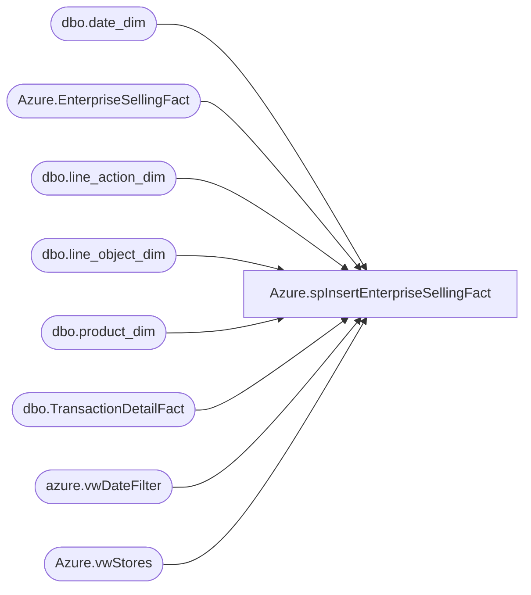

# Azure.spInsertEnterpriseSellingFact

**Database:** dw  
**Server:** papamart  

## Architecture Diagram



## Table Dependencies

| Referenced Table |
|---|
| dbo.date_dim |
| Azure.EnterpriseSellingFact |
| dbo.line_action_dim |
| dbo.line_object_dim |
| dbo.product_dim |
| dbo.TransactionDetailFact |
| azure.vwDateFilter |
| Azure.vwStores |

## Stored Procedure Code

```sql
CREATE proc [Azure].[spInsertEnterpriseSellingFact]

as 

set nocount on

truncate table Azure.EnterpriseSellingFact
	
--insert Azure.EnterpriseSellingFact
--select * --takes about 10 minutes, captures 2 years
--from azure.vwEntepriseSellingFact 


if(object_id('tempdb..#ESTRANS') is not null) drop table #ESTRANS
SELECT DISTINCT transaction_id AS TransactionID,
				cast(d.actual_date as date) AS TransactionDate
into #ESTrans
FROM dw.dbo.TransactionDetailFact tdf with (nolock)
INNER JOIN dw.dbo.date_dim d
	ON d.date_key=tdf.date_key
join azure.vwDateFilter df on d.actual_date=df.actual_date
WHERE line_object_key = 954 -- line object 106

if(object_id('tempdb..#HasNonES') is not null) drop table #HasNonES
SELECT DISTINCT tdf.transaction_id AS TransactionID
into #HasNonES	
FROM dw.dbo.TransactionDetailFact tdf with (nolock)
INNER JOIN #ESTrans e 
	ON e.TransactionID=tdf.transaction_id
WHERE tdf.line_object_key <> 954
	
insert Azure.EnterpriseSellingFact
SELECT 
	tdf.transaction_id AS TransactionID, 
	tdf.transaction_line_seq AS LineSeq,	
	ds.StoreNumber,
	ds.StoreKey as StoreKey,
	e.TransactionDate,
	tdf.reference_no AS ReferenceNumber,
	CASE WHEN HNE.TransactionID IS NULL
			THEN 'NO' 
			ELSE 'YES' 
	END AS HasNonESitems,
	la.Line_Action_Description AS ESAction,
	tdf.product_key AS ProductKey, 
	tdf.units AS Units,
	ISNULL(tdf.unit_gross_amount, 0) AS UnitGrossAmount,
	ISNULL(tdf.unit_gross_amount, 0) - ISNULL(unit_disc_amount, 0) AS UnitNetAmount,
	ISNULL(unit_disc_amount, 0) AS UnitDiscountAmount
FROM #ESTrans e 
INNER JOIN dw.dbo.TransactionDetailFact tdf with (nolock)
	ON tdf.transaction_id=e.TransactionID
join [dw].[Azure].[vwStores] ds WITH(NOLOCK)
			ON ds.StoreKey= case when CONVERT(VARCHAR,tdf.store_key) = -1 then 13 else CONVERT(VARCHAR,tdf.store_key) end 
INNER JOIN dw.dbo.date_dim dd with (nolock)
	ON tdf.date_key = dd.date_key
INNER JOIN dw.dbo.product_dim p with (nolock)
	ON p.product_key = tdf.product_key
INNER JOIN dw.dbo.line_object_dim lo with (nolock)
	ON lo.line_object_key = tdf.line_object_key
INNER JOIN dw.dbo.line_action_dim la with (nolock)
	ON la.line_action_key = tdf.line_action_key
LEFT OUTER JOIN #HasNonES HNE 
	ON HNE.TransactionID = e.TransactionID
join azure.vwDateFilter df on e.TransactionDate=cast(df.actual_date as date)
WHERE la.Line_Action_Description<>'sold'
AND p.product_key>0
```

