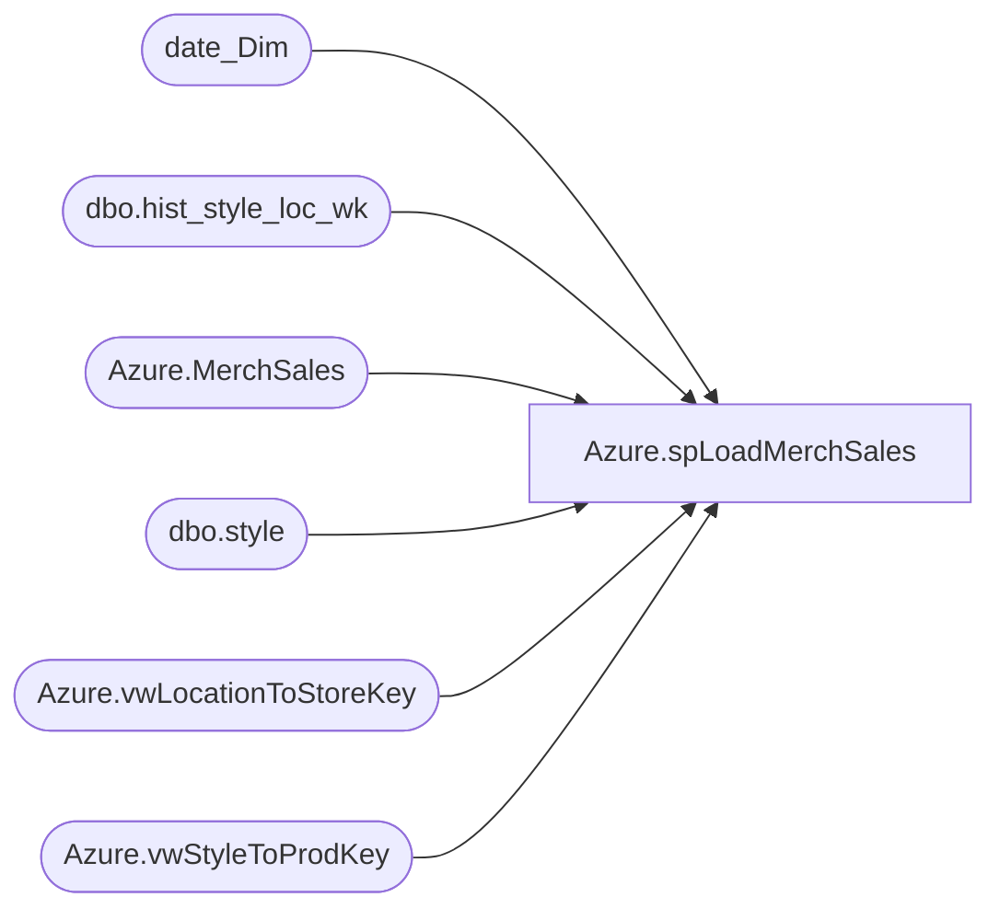

# Azure.spLoadMerchSales

**Database:** dw  
**Server:** papamart  

## Architecture Diagram



## Table Dependencies

| Referenced Table |
|---|
| date_Dim |
| dbo.hist_style_loc_wk |
| Azure.MerchSales |
| dbo.style |
| Azure.vwLocationToStoreKey |
| Azure.vwStyleToProdKey |

## Stored Procedure Code

```sql
-- =============================================
-- Author:		<Author,,Name>
-- Create date: <Create Date,,>
-- Description:	<Description,,>
-- =============================================
CREATE PROCEDURE [Azure].[spLoadMerchSales]
AS
BEGIN
	
Truncate Table Azure.MerchSales


Declare @BegWeek char(6)
Declare @EndWeek char(6)
Select @BegWeek = (Select Cast(Fiscal_Year - 1 as char(4)) + '01' from date_Dim where Actual_Date between GetDate()-2 and GetDate()-1)
Select @EndWeek = (Select Cast(Fiscal_Year as char(4)) + '53' from date_Dim where Actual_Date between GetDate()-2 and GetDate()-1);


With Da as (Select Actual_date,fiscal_week,fiscal_year from date_dim where datepart(dw,actual_date) = 7)
Insert into Azure.MerchSales
select ProductKey,StoreKey,Left(Merch_year_wk,4) as FiscalYear,Right(Merch_year_wk,2) as FiscalWeek ,
sum(sales_total_units-return_units) as NetSalesUnits,sum(sales_total_retail_te-return_retail_te) as NetSalesRetail 
,Actual_date as DateKey
from bedrockdb02.ma_01.dbo.hist_style_loc_wk d
inner join bedrockdb02.ma_01.dbo.style a on d.style_ID = a.style_id
inner join Azure.vwStyleToProdKey p on a.style_code = p.style
inner join Azure.vwLocationToStoreKey S on d.location_id = s.Locationid 
inner join da on (fiscal_year = Left(Merch_year_wk,4) and fiscal_week = Right(Merch_year_wk,2))
where Merch_year_wk between @BegWeek and @EndWeek
group by ProductKey,StoreKey,Left(Merch_year_wk,4) ,Right(Merch_year_wk,2) ,Actual_date
having sum(sales_total_units-return_units) <> 0;

End
```

