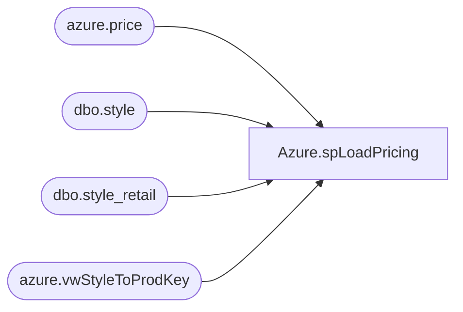

# Azure.spLoadPricing

**Database:** dw  
**Server:** papamart  

## Architecture Diagram



## Table Dependencies

| Referenced Table |
|---|
| azure.price |
| dbo.style |
| dbo.style_retail |
| azure.vwStyleToProdKey |

## Stored Procedure Code

```sql
-- =============================================
-- Author:		John Eck
-- Create date: 2/25/2019
-- Description:	Loads pricing data from merchandising for power bi 
-- =============================================
CREATE PROCEDURE [Azure].[spLoadPricing]
AS
BEGIN


truncate table azure.price

Insert into azure.Price
Select ProductKey,'Home',Current_selling_retail, Original_Selling_Retail
from bedrockdb02.me_01.dbo.style_retail sr inner join bedrockdb02.me_01.dbo.style s on sr.style_ID = s.style_ID
inner join azure.vwStyleToProdKey p on s.style_code = p.style
where (left(style_code,1) = '0' and Jurisdiction_ID = 1) or
(left(style_code,1) = '1' and Jurisdiction_ID = 3) or
(left(style_code,1) = '4' and Jurisdiction_ID = 2) or
(left(style_code,1) = '8' and Jurisdiction_ID = 8) 


Insert into azure.Price
Select ProductKey,'IE Price',Current_selling_retail, Original_Selling_Retail
from bedrockdb02.me_01.dbo.style_retail sr inner join bedrockdb02.me_01.dbo.style s on sr.style_ID = s.style_ID
inner join azure.vwStyleToProdKey p on s.style_code = p.style
where (left(style_code,1) = '4' and Jurisdiction_ID = 5) 


Insert into azure.Price
Select ProductKey,'DK Price',Current_selling_retail, Original_Selling_Retail
from bedrockdb02.me_01.dbo.style_retail sr inner join bedrockdb02.me_01.dbo.style s on sr.style_ID = s.style_ID
inner join azure.vwStyleToProdKey p on s.style_code = p.style
where (left(style_code,1) = '4' and Jurisdiction_ID = 7) 
END
```

