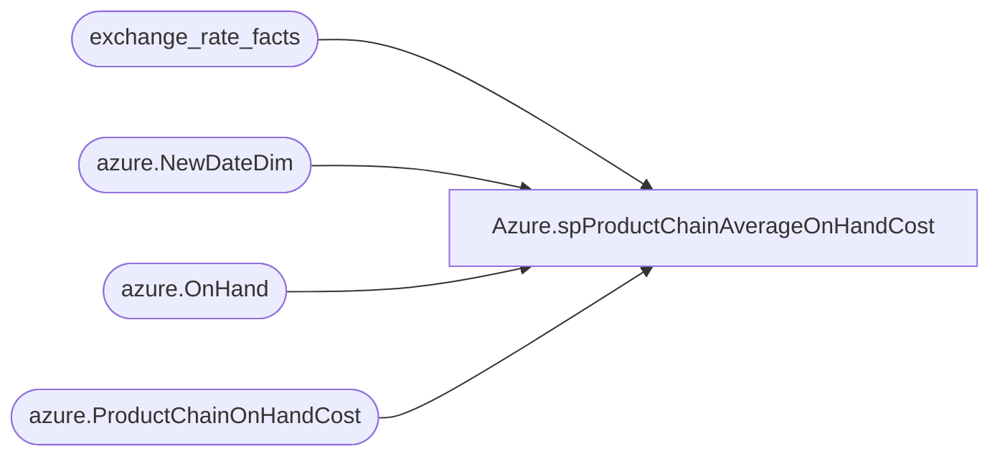

# Azure.spProductChainAverageOnHandCost

**Database:** dw  
**Server:** papamart  

## Architecture Diagram



## Table Dependencies

| Referenced Table |
|---|
| exchange_rate_facts |
| azure.NewDateDim |
| azure.OnHand |
| azure.ProductChainOnHandCost |

## Stored Procedure Code

```sql
CREATE proc [Azure].[spProductChainAverageOnHandCost]

as

--===========================================================================================================================================================================
--	Dan Tweedie	2019-08/24	Created proc to run before Power BI data is processed, to be queried via azure.vwProducts for purpose of getting most recent cost that is > 0
--							--sort of a band aid solution to a power bi reporting issue
--===========================================================================================================================================================================

set nocount on

IF (Object_ID('tempdb..#CostByDate') IS NOT NULL) DROP TABLE #CostByDate
SELECT 
        ProductKey,
        case when sum(OnHand) = 0 then 0 else round(sum(OnHandcost)/sum(Onhand),2) end as ChainAverageOnHandCost,
		date_key
into #CostByDate
FROM   
        azure.OnHand
        join azure.NewDateDim 
            on workyear = right(Fiscal_Year,4) 
                    and workWeek = Cast(Fiscal_Week_Of_Year_key as int) 
                    and Fiscal_Day_Of_Week_key = 1
WHERE inv_status = 'Available' 
--and ProductKey = 75093
GROUP BY ProductKey, date_key


IF (Object_ID('tempdb..#MaxDateForCost') IS NOT NULL) DROP TABLE #MaxDateForCost 
select 
	ProductKey,
	max(date_key) MaxDate
into #MaxDateForCost
from #CostByDate
where 1=1
and date_key <= getdate()
group by 
	ProductKey


IF (Object_ID('tempdb..#ProductChainOnHandCostStage') IS NOT NULL) DROP TABLE #ProductChainOnHandCostStage
select 
	cbd.ProductKey,
	cbd.ChainAverageOnHandCost
into #ProductChainOnHandCostStage
from #CostByDate cbd
join #MaxDateForCost md 
	on cbd.ProductKey=md.ProductKey
	and cbd.date_key=md.MaxDate


IF (Object_ID('tempdb..#ExchangeRateGBP') IS NOT NULL) DROP TABLE #ExchangeRateGBP
select 
	(1/e.fiscal_month_ave_rate) as ExchangeRate
into #ExchangeRateGBP
from exchange_rate_facts e with (nolock) 
join Azure.NewDateDim d with (nolock) 
	on e.actual_date=d.Fiscal_Month_Key
	and d.Date_Key = CONVERT(varchar, getdate(), 23)
where e.from_currency_code = 'GBP' and e.to_currency_code = 'USD'


;

merge into azure.ProductChainOnHandCost t
using #ProductChainOnHandCostStage s
on 
	(
		t.ProductKey=s.ProductKey
	)
when matched and 
	(
		isnull(t.ChainAverageOnHandCost,0)<>isnull(s.ChainAverageOnHandCost,0)
	)
then update
	set 
		t.ChainAverageOnHandCost=s.ChainAverageOnHandCost
when not matched by target
	then insert
		(
			ProductKey,
			ChainAverageOnHandCost
		)
	values
		(
			s.ProductKey,
			s.ChainAverageOnHandCost
		)
;

-----
declare 
	@ExchangeRate float

select @ExchangeRate = ExchangeRate from #ExchangeRateGBP


update azure.ProductChainOnHandCost
set ChainAverageOnHandCostGBP=(ChainAverageOnHandCost*@ExchangeRate)
-----

--update azure.ProductChainOnHandCost
--set ChainAverageOnHandCostGBP = 0 
--where ChainAverageOnHandCostGBP < 0

--update azure.ProductChainOnHandCost
--set ChainAverageOnHandCost = 0 
--where ChainAverageOnHandCost < 0


dbo,usp_delete_old_files,-- Example:		exec usp_delete_old_files @path = 'c:\temp\', @filemask = '*.zip', @retention = 7
------------------------------------------------------------------------------------------------
CREATE proc usp_delete_old_files (@path varchar(100), @filemask varchar(20), @retention int = 2)
as
declare @cmd varchar(1000)
declare @rowcnt int	--stores @@rowcount
declare @WhichFile VARCHAR(1000)

--declare @path varchar(100)
--declare @filemask varchar(20)
--declare @retention int
--
--select @path = 'i:\postfuture\uploaded\'
--select @filemask = '*.zip'
--select @retention = 7

-- Stores the name of the file to be deleted
CREATE TABLE #DeleteOldFiles
 (
  DirInfo VARCHAR(7000)
 )

-- Build the command that will list out all of the files in a directory
SELECT @cmd = 'dir ' + @path + @filemask + ' /OD'

  -- Run the dir command and put the results into a temp table
  INSERT INTO #DeleteOldFiles
  EXEC master.dbo.xp_cmdshell @cmd

  -- Delete all rows from the temp table except the ones that correspond to the files to be deleted
  DELETE
  FROM #DeleteOldFiles
  WHERE ISDATE(SUBSTRING(DirInfo, 1, 10)) = 0 OR DirInfo LIKE '%
%' OR SUBSTRING(DirInfo, 25, 5) = '<DIR>'
	OR SUBSTRING(DirInfo, 1, 10) >= GETDATE() - @retention

  -- Get the file name portion of the row that corresponds to the file to be deleted
  SELECT TOP 1 @WhichFile = SUBSTRING(DirInfo, LEN(DirInfo) -  PATINDEX('% %', REVERSE(DirInfo)) + 2, LEN(DirInfo))
  FROM #DeleteOldFiles
  
  SET @rowcnt = @@ROWCOUNT
  
  -- Interate through the temp table until there are no more files to delete
  WHILE @rowcnt <> 0
  BEGIN
  
   -- Build the del command
   SELECT @cmd = 'del ' + @path + @WhichFile + ' /Q /F'
   
   -- Delete the file
   EXEC master.dbo.xp_cmdshell @cmd, NO_OUTPUT
   
   -- To move to the next file, the current file name needs to be deleted from the temp table
   DELETE
   FROM #DeleteOldFiles
   WHERE SUBSTRING(DirInfo, LEN(DirInfo) -  PATINDEX('% %', REVERSE(DirInfo)) + 2, LEN(DirInfo))  = @WhichFile

   -- Get the file name portion of the row that corresponds to the file to be deleted
   SELECT TOP 1 @WhichFile = SUBSTRING(DirInfo, LEN(DirInfo) -  PATINDEX('% %', REVERSE(DirInfo)) + 2, LEN(DirInfo))
   FROM #DeleteOldFiles
  
   SET @rowcnt = @@ROWCOUNT
  
  END
  
  DROP TABLE #DeleteOldFiles
```

