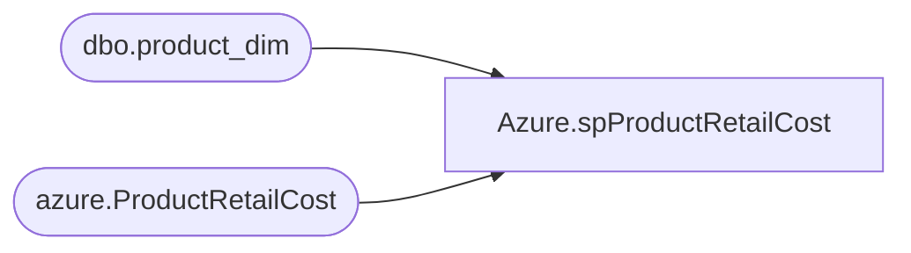

# Azure.spProductRetailCost

**Database:** dw  
**Server:** papamart  

## Architecture Diagram



## Table Dependencies

| Referenced Table |
|---|
| dbo.product_dim |
| azure.ProductRetailCost |

## Stored Procedure Code

```sql
-- =============================================
-- Author:		Ian Wallace - to fix retail cost missing on powerBI reports
-- =============================================
CREATE PROCEDURE [Azure].[spProductRetailCost] 
	
AS
BEGIN
	
	SET NOCOUNT ON;

    
  
--select pD.product_key, pD.sku, pD.original_retail, pD.current_retail
--into #retailCost
--from [Azure].[OnHand] oH 
--join dbo.product_dim pD on oH.ProductKey = pD.product_key 
--group by pD.product_key, pD.sku, pD.current_retail, pD.original_retail
--order by product_key asc

select pD.product_key, pD.sku, 
isnull(pD.original_retail,0.00) as original_retail, 
isnull(pD.current_retail,0.00) as current_retail
into #retailCost
from dbo.product_dim pD 
group by pD.product_key, pD.sku, pD.current_retail, pD.original_retail
--order by pD.sku asc


merge into azure.ProductRetailCost pRc
using #retailCost rC
on 
	(
		rC.product_key = pRc.product_key
	)
when matched 
then update
	set pRc.original_retail = rC.original_retail
	,pRc.current_retail = rC.current_retail
when not matched by target
	then insert
		(
			product_key,
			sku,
			original_retail,
			current_retail
		)
	values
		(
			rC.product_key,
			rC.sku,
			rC.original_retail,
			rC.current_retail
		)
;


END
```

