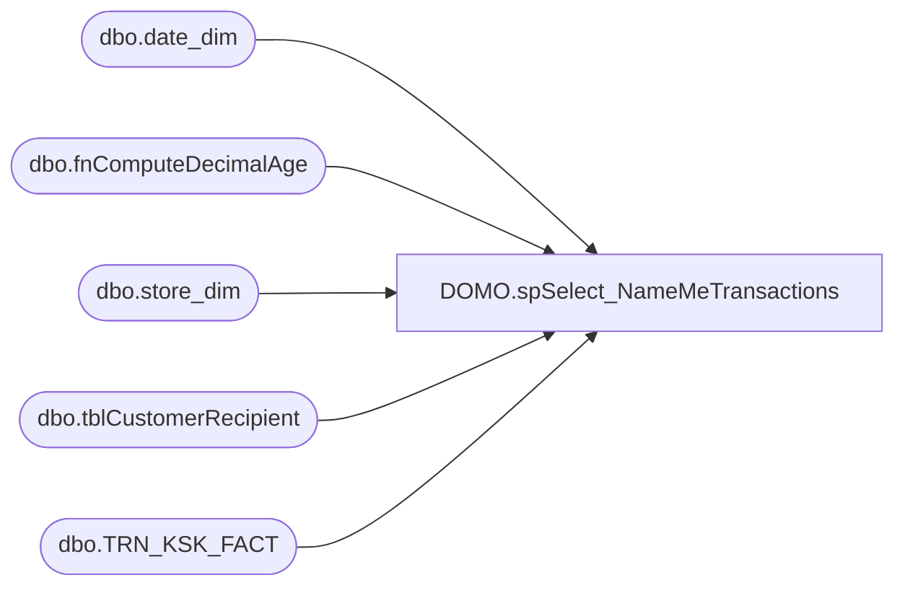

# DOMO.spSelect_NameMeTransactions

**Database:** dw  
**Server:** papamart  

## Architecture Diagram



## Table Dependencies

| Referenced Table |
|---|
| dbo.date_dim |
| dbo.fnComputeDecimalAge |
| dbo.store_dim |
| dbo.tblCustomerRecipient |
| dbo.TRN_KSK_FACT |

## Stored Procedure Code

```sql
CREATE PROCEDURE [DOMO].[spSelect_NameMeTransactions]
@StartDate DATE
AS
-- =====================================================================================================
-- Name: spSelect_NameMeTransactions
--
-- Description:	Generates a list of NameMe transactions from @StartDate through Yesterday.  Feeds DOMO.
--
-- Input: @StartDate
--
-- Output: Resultset 
--			
--
-- Dependencies: None
--
-- Revision History
--		Name:			Date:			Comments:
--		Anthony Delgado	06/21/2016		Initial Creation
-- =====================================================================================================
BEGIN
	SET NOCOUNT ON;

	SELECT 
		ID,
		CAST(dRStartTime AS DATE) dRStartTime,
		sRGender,
		CAST(dRBirthDate AS DATE) dRBirthDate,
		CASE WHEN sRRecipientType='For_Someone_Else' THEN 1 ELSE 0 END AS GiftFlag
	INTO #KioskDetail
	FROM KODIAK.babw.dbo.tblCustomerRecipient WITH (NOLOCK)
	WHERE CAST(Pull_DateStamp AS DATE)>=@StartDate
	AND CAST(Pull_DateStamp AS DATE)<=CAST(GETDATE()-1 AS DATE)

	CREATE NONCLUSTERED INDEX N_NameMeGenderBDay ON #KioskDetail
	(
		ID ASC
	)

	SELECT	d.actual_date AS TransactionDate, 
			CASE WHEN (k.dRBirthDate<='1900-01-01' OR k.dRBirthDate IS NULL OR dRStartTime=dRBirthDate)
				THEN NULL
				ELSE dw.dbo.fnComputeDecimalAge(k.dRBirthDate, d.actual_date) 
			END AS RecipientAge,
			CASE WHEN k.sRGender IN ('BOY', 'MALE', 'M', 'NIÑO') THEN 'Male'
				 WHEN k.sRGender IN ('GIRL', 'F', 'FEMALE', 'FEMAL', 'NIÑA') THEN 'Female'
				 ELSE 'Unknown'
			END AS RecipientGenderCode, 
			k.GiftFlag AS GiftFlag,
			sd.store_id AS StoreKey, 
			tkf.PRDCT_ID AS ProductKey,
			d.fiscal_year AS FiscalYear,
			d.fiscal_period AS FiscalPeriod,
			d.fiscal_week AS FiscalWeek
	FROM dw.dbo.TRN_KSK_FACT tkf
	INNER JOIN dw.dbo.date_dim d
		ON d.date_key=tkf.DT_ID
	INNER JOIN dw.dbo.store_dim sd
		ON sd.store_key=tkf.STR_ID
	INNER JOIN #KioskDetail k
		ON k.ID=tkf.TRN_NBR
	WHERE CAST(d.actual_date AS DATE)>=@StartDate
	AND CAST(d.actual_date AS DATE)<=CAST(GETDATE()-1 AS DATE) 

END
```

