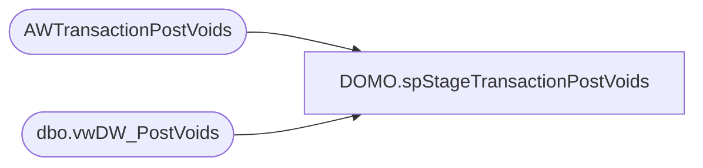

# DOMO.spStageTransactionPostVoids

**Database:** dw  
**Server:** papamart  

## Architecture Diagram



## Table Dependencies

| Referenced Table |
|---|
| AWTransactionPostVoids |
| dbo.vwDW_PostVoids |

## Stored Procedure Code

```sql
CREATE proc [DOMO].[spStageTransactionPostVoids] 
as

set nocount on

truncate table AWTransactionPostVoids

insert AWTransactionPostVoids
select TransactionDate, StoreNo, PostVoidUGA,PostVoidUnits 
from bedrockdb01.auditworks.dbo.vwDW_PostVoids --LINKED SERVER QUERY ONLY TAKES 16 SECONDS TO RUN FOR 1000 DAYS...
```

