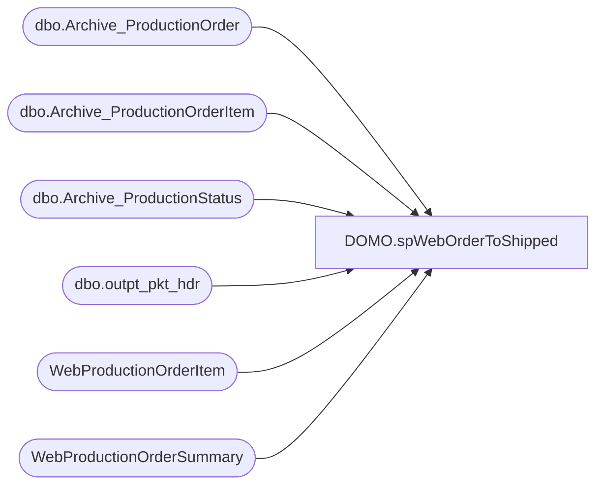

# DOMO.spWebOrderToShipped

**Database:** dw  
**Server:** papamart  

## Architecture Diagram



## Table Dependencies

| Referenced Table |
|---|
| dbo.Archive_ProductionOrder |
| dbo.Archive_ProductionOrderItem |
| dbo.Archive_ProductionStatus |
| dbo.outpt_pkt_hdr |
| WebProductionOrderItem |
| WebProductionOrderSummary |

## Stored Procedure Code

```sql
CREATE proc [DOMO].[spWebOrderToShipped]

as
-- =====================================================================================================
-- Name: spWebOrderToShipped
--
-- Description:	Captures count of US web orders created by date, count of orders shipped in 0 days, 1 day, 2 days, 3 days, etc
--
-- Revision History
--		Name:			Date:			Comments:
--		Dan Tweedie		2016-12-09		Created Proc
-- =====================================================================================================
set nocount on


IF (Object_ID('tempdb..#OrdersCreated') IS NOT NULL) DROP TABLE #OrdersCreated	
;
with 
Canceled as
	(
		SELECT distinct
			ProductionOrderNumber OrderNumber
		FROM 
			WebProductionOrderSummary
		WHERE ProductionOrderSiteCode = 'BABW_US'
		AND ProductionOrderBillingFirstName <> 'House Order'
		and ProductionOrderWebOrderStatus = 'Canceled'
		and ProductionOrderDateTimeCreated >=DATEADD(year, -2, DATEADD(yy, DATEDIFF(yy, 0, GETDATE()), 0))
		--AND PO.ProductionOrderDateTimeCreated <=CONVERT(DATE,GETDATE())
		UNION
		SELECT distinct
			po.ProductionOrderNumber OrderNumber
		FROM 
			KODIAK.BABWPMS.dbo.Archive_ProductionOrder po WITH (NOLOCK) 
		join KODIAK.BABWPMS.dbo.Archive_ProductionStatus ps with (nolock) on po.productionorderid = ps.productionorderid
		WHERE PO.ProductionOrderSiteCode = 'BABW_US'
		AND po.ProductionOrderBillingFirstName <> 'House Order'
		and ps.productionstatuscode = 'Canceled'
		and PO.ProductionOrderDateTimeCreated >=DATEADD(year, -2, DATEADD(yy, DATEDIFF(yy, 0, GETDATE()), 0))
		--AND PO.ProductionOrderDateTimeCreated <=CONVERT(DATE,GETDATE())
	),
Orders as
	(
	SELECT  DISTINCT
		cast(po.ProductionOrderDateTimeCreated as date) OrderDate,
		po.ProductionOrderNumber OrderNumber
	FROM 
		WebProductionOrderSummary po
		join WebProductionOrderItem poi on po.productionorderid = poi.productionorderid and len(ProductionOrderItemSku)<=6
	WHERE po.ProductionOrderSiteCode = 'BABW_US'
	AND po.ProductionOrderBillingFirstName <> 'House Order'
	and (poi.ProductionOrderItemIsVirtualItem = 0 or poi.ProductionOrderItemIsVirtualItem is NULL) 
	and (poi.ProductionOrderItemIsVirtualGiftCard = 0 or poi.ProductionOrderItemIsVirtualGiftCard is NULL)
	and poi.ProductionOrderItemSku NOT in ('191450','111027','-16','14094','22605','91450','407601','411027','411207','414300','414826','491450') --donations
	and poi.ProductionOrderItemName	NOT like '%donation%'
	and PO.ProductionOrderDateTimeCreated >=DATEADD(year, -2, DATEADD(yy, DATEDIFF(yy, 0, GETDATE()), 0))
	--AND PO.ProductionOrderDateTimeCreated <=CONVERT(DATE,GETDATE())
	and po.ProductionOrderNumber not in (select OrderNumber from Canceled)
	UNION
	SELECT  DISTINCT
		cast(PO.ProductionOrderDateTimeCreated as date) OrderDate,
		po.ProductionOrderNumber OrderNumber
	FROM 
		KODIAK.BABWPMS.dbo.Archive_ProductionOrder PO WITH (NOLOCK) 
		join KODIAK.BABWPMS.dbo.Archive_ProductionOrderItem poi with (nolock) on po.productionorderid = poi.productionorderid
	WHERE PO.ProductionOrderSiteCode = 'BABW_US'
	AND PO.ProductionOrderBillingFirstName <> 'House Order'
	and (poi.ProductionOrderItemIsVirtualItem = 0 or poi.ProductionOrderItemIsVirtualItem is NULL) 
	and (poi.ProductionOrderItemIsVirtualGiftCard = 0 or poi.ProductionOrderItemIsVirtualGiftCard is NULL)
	and poi.ProductionOrderItemSku NOT in ('191450','111027','-16','14094','22605','91450','407601','411027','411207','414300','414826','491450') --donations
	and poi.ProductionOrderItemName	NOT like '%donation%'
	and PO.ProductionOrderDateTimeCreated >=DATEADD(year, -2, DATEADD(yy, DATEDIFF(yy, 0, GETDATE()), 0))
	--AND PO.ProductionOrderDateTimeCreated <=CONVERT(DATE,GETDATE())
	and po.ProductionOrderNumber not in (select OrderNumber from Canceled)
)
select distinct
	OrderDate,
	OrderNumber
into #OrdersCreated
from 
	Orders


IF (Object_ID('tempdb..#OrdersShipped') IS NOT NULL) DROP TABLE #OrdersShipped
select 
	max(ShipDate) ShipDate,
	OrderNumber
into #OrdersShipped
from 
	(
		select 
			max(cast(WM.create_date_time as date)) ShipDate,
			replace(WM.pkt_ctrl_nbr, right(pkt_ctrl_nbr, 2), '') OrderNumber 
		from wmdb01.wmprod.dbo.outpt_pkt_hdr WM
		join #OrdersCreated oc on oc.OrderNumber = replace(WM.pkt_ctrl_nbr, right(pkt_ctrl_nbr, 2), '') 
		group by replace(WM.pkt_ctrl_nbr, right(pkt_ctrl_nbr, 2), '')
		UNION
		select 
			max(cast(WM.create_date_time as date)) ShipDate,
			replace(WM.pkt_ctrl_nbr, right(pkt_ctrl_nbr, 2), '') OrderNumber 
		from wmdb01.wmprod_archive.dbo.outpt_pkt_hdr WM
		join #OrdersCreated oc on oc.OrderNumber = replace(WM.pkt_ctrl_nbr, right(pkt_ctrl_nbr, 2), '') 
		group by replace(WM.pkt_ctrl_nbr, right(pkt_ctrl_nbr, 2), '')
	) sub
group by OrderNumber

IF (Object_ID('tempdb..#ShipMatrix') IS NOT NULL) DROP TABLE #ShipMatrix
select
	oc.OrderDate,
	oc.OrderNumber,
	case when os.ShipDate = oc.OrderDate then 1 else 0 end as Day0,
	case when isnull(os.ShipDate, '1900-01-01') = dateadd(dd, +1, oc.OrderDate) then 1 else 0 end as Day1,
	case when isnull(os.ShipDate, '1900-01-01') = dateadd(dd, +2, oc.OrderDate) then 1 else 0 end as Day2,
	case when isnull(os.ShipDate, '1900-01-01') = dateadd(dd, +3, oc.OrderDate) then 1 else 0 end as Day3,
	case when isnull(os.ShipDate, '1900-01-01') = dateadd(dd, +4, oc.OrderDate) then 1 else 0 end as Day4,
	case when isnull(os.ShipDate, '1900-01-01') = dateadd(dd, +5, oc.OrderDate) then 1 else 0 end as Day5,
	case when isnull(os.ShipDate, '1900-01-01') = dateadd(dd, +6, oc.OrderDate) then 1 else 0 end as Day6,
	case when isnull(os.ShipDate, '1900-01-01') = dateadd(dd, +7, oc.OrderDate) then 1 else 0 end as Day7,
	case when isnull(os.ShipDate, '1900-01-01') = dateadd(dd, +8, oc.OrderDate) then 1 else 0 end as Day8,
	case when isnull(os.ShipDate, '1900-01-01') = dateadd(dd, +9, oc.OrderDate) then 1 else 0 end as Day9,
	case when isnull(os.ShipDate, '1900-01-01') = dateadd(dd, +10, oc.OrderDate) then 1 else 0 end as Day10,
	case when isnull(os.ShipDate, '1900-01-01') = dateadd(dd, +11, oc.OrderDate) then 1 else 0 end as Day11,
	case when isnull(os.ShipDate, '1900-01-01') = dateadd(dd, +12, oc.OrderDate) then 1 else 0 end as Day12,
	case when isnull(os.ShipDate, '1900-01-01') = dateadd(dd, +13, oc.OrderDate) then 1 else 0 end as Day13,
	case when isnull(os.ShipDate, '1900-01-01') = dateadd(dd, +14, oc.OrderDate) then 1 else 0 end as Day14,
	case when isnull(os.ShipDate, '1900-01-01') >= dateadd(dd, +15, oc.OrderDate) then 1 else 0 end as Day15Plus
into #ShipMatrix
from 
	#OrdersCreated oc
left join #OrdersShipped os on oc.OrderNumber = os.OrderNumber

select 
	OrderDate,
	count(OrderNumber) OrdersCreated,
	sum(Day0) ShippedSameDay,
	sum(Day1) ShippedIn1Day,
	sum(Day2) ShippedIn2Days,
	sum(Day3) ShippedIn3Days,
	sum(Day4) ShippedIn4Days,
	sum(Day5) ShippedIn5Days,
	sum(Day6) ShippedIn6Days,
	sum(Day7) ShippedIn7Days,
	sum(Day8) ShippedIn8Days,
	sum(Day9) ShippedIn9Days,
	sum(Day10) ShippedIn10Days,
	sum(Day11) ShippedIn11Days,
	sum(Day12) ShippedIn12Days,
	sum(Day13) ShippedIn13Days,
	sum(Day14) ShippedIn14Days,
	sum(Day15Plus) ShippedIn15DaysPlus
from #ShipMatrix
group by OrderDate
order by OrderDate
```

