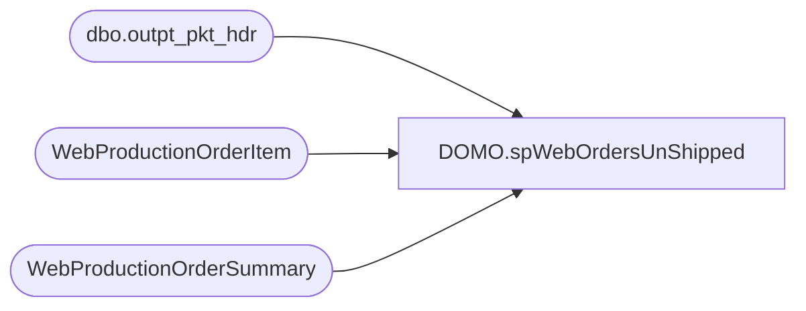

# DOMO.spWebOrdersUnShipped

**Database:** dw  
**Server:** papamart  

## Architecture Diagram



## Table Dependencies

| Referenced Table |
|---|
| dbo.outpt_pkt_hdr |
| WebProductionOrderItem |
| WebProductionOrderSummary |

## Stored Procedure Code

```sql
CREATE proc [DOMO].[spWebOrdersUnShipped]

as 

-- =====================================================================================================
-- Name: spWebOrdersUnShipped
--
-- Description:	Captures US web orders created which have not been shipped 
--
-- Revision History
--		Name:			Date:			Comments:
--		Dan Tweedie		2016-12-14		Created Proc
-- =====================================================================================================

set nocount on

IF (Object_ID('tempdb..#OrdersCreated') IS NOT NULL) DROP TABLE #OrdersCreated	
;
with 
Canceled as
	(
		SELECT distinct
			po.ProductionOrderNumber OrderNumber
		FROM 
			 WebProductionOrderSummary po
		WHERE PO.ProductionOrderSiteCode = 'BABW_US'
		AND po.ProductionOrderBillingFirstName <> 'House Order'
		and po.ProductionOrderWebOrderStatus = 'Canceled'
	)
SELECT  
	cast(PO.ProductionOrderDateTimeCreated as date) OrderDate,
	po.ProductionOrderNumber OrderNumber, 
	poi.ProductionOrderItemSku SKU,
	poi.ProductionOrderItemName SKU_Description, 
	sum(poi.ProductionOrderItemQuantity) Qty
into #OrdersCreated
FROM 
	WebProductionOrderSummary po
		join WebProductionOrderItem poi on po.productionorderid = poi.productionorderid and len(ProductionOrderItemSku)<=6
WHERE PO.ProductionOrderSiteCode = 'BABW_US'
AND PO.ProductionOrderBillingFirstName <> 'House Order'
and (poi.ProductionOrderItemIsVirtualItem = 0 or poi.ProductionOrderItemIsVirtualItem is null)
and (poi.ProductionOrderItemIsVirtualGiftCard = 0 or poi.ProductionOrderItemIsVirtualGiftCard is null)
and poi.ProductionOrderItemSku NOT in ('191450','111027','-16','14094','22605','91450','407601','411027','411207','414300','414826','491450') --donations
and poi.ProductionOrderItemName	NOT like '%donation%'
and PO.ProductionOrderDateTimeCreated >=DATEADD(year, -2, DATEADD(yy, DATEDIFF(yy, 0, GETDATE()), 0))
AND PO.ProductionOrderDateTimeCreated <=CONVERT(DATE,GETDATE())
and po.ProductionOrderNumber not in (select OrderNumber from Canceled)
group by 
	cast(PO.ProductionOrderDateTimeCreated as date),
	po.ProductionOrderNumber, 
	poi.ProductionOrderItemSku,
	poi.ProductionOrderItemName

IF (Object_ID('tempdb..#OrdersShipped') IS NOT NULL) DROP TABLE #OrdersShipped
select 
	max(ShipDate) ShipDate,
	OrderNumber
into #OrdersShipped
from 
	(
		select 
			max(cast(WM.create_date_time as date)) ShipDate,
			replace(WM.pkt_ctrl_nbr, right(pkt_ctrl_nbr, 2), '') OrderNumber 
		from wmdb01.wmprod.dbo.outpt_pkt_hdr WM
		join #OrdersCreated oc on oc.OrderNumber = replace(WM.pkt_ctrl_nbr, right(pkt_ctrl_nbr, 2), '') 
		group by replace(WM.pkt_ctrl_nbr, right(pkt_ctrl_nbr, 2), '')
		UNION
		select 
			max(cast(WM.create_date_time as date)) ShipDate,
			replace(WM.pkt_ctrl_nbr, right(pkt_ctrl_nbr, 2), '') OrderNumber 
		from wmdb01.wmprod_archive.dbo.outpt_pkt_hdr WM
		join #OrdersCreated oc on oc.OrderNumber = replace(WM.pkt_ctrl_nbr, right(pkt_ctrl_nbr, 2), '') 
		group by replace(WM.pkt_ctrl_nbr, right(pkt_ctrl_nbr, 2), '')
	) sub
group by OrderNumber

;with OrdersCreatedByDate as
	(
		select OrderDate, count(distinct OrderNumber) TotalOrdersCreatedByDay
		from #OrdersCreated oc
		group by OrderDate
	)
select
	oc.OrderDate,
	oc.OrderNumber, 
	oc.SKU,
	oc.SKU_Description, 
	oc.Qty,
	ocbd.TotalOrdersCreatedByDay
from #OrdersCreated oc 
join OrdersCreatedByDate ocbd on oc.OrderDate = ocbd.OrderDate
where OrderNumber not in (select OrderNumber from #OrdersShipped)
```

