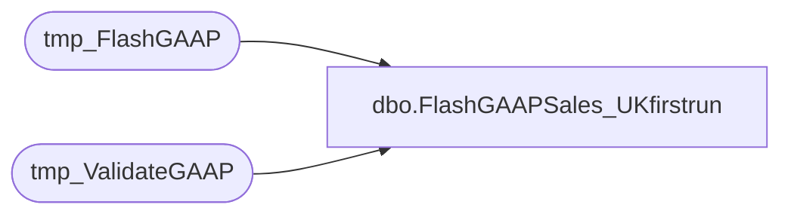

# dbo.FlashGAAPSales_UKfirstrun

**Database:** dw  
**Server:** papamart  

## Architecture Diagram



## Table Dependencies

| Referenced Table |
|---|
| tmp_FlashGAAP |
| tmp_ValidateGAAP |

## Stored Procedure Code

```sql
create proc FlashGAAPSales_UKfirstrun

as

truncate table tmp_FlashGAAP
truncate table tmp_ValidateGAAP

SET ANSI_WARNINGS OFF
```

