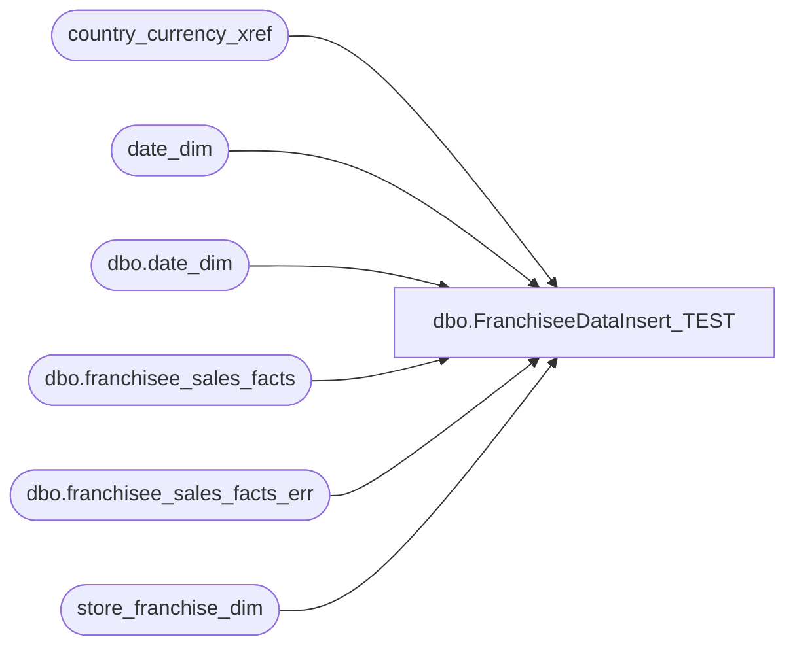

# dbo.FranchiseeDataInsert_TEST

**Database:** dw  
**Server:** papamart  

## Architecture Diagram



## Table Dependencies

| Referenced Table |
|---|
| country_currency_xref |
| date_dim |
| dbo.date_dim |
| dbo.franchisee_sales_facts |
| dbo.franchisee_sales_facts_err |
| store_franchise_dim |

## Stored Procedure Code

```sql
CREATE PROCEDURE [dbo].[FranchiseeDataInsert_TEST]

	@WeekEndingDate AS datetime
	,@StoreID AS varchar(20)
	,@TotalSales AS decimal = 0
	,@SalesPlan AS decimal = 0
	,@TransactionCount AS int = 0
	,@FootwareSales AS decimal = 0
	,@FootwareUnits AS int = 0
	,@SoundSales AS decimal = 0
	,@SoundUnits AS int = 0
	,@UnstuffedSales AS decimal = 0
	,@UnstuffedUnits AS int = 0
	,@PartySales AS decimal = 0
	,@PartyCount AS int = 0
	,@GiftCardSales AS decimal = 0
	,@GiftCardUnits AS int = 0
	,@AccessoriesSales AS decimal = 0
	,@AccessoriesUnits AS int = 0
	,@ClothesSales AS decimal = 0
	,@ClothesUnits AS int = 0
	,@SportsSales AS decimal = 0
	,@SportsUnits AS int = 0
	,@PrestuffedSales AS decimal = 0
	,@PrestuffedUnits AS int = 0

AS
BEGIN

	DECLARE @WeekEndingDateKey int
	DECLARE @ParsedStoreID varchar(50)
	DECLARE @FranchiseeStoreKey int
	DECLARE @CurrencyKey int

	SELECT @WeekEndingDateKey = MAX(date_key)
	FROM dw.dbo.date_dim
	WHERE week_id IN (SELECT week_id FROM date_dim WHERE actual_date = CAST(CONVERT(varchar(10),@WeekEndingDate,101) AS smalldatetime))

	--IF @WeekEndingDateKey IS NULL BEGIN SET @WeekEndingDateKey = 1 END

	SET @ParsedStoreID = SUBSTRING(@StoreID, CHARINDEX('#', @StoreID) + 1, CHARINDEX(' ', @StoreID) - CHARINDEX('#', @StoreID) - 1)

	SELECT @FranchiseeStoreKey = store_key
		,@CurrencyKey = cc.currency_key
	FROM store_franchise_dim s
	LEFT JOIN country_currency_xref cc ON cc.country_code = s.country
	WHERE store_id = @ParsedStoreID

	DECLARE @c_date_key int
	DECLARE @c_store_key int

	-- This was embedded in code, i added it to this sproc because it is executed before the proc anyway.
	--TRUNCATE TABLE dbo.franchisee_sales_facts

	IF EXISTS (SELECT 1 FROM dbo.franchisee_sales_facts WHERE week_ending_date_key = @WeekEndingDateKey AND franchisee_store_key = @FranchiseeStoreKey)
	BEGIN

		INSERT INTO [dw].[dbo].[franchisee_sales_facts_err]
			([week_ending_date_key]
			,[franchisee_store_key]
			,[currency_key]
			,[total_sales]
			,[sales_plan]
			,[transaction_count]
			,[footware_sales]
			,[footware_units]
			,[sound_sales]
			,[sound_units]
			,[unstuffed_sales]
			,[unstuffed_units]
			,[party_sales]
			,[party_count]
			,[gift_card_sales]
			,[gift_card_units]
			,[accessories_sales]
			,[accessories_units]
			,[clothes_sales]
			,[clothes_units]
			,[sports_sales]
			,[sports_units]
			,[prestuffed_sales]
			,[prestuffed_units]
			,[Error]
			,[ErrorDateTime])
		VALUES
			(@WeekEndingDateKey
			,@FranchiseeStoreKey
			,@CurrencyKey
			,@TotalSales
			,@SalesPlan
			,@TransactionCount
			,@FootwareSales
			,@FootwareUnits
			,@SoundSales
			,@SoundUnits
			,@UnstuffedSales
			,@UnstuffedUnits
			,@PartySales
			,@PartyCount
			,@GiftCardSales
			,@GiftCardUnits
			,@AccessoriesSales
			,@AccessoriesUnits
			,@ClothesSales
			,@ClothesUnits
			,@SportsSales
			,@SportsUnits
			,@PrestuffedSales
			,@PrestuffedUnits
			,'Duplicate Data'
			,GETDATE())

	END

	ELSE IF (@CurrencyKey IS NULL)
	BEGIN

		INSERT INTO [dw].[dbo].[franchisee_sales_facts_err]
			([week_ending_date_key]
			,[franchisee_store_key]
			,[currency_key]
			,[total_sales]
			,[sales_plan]
			,[transaction_count]
			,[footware_sales]
			,[footware_units]
			,[sound_sales]
			,[sound_units]
			,[unstuffed_sales]
			,[unstuffed_units]
			,[party_sales]
			,[party_count]
			,[gift_card_sales]
			,[gift_card_units]
			,[accessories_sales]
			,[accessories_units]
			,[clothes_sales]
			,[clothes_units]
			,[sports_sales]
			,[sports_units]
			,[prestuffed_sales]
			,[prestuffed_units]
			,[Error]
			,[ErrorDateTime])
		VALUES
			(@WeekEndingDateKey
			,@FranchiseeStoreKey
			,@CurrencyKey
			,@TotalSales
			,@SalesPlan
			,@TransactionCount
			,@FootwareSales
			,@FootwareUnits
			,@SoundSales
			,@SoundUnits
			,@UnstuffedSales
			,@UnstuffedUnits
			,@PartySales
			,@PartyCount
			,@GiftCardSales
			,@GiftCardUnits
			,@AccessoriesSales
			,@AccessoriesUnits
			,@ClothesSales
			,@ClothesUnits
			,@SportsSales
			,@SportsUnits
			,@PrestuffedSales
			,@PrestuffedUnits
			,'No currency found for this store'
			,GETDATE())

	END

	ELSE
	BEGIN

		INSERT INTO [dw].[dbo].[franchisee_sales_facts]
			([week_ending_date_key]
			,[franchisee_store_key]
			,[currency_key]
			,[total_sales]
			,[sales_plan]
			,[transaction_count]
			,[footware_sales]
			,[footware_units]
			,[sound_sales]
			,[sound_units]
			,[unstuffed_sales]
			,[unstuffed_units]
			,[party_sales]
			,[party_count]
			,[gift_card_sales]
			,[gift_card_units]
			,[accessories_sales]
			,[accessories_units]
			,[clothes_sales]
			,[clothes_units]
			,[sports_sales]
			,[sports_units]
			,[prestuffed_sales]
			,[prestuffed_units])
		VALUES
			(@WeekEndingDateKey
			,@FranchiseeStoreKey
			,@CurrencyKey
			,@TotalSales
			,@SalesPlan
			,@TransactionCount
			,@FootwareSales
			,@FootwareUnits
			,@SoundSales
			,@SoundUnits
			,@UnstuffedSales
			,@UnstuffedUnits
			,@PartySales
			,@PartyCount
			,@GiftCardSales
			,@GiftCardUnits
			,@AccessoriesSales
			,@AccessoriesUnits
			,@ClothesSales
			,@ClothesUnits
			,@SportsSales
			,@SportsUnits
			,@PrestuffedSales
			,@PrestuffedUnits)
	END

END
```

