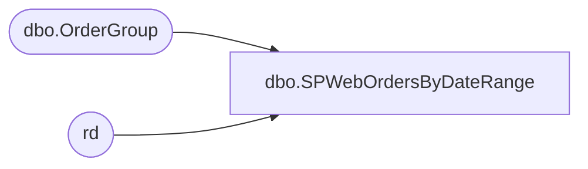

# dbo.SPWebOrdersByDateRange

**Database:** dw  
**Server:** papamart  

## Architecture Diagram



## Table Dependencies

| Referenced Table |
|---|
| dbo.OrderGroup |
| rd |

## Stored Procedure Code

```sql
CREATE PROCEDURE SPWebOrdersByDateRange
	@BeginDate datetime, 
	@EndDate datetime
AS 

SET @EndDate=dateadd(dd,1,@EndDate)

--order_create_date, d_DateCreated
Create Table #report_date
(PlacedDate datetime,
ReceivedCount int,
ReceivedDollars money,
PendingCount int,
PendingDollars money,
ProcessingCount int,
ProcessingDollars money,
CancelledCount int,
CancelledDollars money,
ShippedCount int,
ShippedDollars money,
ReturnedCount int,
ReturnedDollars money,
LimboCount int,
LimboDollars money)


--Order Detail
SELECT    order_number,
          saved_cy_total_total Dollars,
          SiteCode, 
         convert(varchar(12),d_DateCreated,101) PlacedDate,
         order_status_code Status
INTO #temp_detail
FROM         BearWebDB.WebCart_Commerce.dbo.OrderGroup
WHERE  order_create_date>'10/19/2004' and
 order_create_date>=@BeginDate and 
 order_create_date<@EndDate

--Dates
INSERT INTO #report_date
(PlacedDate) 
Select distinct  PlacedDate
from #temp_detail

--Received
Update rd
SET ReceivedCount=q.ReceivedCount,
    ReceivedDollars=q.ReceivedDollars
FROM #report_date rd
INNER JOIN 
     (Select PlacedDate,count(*) ReceivedCount,sum(isnull(Dollars,0)) ReceivedDollars
     From #temp_detail
     Group By PlacedDate) q
ON rd.PlacedDate=q.PlacedDate

--Pending
Update rd
SET PendingCount=q.PendingCount,
    PendingDollars=q.PendingDollars
FROM #report_date rd
INNER JOIN 
     (Select PlacedDate,count(*) PendingCount,sum(isnull(Dollars,0)) PendingDollars
     From #temp_detail
Where Status=4
     Group By PlacedDate) q
ON rd.PlacedDate=q.PlacedDate

--Processing
Update rd
SET ProcessingCount=q.ProcessingCount,
    ProcessingDollars=q.ProcessingDollars
FROM #report_date rd
INNER JOIN 
     (Select PlacedDate,count(*) ProcessingCount,sum(isnull(Dollars,0)) ProcessingDollars
     From #temp_detail
Where Status=8
     Group By PlacedDate) q
ON rd.PlacedDate=q.PlacedDate

--Cancelled
Update rd
SET CancelledCount=q.CancelledCount,
    CancelledDollars=q.CancelledDollars
FROM #report_date rd
INNER JOIN 
     (Select PlacedDate,count(*) CancelledCount,sum(isnull(Dollars,0)) CancelledDollars
     From #temp_detail
     Where Status=32
     Group By PlacedDate) q
ON rd.PlacedDate=q.PlacedDate

--Shipped
Update rd
SET ShippedCount=q.ShippedCount,
    ShippedDollars=q.ShippedDollars
FROM #report_date rd
INNER JOIN 
     (Select PlacedDate,count(*) ShippedCount,sum(isnull(Dollars,0)) ShippedDollars
     From #temp_detail
     Where Status=16
     Group By PlacedDate) q
ON rd.PlacedDate=q.PlacedDate

--Returned
Update rd
SET ReturnedCount=q.ReturnedCount,
    ReturnedDollars=q.ReturnedDollars
FROM #report_date rd
INNER JOIN 
     (Select PlacedDate,count(*) ReturnedCount,sum(isnull(Dollars,0)) ReturnedDollars
     From #temp_detail
Where Status=64
     Group By PlacedDate) q
ON rd.PlacedDate=q.PlacedDate

--Limbo
Update rd
SET LimboCount=q.LimboCount,
    LimboDollars=q.LimboDollars
FROM #report_date rd
INNER JOIN 
     (Select PlacedDate,count(*) LimboCount,sum(isnull(Dollars,0)) LimboDollars
     From #temp_detail
     Where Status not in (4,8,16,32,64)
     Group By PlacedDate) q
ON rd.PlacedDate=q.PlacedDate


Select 
PlacedDate,
isnull(ReceivedCount,0) ReceivedCount,
isnull(ReceivedDollars,0) ReceivedDollars,
isnull(PendingCount,0) PendingCount,
isnull(PendingDollars,0) PendingDollars,
isnull(ProcessingCount,0) ProcessingCount,
isnull(ProcessingDollars,0) ProcessingDollars,
isnull(CancelledCount,0) CancelledCount,
isnull(CancelledDollars,0) CancelledDollars,
isnull(ShippedCount,0) ShippedCount,
isnull(ShippedDollars,0) ShippedDollars,
isnull(ReturnedCount,0) ReturnedCount,
isnull(ReturnedDollars,0) ReturnedDollars,
isnull(LimboCount,0) LimboCount,
isnull(LimboDollars,0) LimboDollars
From #report_date rd
Order by PlacedDate


--Clean Up
IF object_id('tempdb..#report_date') IS NOT NULL
DROP TABLE #report_date

IF object_id('tempdb..#temp_detail') IS NOT NULL
DROP TABLE #temp_detail


dbo,sp_VoucherLookup_voucher,-- =============================================
-- Author:		<Author,,Name>
-- Create date: <Create Date,,>
-- Description:	<Description,,>
-- =============================================
CREATE PROCEDURE [dbo].[sp_VoucherLookup_voucher]
	-- Add the parameters for the stored procedure here
	@voucher_number varchar(20) = 'NoData',
	@refType int
AS
BEGIN

	SET NOCOUNT ON;

IF @voucher_number != 'NoData'
BEGIN
SELECT DISTINCT c.reference_no AS 'VoucherNumber'
	,[RedeemedDate]
	,[RedeemedAt]
	,c.date_issued AS 'IssuedDate'
	,CASE WHEN expiry_date <= CONVERT(VARCHAR,DATEADD(DAY,-0,GETDATE()),111) 
		  THEN 'Yes' 
		  ELSE 'No' 
	END AS 'Expired'
	,DATEADD(SECOND, -1, c.expiry_date) AS 'ExpirationDate'
	,c.pos_amount_1 AS 'Balance'
	,CASE WHEN c.liability_amount != c.amount_3 
		  THEN 'Redeemed' 
		  WHEN c.pos_amount_1 = 0
		  THEN 'Redeemed'
		  WHEN c.pos_status = '30' AND c.liability_amount = c.amount_3 AND c.amount_4 = 0 AND c.expiry_date > CONVERT(VARCHAR,DATEADD(DAY,-0,GETDATE()),111) 
		  THEN 'Valid' 
		  WHEN c.pos_status = '0' 
		  THEN 'Cancelled' 
		  WHEN c.pos_status = '50' 
		  THEN 'Forfeited' 
		  WHEN c.expiry_date <= CONVERT(VARCHAR,DATEADD(DAY,-0,GETDATE()),111) 
		  THEN 'Expired' 
				END AS 'Status'
	,c.customer_no AS 'CustomerNumber'
	,c.last_name AS 'LastName'
	,c.first_name AS 'FirstName'
	,c.email_address AS 'EmailAddress'  
	,NULL AS 'Tier'
	--,'Test' AS 'Tier'
	,'UK:$11 off select FF' AS 'Title'
	,'$11 off select furry friend serialized coupon' AS 'Description'
	,522 AS 'POSTransactionNumber'


FROM bedrockdb01.auditworks.dbo.cust_liability c (NOLOCK) 
LEFT OUTER JOIN bedrockdb01.auditworks.dbo.cust_liability_history h (NOLOCK) ON c.reference_no = h.reference_no
--LEFT OUTER JOIN [stl-crmdb-p-01].crm.dbo.customer cc (NOLOCK) ON c.customer_no = cc.customer_no
--INNER JOIN [stl-crmdb-p-01].crm.dbo.customer_attribute ca (NOLOCK) ON cc.customer_id = ca.customer_id
LEFT JOIN 
       (
              SELECT MIN(h2.transaction_date) [RedeemedDate], MIN(h2.store_no) [RedeemedAt], reference_no
              FROM bedrockdb01.auditworks.dbo.cust_liability_history h2 (NOLOCK)
              WHERE h2.store_no <> 990
              GROUP BY reference_no
       ) qry ON c.reference_no = qry.reference_no 

WHERE h.store_no = 990 AND (c.reference_type = @refType OR c.reference_type = 35) AND c.reference_no LIKE @voucher_number
ORDER BY c.date_issued
END
END
```

