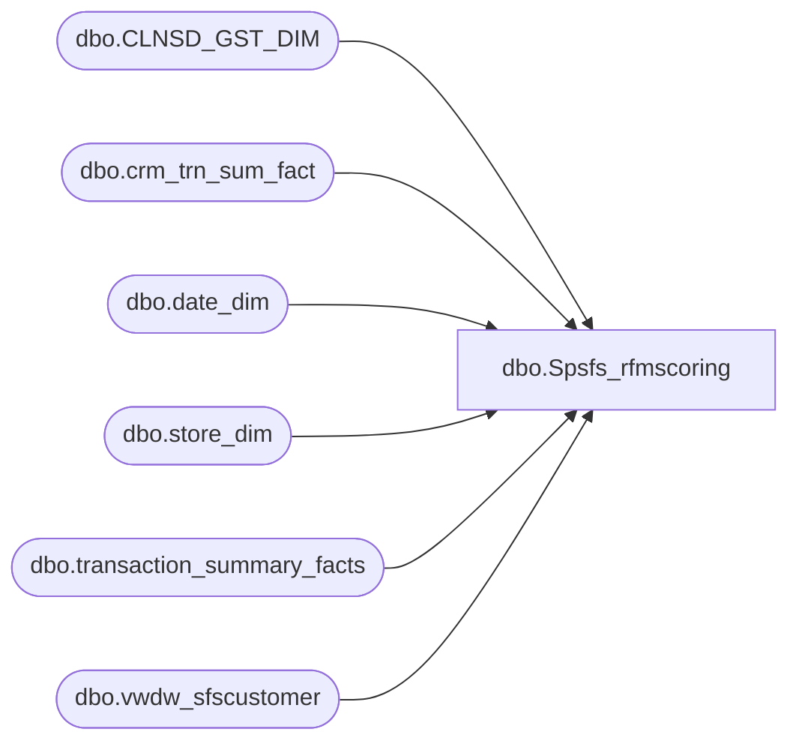

# dbo.Spsfs_rfmscoring

**Database:** dw  
**Server:** papamart  

## Architecture Diagram



## Table Dependencies

| Referenced Table |
|---|
| dbo.CLNSD_GST_DIM |
| dbo.crm_trn_sum_fact |
| dbo.date_dim |
| dbo.store_dim |
| dbo.transaction_summary_facts |
| dbo.vwdw_sfscustomer |

## Stored Procedure Code

```sql
CREATE proc [dbo].[Spsfs_rfmscoring]
as
begin
set nocount on
--SFS MEMBERS FROM CUSTOMER VIEW
	select customer_id
		  , customer_no
		  , store_no
		  , membership_date
		  ,clnsd_gst_id
	into #tmpsfs
	from crmdb02.crm.dbo.vwdw_sfscustomer crm WITH (NOLOCK)
		  join dw.dbo.CLNSD_GST_DIM cgd WITH (NOLOCK)
			on crm.customer_no=cgd.LYLTY_GST_NBR


--GRABBING CUSTOMER COUNTRY BASED ON STORE
	select t.*
		  , s.country
	into #tmpsfsco
	from #tmpsfs t
		  join dw.dbo.store_dim s with (nolock)
			on t.store_no = s.store_id;

	drop table #tmpsfs


--GATHERING GUEST VARIABLE OVER PAST 2 YEARS FOR SCORING
--NOTE DATES NEED TO BE CHANGED
	select t.*
		  , First_trans_date 
		  , Last_Trans_date
		  , Visits
		  , Transactions
		  , GAAP
	into #tmpsfs2
	from #tmpsfsco t
		  join(select crm.clnsd_gst_id
					  , min(d.actual_date) as First_Trans_Date
					  , max(d.actual_date) as Last_Trans_Date
					  , count(distinct d.actual_date) as Visits
					  , count(*) as Transactions
					  , sum(tsf.gaap_sale) as GAAP
				  from dw.dbo.crm_trn_sum_fact crm WITH (NOLOCK)
						 LEFT join dw.dbo.transaction_summary_facts tsf WITH (NOLOCK)
							on tsf.transaction_id = crm.tdf_trn_id
							and tsf.store_key = crm.str_id
							and tsf.date_key = crm.dt_id
						 join dw.dbo.date_dim d WITH (NOLOCK)
							on d.date_key = crm.dt_id
				  where d.actual_date between dateadd(yy,-2,getdate()) and dateadd(dd,-1,getdate())
				   and tsf.GAAP_Sale<>0
				  group by crm.clnsd_gst_id ) x
			on t.clnsd_gst_id = x.clnsd_gst_id

		drop table #tmpsfsco

		select customer_no as lylty_gst_nbr, clnsd_gst_id
			  , country
			  , last_trans_date
			  , first_trans_date
			  , visits
			  , gaap
		into #tmpsfs1
			from #tmpsfs2

		drop table #tmpsfs2


--SETTING RECENCY AS DAYS BETWEEN LAST TXN AND END OF PERIOD
--NOTE DATES NEED TO BE CHANGED
		select *
			  , datediff(day,last_trans_date,dateadd(dd,-1,getdate())) as recency
		into #tmpset
		from #tmpsfs1
		where country = 'US';

		drop table #tmpsfs1
		--PROC RANK SUBSTITUTION
		select lylty_gst_nbr, clnsd_gst_id
			  , country
			  , t.last_trans_date
			  , first_trans_date
			  , t.visits
			  , t.gaap
			  , recency
			  , floor(cast(m_scr*5 as float)/cast((select count(*)+1 from #tmpset where gaap is not null)as float) )+1 m_score
			  , floor(cast(f_scr*5 as float)/cast((select count(*)+1 from #tmpset where visits is not null)as float) )+1 f_score
			  , floor(cast(r_scr*5 as float)/cast((select count(*)+1 from #tmpset where last_trans_date is not null)as float) )+1 r_score
		into #tmprfm
		from #tmpset t
		,(select gaap, avg(cast(m_scr as float)) m_scr
		from( select *
					, row_number() over(order by gaap) m_scr
		from #tmpset) x
		group by gaap) g
		,(select visits, avg(cast(f_scr as float)) f_scr
		from( select *
					, row_number() over(order by visits) f_scr
		from #tmpset) x
		group by visits) v
		,(select last_trans_date, avg(cast(r_scr as float)) r_scr
		from( select *
					, row_number() over(order by last_trans_date) r_scr
		from #tmpset) x
		group by last_trans_date) r
		where t.gaap = g.gaap 
		 and t.visits = v.visits
		and t.last_trans_date = r.last_trans_date


		drop table #tmpset;


--COUNTS BY R + F + M AND THEIR BREAKING POINTS
		select r_score, count(*), min(recency), max(recency)
		from #tmprfm
		group by r_score;

		select f_score, count(*), min(visits), max(visits)
		from #tmprfm
		group by f_score;

		select m_score, count(*), min(gaap), max(gaap)
		from #tmprfm
		group by m_score


--COMBINING RFM SCORES INTO GROUPS
		select *
			  , case when rfm_score in (555,554,553,552
													,545,544,543
													,525,524
													,455,454,453
													,445,444,443) 
					then 'Tried and True'
					   when rfm_score in (551
													,542,541
													,523,522,521
													,452,451
													,442,441
													,425,424,423,422,421
													,355,354
													,345
													,325,324
													,255,254
													,245)
					then 'Most Impressionable'
					   when rfm_score in (353,352,351
													,341,342,343,344
													,323,322,321
													,253,252
													,244,243
													,225,224
													,155,154
													,145)
					then 'Hibernating but Awakenable'
					   when rfm_score in (121,122,123,124,125
													,141,142,143,144
													,151,152,153
													,221,222,223
													,241,242
													,251)
					then 'Past Their Prime'
					end as rfm_group
			  , case when visits = 1 then '1x'
					   when visits = 2 then '2x'
					   when visits > 2 then '3+'
					end as Segment2yr
			  , CASE
					WHEN recency BETWEEN 0 AND 90 THEN '00-03'
					WHEN recency BETWEEN 91 AND 180 THEN '04-06'
					WHEN recency BETWEEN 181 AND 270 THEN '07-09'
					WHEN recency BETWEEN 271 AND 365 THEN '10-12'
					else 'Lapsed' end as Recency_seg
		into #tmprfmfinal
		from(
		select *
			  , r_score*100 + f_score*10 + m_score rfm_score
			  , r_Score+f_score+m_score rfm_total
		from  #tmprfm ) x


		drop table #tmprfm

		--COUNTS BY FINAL RFM GROUPS
		select rfm_group, count(*)
		from #tmprfmfinal
		group by rfm_group

		--SAVE TO PERMANENT TABLE WHICH WILL BE USED WHEN GENERATING MAILER
		declare @sql varchar(8000)
			,	@tablename varchar(200)
			,	@yearpart int
			,	@monthpart int
		if datepart(mm,getdate())=1 
			begin
				set @yearpart = datepart(yy,dateadd(yy,-1,getdate()))
			end
			else 
			begin
				set @yearpart = datepart(yy,getdate())
			end
		set @tablename ='sfs_rfmscore_'+convert(varchar(10),@yearpart)+datename(mm,dateadd(dd,-1,getdate()))
			
		SET @sql='select * into queries.dbo.'+@tablename+' from #tmprfmfinal'

		--Print @sql
		exec(@sql)
	set nocount off
end
```

