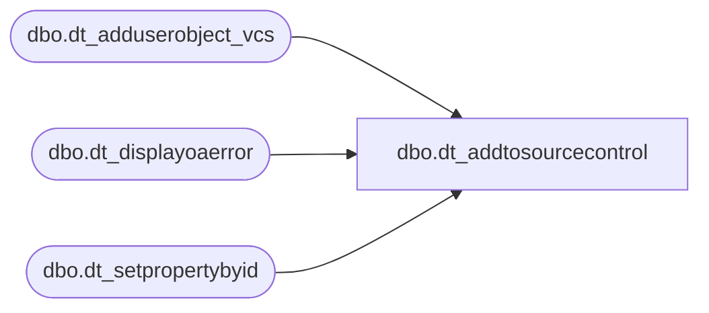

# dbo.dt_addtosourcecontrol

**Database:** dw  
**Server:** papamart  

## Architecture Diagram



## Table Dependencies

| Referenced Table |
|---|
| dbo.dt_adduserobject_vcs |
| dbo.dt_displayoaerror |
| dbo.dt_setpropertybyid |

## Stored Procedure Code

```sql
create proc dbo.dt_addtosourcecontrol
    @vchSourceSafeINI varchar(255) = '',
    @vchProjectName   varchar(255) ='',
    @vchComment       varchar(255) ='',
    @vchLoginName     varchar(255) ='',
    @vchPassword      varchar(255) =''

as

set nocount on

declare @iReturn int
declare @iObjectId int
select @iObjectId = 0

declare @iStreamObjectId int
select @iStreamObjectId = 0

declare @VSSGUID varchar(100)
select @VSSGUID = 'SQLVersionControl.VCS_SQL'

declare @vchDatabaseName varchar(255)
select @vchDatabaseName = db_name()

declare @iReturnValue int
select @iReturnValue = 0

declare @iPropertyObjectId int
declare @vchParentId varchar(255)

declare @iObjectCount int
select @iObjectCount = 0

    exec @iReturn = master.dbo.sp_OACreate @VSSGUID, @iObjectId OUT
    if @iReturn <> 0 GOTO E_OAError


    /* Create Project in SS */
    exec @iReturn = master.dbo.sp_OAMethod @iObjectId,
											'AddProjectToSourceSafe',
											NULL,
											@vchSourceSafeINI,
											@vchProjectName output,
											@@SERVERNAME,
											@vchDatabaseName,
											@vchLoginName,
											@vchPassword,
											@vchComment


    if @iReturn <> 0 GOTO E_OAError

    /* Set Database Properties */

    begin tran SetProperties

    /* add high level object */

    exec @iPropertyObjectId = dbo.dt_adduserobject_vcs 'VCSProjectID'

    select @vchParentId = CONVERT(varchar(255),@iPropertyObjectId)

    exec dbo.dt_setpropertybyid @iPropertyObjectId, 'VCSProjectID', @vchParentId , NULL
    exec dbo.dt_setpropertybyid @iPropertyObjectId, 'VCSProject' , @vchProjectName , NULL
    exec dbo.dt_setpropertybyid @iPropertyObjectId, 'VCSSourceSafeINI' , @vchSourceSafeINI , NULL
    exec dbo.dt_setpropertybyid @iPropertyObjectId, 'VCSSQLServer', @@SERVERNAME, NULL
    exec dbo.dt_setpropertybyid @iPropertyObjectId, 'VCSSQLDatabase', @vchDatabaseName, NULL

    if @@error <> 0 GOTO E_General_Error

    commit tran SetProperties
    
    select @iObjectCount = 0;

CleanUp:
    select @vchProjectName
    select @iObjectCount
    return

E_General_Error:
    /* this is an all or nothing.  No specific error messages */
    goto CleanUp

E_OAError:
    exec dbo.dt_displayoaerror @iObjectId, @iReturn
    goto CleanUp
```

