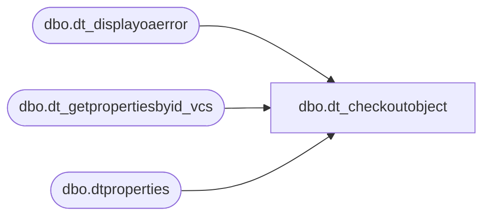

# dbo.dt_checkoutobject

**Database:** dw  
**Server:** papamart  

## Architecture Diagram



## Table Dependencies

| Referenced Table |
|---|
| dbo.dt_displayoaerror |
| dbo.dt_getpropertiesbyid_vcs |
| dbo.dtproperties |

## Stored Procedure Code

```sql
create proc dbo.dt_checkoutobject
    @chObjectType  char(4),
    @vchObjectName varchar(255),
    @vchComment    varchar(255),
    @vchLoginName  varchar(255),
    @vchPassword   varchar(255),
    @iVCSFlags     int = 0,
    @iActionFlag   int = 0/* 0 => Checkout, 1 => GetLatest, 2 => UndoCheckOut */

as

	set nocount on

	declare @iReturn int
	declare @iObjectId int
	select @iObjectId =0

	declare @VSSGUID varchar(100)
	select @VSSGUID = 'SQLVersionControl.VCS_SQL'

	declare @iReturnValue int
	select @iReturnValue = 0

	declare @vchTempText varchar(255)

	/* this is for our strings */
	declare @iStreamObjectId int
	select @iStreamObjectId = 0

    declare @iPropertyObjectId int
    select @iPropertyObjectId = (select objectid from dbo.dtproperties where property = 'VCSProjectID')

    declare @vchProjectName   varchar(255)
    declare @vchSourceSafeINI varchar(255)
    declare @vchServerName    varchar(255)
    declare @vchDatabaseName  varchar(255)
    exec dbo.dt_getpropertiesbyid_vcs @iPropertyObjectId, 'VCSProject',       @vchProjectName   OUT
    exec dbo.dt_getpropertiesbyid_vcs @iPropertyObjectId, 'VCSSourceSafeINI', @vchSourceSafeINI OUT
    exec dbo.dt_getpropertiesbyid_vcs @iPropertyObjectId, 'VCSSQLServer',     @vchServerName    OUT
    exec dbo.dt_getpropertiesbyid_vcs @iPropertyObjectId, 'VCSSQLDatabase',   @vchDatabaseName  OUT

    if @chObjectType = 'PROC'
    begin
        /* Procedure Can have up to three streams
           Drop Stream, Create Stream, GRANT stream */

        exec @iReturn = master.dbo.sp_OACreate @VSSGUID, @iObjectId OUT

        if @iReturn <> 0 GOTO E_OAError

        exec @iReturn = master.dbo.sp_OAMethod @iObjectId,
												'CheckOut_StoredProcedure',
												NULL,
												@sProjectName = @vchProjectName,
												@sSourceSafeINI = @vchSourceSafeINI,
												@sObjectName = @vchObjectName,
												@sServerName = @vchServerName,
												@sDatabaseName = @vchDatabaseName,
												@sComment = @vchComment,
												@sLoginName = @vchLoginName,
												@sPassword = @vchPassword,
												@iVCSFlags = @iVCSFlags,
												@iActionFlag = @iActionFlag

        if @iReturn <> 0 GOTO E_OAError


        exec @iReturn = master.dbo.sp_OAGetProperty @iObjectId, 'GetStreamObject', @iStreamObjectId OUT

        if @iReturn <> 0 GOTO E_OAError

        create table #commenttext (id int identity, sourcecode varchar(255))


        select @vchTempText = 'STUB'
        while @vchTempText is not null
        begin
            exec @iReturn = master.dbo.sp_OAMethod @iStreamObjectId, 'GetStream', @iReturnValue OUT, @vchTempText OUT
            if @iReturn <> 0 GOTO E_OAError
            
            if (@vchTempText = '') set @vchTempText = null
            if (@vchTempText is not null) insert into #commenttext (sourcecode) select @vchTempText
        end

        select 'VCS'=sourcecode from #commenttext order by id
        select 'SQL'=text from syscomments where id = object_id(@vchObjectName) order by colid

    end

CleanUp:
    return

E_OAError:
    exec dbo.dt_displayoaerror @iObjectId, @iReturn
    GOTO CleanUp


dbo,spAuditWebCart_Populate_AW_Direct_FAST,--exec spAuditWebCart_Populate_AW_Direct_FAST '1/1/07', '1/1/07'
CREATE          PROCEDURE [dbo].[spAuditWebCart_Populate_AW_Direct_FAST](
@FirstDate datetime
,@LastDate datetime
)
as
-- =====================================================================================================
-- Name: spAuditWebCart_Populate_AW_Direct_FAST
--
-- Description:	Pulls transaction data from Sales Audit
--
-- Input:	
--			@FirstDate			datetime	Sets date range
--			@LastDate			datetime	
--
-- Output: Resultset with the following columns:
--			N/A
--
-- Dependencies: None
--
-- Revision History
--		Name:			Date:			Comments:
--		GaryD			08/18/2010		Initial version in source control.
--		GaryD			08/19/2010		Update server name for SA 5.0
-- =====================================================================================================

-- DECLARE @FIRSTDATE DATETIME, @LASTDATE DATETIME
-- SELECT @FIRSTDATE='12/1/06', @LASTDATE='12/29/06'
-- 
-- declare @OrdersTable table(orderNumber varchar(50))
-- insert into @OrdersTable(orderNumber) values(2489386)

select @LastDate = Dateadd(day,1,@LastDate) --to include @LastDate dates in queries

-- CLEAN UP TEMP TABLES =================================================================================
IF (Object_ID('tempdb.dbo.#AW_Direct') IS NOT NULL) DROP TABLE dbo.#AW_Direct
IF (Object_ID('tempdb.dbo.#AW_transaction_header') IS NOT NULL) DROP TABLE dbo.#AW_transaction_header
IF (Object_ID('tempdb.dbo.#AW_transaction_line') IS NOT NULL) DROP TABLE dbo.#AW_transaction_line
IF (Object_ID('tempdb.dbo.#AW_line_note') IS NOT NULL) DROP TABLE dbo.#AW_line_note
IF (Object_ID('tempdb.dbo.#AW_authorization_detail') IS NOT NULL) DROP TABLE dbo.#AW_authorization_detail

create table #AW_line_note(
	transaction_id numeric(12,0)
	,AW_OrderNumber varchar(50)	--web cart order number
)
create index ix_AWLineNote_transactionID on #AW_line_note(transaction_id)


create table #AW_transaction_header(
	transaction_id numeric(12,0)
	,store_no int
	,transaction_no numeric(12,0) --AW trans ID in SJ
	,transaction_series varchar(50)
	,register_no int
	,transaction_date datetime	--actual transaction date
	,AW_transaction_void_flag smallint
)
create index ix_AWTransactionHeader_transactionID on #AW_transaction_header(transaction_id)


create table #AW_transaction_line(
	transaction_id numeric(12,0)
	,line_action tinyint
	,line_object smallint
	,gross_line_amount money
	,AW_line_void_flag tinyint
	,line_id numeric(5,0)
)
create index ix_AWTransactionLine_transactionID on #AW_transaction_line(transaction_id)


create table #AW_authorization_detail(
	transaction_id numeric(12,0)
	,line_id numeric(5,0)
	,SJ_ID_UsedForSettleRequest varchar(50)	--SJ OrderID starting March 8,2005, SJtransactionID for WebService settled orders that is GC_K as of 1/11/06
)
create index ix_AWAuthorizationDetail_transactionID on #AW_authorization_detail(transaction_id)


--##### detect if in archive #############################################################################
declare @iMax_AuditStatus int

select @iMax_AuditStatus = max(audit_status)
from bedrockdb01.auditworks.dbo.audit_status
where store_no IN (13,136,2013,1513)
 	and register_no=2 
	and sales_date between @FirstDate and @LastDate
	and audit_status in (100,200,300,400,500)

--300 or less IS NOT IN ARCHIVE
--400 or more IS IN ARCHIVE
--select * from code_description where code_type = 13

--##### ARCHIVED AW TABLE DATA #############################################################################
if(@iMax_AuditStatus=400 or @iMax_AuditStatus=500) begin
	print 'archive data needed'

	--NOTE: this willl insert dupe WC orders that were exported 2x and have 2 AW trans IDs
	INSERT #AW_line_note(
		transaction_id
		,AW_OrderNumber
	)
	SELECT av_transaction_id
		,substring(d.line_note,12,99) 	as AW_OrderNumber	--web cart order number
	--	INTO #AW_line_note
	FROM bedrockdb01.auditworks.dbo.av_line_note d
	--	FROM av_line_note d with(nolock)
	WHERE d.note_type = 28
		and substring(d.line_note,12,99) collate SQL_Latin1_General_CP1_CI_AS  IN (
			select sProductionOrderNumber 
			from queries.dbo.WCAudit_PMS_OrdersShipped 
			--WHERE sProductionOrderNumber is not null
		)
	
	INSERT #AW_transaction_header(
		transaction_id
		,store_no
		,transaction_no
		,transaction_series
		,register_no
		,transaction_date
		,AW_transaction_void_flag
	)
	SELECT  a.av_transaction_id
		,a.store_no
		,a.transaction_no 		
		,a.transaction_series
		,a.register_no
		,a.transaction_date		--actual transaction date
		,a.transaction_void_flag 	as AW_transaction_void_flag
	--	INTO #AW_transaction_header
	FROM bedrockdb01.auditworks.dbo.av_transaction_header a
	--	FROM av_transaction_header a with(nolock)
	WHERE a.av_transaction_id IN (select transaction_id from #AW_line_note)
	
	
	INSERT #AW_transaction_line(
		transaction_id

		,line_action
		,line_object
		,gross_line_amount
		,AW_line_void_flag
		,line_id
	)
	SELECT  b.av_transaction_id
		,b.line_action
		,b.line_object
		,b.gross_line_amount	
		,b.line_void_flag 		as AW_line_void_flag
		,b.line_id
	--	INTO #AW_transaction_line
	FROM bedrockdb01.auditworks.dbo.av_transaction_line b
	--	FROM av_transaction_line b with(nolock)
	WHERE b.av_transaction_id IN (select transaction_id from #AW_line_note)
		
	
	INSERT #AW_authorization_detail(
		transaction_id
		,line_id
		,SJ_ID_UsedForSettleRequest
	)
	SELECT  e.av_transaction_id
		,e.line_id
		,e.approval_message 		as SJ_ID_UsedForSettleRequest	--SJ OrderID starting March 8,2005, SJtransactionID for WebService settled orders that is GC_K as of 1/11/06
	--	INTO #AW_authorization_detail
	FROM bedrockdb01.auditworks.dbo.av_authorization_detail e
	--	FROM av_authorization_detail e with(nolock)
	WHERE e.av_transaction_id IN (select transaction_id from #AW_line_note)
end
--END ARCHIVED AW TABLE DATA #############################################################################


--##### CURRENT AW TABLE DATA #############################################################################

--NOTE: this willl insert dupe WC orders that were exported 2x and have 2 AW trans IDs
INSERT #AW_line_note(
	transaction_id
	,AW_OrderNumber
)
SELECT transaction_id
	,substring(d.line_note,12,99) 	as AW_OrderNumber	--web cart order number
--	INTO #AW_line_note
FROM bedrockdb01.auditworks.dbo.line_note d
--	FROM line_note d with(nolock)
WHERE d.note_type = 28
	and substring(d.line_note,12,99) collate SQL_Latin1_General_CP1_CI_AS IN (select sProductionOrderNumber from queries.dbo.WCAudit_PMS_OrdersShipped)

INSERT #AW_transaction_header(
	transaction_id
	,store_no
	,transaction_no
	,transaction_series
	,register_no
	,transaction_date
	,AW_transaction_void_flag
)
SELECT  a.transaction_id
	,a.store_no
	,a.transaction_no 		
	,a.transaction_series
	,a.register_no
	,a.transaction_date		--actual transaction date
	,a.transaction_void_flag 	as AW_transaction_void_flag
--	INTO #AW_transaction_header
FROM bedrockdb01.auditworks.dbo.transaction_header a
--	FROM transaction_header a with(nolock)
WHERE a.transaction_id	IN (select transaction_id from #AW_line_note)


INSERT #AW_transaction_line(
	transaction_id
	,line_action
	,line_object
	,gross_line_amount
	,AW_line_void_flag
	,line_id
)
SELECT  b.transaction_id
	,b.line_action
	,b.line_object
	,b.gross_line_amount	
	,b.line_void_flag 		as AW_line_void_flag
	,b.line_id
--	INTO #AW_transaction_line
FROM bedrockdb01.auditworks.dbo.transaction_line b
--	FROM transaction_line b with(nolock)
WHERE b.transaction_id IN (select transaction_id from #AW_line_note)
	

INSERT #AW_authorization_detail(
	transaction_id
	,line_id
	,SJ_ID_UsedForSettleRequest
)
SELECT  e.transaction_id
	,e.line_id
	,e.approval_message 		as SJ_ID_UsedForSettleRequest	--SJ OrderID starting March 8,2005, SJtransactionID for WebService settled orders that is GC_K as of 1/11/06
--	INTO #AW_authorization_detail
FROM bedrockdb01.auditworks.dbo.authorization_detail e
--	FROM authorization_detail e with(nolock)
WHERE e.transaction_id IN (select transaction_id from #AW_line_note)
--END CURRENT AW TABLE DATA #############################################################################


--##### Combine Data ##################################################################################################################
SELECT  case 	when a.store_no=13 AND a.transaction_series='W' and a.register_no < 1000 then 'US_WEB'
		when a.store_no=13 AND a.transaction_series='D' then 'US_F2BM'
		when a.store_no=13 AND a.transaction_series='F' then 'US_DINO'
		when a.store_no=136 AND a.transaction_series='W' then 'CA_WEB'
		when a.store_no=2013 AND a.transaction_series='W' then 'UK_WEB'
		when a.store_no=1513 AND a.transaction_series='W' then 'RZ_WEB'
		--when a.store_no not in (13, 136) AND a.transaction_series='W' and a.register_no=1 then 'GC_KIOSK' --old, future?
		when a.store_no = 13 AND a.transaction_series='W' and a.register_no > 1000 then 'GC_KIOSK' --current
		else 'NOT 13, 136 or 2013!'
	end 	as AW_Site
	,d.AW_OrderNumber	--web cart order number
	,a.store_no	as store_no
	,a.transaction_no as AW_TranNo --AW trans ID in SJ
	,Cast(CONVERT(varchar(20),a.transaction_date,101) as datetime) as AW_ReqToSettleDate --actual transaction date
	,sum(case when b.line_action = 11 AND b.line_object IN (604,605,606,608,611,614,642,699)then b.gross_line_amount	
		when b.line_action = 27 AND b.line_object IN (604,605,606,608,611,614,642,699)then - b.gross_line_amount	
		else 0
	end) 	as AW_CCAmount	--$ on this CC line item
	,sum(case when b.line_action = 25 AND b.line_object IN (624,633)then b.gross_line_amount	
		when b.line_action = 12 AND b.line_object IN (624,633)then - b.gross_line_amount	
		else 0
	end) 	as AW_GCAmount	--$ on this GC line item
	,sum(case when b.line_action = 25 AND b.line_object IN (640)then b.gross_line_amount	
		when b.line_action = 24 AND b.line_object IN (640)then - b.gross_line_amount	
		else 0
	end) 	as AW_SFSAmount	--$ on this GC line item
	,e.SJ_ID_UsedForSettleRequest	--SJ OrderID starting March 8,2005, SJtransactionID for WebService settled orders that is GC_K as of 1/11/06
	,b.AW_line_void_flag
	,a.AW_transaction_void_flag
INTO #AW_Direct
FROM 	#AW_transaction_header a
	JOIN #AW_transaction_line b ON a.transaction_id=b.transaction_id 
	JOIN #AW_line_note d ON  b.transaction_id=d.transaction_id 
	LEFT JOIN #AW_authorization_detail e on e.transaction_id=b.transaction_id and e.line_id=b.line_id --LEFT JOIN TO GET GC TENDERS (No Auth record)
WHERE 	(
		(a.store_no IN (13,136,2013) AND a.transaction_series = 'W' and a.register_no < 1000)
		OR 
		(a.store_no = 13 AND (a.transaction_series = 'D' or a.transaction_series = 'F'))
		--OR
		--(a.store_no NOT IN (13,136) AND a.transaction_series = 'W' and a.register_no = 1) --old, future?
		OR
		(a.store_no = 13 AND a.transaction_series='W' and a.register_no > 1000) --current
	    )
group by b.AW_line_void_flag
	,a.AW_transaction_void_flag
	,a.store_no
	,case 	when a.store_no=13 AND a.transaction_series='W' and a.register_no < 1000 then 'US_WEB'
		when a.store_no=13 AND a.transaction_series='D' then 'US_F2BM'
		when a.store_no=13 AND a.transaction_series='F' then 'US_DINO'
		when a.store_no=136 AND a.transaction_series='W' then 'CA_WEB'
		when a.store_no=2013 AND a.transaction_series='W' then 'UK_WEB'
		when a.store_no=1513 AND a.transaction_series='W' then 'RZ_WEB'
		--when a.store_no not in (13, 136) AND a.transaction_series='W' and a.register_no=1 then 'GC_KIOSK' --old, future?
		when a.store_no = 13 AND a.transaction_series='W' and a.register_no > 1000 then 'GC_KIOSK' --current
		else 'NOT 13, 136 or 2013!'
	end
	,d.AW_OrderNumber
	,a.transaction_no
	,Cast(CONVERT(varchar(20),a.transaction_date,101) as datetime)
	,e.SJ_ID_UsedForSettleRequest 

--select sum(AW_CCAmount), sum(AW_GCAmount), count(*) from #AW_Direct
--END Combine Data ##################################################################################################################


--##### BUILD OUTPUT TABLES ##################################################################################################
IF (Object_ID('queries.dbo.WCAudit_AW_Direct_For_AWT_Log') IS NOT NULL) DROP TABLE queries.dbo.WCAudit_AW_Direct_For_AWT_Log

--EVERY AW Transaction (Unique by AW.Transaction Number which is equivelent to SJ.AWTransID)
CREATE TABLE queries.dbo.WCAudit_AW_Direct_For_AWT_Log
	(AW_Site varchar(50)
	,AW_TranNo int
	,AW_OrderNumber varchar(50)
	,AW_ReqToSettleDate datetime
	,AW_CCAmount money
	,AW_GCAmount money
	,AW_SFSAmount money
	,AW_line_void_flag int
	,AW_transaction_void_flag int
--	,AW_Archive bit
	)
create index ix_AWDirectAWTLog_AW_OrderNumber on queries.dbo.WCAudit_AW_Direct_For_AWT_Log(AW_OrderNumber)

Insert queries.dbo.WCAudit_AW_Direct_For_AWT_Log(
	AW_Site
	,AW_TranNo 
	,AW_OrderNumber 
	,AW_ReqToSettleDate 
	,AW_CCAmount 
	,AW_GCAmount 
	,AW_SFSAmount
	,AW_line_void_flag
	,AW_transaction_void_flag
--	,AW_Archive
	)
SELECT AW_Site
	,AW_TranNo
	,AW_OrderNumber
	,AW_ReqToSettleDate
	,SUM(AW_CCAmount) as AW_CCAmount
	,SUM(AW_GCAmount) as AW_GCAmount
	,SUM(AW_SFSAmount) as AW_SFSAmount
	,AW_line_void_flag
	,AW_transaction_void_flag
--	,0
from  #AW_Direct
--where AW_OrderNumber IN (select OrderNumber from queries.dbo.WCAudit_OrdersShipped)
group by AW_Site, AW_TranNo, AW_OrderNumber, AW_ReqToSettleDate	,AW_line_void_flag, AW_transaction_void_flag
order by AW_line_void_flag, AW_transaction_void_flag, AW_Site, AW_TranNo, AW_OrderNumber, AW_ReqToSettleDate	


--select * from #AW_Direct
--select * from queries..WCAudit_AW_Direct_For_AWT_Log


-- CLEAN UP =============================================================================================
-- IF (Object_ID('queries.dbo.WCAudit_AW_Direct_For_CC_Log') IS NOT NULL) DROP TABLE queries.dbo.WCAudit_AW_Direct_For_CC_Log
-- 
-- --EVERY CC Charge with SJ order number or SJ TransID that was used to request settlement
-- CREATE TABLE queries.dbo.WCAudit_AW_Direct_For_CC_Log
-- 	(AW_Site varchar(50)
-- 	,AW_TranNo int
-- 	,AW_OrderNumber varchar(50)
-- 	,AW_ReqToSettleDate datetime
-- 	,AW_CCAmount money
-- 	,SJ_ID_UsedForSettleRequest varchar(100)
-- --	,AW_Archive bit
-- 	)
-- create index ix_AWDirectCCLog_AW_OrderNumber on queries.dbo.WCAudit_AW_Direct_For_CC_Log(AW_OrderNumber)
-- 
-- Insert queries.dbo.WCAudit_AW_Direct_For_CC_Log
-- 	(AW_Site 
-- 	,AW_TranNo 
-- 	,AW_OrderNumber 
-- 	,AW_ReqToSettleDate 
-- 	,AW_CCAmount 
-- 	,SJ_ID_UsedForSettleRequest 
-- --	,AW_Archive
-- 	)
-- SELECT AW_Site
-- 	,AW_TranNo
-- 	,AW_OrderNumber
-- 	,AW_ReqToSettleDate
-- 	,AW_CCAmount
-- 	,SJ_ID_UsedForSettleRequest
-- --	,0
-- from  #AW_Direct
-- where AW_CCAmount <> 0 AND AW_OrderNumber IN (select OrderNumber from queries.dbo.WCAudit_OrdersShipped)
-- group by AW_Site, AW_TranNo, AW_OrderNumber, AW_ReqToSettleDate, AW_CCAmount, SJ_ID_UsedForSettleRequest,AW_line_void_flag, AW_transaction_void_flag
-- order by AW_line_void_flag, AW_transaction_void_flag, AW_Site, AW_TranNo, AW_OrderNumber, AW_ReqToSettleDate, AW_CCAmount, SJ_ID_UsedForSettleRequest

--select * from #Level1_AW_Direct_For_CC_Log
--END BUILD OUTPUT TABLES ##################################################################################################


-- CLEAN UP TEMP TABLES =================================================================================
IF (Object_ID('tempdb.dbo.#AW_Direct') IS NOT NULL) DROP TABLE dbo.#AW_Direct
IF (Object_ID('tempdb.dbo.#AW_transaction_header') IS NOT NULL) DROP TABLE dbo.#AW_transaction_header
IF (Object_ID('tempdb.dbo.#AW_transaction_line') IS NOT NULL) DROP TABLE dbo.#AW_transaction_line
IF (Object_ID('tempdb.dbo.#AW_line_note') IS NOT NULL) DROP TABLE dbo.#AW_line_note
IF (Object_ID('tempdb.dbo.#AW_authorization_detail') IS NOT NULL) DROP TABLE dbo.#AW_authorization_detail
```

