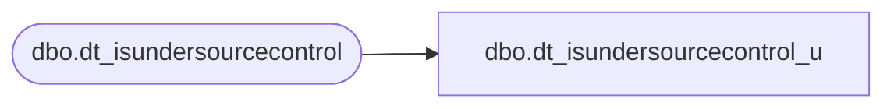

# dbo.dt_isundersourcecontrol_u

**Database:** dw  
**Server:** papamart  

## Architecture Diagram



## Table Dependencies

| Referenced Table |
|---|
| dbo.dt_isundersourcecontrol |

## Stored Procedure Code

```sql
create proc dbo.dt_isundersourcecontrol_u
    @vchLoginName nvarchar(255) = '',
    @vchPassword  nvarchar(255) = '',
    @iWhoToo      int = 0 /* 0 => Just check project; 1 => get list of objs */

as
	-- This procedure should no longer be called;  dt_isundersourcecontrol should be called instead.
	-- Calls are forwarded to dt_isundersourcecontrol to maintain backward compatibility.
	set nocount on
	exec dbo.dt_isundersourcecontrol
		@vchLoginName,
		@vchPassword,
		@iWhoToo
```

