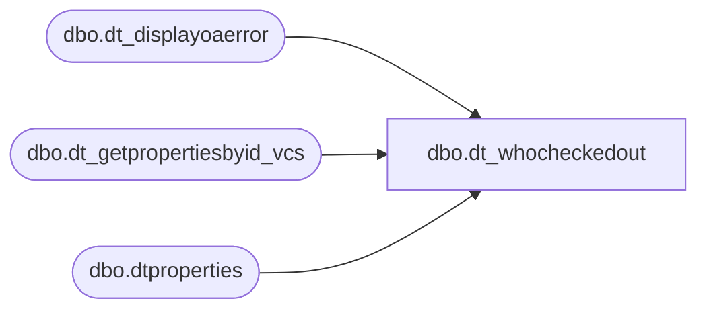

# dbo.dt_whocheckedout

**Database:** dw  
**Server:** papamart  

## Architecture Diagram



## Table Dependencies

| Referenced Table |
|---|
| dbo.dt_displayoaerror |
| dbo.dt_getpropertiesbyid_vcs |
| dbo.dtproperties |

## Stored Procedure Code

```sql
create proc dbo.dt_whocheckedout
        @chObjectType  char(4),
        @vchObjectName varchar(255),
        @vchLoginName  varchar(255),
        @vchPassword   varchar(255)

as

set nocount on

declare @iReturn int
declare @iObjectId int
select @iObjectId =0

declare @VSSGUID varchar(100)
select @VSSGUID = 'SQLVersionControl.VCS_SQL'

    declare @iPropertyObjectId int

    select @iPropertyObjectId = (select objectid from dbo.dtproperties where property = 'VCSProjectID')

    declare @vchProjectName   varchar(255)
    declare @vchSourceSafeINI varchar(255)
    declare @vchServerName    varchar(255)
    declare @vchDatabaseName  varchar(255)
    exec dbo.dt_getpropertiesbyid_vcs @iPropertyObjectId, 'VCSProject',       @vchProjectName   OUT
    exec dbo.dt_getpropertiesbyid_vcs @iPropertyObjectId, 'VCSSourceSafeINI', @vchSourceSafeINI OUT
    exec dbo.dt_getpropertiesbyid_vcs @iPropertyObjectId, 'VCSSQLServer',     @vchServerName    OUT
    exec dbo.dt_getpropertiesbyid_vcs @iPropertyObjectId, 'VCSSQLDatabase',   @vchDatabaseName  OUT

    if @chObjectType = 'PROC'
    begin
        exec @iReturn = master.dbo.sp_OACreate @VSSGUID, @iObjectId OUT

        if @iReturn <> 0 GOTO E_OAError

        declare @vchReturnValue varchar(255)
        select @vchReturnValue = ''

        exec @iReturn = master.dbo.sp_OAMethod @iObjectId,
												'WhoCheckedOut',
												@vchReturnValue OUT,
												@sProjectName = @vchProjectName,
												@sSourceSafeINI = @vchSourceSafeINI,
												@sObjectName = @vchObjectName,
												@sServerName = @vchServerName,
												@sDatabaseName = @vchDatabaseName,
												@sLoginName = @vchLoginName,
												@sPassword = @vchPassword

        if @iReturn <> 0 GOTO E_OAError

        select @vchReturnValue

    end

CleanUp:
    return

E_OAError:
    exec dbo.dt_displayoaerror @iObjectId, @iReturn
    GOTO CleanUp


dbo,spRPT_WeeklyMerchPerformance_Trigger,-- =====================================================================================================
-- Name: spRPT_WeeklyMerchPerformance_Trigger
--
-- Description:	Generates the Data Subscription for the Weekly Merch Performance Report
--
-- Input: None
--
-- Output: Resultset 
--			
--
-- Dependencies: None
--
-- Revision History
--		Name:			Date:			Comments:
--		Gary Murrish	3/25/2015		Initial Release

-- =====================================================================================================
CREATE PROCEDURE [dbo].[spRPT_WeeklyMerchPerformance_Trigger]
AS
BEGIN
	SET NOCOUNT ON;
	-- Get last Saturday's Date
	DECLARE @today datetime
	SET @today = GETDATE()
	DECLARE @lastSaturday datetime
	DECLARE @priorSunday datetime
	DECLARE @lastSaturdayPY datetime -- Prior Year Saturday
	DECLARE @priorSundayPY datetime -- Prior Year Sunday
	DECLARE @startOfMonth datetime
	DECLARE @startOfMonthPY datetime
	DECLARE @startOfQuarter datetime
	DECLARE @startOfQuarterPY datetime
	DECLARE @startOfYear datetime
	DECLARE @startOfYearPY datetime
	DECLARE @thisFiscalYear int
	DECLARE @thisFiscalPeriod int
	DECLARE @thisFiscalQuarter int

	DECLARE @ToAddresses AS varchar(max)
	DECLARE @CCAddresses AS varchar(max)
	SET @ToAddresses = 'BrysonA@buildabear.com;markd@buildabear.com'
	SET @CCAddresses = 'BIAdmin@buildabear.com'


	SELECT
		@lastSaturday = actual_date,
		@thisFiscalYear = dd.fiscal_year,
		@thisFiscalPeriod = dd.fiscal_period,
		@thisFiscalQuarter = dd.fiscal_quarter
	FROM
		date_dim dd WITH (NOLOCK)
	WHERE
		actual_date BETWEEN dbo.fnDateOnly(DATEADD(DAY, -6, @today)) AND dbo.fnDateOnly(@today)
		AND day_of_week = 7

	SET @priorSunday = DATEADD(DAY, -6, @lastSaturday)

	SET @lastSaturdayPY = (SELECT
			ly.actual_date
		FROM
			date_dim ly WITH (NOLOCK)
			INNER JOIN (SELECT
					week_id - 52 AS lyWeek_ID,
					day_of_week
				FROM
					date_dim dd WITH (NOLOCK)
				WHERE
					actual_date = @lastSaturday) ty
				ON ly.week_id = ty.lyWeek_ID
				AND ly.day_of_week = ty.day_of_week)

	SET @priorSundayPY = (SELECT
			ly.actual_date
		FROM
			date_dim ly WITH (NOLOCK)
			INNER JOIN (SELECT
					week_id - 52 AS lyWeek_ID,
					day_of_week
				FROM
					date_dim dd WITH (NOLOCK)
				WHERE
					actual_date = @priorSunday) ty
				ON ly.week_id = ty.lyWeek_ID
				AND ly.day_of_week = ty.day_of_week)

	-- Get Start of Month
	SET @startOfMonth = (SELECT
			MIN(actual_date)
		FROM
			date_dim dd WITH (NOLOCK)
		WHERE
			dd.fiscal_year = @thisFiscalYear
			AND dd.fiscal_period = @thisFiscalPeriod)

	-- Get Start of Month for the Prior Year
	SET @startOfMonthPY = (SELECT
			ly.actual_date
		FROM
			date_dim ly WITH (NOLOCK)
			INNER JOIN (SELECT
					week_id - 52 AS lyWeek_ID,
					day_of_week
				FROM
					date_dim dd WITH (NOLOCK)
				WHERE
					actual_date = @startOfMonth) ty
				ON ly.week_id = ty.lyWeek_ID
				AND ly.day_of_week = ty.day_of_week)
	-- Get Start of Quarter
	SET @startOfQuarter = (SELECT
			MIN(actual_date)
		FROM
			date_dim dd WITH (NOLOCK)
		WHERE
			dd.fiscal_year = @thisFiscalYear
			AND dd.fiscal_quarter = @thisFiscalQuarter)

	-- Get Start of quarter for the Prior Year
	SET @startOfQuarterPY = (SELECT
			ly.actual_date
		FROM
			date_dim ly WITH (NOLOCK)
			INNER JOIN (SELECT
					week_id - 52 AS lyWeek_ID,
					day_of_week
				FROM
					date_dim dd WITH (NOLOCK)
				WHERE
					actual_date = @startOfQuarter) ty
				ON ly.week_id = ty.lyWeek_ID
				AND ly.day_of_week = ty.day_of_week)

	-- Get Start of Year
	SET @startOfYear = (SELECT
			MIN(actual_date)
		FROM
			date_dim dd WITH (NOLOCK)
		WHERE
			dd.fiscal_year = @thisFiscalYear)

	-- Get Start of Year for the Prior Year
	SET @startOfYearPY = (SELECT
			ly.actual_date
		FROM
			date_dim ly WITH (NOLOCK)
			INNER JOIN (SELECT
					week_id - 52 AS lyWeek_ID,
					day_of_week
				FROM
					date_dim dd WITH (NOLOCK)
				WHERE
					actual_date = @startOfYear) ty
				ON ly.week_id = ty.lyWeek_ID
				AND ly.day_of_week = ty.day_of_week)

	-- Generate the requests for This Year and Last Year
	SELECT
		@ToAddresses AS ToAddresses,
		@CCAddresses AS CCAddresses,
		@priorSunday AS fromDate,
		@lastSaturday AS thruDate,
		'Y' AS compTY,
		'Weekly Merch Performance Week TY ' + CONVERT(varchar(10), @lastSaturday, 120) AS Title
	UNION ALL
	SELECT
		@ToAddresses AS ToAddresses,
		@CCAddresses AS CCAddresses,
		@priorSundayPY AS fromDate,
		@lastSaturdayPY AS thruDate,
		'N' AS compTY,
		'Weekly Merch Performance Week PY ' + CONVERT(varchar(10), @lastSaturday, 120) AS Title
	UNION ALL
	SELECT
		@ToAddresses AS ToAddresses,
		@CCAddresses AS CCAddresses,
		@startOfMonth AS fromDate,
		@lastSaturday AS thruDate,
		'Y' AS compTY,
		'Weekly Merch Performance MTD TY ' + CONVERT(varchar(10), @lastSaturday, 120) AS Title
	UNION ALL
	SELECT
		@ToAddresses AS ToAddresses,
		@CCAddresses AS CCAddresses,
		@startOfMonthPY AS fromDate,
		@lastSaturdayPY AS thruDate,
		'N' AS compTY,
		'Weekly Merch Performance MTD PY ' + CONVERT(varchar(10), @lastSaturday, 120) AS Title
	UNION ALL
	SELECT
		@ToAddresses AS ToAddresses,
		@CCAddresses AS CCAddresses,
		@startOfQuarter AS fromDate,
		@lastSaturday AS thruDate,
		'Y' AS compTY,
		'Weekly Merch Performance QTD TY ' + CONVERT(varchar(10), @lastSaturday, 120) AS Title
	UNION ALL
	SELECT
		@ToAddresses AS ToAddresses,
		@CCAddresses AS CCAddresses,
		@startOfQuarterPY AS fromDate,
		@lastSaturdayPY AS thruDate,
		'N' AS compTY,
		'Weekly Merch Performance QTD PY ' + CONVERT(varchar(10), @lastSaturday, 120) AS Title
	UNION ALL
	SELECT
		@ToAddresses AS ToAddresses,
		@CCAddresses AS CCAddresses,
		@startOfYear AS fromDate,
		@lastSaturday AS thruDate,
		'Y' AS compTY,
		'Weekly Merch Performance YTD TY ' + CONVERT(varchar(10), @lastSaturday, 120) AS Title
		WHERE @startOfYear <> @startOfQuarter
	UNION ALL
	SELECT
		@ToAddresses AS ToAddresses,
		@CCAddresses AS CCAddresses,
		@startOfYearPY AS fromDate,
		@lastSaturdayPY AS thruDate,
		'N' AS compTY,
		'Weekly Merch Performance YTD PY ' + CONVERT(varchar(10), @lastSaturday, 120) AS Title
		WHERE @startOfYear <> @startOfQuarter
END


dbo,spGuestLoad_Pull_TRN_KSK_FACT,-- =============================================================================================================
-- Name: spGuestLoad_Pull_TRN_KSK_FACT
--
-- Description:	
--		Pull a list of tkf records for this load.
--
-- Input:
--		@etl_log_id			int	
--			Current load to process
--
-- Output: 
--		data will be loaded into dw.dbo.GuestLoad_Pull_TRN_KSK_FACT 
--
-- Dependencies: 
--
-- EXAMPLE:
--		exec dw.dbo.spGuestLoad_Pull_TRN_KSK_FACT '1/1/2010', 1
--
-- Revision History
--		Name:			Date:			Comments:
--		Dave Rice		7/19/2010		created
-- =============================================================================================================
CREATE PROCEDURE [dbo].[spGuestLoad_Pull_TRN_KSK_FACT](@etl_log_id int)
AS
BEGIN
-- SET NOCOUNT ON added to prevent extra result sets from
-- interfering with SELECT statements.
SET NOCOUNT ON;

------exec dbo.[spGuestLoad_Pull_TRN_KSK_FACT] 14678
--select top 1 etl_log_id from dwstaging.dbo.load_rec_id_cntrl with (nolock)
--declare @etl_log_id int
--set @etl_log_id = 27946

truncate table GuestLoad_Pull_TRN_KSK_FACT

-- shouldn't have to do this, but to be safe and to improve the query below let's do this
-- i went from a 5 min query to 5 secs
update DWStaging.dbo.LOAD_REC_ID_CNTRL
set str_id = -1
where str_id is null

--select  * from GuestLoad_Pull_TRN_KSK_FACT
--select  * from TRN_KSK_FACT
--select  * from raw_addr_dim

insert into GuestLoad_Pull_TRN_KSK_FACT (
	stg_id, tkf_id, str_id, nrst_str_id, 
	raw_gst_id, raw_rcpnt_id, tor_clnsd_addr_id, prdct_id, trn_ksk_cntxt_id, 
	dt_id, tm_id, trn_nbr, 
	anml_barcd_nbr, anml_nm, anml_brth_dt, 
	ksk_regis_start_dt, ksk_regis_end_dt, ksk_regis_dur_sc_qty, tor_dstnc_to_str_qty
)
SELECT 
	stg_id as stg_id
	, case when tkf.tkf_id is null then -1 else tkf.tkf_id end tkf_id
     , IsNull(lric.str_id, -1) as str_id
     , IsNull(lric.nrst_str_id, -1) as nrst_str_id
     , IsNull(lric.raw_gst_id, -1) as raw_gst_id
     , IsNull(lric.raw_rcpnt_id, -1) as raw_rcpnt_id
     , IsNull(lric.tor_clnsd_addr_id, -1) as tor_clnsd_addr_id
     , IsNull(lric.prdct_id, -1) as prdct_id
     , IsNull(lric.trn_ksk_cntxt_id, -1) as trn_ksk_cntxt_id
     , IsNull(lric.dt_id, -1) as dt_id
     , IsNull(lric.tm_id, -1) as tm_id
     , krs.src_rec_id as trn_nbr
     , krs.anml_barcd_nbr as anml_barcd_nbr
     , krs.anml_nm as anml_nm
     , CASE WHEN IsDate(krs.anml_brth_dt_txt) = 1 THEN Cast(krs.anml_brth_dt_txt as datetime) ELSE NULL END as anml_brth_dt
     , krs.trn_start_dt as ksk_regis_start_dt
     , krs.trn_end_dt as ksk_regis_end_dt
     , case when datediff(dd, krs.trn_start_dt, krs.trn_end_dt) > 1 then null else datediff(mi, krs.trn_start_dt, krs.trn_end_dt) end as ksk_regis_dur_sc_qty
       --Calc nearest store distance using the function
     , round(dw.dbo.fnCalcDistance(sd.latitude, sd.longitude, cad.lat_nbr, cad.long_nbr), 2) as tor_dstnc_to_str_qty
FROM DWStaging.dbo.LOAD_REC_ID_CNTRL lric with (nolock)
	INNER JOIN [DWStaging].[dbo].[ksk_regis_stg] krs with (nolock)
	ON lric.stg_id = krs.ksk_regis_stg_id
	AND lric.stg_dta_set_cd = 'KSK'
	AND lric.etl_log_id = @etl_log_id
	INNER JOIN dw.dbo.clnsd_addr_dim cad with (nolock)
	ON lric.clnsd_addr_id = cad.clnsd_addr_id
	INNER JOIN dw.dbo.store_dim sd with (nolock)
	on lric.str_id = sd.store_key

	LEFT JOIN dw.dbo.trn_ksk_fact tkf with (nolock)
--	on tkf.str_id = IsNull(lric.str_id, -1)
	on tkf.str_id = lric.str_id
	and tkf.ksk_regis_start_dt = krs.trn_start_dt
	and tkf.anml_barcd_nbr = krs.anml_barcd_nbr
where tkf.tkf_id is null

--order by IsNull(lric.str_id, -1), krs.trn_start_dt, krs.anml_barcd_nbr
END
```

