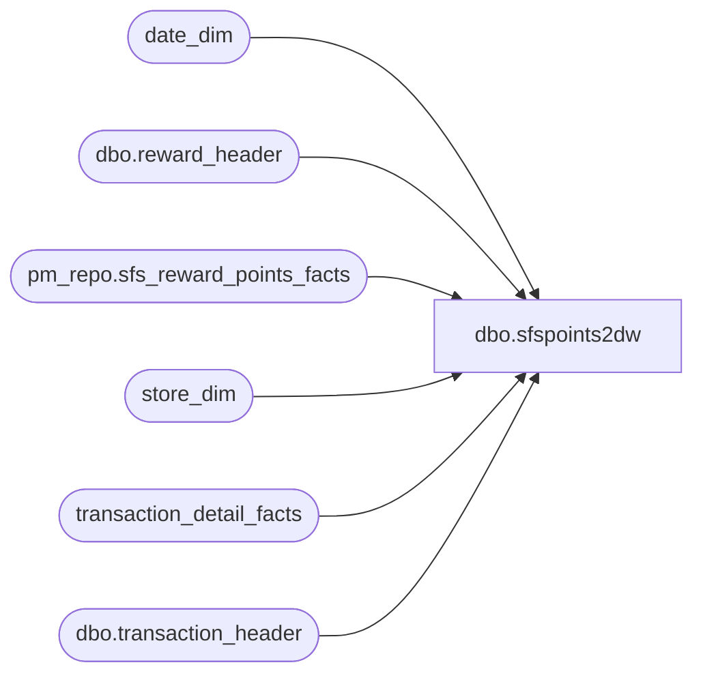

# dbo.sfspoints2dw

**Database:** dw  
**Server:** papamart  

## Architecture Diagram



## Table Dependencies

| Referenced Table |
|---|
| date_dim |
| dbo.reward_header |
| pm_repo.sfs_reward_points_facts |
| store_dim |
| transaction_detail_facts |
| dbo.transaction_header |

## Stored Procedure Code

```sql
CREATE PROCEDURE [dbo].[sfspoints2dw]
-- =============================================================================================================
-- Name: sfspoints2dw
--
-- Description:	
--
-- Input:	N/A
--
-- Output: N/A
--
-- Dependencies: 
--
-- Revision History
--		Name:			Date:			Comments:
--		Gary Derikito	05/16/2008		Modify to point to new crm server.
-- =============================================================================================================

	@FiscalYear int
	,@FiscalPeriod int = NULL
	,@FiscalWeek int = NULL
	,@ActualDate smalldatetime = NULL
	,@StoreID int = NULL

AS
BEGIN

	SET NOCOUNT ON;

	-- Get store info
	DECLARE @store_key int
	SELECT @store_key = store_key FROM store_dim WHERE store_id = @StoreID

	-- Get date info
	DECLARE @BeginDate smalldatetime
	DECLARE @EndDate smalldatetime
	DECLARE @BeginDateKey int
	DECLARE @EndDateKey int

	IF @ActualDate IS NOT NULL BEGIN SELECT @FiscalWeek = NULL, @FiscalPeriod = NULL END
	IF @FiscalWeek IS NOT NULL BEGIN SELECT @FiscalPeriod = NULL END

	SELECT @BeginDate = MIN(d.actual_date), @EndDate = MAX(d.actual_date)
		,@BeginDateKey = MIN(d.date_key), @EndDateKey = MAX(d.date_key)
	FROM date_dim d
	WHERE d.fiscal_year = @FiscalYear
		AND d.fiscal_period = ISNULL(@FiscalPeriod, d.fiscal_period)
		AND d.fiscal_week = ISNULL(@FiscalWeek, d.fiscal_week)
		AND d.actual_date = ISNULL(@ActualDate, d.actual_date)

	--SELECT @BeginDate, @EndDate

	SELECT rh.*, th.register_no, th.pos_transaction_no INTO #crm
--	FROM OURSCLIENT.mw.dbo.reward_header rh
--	INNER JOIN OURSCLIENT.mw.dbo.transaction_header th ON rh.transaction_id = th.transaction_id
	FROM crmdb02.crm.dbo.reward_header rh
	INNER JOIN crmdb02.crm.dbo.transaction_header th ON rh.transaction_id = th.transaction_id
	WHERE rh.transaction_date >= @BeginDate AND rh.transaction_date <= @EndDate
		AND th.store_no = ISNULL(@StoreID, th.store_no)


	/* Create some statistics */
	DECLARE @RowCountDw int
	DECLARE @PointValueDw int
	DECLARE @RowCountCrm int
	DECLARE @PointValueCrm int

	SELECT @RowCountDw = COUNT(*)
		,@PointValueDw = SUM(points_posted)
	FROM pm_repo.sfs_reward_points_facts sfs
	WHERE sfs.date_key >= @BeginDateKey AND sfs.date_key <= @EndDateKey
		AND sfs.store_key = ISNULL(@store_key, sfs.store_key)

	SELECT @RowCountCrm = COUNT(*)
		,@PointValueCrm = SUM(points_posted)
	FROM #crm

	SELECT @RowCountDw AS 'Row count of DW Fact Table', @PointValueDw AS 'Points in DW', @RowCountCrm AS 'Row count of CRM table', @PointValueCrm AS 'Points in CRM'


	/* Gets CRM transactions that are not flagged as SFS in TDF */
	SELECT c.transaction_date, c.store_no, c.register_no, c.pos_transaction_no
		,(
			SELECT TOP 1 transaction_id
			FROM transaction_detail_facts tdf2
			INNER JOIN date_dim d2 ON d2.date_key = tdf2.date_key
			INNER JOIN store_dim s2 ON s2.store_key = tdf2.store_key
			WHERE d2.actual_date = c.transaction_date
				AND s2.store_id = c.store_no
				AND tdf2.register_num = c.register_no
				AND tdf2.transaction_no = c.pos_transaction_no
		) AS transaction_id
	FROM #crm c
	LEFT JOIN
	(
		SELECT s.store_id, d.actual_date, tdf.register_num, tdf.transaction_no
		FROM transaction_detail_facts tdf
		INNER JOIN date_dim d ON d.date_key = tdf.date_key
		INNER JOIN store_dim s ON s.store_key = tdf.store_key
		WHERE tdf.date_key >= @BeginDateKey AND tdf.date_key <= @EndDateKey
			AND tdf.store_key = ISNULL(@store_key, tdf.store_key)
		GROUP BY s.store_id, d.actual_date, tdf.register_num, tdf.transaction_no
	) tdf ON tdf.actual_date = c.transaction_date
		AND tdf.store_id = c.store_no
		AND tdf.register_num = c.register_no
		AND tdf.transaction_no = c.pos_transaction_no
	WHERE tdf.store_id IS NULL


--	/* Gets CRM transactions that are not in TDF */
--	SELECT c.*
--	FROM #crm c
--	LEFT JOIN
--	(
--		SELECT s.store_id, d.actual_date, tdf.register_num, tdf.transaction_no
--		FROM transaction_detail_facts tdf
--		INNER JOIN date_dim d ON d.date_key = tdf.date_key
--		INNER JOIN store_dim s ON s.store_key = tdf.store_key
--		WHERE tdf.date_key >= @BeginDateKey AND tdf.date_key <= @EndDateKey
--			AND tdf.store_key = @store_key
--		GROUP BY s.store_id, d.actual_date, tdf.register_num, tdf.transaction_no
--	) tdf ON tdf.actual_date = c.transaction_date
--		AND tdf.store_id = c.store_no
--		AND tdf.register_num = c.register_no
--		AND tdf.transaction_no = c.pos_transaction_no
--	WHERE tdf.store_id IS NULL


	/* Drop the table */
	DROP TABLE #crm

END

dbo,spPMSShipmentTotals,-- =============================================
-- Author:		<Author,,Name>
-- Create date: <Create Date,,>
-- Description:	<Description,,>
-- =============================================
CREATE PROCEDURE spPMSShipmentTotals
AS
BEGIN
	-- SET NOCOUNT ON added to prevent extra result sets from
	-- interfering with SELECT statements.
	SET NOCOUNT ON;

    -- Insert statements for procedure here
	SELECT 'tmp'
END
```

