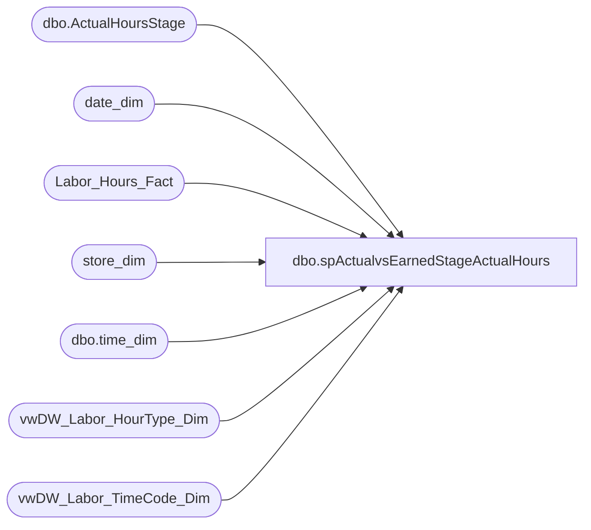

# dbo.spActualvsEarnedStageActualHours

**Database:** dw  
**Server:** papamart  

## Architecture Diagram



## Table Dependencies

| Referenced Table |
|---|
| dbo.ActualHoursStage |
| date_dim |
| Labor_Hours_Fact |
| store_dim |
| dbo.time_dim |
| vwDW_Labor_HourType_Dim |
| vwDW_Labor_TimeCode_Dim |

## Stored Procedure Code

```sql
CREATE proc [dbo].[spActualvsEarnedStageActualHours]
@Start date,
@End date

------------------------------------------------------------------------------------------------------------------------------
--	Dan Tweedie	2018-10-29	Created proc to stage labor hours, view takes too long, but code is taken from vwDW_Labor_Cube_V3
------------------------------------------------------------------------------------------------------------------------------

as

set nocount on

TRUNCATE TABLE dwstaging.dbo.ActualHoursStage

IF (Object_ID('tempdb..#StoreDate') IS NOT NULL) DROP TABLE #StoreDate
select 
	dd.fiscal_year as Year,
	dd.fiscal_week as  Week,
	min(cast(dd.actual_date as datetime)) as WeekStartDate
into #StoreDate
from date_dim dd with (nolock) 
where cast(dd.actual_date as date) between @Start and @End
group by dd.fiscal_year,dd.fiscal_week


IF (Object_ID('tempdb..#TimeDataOne') IS NOT NULL) DROP TABLE #TimeDataOne
SELECT
	time_key,
	CAST(CAST([hour] AS varchar) + ':' + CAST([minute] AS varchar) AS datetime) AS minTime,
	CAST(CAST([hour] AS varchar) + ':' + CAST([minute] + 29 AS varchar) + ':59' AS datetime) AS maxTime,
	0 AS offsetDate
into #TimeDataOne
FROM
	dbo.time_dim AS td WITH (NOLOCK)
WHERE
	([minute] IN (0, 30))
UNION ALL
SELECT
	time_key,
	DATEADD(D, 1, CAST(CAST([hour] AS varchar) + ':' + CAST([minute] AS varchar) AS datetime)) AS minTime,
	DATEADD(D, 1, CAST(CAST([hour] AS varchar) + ':' + CAST([minute] + 29 AS varchar) + ':59' AS datetime)) AS maxTime,
	1 AS offsetDate
FROM
	dbo.time_dim AS td WITH (NOLOCK)
WHERE
	([minute] IN (0, 30))

IF (Object_ID('tempdb..#LaborStageOne') IS NOT NULL) DROP TABLE #LaborStageOne
SELECT
	lhf.store_key,
	lhf.date_key,
	lhf.start_time,
	lhf.end_time
into #LaborStageOne
FROM Labor_Hours_Fact lhf WITH (NOLOCK) 
join date_dim dd with (nolock) on lhf.date_key = dd.date_key 
join vwDW_Labor_HourType_Dim h with (nolock) on lhf.HOURTYPE_KEY = h.HourType_key and h.isPaid = 'Paid'
join vwDW_Labor_TimeCode_Dim t with (nolock) on lhf.timecode_key = t.timeCode_key and t.isWork = 'Work'
where cast(dd.actual_date as date) between @Start and @End


IF (Object_ID('tempdb..#LaborStageTwo') IS NOT NULL) DROP TABLE #LaborStageTwo
SELECT
	lhf.store_key,
	lhf.date_key + td.offsetDate AS date_key,
	sum(
			CASE
				WHEN td.minTime <= lhf.start_Time AND
				td.maxTime <= lhf.end_Time THEN DATEDIFF(MINUTE, lhf.start_Time, td.maxTime) + 1
				WHEN td.mintime <= lhf.start_Time AND
				td.maxTime > lhf.end_Time THEN DATEDIFF(MINUTE, lhf.start_Time, lhf.end_Time)
				WHEN td.mintime > lhf.start_Time AND
				td.maxTime >= lhf.end_Time THEN DATEDIFF(MINUTE, td.minTime, lhf.end_Time)
				WHEN td.mintime > lhf.start_Time AND
				td.maxTime < lhf.end_Time THEN DATEDIFF(MINUTE, td.minTime, td.maxTime) + 1
				ELSE -99
			END)
		AS minsWorked
into #LaborStageTwo
FROM #LaborStageOne lhf WITH (NOLOCK)
join #TimeDataOne td on lhf.start_Time < td.maxTime
		AND lhf.end_Time > td.minTime
join date_dim dd with (nolock) on lhf.date_key + td.offsetDate = dd.date_key 
WHERE lhf.start_Time<>lhf.end_Time
group by lhf.store_key,
	lhf.date_key + td.offsetDate
UNION 
SELECT
	lhf.store_key,
	lhf.date_key + td.offsetDate AS date_key,
	sum(lhf.wrkd_minutes) as minsWorked
FROM
	Labor_Hours_Fact lhf WITH (NOLOCK)
join #TimeDataOne td on lhf.start_Time BETWEEN td.minTime AND td.maxTime
join date_dim dd with (nolock) on lhf.date_key + td.offsetDate = dd.date_key 
join vwDW_Labor_HourType_Dim h with (nolock) on lhf.HOURTYPE_KEY = h.HourType_key and h.isPaid = 'Paid'
join vwDW_Labor_TimeCode_Dim t with (nolock) on lhf.timecode_key = t.timeCode_key and t.isWork = 'Work'
WHERE 
	lhf.start_Time = lhf.end_Time
group by lhf.store_key,
	lhf.date_key + td.offsetDate 

insert DWStaging.dbo.ActualHoursStage
select 
	cast(sd.store_id as int) as StoreID,
	ssd.Year,
	ssd.Week,
	ssd.WeekStartDate as WeekStartDate,	
	cast((sum(l.minsWorked) / 60) as numeric(10,2)) as ActualHours
from #LaborStageTwo l
join store_dim sd with (nolock) on l.store_key = sd.store_key
join date_dim dd with (nolock) on l.date_key = dd.date_key
join #StoreDate ssd on ssd.year = dd.fiscal_year and ssd.week = dd.fiscal_week 
group by  
	cast(sd.store_id as int),
	ssd.Year,
	ssd.Week, 
	ssd.WeekStartDate
```

