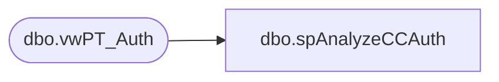

# dbo.spAnalyzeCCAuth

**Database:** dw  
**Server:** papamart  

## Architecture Diagram



## Table Dependencies

| Referenced Table |
|---|
| dbo.vwPT_Auth |

## Stored Procedure Code

```sql
--exec spAnalyzeCCAuth

CREATE  procedure spAnalyzeCCAuth
as

declare @start as datetime
select @start = '12/15/06'

-- SELECT  --[sMessageType], [iClientId]
-- --, [sCC_secure],  [sCreditCardType], 
-- -- [sBillToName], [dTimeStamp]
-- --, [iProcStatus], 
-- [bIsApproved], [sRespCode]
-- , [sAvsResponseCode], [sCvv2ResponseCode]--, [sCavvResponseCode]
-- , [sStatusMsg]--, [sGuestErrorMessage]
-- FROM [WebCart_Commerce].[dbo].[vwPT_Auth]
-- group by [bIsApproved], [sRespCode], [sAvsResponseCode], [sCvv2ResponseCode],[sStatusMsg]
-- order by [bIsApproved], [sRespCode], [sAvsResponseCode], [sCvv2ResponseCode],[sStatusMsg]
-- 

--===========================================================================
--find all UNIQUE order fails to auth so we know how many orders are actually not completed
--1. find all unique order #s (create tmp tbl) and get max(isapproved) and max(dTimeStamp)
	IF object_id('tempdb..#UniqueOrders') IS NOT NULL
	BEGIN
	   DROP TABLE #UniqueOrders
	END


	select distinct sOrderNumber as OrderNumber
		,max(Cast(bisapproved as tinyint)) as IsApproved
		,max(Cast(Convert(varchar(25),AuthDateTime,1) as datetime)) as dtimestamp
		,min(sRespCode) as responseCode
	into #UniqueOrders
	from bearwebdb.[WebCart_Commerce].[dbo].vwPT_Auth
	group by sOrderNumber
	--10233 unique order numbers


declare @IsApproved decimal(10,2), @IsNotApproved decimal(10,2), @TotalAttempts decimal(10,2), @PctAuth decimal(10,2)

select @IsApproved = count(*)
from #UniqueOrders
where IsApproved=1 and dtimestamp > @start -- 12/14/06 was last CC update

select @IsNotApproved = count(*)
from #UniqueOrders
where IsApproved=0 and dtimestamp > @start -- 12/14/06 was last CC update

select @TotalAttempts = count(*)
from #UniqueOrders
where dtimestamp > @start -- 12/14/06 was last CC update

select @PctAuth = @IsApproved / @TotalAttempts * 100.00


select @IsApproved as AuthOK
	,@IsNotApproved as NeverAuthed
	,@TotalAttempts as TotalOrderAttempts
	,@PctAuth as PctAuthOK

--76.28% orders eventually auth OK since last update


--======================
--for orders never getting auth analyze the resp codes
-- select responseCode, count(*) howMany
-- from #UniqueOrders
-- where IsApproved=0 and dtimestamp > @start
-- group by responseCode
-- order by count(*) Desc

select --[scc_secure],  [screditcardtype], [sbilltoname], [AuthDateTime], 
count(*) as HowMany, sRespCode as ResponseCode, [sGuestErrorMessage] as GuestErrorMessage
from bearwebdb.[webcart_commerce].[dbo].[vwpt_auth]
where bisapproved=0 and AuthDateTime > @start
group by srespcode, sGuestErrorMessage
order by Count(*) desc
```

