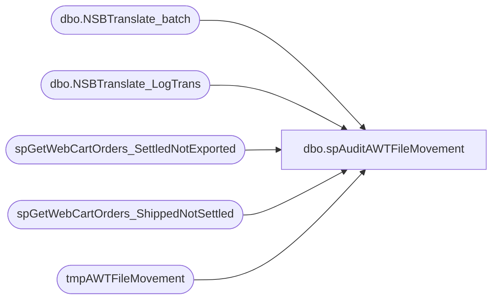

# dbo.spAuditAWTFileMovement

**Database:** dw  
**Server:** papamart  

## Architecture Diagram



## Table Dependencies

| Referenced Table |
|---|
| dbo.NSBTranslate_batch |
| dbo.NSBTranslate_LogTrans |
| spGetWebCartOrders_SettledNotExported |
| spGetWebCartOrders_ShippedNotSettled |
| tmpAWTFileMovement |

## Stored Procedure Code

```sql
--exec spAuditAWTFileMovement '12/6/07 5:00 am', '12/7/07 8:45 am'
CREATE               procedure [dbo].[spAuditAWTFileMovement]
-- =============================================================================================================
-- Name: spAuditAWTFileMovement
--
-- Description:	

--
-- Input:		@firstdate	smalldatetime
--				@lastdate	smalldatetime
--
--
-- Output: 
--
-- Dependencies: 
--
-- Revision History
--		Name:			Date:			Comments:
--		Brad Atkinson					created
--		Brad A			03/31/2010		updated email receipient to webteam
-- =============================================================================================================
(
@firstDate smalldatetime = '1/1/1900'
,@lastDate smalldatetime = '1/1/1900'
)
as
SET NOCOUNT ON
declare	@now 		smalldatetime,
	@today 		smalldatetime,
	@MyRecipient 	varchar(250),
	@MyMessage 	varchar(1000),
	@MySubject 	varchar(250)
--------------------TBD
--,@firstDate smalldatetime 
--,@lastDate smalldatetime
--SET @firstDate = '1/1/1900' 
--SET @lastDate = '1/1/1900' 
--------------------

if @firstDate = '1/1/1900' or @lastDate = '1/1/1900' begin
	select @now = getdate()
	select @today = DateAdd(hour, +5, Cast(Convert(varchar(12),@now,101) as smalldatetime)) --5am
	select @firstDate = dateadd(day,-1,@today)
		,@lastDate = @today
end


IF  EXISTS (SELECT * FROM dbo.sysobjects WHERE id = OBJECT_ID(N'[dbo].[tmpAWTFileMovement]') AND OBJECTPROPERTY(id, N'IsUserTable') = 1)
DROP TABLE [dbo].[tmpAWTFileMovement]
IF  EXISTS (SELECT * FROM dbo.sysobjects WHERE id = OBJECT_ID(N'[dbo].[tmpAWTFileMovement_log]') AND OBJECTPROPERTY(id, N'IsUserTable') = 1)
DROP TABLE [dbo].[tmpAWTFileMovement_log]
IF  EXISTS (SELECT * FROM dbo.sysobjects WHERE id = OBJECT_ID(N'[dbo].[tmpAWTSettlement_log]') AND OBJECTPROPERTY(id, N'IsUserTable') = 1)
DROP TABLE [dbo].[tmpAWTSettlement_log]


--GET ALL BATCHES for the time period
SELECT 
[sBatchID], 
[dTimeStamp], 
[bSentToAW], 
[sDevComments], 
[sCreatedBy],
@firstDate as firstdate,
@lastDate as lastdate
into tmpAWTFileMovement
 FROM BearWebDb.[WebCart_Commerce].[dbo].[NSBTranslate_batch] WITH(NOLOCK)
where --bSentToAW=0 and 
	[sCreatedBy] in ('WebCart','PostProductionService') and 
	dtimestamp between @firstDate and @lastDate
order by dTimeStamp desc


--GET ALL transaction details for the batches brought over
select 	t.sbatchid
	,convert(varchar(10),b.dTimeStamp,101) as dTimeStamp
	,sum(t.mAmount) as mAmount
	,sum(t.mCcAmount) as mCcAmount
	,sum(t.mGcTenderAmount) as mGcTenderAmount
	,sum(t.mVoucherAmount) as mVoucherAmount
	,count(*) as [OrderCount]
	,case
		when iStoreID in (13,136,1513) then 'US'
		when iStoreID in (2013) then 'UK'
		else Cast(iStoreID as varchar(10))
	 end as WH --US BABW, US F2BM, US Dino are all 13, 136 is Canada, 1513 is RZ 
into tmpAWTFileMovement_log
from BearWebDb.[WebCart_Commerce].[dbo].NSBTranslate_LogTrans t WITH(NOLOCK)
	join tmpAWTFileMovement b on b.sbatchid=t.sbatchid
where t.dtimestamp between @firstDate and @lastDate
group by t.sbatchid, convert(varchar(10),b.dTimeStamp,101), iStoreID


--Accounting Summary of SETTLEMENTS
SELECT convert(varchar(50),dTimeStamp,101) as [SettleDate]
, [iStoreID]
, Sum(mAmount) as [Total$]
, sum(mCcAmount) as [CC$]
, sum(mGcTenderAmount) as [GC$]
, sum(mVoucherAmount) as [SFS$]
, count(*) as [Count]
into tmpAWTSettlement_log
FROM BearWebDb.[WebCart_Commerce].[dbo].[NSBTranslate_LogTrans] WITH(NOLOCK)
where dTimeStamp between Dateadd(day,-6,@firstDate) and @lastDate
group by convert(varchar(50),dTimeStamp,101),iStoreID


exec spGetWebCartOrders_ShippedNotSettled 
exec spGetWebCartOrders_SettledNotExported


--declare @subjectText varchar(200)
--set @subjectText = 'Daily Webcart AWT batch status - ' + Convert(varchar(10),getdate(),101)
--
--exec master..xp_sendmail @recipients='lindak@buildabear.com;jackm@buildabear.com;sarahm@buildabear.com;brada@buildabear.com;kens@buildabear.com;phild@buildabear.com;davew@buildabear.com;jeffk@buildabear.com;marks@buildabear.com;'
----exec master..xp_sendmail @recipients='brada@buildabear.com'
--,@subject = @subjectText
--,@width = 110	--default is 80
--,@query = 'SET ANSI_WARNINGS OFF 
--select ''AW batches, ALL sites '' + cast(Dateadd(hour,+5,Cast(Convert(varchar(10),max(firstdate),1) as datetime))as varchar(20)) + '' to '' + cast(Dateadd(hour,+5,Cast(Convert(varchar(10),max(lastdate),1) as datetime)) as varchar(20))  from dw..tmpAWTFileMovement
--select ''NOTE: AWT numbers CANNOT be compared to the Bank!''
--select ''================= SUMMARY ===================''
--select 	--convert(varchar(10),b.dTimeStamp,101) as [Date],
--	CAST(t.WH as varchar(2)) as WH,
--	CASE b.bSentToAW 
--		when 1 then ''OK''
--		when 0 then ''FAIL''
--	 end as Sent
--	,CAST(sum(t.mAmount) as varchar(9)) as Total$
--	,CAST(sum(t.mCcAmount) as varchar(9)) as CC$
--	,CAST(sum(t.mGcTenderAmount) as varchar(9)) as GC$
--	,CAST(sum(t.mVoucherAmount) as varchar(9)) as SFS$
--	,CAST(sum(t.OrderCount) as varchar(5)) as Orders
--from dw..tmpAWTFileMovement_log t 
--	join dw..tmpAWTFileMovement b on b.sbatchid=t.sbatchid
--group by t.WH, b.bSentToAW
--order by t.WH, b.bSentToAW
----group by convert(varchar(10),b.dTimeStamp,101), b.bSentToAW
----order by convert(varchar(10),b.dTimeStamp,101), b.bSentToAW
--
--
--select ''===================== BATCH DETAILS =============================''
--select 	CAST(b.sBatchID as char(15)) as BatchID
--	,Left(convert(varchar(10),b.dTimeStamp,108),5) as [Time]
--	,CASE b.bSentToAW 
--		when 1 then ''OK''
--		when 0 then ''FAIL''
--	 end as Sent
--	,CAST(b.sCreatedBy as char(8)) as Source
--	,CAST(sum(t.mAmount) as varchar(9)) as Total$
--	,CAST(sum(t.mCcAmount) as varchar(9)) as CC$
--	,CAST(sum(t.mGcTenderAmount) as varchar(9)) as GC$
--	,CAST(sum(t.mVoucherAmount) as varchar(9)) as SFS$
--	,CAST(sum(t.OrderCount) as varchar(5)) as Orders
--from dw..tmpAWTFileMovement_log t 
--	join dw..tmpAWTFileMovement b on b.sbatchid=t.sbatchid
--group by b.sBatchID, b.dTimeStamp, b.bSentToAW, b.sCreatedBy
--order by b.sBatchID DESC
--
--
--
--select ''============ SETTLEMENT SUMMARY ==============''
--select ''Sent to AW (settled) 7 days - Dates CAN be compared to the Bank.''
--select 	Cast(SettleDate as varchar(10)) as SettleDate
--	,Cast([iStoreID] as varchar(5)) as Store
--	,Cast([Total$] as varchar(9)) as [Total$]
--	,Cast([CC$] as varchar(9)) as [CC$]
--	,Cast([GC$] as varchar(9)) as [GC$]
--	,Cast([SFS$] as varchar(9)) as [SFS$]
--	,Cast([Count] as varchar(5)) as [count]
--from dw..tmpAWTSettlement_log 
--order by SettleDate DESC
--	,iStoreID
--
--
----select ''============ SETTLEMENT PROBLEMS ===============''
----select Cast(SendToSettlement as varchar(3)) as Settle
----	, Cast(order_status_code as varchar(3)) as Status
----	, Cast(DateTimeShipped as varchar(14)) as DateShipped
----	, Cast(productionOrderNumber as varchar(9)) as OrderNumber
----	--, Cast(order_number as varchar(9)) as order_number
----	, Cast(SiteCode as varchar(7)) as Site
----from dw..tmpAWT_ShippedNotSettled
----
----select ''============ EXPORT PROBLEMS ==========================''
----select Cast(SendToSalesExport as varchar(3)) as Export
----	, Cast(order_status_code as varchar(3)) as Status
----	, Cast(order_number as varchar(9)) as OrderNumber
----	, Cast(SendToSettlement as varchar(3)) as Settle
----	, Cast(SettleDate as varchar(14)) as SettleDate
----	, Cast(SiteCode as varchar(7)) as Site
----from dw..tmpAWT_SettledNotExported
--
--
--
--select ''SQL SP: PapaMart.DW.spAuditAWTFileMovement''
--select ''SQL Agent: PapaMart.05_AuditAWTFileMovement''
--select ''SQL Agent Schedule: 6:00 AM Sun - Sat''
--'
```

