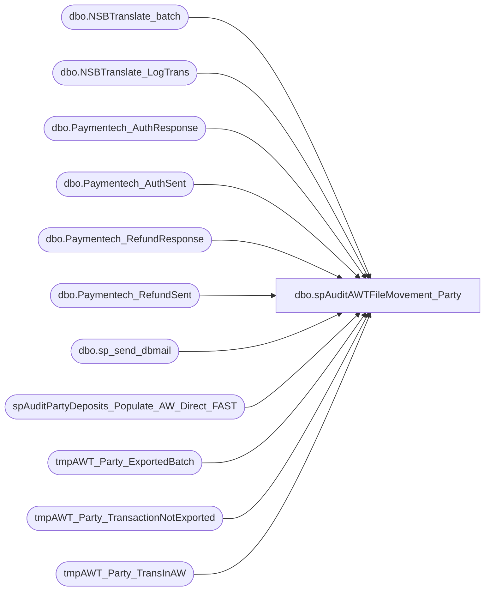

# dbo.spAuditAWTFileMovement_Party

**Database:** dw  
**Server:** papamart  

## Architecture Diagram



## Table Dependencies

| Referenced Table |
|---|
| dbo.NSBTranslate_batch |
| dbo.NSBTranslate_LogTrans |
| dbo.Paymentech_AuthResponse |
| dbo.Paymentech_AuthSent |
| dbo.Paymentech_RefundResponse |
| dbo.Paymentech_RefundSent |
| dbo.sp_send_dbmail |
| spAuditPartyDeposits_Populate_AW_Direct_FAST |
| tmpAWT_Party_ExportedBatch |
| tmpAWT_Party_TransactionNotExported |
| tmpAWT_Party_TransInAW |

## Stored Procedure Code

```sql
CREATE PROC [dbo].[spAuditAWTFileMovement_Party]
-- =============================================================================================================
-- Name: spAuditAWTFileMovement_Party
--
-- Description:	

--
-- Input:		@firstdate	smalldatetime
--				@lastdate	smalldatetime
--
--
-- Output: 
--
-- Dependencies: 
--
-- Revision History
--		Name:			Date:			Comments:
--		Brad Atkinson					created
--		Keith Missey	10/16/2008		Updated to use dbmail following SQL 2005 upgrade
--		Brad A			03/31/2010		updated email receipient to webteam
-- =============================================================================================================
    (
      @firstDate SMALLDATETIME = '1/1/1900',
      @lastDate SMALLDATETIME = '1/1/1900'  
    )
AS 
    SET NOCOUNT ON  
    DECLARE @now SMALLDATETIME,
        @today SMALLDATETIME,
        @MyRecipient VARCHAR(250),
        @MyMessage VARCHAR(1000),
        @MySubject VARCHAR(250)  
--------------------TBD  
--,@firstDate smalldatetime   
--,@lastDate smalldatetime  
--SET @firstDate = '1/1/1900'   
--SET @lastDate = '1/1/1900'   
--------------------  
  
    IF @firstDate = '1/1/1900'
        OR @lastDate = '1/1/1900' 
        BEGIN  
            SELECT  @now = GETDATE()  
 --select @today = DateAdd(hour, +5, Cast(Convert(varchar(12),@now,101) as smalldatetime)) --5am  
            SELECT  @today = CAST(CONVERT(VARCHAR(12), @now, 101) AS SMALLDATETIME)  
            SELECT  @firstDate = DATEADD(day, -1, @today),
                    @lastDate = @today  
        END  
  
  
--GET ALL BATCHES for the time period  
    IF EXISTS ( SELECT  *
                FROM    dbo.sysobjects
                WHERE   id = OBJECT_ID(N'[dbo].tmpAWT_Party_ExportedBatch')
                        AND OBJECTPROPERTY(id, N'IsUserTable') = 1 ) 
        DROP TABLE [dbo].tmpAWT_Party_ExportedBatch  
  
    SELECT  [sBatchID],
            [dTimeStamp],
            [bSentToAW],
            [sDevComments],
            [sCreatedBy],
            @firstDate AS firstdate,
            @lastDate AS lastdate
    INTO    tmpAWT_Party_ExportedBatch
    FROM    BearWebDb.[WebCart_Commerce].[dbo].[NSBTranslate_batch]
    WHERE   --bSentToAW=0 and   
            sCreatedBy = 'PartyAWT'
            AND dtimestamp BETWEEN @firstDate AND @lastDate
    ORDER BY dTimeStamp DESC  
  
--select * from tmpAWT_Party_ExportedBatch  
  
  
--GET details for the batches brought over  
    IF EXISTS ( SELECT  *
                FROM    dbo.sysobjects
                WHERE   id = OBJECT_ID(N'[dbo].tmpAWT_Party_ExportedBatch_Summary')
                        AND OBJECTPROPERTY(id, N'IsUserTable') = 1 ) 
        DROP TABLE [dbo].tmpAWT_Party_ExportedBatch_Summary  
  
    SELECT  t.sbatchid,
            CONVERT(VARCHAR(10), b.dTimeStamp, 101) AS dTimeStamp  
-- ,sum(t.mAmount) as mAmount  
            ,
            SUM(t.mCcAmount) AS mCcAmount  
-- ,sum(t.mGcTenderAmount) as mGcTenderAmount  
-- ,sum(t.mVoucherAmount) as mVoucherAmount  
            ,
            COUNT(*) AS [OrderCount],
            t.iStoreID
    INTO    tmpAWT_Party_ExportedBatch_Summary
    FROM    BearWebDb.[WebCart_Commerce].[dbo].NSBTranslate_LogTrans t
            JOIN tmpAWT_Party_ExportedBatch b ON b.sbatchid = t.sbatchid
    WHERE   t.dtimestamp BETWEEN @firstDate AND @lastDate
            AND LEFT(t.sOrderNumber, 7) <> '5087390'
    GROUP BY t.sbatchid,
            CONVERT(VARCHAR(10), b.dTimeStamp, 101),
            t.iStoreID  
   
  
------------select * from tmpAWT_Party_ExportedBatch_Summary_ByAWStore_ByAWBucket  
----------/*  
----------select * from BearWebDb.[WebCart_Commerce].[dbo].NSBTranslate_LogTrans t   
---------- join tmpAWT_Party_ExportedBatch b on b.sbatchid=t.sbatchid  
----------where sCreatedBy = 'PartyAWT'   
----------*/  
----------  
------------select * from BearWebDb.[WebCart_Commerce].[dbo].NSBTranslate_LogTrans where sbatchid ='AWL.04150942.IP'  
------------delete from BearWebDb.[WebCart_Commerce].[dbo].NSBTranslate_LogTrans where sbatchid ='AWL.04150942.IP'  
------------delete from BearWebDb.[WebCart_Commerce].[dbo].[NSBTranslate_batch] where sbatchid ='AWL.04150942.IP'  
  
  
  
--Accounting Summary  
    IF EXISTS ( SELECT  *
                FROM    dbo.sysobjects
                WHERE   id = OBJECT_ID(N'[dbo].[tmpAWT_Party_ExportedBatch_Summary_ByAWStore]')
                        AND OBJECTPROPERTY(id, N'IsUserTable') = 1 ) 
        DROP TABLE [dbo].[tmpAWT_Party_ExportedBatch_Summary_ByAWStore]  
  
    SELECT  CONVERT(VARCHAR(50), t.dTimeStamp, 101) AS [SettleDate],
            t.iStoreID  
--, Sum(mAmount) as [Total$]  
            ,
            SUM(mCcAmount) AS [CC$]  
--, sum(mGcTenderAmount) as [GC$]  
--, sum(mVoucherAmount) as [SFS$]  
            ,
            COUNT(*) AS [Count]
    INTO    tmpAWT_Party_ExportedBatch_Summary_ByAWStore
    FROM    BearWebDb.[WebCart_Commerce].[dbo].NSBTranslate_LogTrans t
            JOIN tmpAWT_Party_ExportedBatch b ON b.sbatchid = t.sbatchid
    WHERE   b.sCreatedBy = 'PartyAWT'
            AND t.dTimeStamp BETWEEN @firstDate AND @lastDate
            AND LEFT(t.sOrderNumber, 7) <> '5087390'
    GROUP BY CONVERT(VARCHAR(50), t.dTimeStamp, 101),
            t.iStoreID  
  
--select * from tmpAWT_Party_ExportedBatch_Summary_ByAWStore  
  
  
--=============================================================================================  
--====== PROBLEM CATCHING =====================================================================  
--=============================================================================================  
  
  
--==================================================================================  
-- "NOT EXPORTED" PROBLEMS   
--combine Auths and Refunds not Exported  
    IF EXISTS ( SELECT  *
                FROM    dbo.sysobjects
                WHERE   id = OBJECT_ID(N'[dbo].tmpAWT_Party_TransactionNotExported')
                        AND OBJECTPROPERTY(id, N'IsUserTable') = 1 ) 
        DROP TABLE [dbo].tmpAWT_Party_TransactionNotExported  
  
    CREATE TABLE tmpAWT_Party_TransactionNotExported
        (
          SettleDate SMALLDATETIME,
          iExportStatus INT,
          sOrderNumber VARCHAR(15),
          dDateExported SMALLDATETIME
        )  
  
-- "AUTH FAILED to EXPORT" PROBLEM - What deposits failed to export?  
    IF ( OBJECT_ID('tempdb.dbo.#AWT_Party_DepositNotExported') IS NOT NULL ) 
        DROP TABLE dbo.#AWT_Party_DepositNotExported  
  
    SELECT  resp.iExportStatus,
            resp.sOrderNumber,
            resp.dDateExported,
            resp.dTimeStamp AS SettleDate
    INTO    #AWT_Party_DepositNotExported
    FROM    Bearwebdb.webcart_commerce.dbo.Paymentech_AuthResponse resp
            JOIN Bearwebdb.webcart_commerce.dbo.Paymentech_AuthSent sent ON resp.sOrderNumber = sent.sOrderNumber
    WHERE   sent.iClientID IN ( 1, 3, 6 ) --1=BT, 3=BAP, 6=BT POS  
            AND resp.iExportStatus NOT IN ( 2, 3 ) -- 2=Complete, 3=Never Do  
            AND resp.dTimeStamp > '4/14/08' --start date of required logging  
            AND resp.bIsApproved = 1
            AND LEFT(sent.sOrderNumber, 7) <> '5087390'
            AND sent.sBillToFirstName <> 'Test'
            AND sent.sBillToLastName <> 'Test'
    ORDER BY resp.dDateExported,
            resp.dTimeStamp  
  
--select * from #AWT_Party_DepositNotExported  
  
  
-- "REFUND FAILED to EXPORT" PROBLEM - What refunds failed to export?  
    IF ( OBJECT_ID('tempdb.dbo.#AWT_Party_RefundNotExported') IS NOT NULL ) 
        DROP TABLE dbo.#AWT_Party_RefundNotExported  
  
    SELECT  resp.iExportStatus,
            resp.sOrderNumber,
            resp.dDateExported,
            resp.dTimeStamp AS SettleDate
    INTO    #AWT_Party_RefundNotExported
    FROM    Bearwebdb.webcart_commerce.dbo.Paymentech_RefundResponse resp
            JOIN Bearwebdb.webcart_commerce.dbo.Paymentech_RefundSent sent ON resp.sOrderNumber = sent.sOrderNumber
    WHERE   sent.iClientID IN ( 1, 3, 6 ) --1=BT, 3=BAP, 6=BT POS  
            AND resp.iExportStatus NOT IN ( 2, 3 ) -- 2=Complete, 3=Never Do  
            AND resp.dTimeStamp > '4/14/08' --start date of required logging  
            AND resp.bIsApproved = 1
            AND LEFT(sent.sOrderNumber, 7) <> '5087390'
            AND sent.sBillToFirstName <> 'Test'
            AND sent.sBillToLastName <> 'Test'
    ORDER BY resp.dDateExported,
            resp.dTimeStamp  
  
--select * from #AWT_Party_RefundNotExported  
  
    INSERT  INTO tmpAWT_Party_TransactionNotExported
            (
              SettleDate,
              iExportStatus,
              sOrderNumber,
              dDateExported 
            )
            SELECT  SettleDate,
                    iExportStatus,
                    sOrderNumber,
                    dDateExported
            FROM    #AWT_Party_DepositNotExported
            WHERE   SettleDate < @today  
  
    INSERT  INTO tmpAWT_Party_TransactionNotExported
            (
              SettleDate,
              iExportStatus,
              sOrderNumber,
              dDateExported 
            )
            SELECT  SettleDate,
                    iExportStatus,
                    sOrderNumber,
                    dDateExported
            FROM    #AWT_Party_RefundNotExported
            WHERE   SettleDate < @today  
  
--select SettleDate ,iExportStatus ,sOrderNumber ,dDateExported  from tmpAWT_Party_TransactionNotExported  
  
--==================================================================================  
-- "SETTLED"   
  
--get all successful AUTHs  
    IF ( OBJECT_ID('tempdb.dbo.#AWT_Party_AuthSettled') IS NOT NULL ) 
        DROP TABLE dbo.#AWT_Party_AuthSettled  
  
    SELECT  CAST(CONVERT(VARCHAR, AuthR.dTimeStamp, 101) AS SMALLDATETIME) AS SettleDate,
            AuthS.iStoreID,
            SUM(AuthS.mAmount) AS 'Auth_CC$',
            0 AS 'Refund_CC$',
            COUNT(*) AS 'Auths',
            0 AS 'Refunds'
    INTO    #AWT_Party_AuthSettled
    FROM    Bearwebdb.webcart_commerce.dbo.Paymentech_AuthResponse AuthR
            JOIN Bearwebdb.webcart_commerce.dbo.Paymentech_AuthSent AuthS ON AuthR.sOrderNumber = AuthS.sOrderNumber
    WHERE   AuthS.iClientID IN ( 1, 3, 6 ) --1=BT, 3=BAP, 6=BT POS  
            AND CAST(CONVERT(VARCHAR, AuthR.dTimeStamp, 101) AS SMALLDATETIME) BETWEEN @firstDate
                                                                               AND     @lastDate
            AND AuthR.bIsApproved = 1
    GROUP BY AuthS.iStoreID,
            CAST(CONVERT(VARCHAR, AuthR.dTimeStamp, 101) AS SMALLDATETIME)  
  
--select * from #AWT_Party_AuthSettled  
  
--get all successful REFUNDs  
    IF ( OBJECT_ID('tempdb.dbo.#AWT_Party_RefundSettled') IS NOT NULL ) 
        DROP TABLE dbo.#AWT_Party_RefundSettled  
  
    SELECT  CAST(CONVERT(VARCHAR, RefundR.dTimeStamp, 101) AS SMALLDATETIME) AS SettleDate,
            RefundS.iStoreID,
            0 AS 'Auth_CC$',
            SUM(-RefundS.mAmount) AS 'Refund_CC$',
            0 AS 'Auths',
            COUNT(*) AS 'Refunds'
    INTO    #AWT_Party_RefundSettled
    FROM    Bearwebdb.webcart_commerce.dbo.Paymentech_RefundResponse RefundR
            JOIN Bearwebdb.webcart_commerce.dbo.Paymentech_RefundSent RefundS ON RefundR.sOrderNumber = RefundS.sOrderNumber
    WHERE   RefundS.iClientID IN ( 1, 3, 6 ) --1=BT, 3=BAP, 6=BT POS  
            AND RefundR.dTimeStamp BETWEEN @firstDate AND @lastDate
            AND RefundR.bIsApproved = 1
    GROUP BY RefundS.iStoreID,
            CAST(CONVERT(VARCHAR, RefundR.dTimeStamp, 101) AS SMALLDATETIME)  
  
--select * from #AWT_Party_RefundSettled  
  
  
--combine Auths and Refunds  
    IF ( OBJECT_ID('tempdb.dbo.#AWT_Party_TransSettled') IS NOT NULL ) 
        DROP TABLE dbo.#AWT_Party_TransSettled  
  
    CREATE TABLE #AWT_Party_TransSettled
        (
          SettleDate SMALLDATETIME,
          iStoreID INT,
          Auth_CC$ MONEY,
          Refund_CC$ MONEY,
          Auths INT,
          Refunds INT
        )  
  
    INSERT  INTO #AWT_Party_TransSettled
            (
              SettleDate,
              iStoreID,
              Auth_CC$,
              Refund_CC$,
              Auths,
              Refunds
            )
            SELECT  SettleDate,
                    iStoreID,
                    Auth_CC$,
                    Refund_CC$,
                    Auths,
                    Refunds
            FROM    #AWT_Party_AuthSettled  
  
    INSERT  INTO #AWT_Party_TransSettled
            (
              SettleDate,
              iStoreID,
              Auth_CC$,
              Refund_CC$,
              Auths,
              Refunds
            )
            SELECT  SettleDate,
                    iStoreID,
                    Auth_CC$,
                    Refund_CC$,
                    Auths,
                    Refunds
            FROM    #AWT_Party_RefundSettled  
  
--select * from #AWT_Party_TransSettled  
  
  
    IF EXISTS ( SELECT  *
                FROM    dbo.sysobjects
                WHERE   id = OBJECT_ID(N'[dbo].[tmpAWT_Party_TransSettled]')
                        AND OBJECTPROPERTY(id, N'IsUserTable') = 1 ) 
        DROP TABLE [dbo].[tmpAWT_Party_TransSettled]  
  
    SELECT  SettleDate  
--  , iStoreID  
            ,
            SUM(Auths) AS 'Auths',
            SUM(Auth_CC$) AS 'Auth_CC$',
            SUM(Refunds) AS 'Refunds',
            SUM(Refund_CC$) AS 'Refund_CC$'
    INTO    tmpAWT_Party_TransSettled
    FROM    #AWT_Party_TransSettled
    WHERE   SettleDate < @today
    GROUP BY SettleDate  
--  , iStoreID  
  
  
--==================================================================================  
-- "EXPORTED but NOT in AW" PROBLEM - What was logged as Exported but is NOT in AW?  
  
--get all trans nums that my AWT log says were exported  
    IF EXISTS ( SELECT  *
                FROM    dbo.sysobjects
                WHERE   id = OBJECT_ID(N'[dbo].[tmpAWT_Party_TransLoggedAsExported]')
                        AND OBJECTPROPERTY(id, N'IsUserTable') = 1 ) 
        DROP TABLE [dbo].[tmpAWT_Party_TransLoggedAsExported]  
  
    SELECT  b.sBatchID,
            b.sDevComments,
            t.iAWTransID AS iAWTransNum,
            t.sOrderNumber,
            t.dTimeStamp,
            t.mAmount,
            t.iStoreID  
-- , t.sSiteCode  
    INTO    tmpAWT_Party_TransLoggedAsExported
    FROM    BearWebDb.[WebCart_Commerce].[dbo].NSBTranslate_LogTrans t
            JOIN tmpAWT_Party_ExportedBatch b ON b.sbatchid = t.sbatchid
    WHERE   sCreatedBy = 'PartyAWT'
            AND bSentToAW = 2  
  
--select * from tmpAWT_Party_TransLoggedAsExported  
  
  
--get all trans nums that my AWT log says were exported  
    EXEC [spAuditPartyDeposits_Populate_AW_Direct_FAST] @firstDate, @lastDate  
  
--select * from tmpAWT_Party_TransInAW  
  
  
--======================================================================  
--==== DUPLICATE IN AW ==================  
  
    IF EXISTS ( SELECT  *
                FROM    dbo.sysobjects
                WHERE   id = OBJECT_ID(N'[dbo].tmpAWT_Party_DuplicateTransInAW')
                        AND OBJECTPROPERTY(id, N'IsUserTable') = 1 ) 
        DROP TABLE [dbo].tmpAWT_Party_DuplicateTransInAW  
  
    SELECT  COUNT(*) AS Instances,
            AW_OrderNumber,
            AW_CCAmount AS Amount,
            CCProcessor_TransID
    INTO    tmpAWT_Party_DuplicateTransInAW
    FROM    dw..tmpAWT_Party_TransInAW
    WHERE   AW_line_void_flag = 0
            AND AW_transaction_void_flag = 0
            AND AW_ReqToSettleDate > '4/16/2008'
    GROUP BY AW_OrderNumber,
            AW_CCAmount,
            CCProcessor_TransID
    HAVING  COUNT(*) > 1
    ORDER BY COUNT(*) DESC  
  
  
  
-- ############# EMAIL RESULTS ########################################  
    DECLARE @subjectText VARCHAR(200)  
    SET @subjectText = 'Daily PARTY AWT batch status - '
        + CONVERT(VARCHAR(10), GETDATE(), 101)  
 --exec master..xp_sendmail @recipients='lindak@buildabear.com;jackm@buildabear.com;brada@buildabear.com;sarahm@buildabear.com;kens@buildabear.com;phild@buildabear.com;davew@buildabear.com;jeffk@buildabear.com;marks@buildabear.com;'  
    EXEC msdb.dbo.sp_send_dbmail @recipients = 'webteam@buildabear.com;retailsystems@buildabear.com;'  
--exec master..xp_sendmail @recipients='brada@buildabear.com'  
        , @subject = @subjectText, @query_result_width = 110 --default is 80  
        ,
        @query = 'SET ANSI_WARNINGS OFF SET NOCOUNT ON
select ''PARTY DEPOSIT AW batches, ALL sites '' + cast(Cast(Convert(varchar(10),max(firstdate),1) as datetime)as varchar(20)) + '' to '' + cast(Cast(Convert(varchar(10),max(lastdate),1) as datetime) as varchar(20))  from dw..tmpAWT_Party_ExportedBatch  
select ''NOTE: AWT numbers CANNOT be compared to the Bank!''  
select ''================= SUMMARY ==============================================''  
select  --convert(varchar(10),b.dTimeStamp,101) as [Date],  
 Cast(t.iStoreID as varchar(5)) as AWStore  
 ,CASE b.bSentToAW   
  when 1 then ''OK''  
  when 0 then ''FAIL''  
  end as Sent  
-- ,CAST(sum(t.mAmount) as varchar(9)) as Total$  
 ,CAST(sum(t.mCcAmount) as varchar(9)) as CC$  
-- ,CAST(sum(t.mGcTenderAmount) as varchar(9)) as GC$  
-- ,CAST(sum(t.mVoucherAmount) as varchar(9)) as SFS$  
 ,CAST(sum(t.OrderCount) as varchar(5)) as Transactions  
from dw..tmpAWT_Party_ExportedBatch b   
JOIN dw..tmpAWT_Party_ExportedBatch_Summary t   
 ON b.sBatchID = t.sBatchID  
group by t.iStoreID, b.bSentToAW  
order by t.iStoreID, b.bSentToAW  
  
  
select ''===================== BATCH DETAILS ====================================''  
select  CAST(b.sBatchID as char(15)) as BatchID  
 ,Left(convert(varchar(10),b.dTimeStamp,108),5) as [Time]  
 ,CASE b.bSentToAW   
  when 1 then ''OK''  
  when 0 then ''FAIL''  
  end as Sent  
 ,CAST(b.sCreatedBy as char(8)) as Source  
-- ,CAST(sum(t.mAmount) as varchar(9)) as Total$  
 ,CAST(sum(t.mCcAmount) as varchar(9)) as CC$  
-- ,CAST(sum(t.mGcTenderAmount) as varchar(9)) as GC$  
-- ,CAST(sum(t.mVoucherAmount) as varchar(9)) as SFS$  
 ,CAST(sum(t.OrderCount) as varchar(5)) as Transactions  
from dw..tmpAWT_Party_ExportedBatch b   
JOIN dw..tmpAWT_Party_ExportedBatch_Summary t   
 ON b.sBatchID = t.sBatchID  
group by b.sBatchID, b.dTimeStamp, b.bSentToAW, b.sCreatedBy  
order by b.sBatchID DESC  
  
  
  
select ''============ SETTLEMENT SUMMARY =========================================''  
select ''Sent to AW (settled) - Dates CAN be compared to the Bank.''  
select  Cast(SettleDate as varchar(11)) as SettleDate  
  --,Cast([iStoreID] as varchar(5)) as Store  
  ,Cast(Auths as varchar(5)) as Auths  
  ,Cast(Auth_CC$ as varchar(8)) as Auth_CC$  
  ,Cast(Refunds as varchar(5)) as Refunds  
  ,Cast(Refund_CC$ as varchar(8)) as Refund_CC$  
  ,Cast((Refunds + Auths) as varchar(5)) as TransCount  
  ,Cast((Refund_CC$ + Auth_CC$) as varchar(8)) as Net_CC$  
from dw..tmpAWT_Party_TransSettled  
  
  
  
if exists(  
 select Cast(SettleDate as varchar(11)) as SettleDate   
  , Cast(iExportStatus as varchar(3)) as Exported   
  , Cast(count(*) as varchar(5)) as transactions  
 from dw..tmpAWT_Party_TransactionNotExported  
 group by SettleDate, iExportStatus  
) begin  
 select ''     -----> PROBLEM!  "NOT EXPORTED": select * from PapaMart.dw..tmpAWT_Party_TransactionNotExported''  
end  
else begin  
 select ''     -----> No "NOT EXPORTED" Problems''  
end  
  
  
  
if exists(  
 select  Cast(x.sBatchID as varchar(15)) as BatchID  
  --, Cast(x.sDevComments as varchar(50)) as DevComments  
  , Cast(x.iAWTransNum as varchar(6)) as AWTransNum  
  , Cast(x.sOrderNumber as varchar(11)) as OrderNumber  
  , Cast(x.dTimeStamp as varchar(19)) as SettleDate  
  , Cast(x.mAmount as varchar(7)) as Amount  
  , Cast(x.iStoreID as varchar(5)) as StoreID  
 from dw..tmpAWT_Party_TransLoggedAsExported x   
  LEFT OUTER JOIN dw..tmpAWT_Party_TransInAW aw ON x.sOrderNumber = aw.AW_OrderNumber  
 Where aw.AW_OrderNumber IS NULL  
) begin  
 select ''     -----> PROBLEM!  "EXPORTED NOT IN AW": select * from dw..tmpAWT_Party_TransLoggedAsExported x LEFT OUTER JOIN dw..tmpAWT_Party_TransInAW aw ON x.sOrderNumber = aw.AW_OrderNumber Where aw.AW_OrderNumber IS NULL''  
end  
else begin  
 select ''     -----> No "EXPORTED NOT IN AW" Problems''  
end  
  
  
if exists(  
 select Cast(instances as varchar(3)) as instances  
  , Cast(Amount as varchar(7)) as Amount  
  , Cast(AW_OrderNumber as varchar(15)) as AW_OrderNumber  
  , Cast(CCProcessor_TransID as varchar(30)) as CCProcessor_TransID  
 from dw..tmpAWT_Party_DuplicateTransInAW  
) begin  
 select ''     -----> PROBLEM!  "DUPLICATE Party Deposit in AW": select * from dw..tmpAWT_Party_DuplicateTransInAW''  
end  
else begin  
 select ''     -----> No "DUPLICATE Party Deposit in AW" Problems''  
end  
  
select ''SQL SP: PapaMart.DW.spAuditAWTFileMovement_Party''  
select ''SQL Agent: PapaMart.05_AuditAWTFileMovement_Party''  
select ''SQL Agent Schedule: 6:30 AM Sun - Sat''  
'
```

