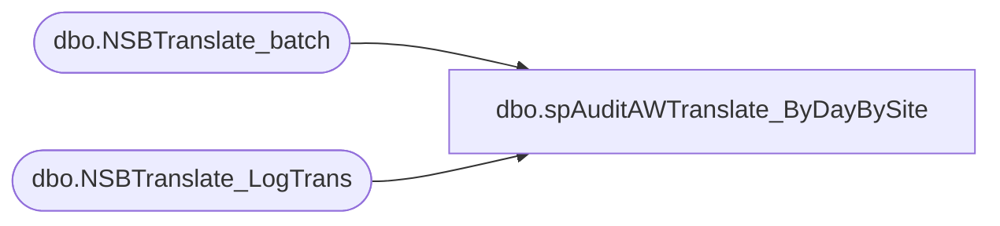

# dbo.spAuditAWTranslate_ByDayBySite

**Database:** dw  
**Server:** papamart  

## Architecture Diagram



## Table Dependencies

| Referenced Table |
|---|
| dbo.NSBTranslate_batch |
| dbo.NSBTranslate_LogTrans |

## Stored Procedure Code

```sql
--exec spAuditAWTranslate_ByDayBySite 1
CREATE procedure spAuditAWTranslate_ByDayBySite
(@iDaysBack int = 0)
as

declare @today as smalldatetime
set @today = Cast(Convert(varchar(50), getdate(), 1) as smalldatetime)

SELECT convert( varchar(50),b.dTimeStamp, 101) DateOfExport
	, iStoreId
	, sum(t.mAmount) as amount_Total
	, sum(t.mCcAmount) as amount_CC
	, sum(t.mGcTenderAmount) as amount_GiftCard
	, sum(t.mVoucherAmount) as amount_SFS
	, sum(t.iUnits) as units
	, count(*) as TransCount
FROM BearwebDB.WebCart_Commerce.dbo.NSBTranslate_batch b 
	join BearwebDB.WebCart_Commerce.dbo.NSBTranslate_LogTrans t 
	on b.sbatchid=t.sbatchid
where bSentToAW=1 
	and b.dtimestamp > DATEADD(day, - @iDaysBack, @today)
group by  convert(varchar(50),b.dTimeStamp, 101)
	, iStoreId
ORDER BY convert(varchar(50),b.dTimeStamp, 101) DESC


dbo,spStoreCompDim_GetEarliestDateToRefresh,-- =====================================================================================================
-- Name: spStoreCompDim_GetEarliestDateToRefresh
--
-- Description:	Determines the earliest date_key to refresh because of changes made to the StoreCompDate_Dim
--				The snapshot was taken by the stored procedure spStoreCompDim_MakeSnapshot
--				If there are no changes, this will return the date 9999999
--
-- Input: None
--
-- Output: @earliestDateToProcess - This will be the earliest date to be refreshed. If nothing needs to
--									refreshed, it will return the date 9999999 
--			
--
-- Dependencies: None
--
-- Revision History
--		Name:			Date:			Comments:
--		Gary Murrish	4/30/2013		Initial Release
-- =====================================================================================================
CREATE PROCEDURE [dbo].[spStoreCompDim_GetEarliestDateToRefresh]
	@earliestDateToProcess int OUTPUT
AS
BEGIN
	SET NOCOUNT ON;

	-- Get the earliest date for each store that has a change
	IF OBJECT_ID('tempdb..#tmpStoreDate') IS NOT NULL
	BEGIN
		DROP TABLE #tmpStoreDate
	END

	SELECT
		scdd.store_key,
		MIN(scdd.date_key) AS earliestDate
	INTO #tmpStoreDate
	FROM
		queries.Snapshot_StoreCompDetail_Dim snap WITH (NOLOCK)
		INNER JOIN StoreCompDetail_Dim scdd WITH (NOLOCK)
			ON snap.store_key = scdd.store_key
			AND snap.date_key = scdd.date_key
	WHERE
		scdd.isCompTY <> snap.isCompTY
		OR scdd.isCompNY <> snap.isCompNY
		OR scdd.isShopperTrak <> snap.isShopperTrak
		OR scdd.isShopperTrakCompTY <> snap.isShopperTrakCompTY
		OR scdd.isShopperTrakCompNY <> snap.isShopperTrakCompNY
		OR scdd.isSOTF <> snap.isSOTF
	GROUP BY scdd.store_key

	-- Now get the earliest sales date for that store
	IF OBJECT_ID('tempdb..#tmpStoreSales') IS NOT NULL
	BEGIN
		DROP TABLE #tmpStoreSales
	END
	SELECT
		sd.store_key,
		MIN(tdf.date_key) AS minSalesDate
	INTO #tmpStoreSales
	FROM
		transaction_detail_facts tdf WITH (NOLOCK)
		INNER JOIN #tmpStoreDate sd WITH (NOLOCK)
			ON tdf.store_key = sd.store_key
	GROUP BY sd.store_key

	-- Now figure out the earliest thing that we need to refresh
	--	For any store, it will be either the earliest date with a change or the first sales date whichever is greater
	--	Then we get the smallest one for any store.
	SELECT
		@earliestDateToProcess = ISNULL(MIN(CASE
			WHEN sd.earliestDate > ss.minSalesDate THEN sd.earliestDate
			ELSE ss.minSalesDate
		END), 9999999)
	FROM
		#tmpStoreDate sd WITH (NOLOCK)
		INNER JOIN #tmpStoreSales ss WITH (NOLOCK)
			ON sd.store_key = ss.store_key

END
```

