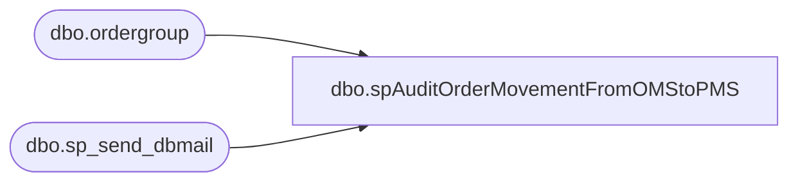

# dbo.spAuditOrderMovementFromOMStoPMS

**Database:** dw  
**Server:** papamart  

## Architecture Diagram



## Table Dependencies

| Referenced Table |
|---|
| dbo.ordergroup |
| dbo.sp_send_dbmail |

## Stored Procedure Code

```sql
--exec spAuditOrderMovementFromOMStoPMS
CREATE PROC [dbo].[spAuditOrderMovementFromOMStoPMS]
-- =============================================================================================================
-- Name: spAuditOrderMovementFromOMStoPMS
--
-- Description:	Used to alert when orders stop flowing to PMS
--
-- Input:		
--
-- Output: 
--
-- Dependencies: 
--
-- Revision History
--		Name:			Date:			Comments:
--		Brad Atkinson	5/17/2010		created
--		Brad			6/30/2010		changed trigger from 10 to 30 orders pending
-- =============================================================================================================

AS 
    SET NOCOUNT ON  
    DECLARE @now SMALLDATETIME,
        @today SMALLDATETIME,
        @MyRecipient VARCHAR(250),
        @MyMessage VARCHAR(1000),
        @MySubject VARCHAR(250),
		@pendingSendToPMS int,
		@ordersPendingPMS_CreatedInLast30days int,
		@ordersSentToPMS_Last30minutes int,
		@TimeLastOrderWasSentToPMS datetime,
		@pendingTest int
		  
		select @pendingTest = count(*) from bearwebdb.webcart_Commerce.dbo.ordergroup 
		where sendtopms=1 AND order_create_date > dateadd(day,-30,getdate())

	--Any orders queued to go to PMS that are less than 30 days old
	if (@pendingTest > 30) begin

		select @pendingSendToPMS=count(*)
		from bearwebdb.webcart_Commerce.dbo.ordergroup
		WHERE SendToPMS = 1

		select @ordersPendingPMS_CreatedInLast30days=count(*)
		from bearwebdb.webcart_Commerce.dbo.ordergroup 
		WHERE SendToPMS = 1 AND order_create_date > dateadd(day,-30,getdate())

		select @ordersSentToPMS_Last30minutes=count(*)
		--, DateDiff(second, max(order_create_date) , getdate()) / 60.0 
		from bearwebdb.webcart_Commerce.dbo.OrderGroup
		where sendtopms=2 and datesenttopms > dateadd(minute,-30,getdate())
		
		select @TimeLastOrderWasSentToPMS = MAX(order_create_date)
		from bearwebdb.webcart_Commerce.dbo.ordergroup 
		WHERE SendToPMS = 2
				
				
	-- ############# EMAIL RESULTS ########################################  
		DECLARE @subjectText VARCHAR(200), @queryText VARCHAR(2000)
		SET @subjectText = 'ALERT! ALERT! ALERT! Orders NOT flowing to PMS! - ' + Cast(GETDATE() as varchar(50))
		SET @queryText = 'SET ANSI_WARNINGS ON 
				SET NOCOUNT ON 
				SET ANSI_NULLS ON
				print ''DATA:' + CHAR(13) + '''
				print ''Orders pending send to PMS=' + Cast(@pendingSendToPMS as varchar(50)) + ', low number is good' + CHAR(13) + '''
				print ''Orders pending send to PMS created in last 30 days=' +  Cast(@ordersPendingPMS_CreatedInLast30days as varchar(50)) + ', low number is good' + CHAR(13) + '''
				print ''Orders sent to PMS in last 30 minutes=' +  Cast(@ordersSentToPMS_Last30minutes as varchar(50)) + ', = 0 is a PROBLEM' + CHAR(13) + '''
				print ''Time most recent order was sent To PMS=' +  Cast(@TimeLastOrderWasSentToPMS as varchar(50)) + ', > 5 min is a PROBLEM' + CHAR(13) + CHAR(13) + '''
				print ''SCHEDULE:' + CHAR(13) + '''  
				print ''SQL SP: PapaMart.DW.spAuditOrderMovementFromOMStoPMS' + CHAR(13) + '''  
				print ''SQL Agent: PapaMart.05_AuditOrderMovementFromOMStoPMS' + CHAR(13) + ''' 
				print ''SQL Agent Schedule: Every 60 minutes''  
				'  

		--select @queryText

		exec msdb.dbo.sp_send_dbmail 
				--@recipients='brada@buildabear.com'  
				@recipients = 'webteam@buildabear.com;'  
				, @subject = @subjectText
				, @query_result_width = 80 --default is 80  
				, @query = @queryText
	end


--==================================================================================  


dbo,spAuditAWTranslate_BatchesByDay,--exec spAuditAWTranslate_BatchesByDay
CREATE procedure spAuditAWTranslate_BatchesByDay
(@iDaysBack int = 1)
as

declare @today as smalldatetime
set @today = Cast(Convert(varchar(50), getdate(), 1) as smalldatetime)

SELECT b.sBatchID
	, b.dTimeStamp
	, b.bSentToAW
	, sCreatedBy 
	, Sum(t.mAmount) as Amount
	, Sum(t.mCCAmount) as Amount_CC
	, Sum(t.mGcTenderAmount) as Amount_GC
	, Sum(t.mVoucherAmount) as Amount_SFS
	, Sum(t.iUnits) as Units
	, count(*) as TransCount
FROM BearwebDB.WebCart_Commerce.dbo.NSBTranslate_batch b
	join BearwebDB.WebCart_Commerce.dbo.NSBTranslate_LogTrans t 
	on t.sbatchid=b.sbatchid
Where b.dtimestamp > DATEADD(day, - @iDaysBack, @today)
group by b.sBatchID
	, b.bSentToAW
	, b.dTimeStamp
	, b.sCreatedBy
ORDER BY b.dTimeStamp DESC


dbo,dt_getobjwithprop_u,/*
**	Retrieve the owner object(s) of a given property
*/
create procedure dbo.dt_getobjwithprop_u
	@property varchar(30),
	@uvalue nvarchar(255)
as
	set nocount on

	if (@property is null) or (@property = '')
	begin
		raiserror('Must specify a property name.',-1,-1)
		return (1)
	end

	if (@uvalue is null)
		select objectid id from dbo.dtproperties
			where property=@property

	else
		select objectid id from dbo.dtproperties
			where property=@property and uvalue=@uvalue
```

