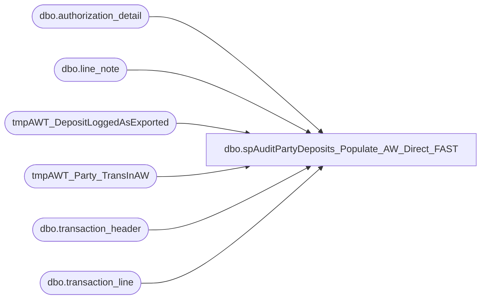

# dbo.spAuditPartyDeposits_Populate_AW_Direct_FAST

**Database:** dw  
**Server:** papamart  

## Architecture Diagram



## Table Dependencies

| Referenced Table |
|---|
| dbo.authorization_detail |
| dbo.line_note |
| tmpAWT_DepositLoggedAsExported |
| tmpAWT_Party_TransInAW |
| dbo.transaction_header |
| dbo.transaction_line |

## Stored Procedure Code

```sql
--exec spAuditPartyDeposits_Populate_AW_Direct_FAST '4/16/08', '4/17/08'
CREATE PROCEDURE [dbo].[spAuditPartyDeposits_Populate_AW_Direct_FAST](
@FirstDate datetime
,@LastDate datetime
)
as

-- DECLARE @FIRSTDATE DATETIME, @LASTDATE DATETIME
-- SELECT @FIRSTDATE='12/1/06', @LASTDATE='12/29/06'
-- 
-- declare @OrdersTable table(orderNumber varchar(50))
-- insert into @OrdersTable(orderNumber) values(2489386)

select @LastDate = Dateadd(day,1,@LastDate) --to include @LastDate dates in queries

-- CLEAN UP TEMP TABLES =================================================================================
IF (Object_ID('tempdb.dbo.#AW_PARTY_Direct') IS NOT NULL) DROP TABLE dbo.#AW_PARTY_Direct
IF (Object_ID('tempdb.dbo.#AW_PARTY_transaction_header') IS NOT NULL) DROP TABLE dbo.#AW_PARTY_transaction_header
IF (Object_ID('tempdb.dbo.#AW_PARTY_transaction_line') IS NOT NULL) DROP TABLE dbo.#AW_PARTY_transaction_line
IF (Object_ID('tempdb.dbo.#AW_PARTY_line_note') IS NOT NULL) DROP TABLE dbo.#AW_PARTY_line_note
IF (Object_ID('tempdb.dbo.#AW_PARTY_authorization_detail') IS NOT NULL) DROP TABLE dbo.#AW_PARTY_authorization_detail

create table #AW_PARTY_line_note(
	transaction_id numeric(12,0)
	,AW_OrderNumber varchar(50)	--Party deposit order number
)
create index ix_AW_PARTYLineNote_transactionID on #AW_PARTY_line_note(transaction_id)


create table #AW_PARTY_transaction_header(
	transaction_id numeric(12,0)
	,store_no int
	,transaction_no numeric(12,0) --AW trans Num
	,transaction_series varchar(50)
	,register_no int
	,transaction_date datetime	--actual transaction date
	,AW_transaction_void_flag smallint
)
create index ix_AW_PARTYTransactionHeader_transactionID on #AW_PARTY_transaction_header(transaction_id)


create table #AW_PARTY_transaction_line(
	transaction_id numeric(12,0)
	,line_action tinyint
	,line_object smallint
	,gross_line_amount money
	,AW_line_void_flag tinyint
	,line_id numeric(5,0)
)
create index ix_AW_PARTYTransactionLine_transactionID on #AW_PARTY_transaction_line(transaction_id)


create table #AW_PARTY_authorization_detail(
	transaction_id numeric(12,0)
	,line_id numeric(5,0)
	,CCProcessor_TransID varchar(50)	--SJ OrderID starting March 8,2005, SJtransactionID for WebService settled orders that is GC_K as of 1/11/06
)
create index ix_AW_PARTYAuthorizationDetail_transactionID on #AW_PARTY_authorization_detail(transaction_id)


--##### detect if in archive #############################################################################
--declare @iMax_AuditStatus int
--
--select @iMax_AuditStatus = max(audit_status)
--from oursblanc.auditworks.dbo.audit_status
--where store_no IN (990,995,1590,2990,2995)
-- 	and register_no=2 
--	and sales_date between @FirstDate and @LastDate
--	and audit_status in (100,200,300,400,500)
--
----300 or less IS NOT IN ARCHIVE
----400 or more IS IN ARCHIVE
----select * from code_description where code_type = 13
--
----##### ARCHIVED AW TABLE DATA #############################################################################
--if(@iMax_AuditStatus=400 or @iMax_AuditStatus=500) begin
--	print 'archive data needed'
--
--	--NOTE: this willl insert dupe WC orders that were exported 2x and have 2 AW trans IDs
--	INSERT #AW_PARTY_line_note(
--		transaction_id
--		,AW_OrderNumber
--	)
--	SELECT av_transaction_id
--		,substring(d.line_note,13,99) 	as AW_OrderNumber	--Party deposit, CC processor order number
--	--	INTO #AW_PARTY_line_note
--	FROM oursblanc.auditworks.dbo.av_line_note d
--	--	FROM av_line_note d with(nolock)
--	WHERE d.note_type = 3
--		and substring(d.line_note,13,99) collate SQL_Latin1_General_CP1_CI_AS  IN (
--			select sOrderNumber 
--			--XXXXXXXXXXXXXXXXXXXfrom queries.dbo.WCAudit_PMS_OrdersShipped 
--			from tmpAWT_DepositLoggedAsExported 
--			--WHERE sProductionOrderNumber is not null
--		)
--	
--	INSERT #AW_PARTY_transaction_header(
--		transaction_id
--		,store_no
--		,transaction_no
--		,transaction_series
--		,register_no
--		,transaction_date
--		,AW_transaction_void_flag
--	)
--	SELECT  a.av_transaction_id
--		,a.store_no
--		,a.transaction_no 		
--		,a.transaction_series
--		,a.register_no
--		,a.transaction_date		--actual transaction date
--		,a.transaction_void_flag 	as AW_transaction_void_flag
--	--	INTO #AW_PARTY_transaction_header
--	FROM oursblanc.auditworks.dbo.av_transaction_header a
--	--	FROM av_transaction_header a with(nolock)
--	WHERE a.av_transaction_id IN (select transaction_id from #AW_PARTY_line_note)
--	
--	
--	INSERT #AW_PARTY_transaction_line(
--		transaction_id
--
--		,line_action
--		,line_object
--		,gross_line_amount
--		,AW_line_void_flag
--		,line_id
--	)
--	SELECT  b.av_transaction_id
--		,b.line_action
--		,b.line_object
--		,b.gross_line_amount	
--		,b.line_void_flag 		as AW_line_void_flag
--		,b.line_id
--	--	INTO #AW_PARTY_transaction_line
--	FROM oursblanc.auditworks.dbo.av_transaction_line b
--	--	FROM av_transaction_line b with(nolock)
--	WHERE b.av_transaction_id IN (select transaction_id from #AW_PARTY_line_note)
--		
--	
--	INSERT #AW_PARTY_authorization_detail(
--		transaction_id
--		,line_id
--		,CCProcessor_TransID
--	)
--	SELECT  e.av_transaction_id
--		,e.line_id
--		,e.approval_message 		as CCProcessor_TransID
--	--	INTO #AW_PARTY_authorization_detail
--	FROM oursblanc.auditworks.dbo.av_authorization_detail e
--	--	FROM av_authorization_detail e with(nolock)
--	WHERE e.av_transaction_id IN (select transaction_id from #AW_PARTY_line_note)
--end
--END ARCHIVED AW TABLE DATA #############################################################################


--##### CURRENT AW TABLE DATA #############################################################################
		--N	0	28	Web Order: 3268894 -- sample line note for web cart
		--N	103	3	OrderNumber=5613685x001 -- sample Line Note for party deposit

--NOTE: this willl insert dupe WC orders that were exported 2x and have 2 AW trans IDs
INSERT #AW_PARTY_line_note(
	transaction_id
	,AW_OrderNumber
)
SELECT transaction_id
	,substring(d.line_note,13,99) 	as AW_OrderNumber	--party deposit, CC processor order number
--FROM oursblanc.auditworks.dbo.line_note d --with(nolock)
FROM AWTEST.auditworks.dbo.line_note d --with(nolock)
WHERE d.note_type = 3 --28 web order, 3= party deposit
	and substring(d.line_note,13,99) collate SQL_Latin1_General_CP1_CI_AS IN 
	(
		select distinct sOrderNumber from tmpAWT_DepositLoggedAsExported
	)


INSERT #AW_PARTY_transaction_header(
	transaction_id
	,store_no
	,transaction_no
	,transaction_series
	,register_no
	,transaction_date
	,AW_transaction_void_flag
)
SELECT  a.transaction_id
	,a.store_no
	,a.transaction_no 		
	,a.transaction_series
	,a.register_no
	,a.transaction_date		--actual transaction date
	,a.transaction_void_flag 	as AW_transaction_void_flag
--FROM oursblanc.auditworks.dbo.transaction_header a --with(nolock)
FROM AWTEST.auditworks.dbo.transaction_header a --with(nolock)
WHERE a.transaction_id	IN (select distinct transaction_id from #AW_PARTY_line_note)


INSERT #AW_PARTY_transaction_line(
	transaction_id
	,line_action
	,line_object
	,gross_line_amount
	,AW_line_void_flag
	,line_id
)
SELECT  b.transaction_id
	,b.line_action
	,b.line_object
	,b.gross_line_amount	
	,b.line_void_flag 		as AW_line_void_flag
	,b.line_id
--FROM oursblanc.auditworks.dbo.transaction_line b--with(nolock)
FROM AWTEST.auditworks.dbo.transaction_line b--with(nolock)
WHERE b.transaction_id IN (select distinct transaction_id from #AW_PARTY_line_note)
	

INSERT #AW_PARTY_authorization_detail(
	transaction_id
	,line_id
	,CCProcessor_TransID
)
SELECT  e.transaction_id
	,e.line_id
	,e.approval_message as CCProcessor_TransID	--SJ OrderID starting March 8,2005, SJtransactionID for WebService settled orders that is GC_K as of 1/11/06
--FROM oursblanc.auditworks.dbo.authorization_detail e --with(nolock)
FROM AWTEST.auditworks.dbo.authorization_detail e --with(nolock)
WHERE e.transaction_id IN (select distinct transaction_id from #AW_PARTY_line_note)
--select * from #AW_PARTY_authorization_detail order by CCProcessor_TransID
--END CURRENT AW TABLE DATA #############################################################################

--##### Combine Data ##################################################################################################################
SELECT d.AW_OrderNumber	--party deposit, CC processor order number
	,a.store_no	as store_no
	,a.transaction_no as AW_TranNo --AW trans Num
	,Cast(CONVERT(varchar(20),a.transaction_date,101) as datetime) as AW_ReqToSettleDate --actual transaction date
	,sum(case when b.line_action = 11 AND b.line_object IN (604,605,606,608,611,614,642,699)then b.gross_line_amount	
		when b.line_action = 27 AND b.line_object IN (604,605,606,608,611,614,642,699)then - b.gross_line_amount	
		else 0
	end) 	as AW_CCAmount	--$ on this CC line item
--	,sum(case when b.line_action = 25 AND b.line_object IN (624,633)then b.gross_line_amount	
--		when b.line_action = 12 AND b.line_object IN (624,633)then - b.gross_line_amount	
--		else 0
--	end) 	as AW_GCAmount	--$ on this GC line item
--	,sum(case when b.line_action = 25 AND b.line_object IN (640)then b.gross_line_amount	
--		when b.line_action = 24 AND b.line_object IN (640)then - b.gross_line_amount	
--		else 0
--	end) 	as AW_SFSAmount	--$ on this GC line item
	,e.CCProcessor_TransID	--SJ OrderID starting March 8,2005, SJtransactionID for WebService settled orders that is GC_K as of 1/11/06
	,b.AW_line_void_flag
	,a.AW_transaction_void_flag
INTO #AW_PARTY_Direct
FROM 	#AW_PARTY_transaction_header a
	JOIN #AW_PARTY_transaction_line b ON a.transaction_id=b.transaction_id 
	JOIN #AW_PARTY_line_note d ON  b.transaction_id=d.transaction_id 
	JOIN #AW_PARTY_authorization_detail e on e.transaction_id=b.transaction_id and e.line_id=b.line_id --LEFT JOIN TO GET Other TENDERS (No CC Auth record)
WHERE a.store_no IN (990,995,1590,2990,2995) 
	and a.register_no = 2
group by b.AW_line_void_flag
	,a.AW_transaction_void_flag
	,a.store_no
	,d.AW_OrderNumber
	,a.transaction_no
	,Cast(CONVERT(varchar(20),a.transaction_date,101) as datetime)
	,e.CCProcessor_TransID 

--select * from #AW_PARTY_Direct
--select sum(AW_CCAmount), sum(AW_GCAmount), count(*) from #AW_PARTY_Direct
--END Combine Data ##################################################################################################################


--##### BUILD OUTPUT TABLES ##################################################################################################
IF (Object_ID('tmpAWT_Party_TransInAW') IS NOT NULL) DROP TABLE tmpAWT_Party_TransInAW

--EVERY AW Transaction (Unique by AW.Transaction Number which is equivelent to SJ.AWTransID)
CREATE TABLE tmpAWT_Party_TransInAW
	(AW_TranNo int
	,AW_OrderNumber varchar(50)
	,AW_ReqToSettleDate datetime
	,AW_CCAmount money
--	,AW_GCAmount money
--	,AW_SFSAmount money
	,AW_line_void_flag int
	,AW_transaction_void_flag int
--	,AW_Archive bit
	,CCProcessor_TransID varchar(50)
	)
create index ix_AW_PARTYDirectAWTLog_AW_OrderNumber on tmpAWT_Party_TransInAW(AW_OrderNumber)

Insert tmpAWT_Party_TransInAW(
	AW_TranNo 
	,AW_OrderNumber 
	,AW_ReqToSettleDate 
	,AW_CCAmount 
--	,AW_GCAmount 
--	,AW_SFSAmount
	,AW_line_void_flag
	,AW_transaction_void_flag
--	,AW_Archive
	,CCProcessor_TransID
	)
SELECT AW_TranNo
	,AW_OrderNumber
	,AW_ReqToSettleDate
	,SUM(AW_CCAmount) as AW_CCAmount
--	,SUM(AW_GCAmount) as AW_GCAmount
--	,SUM(AW_SFSAmount) as AW_SFSAmount
	,AW_line_void_flag
	,AW_transaction_void_flag
--	,0
	,CCProcessor_TransID
from  #AW_PARTY_Direct
group by AW_TranNo, AW_OrderNumber, AW_ReqToSettleDate	,AW_line_void_flag, AW_transaction_void_flag, CCProcessor_TransID
order by AW_line_void_flag, AW_transaction_void_flag, AW_TranNo, AW_OrderNumber, AW_ReqToSettleDate	


--select * from #AW_PARTY_Direct
--select * from tmpAWT_Party_TransInAW

--END BUILD OUTPUT TABLES ##################################################################################################


-- CLEAN UP TEMP TABLES =================================================================================
IF (Object_ID('tempdb.dbo.#AW_PARTY_Direct') IS NOT NULL) DROP TABLE dbo.#AW_PARTY_Direct
IF (Object_ID('tempdb.dbo.#AW_PARTY_transaction_header') IS NOT NULL) DROP TABLE dbo.#AW_PARTY_transaction_header
IF (Object_ID('tempdb.dbo.#AW_PARTY_transaction_line') IS NOT NULL) DROP TABLE dbo.#AW_PARTY_transaction_line
IF (Object_ID('tempdb.dbo.#AW_PARTY_line_note') IS NOT NULL) DROP TABLE dbo.#AW_PARTY_line_note
IF (Object_ID('tempdb.dbo.#AW_PARTY_authorization_detail') IS NOT NULL) DROP TABLE dbo.#AW_PARTY_authorization_detail
```

