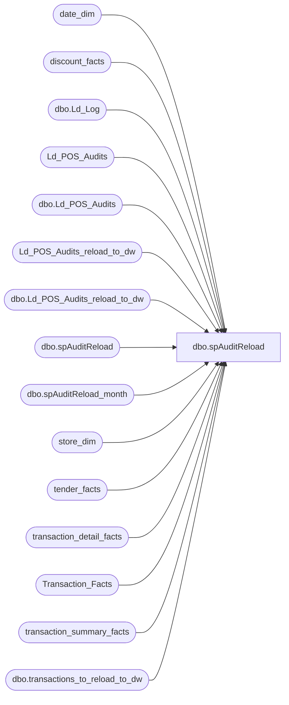

# dbo.spAuditReload

**Database:** dw  
**Server:** papamart  

## Architecture Diagram



## Table Dependencies

| Referenced Table |
|---|
| date_dim |
| discount_facts |
| dbo.Ld_Log |
| Ld_POS_Audits |
| dbo.Ld_POS_Audits |
| Ld_POS_Audits_reload_to_dw |
| dbo.Ld_POS_Audits_reload_to_dw |
| dbo.spAuditReload |
| dbo.spAuditReload_month |
| store_dim |
| tender_facts |
| transaction_detail_facts |
| Transaction_Facts |
| transaction_summary_facts |
| dbo.transactions_to_reload_to_dw |

## Stored Procedure Code

```sql
CREATE           procedure [dbo].[spAuditReload] --2007, 1
 @fiscalyear int = null
,@fiscalperiod int = null
as
-- =====================================================================================================
-- Name: spAuditReload
--
-- Description:	Pulls transaction data from Sales Audit
--
-- Input:	
--			@fiscalyear			datetime	Sets date range
--			@fiscalperiod		datetime	
--
-- Output: Resultset with the following columns:
--			N/A
--
-- Dependencies: None
--
-- Revision History
--		Name:			Date:			Comments:
--		Gary Murrish	12/27/2011		Added delete of Transaction_facts
--		RickC			12/1/2011		Removed tender_group references and added tender_facts
--		GaryD			08/18/2010		Current production version.
--		GaryD			08/18/2010		Update server name for SA 5.0.
-- =====================================================================================================

DECLARE 
	 @last_mod_date datetime
	,@maxModified_date datetime
	,@date_beg datetime
	,@date_end datetime

	,@batch_beg int
	,@batch_end int
	,@batch_rows int
	,@max int
	,@batchtime_beg datetime
	,@batchtime_end datetime

	SET @batch_rows = 100000
	SET @batch_beg = 1
	SET @batch_end = @batch_beg + @batch_rows	

	--,@fiscalyear int
	--,@fiscalperiod int
	--SET @fiscalyear = 2007
	--SET @fiscalperiod = 1

IF @fiscalyear is not null --or datepart(dd,getdate()) = 10  ------load the prior month on the 10th of the following month
	BEGIN  ------------monthly reload of closed fiscal month----------------

		--SET @fiscalyear = (datepart(yy,dateadd(dd,-25,getdate())))  --just get back into the prior month
		--SET @fiscalperiod = (datepart(mm,dateadd(dd,-25,getdate())))--just get back into the prior month

		select 	@date_beg = min(actual_date), @date_end = max(actual_date)	
		from date_dim 
		where fiscal_year = @fiscalyear
			and fiscal_period = @fiscalperiod

	--PREP--

		truncate table Ld_POS_Audits
		--build table on Auditworks
		exec bedrockdb01.auditworks.dbo.spAuditReload_month @date_beg, @date_end

	--end PREP

		select tdf_key, tdf.transaction_id,  identity(int,1,1) as uid 
		into #tmp_pos_tdf_dels_month
		from transaction_detail_facts tdf
			join date_dim dd on tdf.date_key = dd.date_key
		where dd.actual_date between @date_beg and @date_end
			and tdf.transaction_line_seq >0

		SET @max = (select max(uid) from #tmp_pos_tdf_dels_month)

		---build indexes---
		create index idx_tmp_tdf on #tmp_pos_tdf_dels_month(uid,tdf_key)
		create index idx_tmp_tran_id on #tmp_pos_tdf_dels_month(uid,transaction_id)


		IF object_id('tempdb..##tmp_while_month') IS NOT NULL
		DROP TABLE ##tmp_while_month
		
		CREATE TABLE dbo.##tmp_while_month (
			uid int identity(1,1),
			batch_rows int,
			batch_beg int,
			batch_end int,
			batchtime_beg datetime,
			batchtime_end datetime,
			max_rows int)
		
		
		WHILE @batch_beg <= @max
		BEGIN --loop
		------------------- <ACTION>-----------------
		SET @batchtime_beg = getdate()
			
			---delete---
			--delete tender_group_dim 
			--where tender_group_key in (
			--	select tender_group_key from #tmp_pos_tdf_dels_month where uid >= @batch_beg and uid < @batch_end)
			
			--delete tender_group_bridge 
			--where tender_group_key in (
			--	select tender_group_key from #tmp_pos_tdf_dels_month where uid >= @batch_beg and uid < @batch_end)

			delete Transaction_Facts
			where transaction_id in (
				select transaction_id from #tmp_pos_tdf_dels_month where uid >= @batch_beg and uid < @batch_end)				
				
			delete tender_facts
			where transaction_id in (
				select transaction_id from #tmp_pos_tdf_dels_month where uid >= @batch_beg and uid < @batch_end)
			
			--delete coupon_group_dim 
			--where coupon_group_key in (
			--	select coupon_group_key from #tmp_pos_tdf_dels_month where uid >= @batch_beg and uid < @batch_end)
			
			--delete coupon_group_bridge 
			--where coupon_group_key in (
			--	select coupon_group_key from #tmp_pos_tdf_dels_month where uid >= @batch_beg and uid < @batch_end)
			
			delete transaction_detail_facts
			where tdf_key in (
				select tdf_key from #tmp_pos_tdf_dels_month where uid >= @batch_beg and uid < @batch_end)
			
			delete discount_facts
			where transaction_id in (
				select transaction_id from #tmp_pos_tdf_dels_month where uid >= @batch_beg and uid < @batch_end)		

			--delete discount_product_facts
			--where transaction_id in (
			--	select transaction_id from #tmp_pos_tdf_dels_month where uid >= @batch_beg and uid < @batch_end)		
		
		SET @batchtime_end = getdate()
		------------------- </ACTION>-----------------
		
		--<logging>--
		INSERT INTO dbo.##tmp_while_month (batch_rows, batch_beg, batch_end, batchtime_beg, batchtime_end, max_rows)
		VALUES (@batch_rows, @batch_beg, @batch_end, @batchtime_beg, @batchtime_end, @max)
		--</logging>--
		
		-- select *, datediff(ss,batchtime_beg, batchtime_end) as duration from ##tmp_while order by batchtime_end desc
		
		---------<next values>
		SET @batch_beg = @batch_end
		SET @batch_end = @batch_beg + @batch_rows
		
		---------</next values>
		END --loop


	END
ELSE--------------normal audit load---------------
	BEGIN  ------------daily reload of current fiscal month audits----------------

		SET @fiscalyear =   (datepart(yy,dateadd(dd,-25,getdate())))  --just get back into the prior month
		SET @fiscalperiod = (datepart(mm,dateadd(dd,-25,getdate())))--just get back into the prior month

		select 	@last_mod_date = min(actual_date)
		from date_dim 
		where fiscal_year = @fiscalyear
			and fiscal_period = @fiscalperiod
	
	--PREP--
		truncate table Ld_POS_Audits
		truncate table Ld_POS_Audits_reload_to_dw
		--build table on Auditworks
		exec bedrockdb01.auditworks.dbo.spAuditReload @last_mod_date
	--end PREP
------------------------------------------------------------------------------------------		
--create index idxN_NU_Ld_POS_Audits_reload_to_dw1 on Ld_POS_Audits_reload_to_dw(store_id,transaction_date, register_no, transaction_no)
		INSERT INTO [dw].[dbo].Ld_POS_Audits_reload_to_dw (entry_date, store_id, register_no, transaction_date, transaction_no)
		select entry_date, store_no, register_no, transaction_date, transaction_no
			from bedrockdb01.auditworks.dbo.transactions_to_reload_to_dw
------------------------------------------------------------------------------------------		
--		--BUILD LOCAL COPY OF TRANSACTION_IDs to DELETE/RELOAD--
		INSERT INTO dbo.Ld_POS_Audits(transaction_id, modified_date,DM_deleted_y_n)
		select transaction_id, NULL,'N'
			from bedrockdb01.auditworks.dbo.Ld_POS_Audits
		UNION
------------------------------------------------------------------------------------------
		select tdf.transaction_id, NULL, 'N'
		from 	(select dd.date_key, sd.store_key, o.register_no, o.transaction_no
				from Ld_POS_Audits_reload_to_dw o
					join date_dim dd on o.transaction_date = dd.actual_date
					join store_dim sd on o.store_id = sd.store_id
				) a
			join transaction_summary_facts tdf on a.date_key = tdf.date_key and a.store_key = tdf.store_key and a.register_no = tdf.register_no and a.transaction_no = tdf.transaction_no

------------------------------------------------------------------------------------------


--specific transactions to delete--
/*		INSERT INTO dbo.Ld_POS_Audits(transaction_id, modified_date,DM_deleted_y_n)
		VALUES (73238812, getdate(), 'N')

INSERT INTO dbo.Ld_POS_Audits(transaction_id, modified_date,DM_deleted_y_n)
select distinct transaction_id, '6/25/07','N'
from transaction_detail_facts tdf
	join date_dim dd on tdf.date_key = dd.date_key
	join store_dim sd on tdf.store_key = sd.store_key
where sd.store_id between 1500 and 1599 and dd.actual_date between '5/1/07' and '5/17/07'


		INSERT INTO dbo.Ld_POS_Audits(transaction_id, modified_date,DM_deleted_y_n)
		VALUES (73238813, getdate(), 'N')
*/

--select * from ld_pos_audits
----drop table #tmp_pos_tdf_dels

	--1--aw transaction_no is available
		--select a.tdf_key, a.tender_group_key, a.coupon_group_key, a.transaction_id,  identity(int,1,1) as uid 
		select a.tdf_key, a.transaction_id,  identity(int,1,1) as uid 
		into #tmp_pos_tdf_dels
		from (
			--select tdf_key, tender_group_key, coupon_group_key, tdf.transaction_id
			select tdf_key, tdf.transaction_id
			from transaction_detail_facts tdf
				join (select transaction_id 
						from Ld_POS_Audits ld
					  where transaction_id is not null 
				) l on tdf.transaction_id = l.transaction_id
				and tdf.transaction_line_seq >0
			) a


	    SET @batch_rows = 10000
	    SET @batch_beg = 1
	    SET @batch_end = @batch_beg + @batch_rows	
	
		SET @max = (select max(uid) from #tmp_pos_tdf_dels)

		---build indexes---
		create index idx_tmp_tdf on #tmp_pos_tdf_dels(uid,tdf_key)
		--create index idx_tmp_tender on #tmp_pos_tdf_dels(uid,tender_group_key)
		--create index idx_tmp_coupon on #tmp_pos_tdf_dels(uid,coupon_group_key)
		create index idx_tmp_tran_id on #tmp_pos_tdf_dels(uid,transaction_id)

		IF object_id('tempdb..##tmp_while') IS NOT NULL
		DROP TABLE ##tmp_while
		
		CREATE TABLE ##tmp_while (
			uid int identity(1,1),
			batch_rows int,
			batch_beg int,
			batch_end int,
			batchtime_beg datetime,
			batchtime_end datetime)
		
		
		WHILE @batch_beg <= @max
		BEGIN --loop
		------------------- <ACTION>-----------------
		SET @batchtime_beg = getdate()
			
			---delete---
			--delete tender_group_dim 
			--where tender_group_key in (
			--	select tender_group_key from #tmp_pos_tdf_dels where uid >= @batch_beg and uid < @batch_end)
			
			--delete tender_group_bridge 
			--where tender_group_key in (
			--	select tender_group_key from #tmp_pos_tdf_dels where uid >= @batch_beg and uid < @batch_end)

			delete transaction_facts
			where transaction_id in (
				select transaction_id from #tmp_pos_tdf_dels where uid >= @batch_beg and uid < @batch_end)
								
			delete tender_facts
			where transaction_id in (
				select transaction_id from #tmp_pos_tdf_dels where uid >= @batch_beg and uid < @batch_end)
			
			--delete coupon_group_dim 
			--where coupon_group_key in (
			--	select coupon_group_key from #tmp_pos_tdf_dels where uid >= @batch_beg and uid < @batch_end)
			
			--delete coupon_group_bridge 
			--where coupon_group_key in (
			--	select coupon_group_key from #tmp_pos_tdf_dels where uid >= @batch_beg and uid < @batch_end)
			
			delete transaction_detail_facts
			where tdf_key in (
				select tdf_key from #tmp_pos_tdf_dels where uid >= @batch_beg and uid < @batch_end)
			
			delete discount_facts
			where transaction_id in (
				select transaction_id from #tmp_pos_tdf_dels where uid >= @batch_beg and uid < @batch_end)		

			--delete discount_product_facts
			--where transaction_id in (
			--	select transaction_id from #tmp_pos_tdf_dels where uid >= @batch_beg and uid < @batch_end)		

/*
			---delete---
			delete tender_group_dim 
			where tender_group_key in (
				select tender_group_key from #tmp_pos_tdf_dels)
			
			delete tender_group_bridge 
			where tender_group_key in (
				select tender_group_key from #tmp_pos_tdf_dels)
			
			delete coupon_group_dim 
			where coupon_group_key in (
				select coupon_group_key from #tmp_pos_tdf_dels)
			
			delete coupon_group_bridge 
			where coupon_group_key in (
				select coupon_group_key from #tmp_pos_tdf_dels)
			
			delete transaction_detail_facts
			where tdf_key in (
				select tdf_key from #tmp_pos_tdf_dels)
			
			delete discount_facts
			where transaction_id in (
				select transaction_id from #tmp_pos_tdf_dels)

			delete discount_product_facts
			where transaction_id in (
				select transaction_id from #tmp_pos_tdf_dels)

*/
		
		SET @batchtime_end = getdate()
		------------------- </ACTION>-----------------
		
		--<logging>--
		INSERT INTO ##tmp_while (batch_rows, batch_beg, batch_end, batchtime_beg, batchtime_end)
		VALUES (@batch_rows, @batch_beg, @batch_end, @batchtime_beg, @batchtime_end)
		--</logging>--
		
		-- select *, datediff(ss,batchtime_beg, batchtime_end) as duration from ##tmp_while order by batchtime_end desc
		
		---------<next values>
		SET @batch_beg = @batch_end
		SET @batch_end = @batch_beg + @batch_rows
		
		---------</next values>
		END --loop

		
		SET @maxModified_date=(select max(modified_date) from dbo.Ld_POS_Audits) 
		
		INSERT INTO dw.dbo.Ld_Log(LogType, LogDate, DataDate)
		VALUES('POSDels', getdate(), @maxModified_date)

	END

/*

--BUILD LOCAL COPY OF TRANSACTION_IDs to DELETE/RELOAD--
INSERT INTO dbo.Ld_POS_Audits(transaction_id, modified_date,DM_deleted_y_n)
select transaction_id, modified_date,'N'
	from OURSBLANC.auditworks.dbo.Ld_POS_Audits
--select count(*) from Ld_POS_Audits


---build indexes---
create index idx_tmp_tdf on #tmp_pos_tdf_dels(tdf_key)
create index idx_tmp_tender on #tmp_pos_tdf_dels(tender_group_key)
create index idx_tmp_coupon on #tmp_pos_tdf_dels(coupon_group_key)
create index idx_tmp_tran_id on #tmp_pos_tdf_dels(transaction_id)


---log records to SalesAudit tables---
--truncate table SalesAudit_tender_group_dim
INSERT INTO SalesAudit_tender_group_dim(seq_num, tender_group_key, tender_key, tender_amt, ratio, tax, DW_AuditLoadDt)
select seq_num, tender_group_key, tender_key, tender_amt, ratio, tax,getdate() 
from tender_group_dim 
where tender_group_key in (
	select tender_group_key from #tmp_pos_tdf_dels)
--select * from SalesAudit_tender_group_dim

--truncate table SalesAudit_tender_group_bridge
INSERT INTO SalesAudit_tender_group_bridge(tender_group_key, DW_AuditLoadDt)
select tender_group_key, getdate() 
from tender_group_bridge 
where tender_group_key in (
	select tender_group_key from #tmp_pos_tdf_dels)

--truncate table SalesAudit_coupon_group_dim
INSERT INTO SalesAudit_coupon_group_dim(coupon_group_key, coupon_key, seq_num, ratio, Coupon_amount, Units, DW_AuditLoadDt)
select coupon_group_key, coupon_key, seq_num, ratio, Coupon_amount, Units, getdate() 
from coupon_group_dim 
where coupon_group_key in (
	select coupon_group_key from #tmp_pos_tdf_dels)

--truncate table SalesAudit_coupon_group_bridge
INSERT INTO SalesAudit_coupon_group_bridge(coupon_group_key, DW_AuditLoadDt)
select coupon_group_key, getdate() 
from coupon_group_bridge 
where coupon_group_key in (
	select coupon_group_key from #tmp_pos_tdf_dels)

--truncate table SalesAudit_transaction_detail_facts
INSERT INTO SalesAudit_transaction_detail_facts(product_key, sender_customer_key, currency_key, transaction_id, transaction_line_seq, register_num, sender_household_key, channel_key, cashier_id, time_key, distance_to_store_TOP, store_key, promotion_key, unit_gross_amount, date_key, units, animal_key, unit_disc_amount, recipient_household_key, recipient_customer_key, party_y_n, nearest_store_key_TOP, coupon_group_key, tender_group_key, transaction_type_key, line_object_key, party_deposit, non_merch, Party, Loyality, purpose_key, tdf_key, source_key, recipient_address_key, sender_address_key, process_name, process_date, charm_group_key, DW_AuditLoadDt)
select product_key, sender_customer_key, currency_key, transaction_id, transaction_line_seq, register_num, sender_household_key, channel_key, cashier_id, time_key, distance_to_store_TOP, store_key, promotion_key, unit_gross_amount, date_key, units, animal_key, unit_disc_amount, recipient_household_key, recipient_customer_key, party_y_n, nearest_store_key_TOP, coupon_group_key, tender_group_key, transaction_type_key, line_object_key, party_deposit, non_merch, Party, Loyality, purpose_key, tdf_key, source_key, recipient_address_key, sender_address_key, process_name, process_date, charm_group_key, getdate() 
from transaction_detail_facts
where tdf_key in (
	select tdf_key from #tmp_pos_tdf_dels)

--truncate table SalesAudit_discount_facts
INSERT INTO dw.dbo.SalesAudit_discount_facts(transaction_id, store_key, date_key, coupon_key, line_object_key, units, unit_gross_amount, reference_no, process_name, process_date, uid, DW_AuditLoadDt)
select transaction_id, store_key, date_key, coupon_key, line_object_key, units, unit_gross_amount, reference_no, process_name, process_date, uid, getdate() 
from discount_facts
where transaction_id in (
	select transaction_id from #tmp_pos_tdf_dels)


---delete---
delete tender_group_dim 
where tender_group_key in (
	select tender_group_key from #tmp_pos_tdf_dels)

delete tender_group_bridge 
where tender_group_key in (
	select tender_group_key from #tmp_pos_tdf_dels)

delete coupon_group_dim 
where coupon_group_key in (
	select coupon_group_key from #tmp_pos_tdf_dels)

delete coupon_group_bridge 
where coupon_group_key in (
	select coupon_group_key from #tmp_pos_tdf_dels)

delete transaction_detail_facts
where tdf_key in (
	select tdf_key from #tmp_pos_tdf_dels)

delete discount_facts
where transaction_id in (
	select transaction_id from #tmp_pos_tdf_dels)

SET @maxModified_date=(select max(modified_date) from dbo.Ld_POS_Audits) 

INSERT INTO dw.dbo.Ld_Log(LogType, LogDate, DataDate)
VALUES('POSDels', getdate(), @maxModified_date)

*/
```

