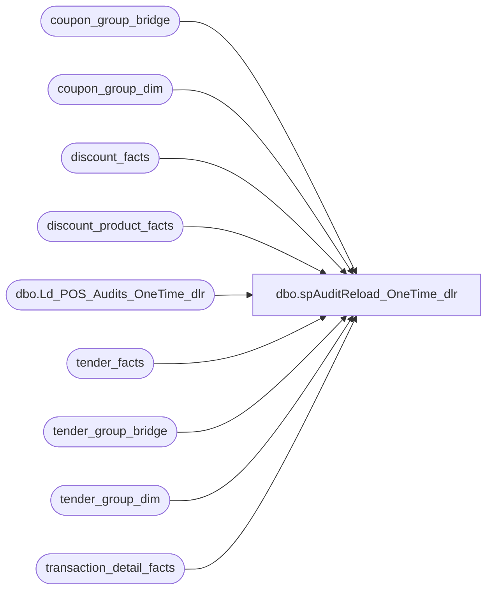

# dbo.spAuditReload_OneTime_dlr

**Database:** dw  
**Server:** papamart  

## Architecture Diagram



## Table Dependencies

| Referenced Table |
|---|
| coupon_group_bridge |
| coupon_group_dim |
| discount_facts |
| discount_product_facts |
| dbo.Ld_POS_Audits_OneTime_dlr |
| tender_facts |
| tender_group_bridge |
| tender_group_dim |
| transaction_detail_facts |

## Stored Procedure Code

```sql
CREATE PROCEDURE [dbo].[spAuditReload_OneTime_dlr]
as
-- =====================================================================================================
-- Name: spAuditReload_OneTime_dlr
--
-- Description:	Pulls transaction data from Sales Audit
--
-- Input:	
--			N/A
--
-- Output: Resultset with the following columns:
--			N/A
--
-- Dependencies: None
--
-- Revision History
--		Name:			Date:			Comments:
---	Gary Murrish		1/2/2012	Changed Tender_Group_dim to tender_facts
--		GaryD			08/18/2010		Current production version.
-- =====================================================================================================

IF (Object_ID('tempdb..#tran_id') IS NOT NULL) DROP TABLE #tran_id
select transaction_id
into #tran_id
from bedrockdb01.auditworks.dbo.Ld_POS_Audits_OneTime_dlr

IF (Object_ID('tempdb..#POSDbsSA_reload') IS NOT NULL) DROP TABLE #POSDbsSA_reload
select distinct ot.transaction_id, tdf.tender_group_key, tdf.coupon_group_key 
into #POSDbsSA_reload
--select distinct tdf.transaction_id
from #tran_id ot
	left join transaction_detail_facts tdf with (nolock)
	on tdf.transaction_id = ot.transaction_id

-- use this to delete the transactions
	delete tender_facts 
	where transaction_id IN (SELECT transaction_id from #POSDbsSA_reload)
	delete tender_group_dim 
	where tender_group_key in (select tender_group_key from #POSDbsSA_reload)

	delete tender_group_bridge 
	where tender_group_key in (select tender_group_key from #POSDbsSA_reload)

	delete coupon_group_dim 
	where coupon_group_key in (select coupon_group_key from #POSDbsSA_reload)

	delete coupon_group_bridge 
	where coupon_group_key in (select coupon_group_key from #POSDbsSA_reload)

	delete transaction_detail_facts
	where transaction_id in (select transaction_id from #POSDbsSA_reload)
	
	delete discount_facts
	where transaction_id in (select transaction_id from #POSDbsSA_reload)

	delete discount_product_facts
	where transaction_id in (select transaction_id from #POSDbsSA_reload)
```

