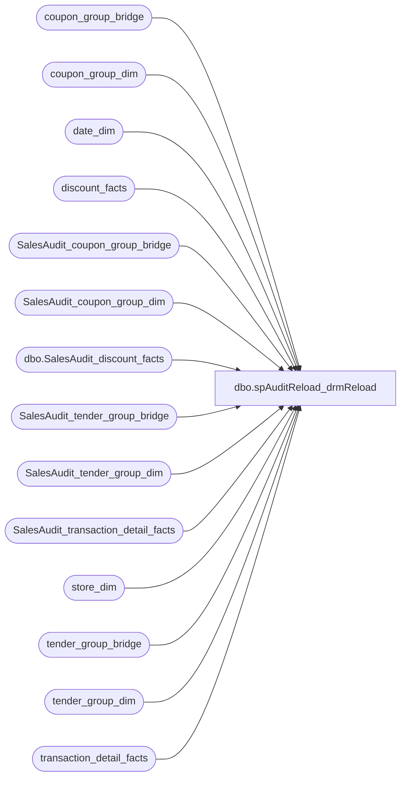

# dbo.spAuditReload_drmReload

**Database:** dw  
**Server:** papamart  

## Architecture Diagram



## Table Dependencies

| Referenced Table |
|---|
| coupon_group_bridge |
| coupon_group_dim |
| date_dim |
| discount_facts |
| SalesAudit_coupon_group_bridge |
| SalesAudit_coupon_group_dim |
| dbo.SalesAudit_discount_facts |
| SalesAudit_tender_group_bridge |
| SalesAudit_tender_group_dim |
| SalesAudit_transaction_detail_facts |
| store_dim |
| tender_group_bridge |
| tender_group_dim |
| transaction_detail_facts |

## Stored Procedure Code

```sql
CREATE               procedure [dbo].[spAuditReload_drmReload]
as
--drop table #tmp_pos_tdf_dels
/*
select tdf_key, tender_group_key, coupon_group_key, tdf.transaction_id
into #tmp_pos_tdf_dels
from transaction_detail_facts tdf
	join tmp_drm_tsf_duperows ld on tdf.transaction_id = ld.transaction_id and tdf.transaction_line_seq >0
*/
--select count(*) from #tmp_pos_tdf_dels
select tdf_key, tender_group_key, coupon_group_key, tdf.transaction_id
into #tmp_pos_tdf_dels
from transaction_detail_facts tdf
	join date_dim dd on tdf.date_key = dd.date_key
	join store_dim sd on tdf.store_key = sd.store_key
where dd.actual_date = '7/2/07' --and sd.store_id in (1,6)

-- select * into tmp_drm_pos_tdf_dels_canada200510 from #tmp_pos_tdf_dels

---build indexes---
create index idx_tmp_tdf on #tmp_pos_tdf_dels(tdf_key)
create index idx_tmp_tender on #tmp_pos_tdf_dels(tender_group_key)
create index idx_tmp_coupon on #tmp_pos_tdf_dels(coupon_group_key)
create index idx_tmp_tran_id on #tmp_pos_tdf_dels(transaction_id)

---log records to SalesAudit tables---
--truncate table SalesAudit_tender_group_dim
INSERT INTO SalesAudit_tender_group_dim(seq_num, tender_group_key, tender_key, tender_amt, ratio, tax, DW_AuditLoadDt)
select seq_num, tender_group_key, tender_key, tender_amt, ratio, tax,getdate() 
from tender_group_dim 
where tender_group_key in (
	select tender_group_key from #tmp_pos_tdf_dels)
--select * from SalesAudit_tender_group_dim

--truncate table SalesAudit_tender_group_bridge
INSERT INTO SalesAudit_tender_group_bridge(tender_group_key, DW_AuditLoadDt)
select tender_group_key, getdate() 
from tender_group_bridge 
where tender_group_key in (
	select tender_group_key from #tmp_pos_tdf_dels)

--truncate table SalesAudit_coupon_group_dim
INSERT INTO SalesAudit_coupon_group_dim(coupon_group_key, coupon_key, seq_num, ratio, Coupon_amount, Units, DW_AuditLoadDt)
select coupon_group_key, coupon_key, seq_num, ratio, Coupon_amount, Units, getdate() 
from coupon_group_dim 
where coupon_group_key in (
	select coupon_group_key from #tmp_pos_tdf_dels)

--truncate table SalesAudit_coupon_group_bridge
INSERT INTO SalesAudit_coupon_group_bridge(coupon_group_key, DW_AuditLoadDt)
select coupon_group_key, getdate() 
from coupon_group_bridge 
where coupon_group_key in (
	select coupon_group_key from #tmp_pos_tdf_dels)

--truncate table SalesAudit_transaction_detail_facts
INSERT INTO SalesAudit_transaction_detail_facts(product_key, sender_customer_key, currency_key, transaction_id, transaction_line_seq, register_num, sender_household_key, channel_key, cashier_id, time_key, distance_to_store_TOP, store_key, promotion_key, unit_gross_amount, date_key, units, animal_key, unit_disc_amount, recipient_household_key, recipient_customer_key, party_y_n, nearest_store_key_TOP, coupon_group_key, tender_group_key, transaction_type_key, line_object_key, party_deposit, non_merch, Party, Loyality, purpose_key, tdf_key, source_key, recipient_address_key, sender_address_key, process_name, process_date, charm_group_key, DW_AuditLoadDt)
select product_key, sender_customer_key, currency_key, transaction_id, transaction_line_seq, register_num, sender_household_key, channel_key, cashier_id, time_key, distance_to_store_TOP, store_key, promotion_key, unit_gross_amount, date_key, units, animal_key, unit_disc_amount, recipient_household_key, recipient_customer_key, party_y_n, nearest_store_key_TOP, coupon_group_key, tender_group_key, transaction_type_key, line_object_key, party_deposit, non_merch, Party, Loyality, purpose_key, tdf_key, source_key, recipient_address_key, sender_address_key, process_name, process_date, charm_group_key, getdate() 
from transaction_detail_facts
where tdf_key in (
	select tdf_key from #tmp_pos_tdf_dels)

--truncate table SalesAudit_discount_facts
INSERT INTO dw.dbo.SalesAudit_discount_facts(transaction_id, store_key, date_key, coupon_key, line_object_key, units, unit_gross_amount, reference_no, process_name, process_date, uid, DW_AuditLoadDt)
select transaction_id, store_key, date_key, coupon_key, line_object_key, units, unit_gross_amount, reference_no, process_name, process_date, uid, getdate() 
from discount_facts
where transaction_id in (
	select transaction_id from #tmp_pos_tdf_dels)

---delete---
delete tender_group_dim 
where tender_group_key in (
	select tender_group_key from #tmp_pos_tdf_dels)

delete tender_group_bridge 
where tender_group_key in (
	select tender_group_key from #tmp_pos_tdf_dels)

delete coupon_group_dim 
where coupon_group_key in (
	select coupon_group_key from #tmp_pos_tdf_dels)

delete coupon_group_bridge 
where coupon_group_key in (
	select coupon_group_key from #tmp_pos_tdf_dels)

delete transaction_detail_facts
where tdf_key in (
	select tdf_key from #tmp_pos_tdf_dels)

delete discount_facts
where transaction_id in (
	select transaction_id from #tmp_pos_tdf_dels)
```

