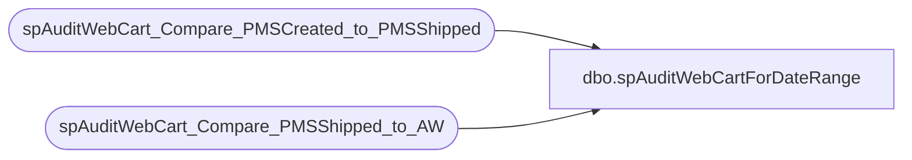

# dbo.spAuditWebCartForDateRange

**Database:** dw  
**Server:** papamart  

## Architecture Diagram



## Table Dependencies

| Referenced Table |
|---|
| spAuditWebCart_Compare_PMSCreated_to_PMSShipped |
| spAuditWebCart_Compare_PMSShipped_to_AW |

## Stored Procedure Code

```sql
create procedure spAuditWebCartForDateRange(
@bDeletePMSCreatedCompareToShippedTempTableWhenFinished bit = 0
,@bReusePMSCreatedCompareToShippedTempTable bit = 1
,@bShowDetails bit = 1
,@FirstDate smalldatetime
,@LastDate smalldatetime
)
as

select 'PMS Created vs Shipped for ' + cast(@FirstDate as varchar(50)) + ' ' + cast(@LastDate as varchar(50))
EXEC spAuditWebCart_Compare_PMSCreated_to_PMSShipped @FirstDate, @LastDate, @bDeletePMSCreatedCompareToShippedTempTableWhenFinished, @bShowDetails

-- declare @bDeletePMSCreatedCompareToShippedTempTableWhenFinished bit,@bReusePMSCreatedCompareToShippedTempTable bit,@bShowDetails bit,@FirstDate smalldatetime,@LastDate smalldatetime
-- select @bDeletePMSCreatedCompareToShippedTempTableWhenFinished = 0
-- ,@bReusePMSCreatedCompareToShippedTempTable = 1
-- ,@bShowDetails = 1
-- ,@FirstDate ='8/1/06'
-- ,@LastDate ='8/1/06'

select 'PMS Shipped vs AW for ' + cast(@FirstDate as varchar(50)) + ' ' + cast(@LastDate as varchar(50))
EXEC spAuditWebCart_Compare_PMSShipped_to_AW @FirstDate, @LastDate, @bReusePMSCreatedCompareToShippedTempTable, @bDeletePMSCreatedCompareToShippedTempTableWhenFinished, @bShowDetails
```

