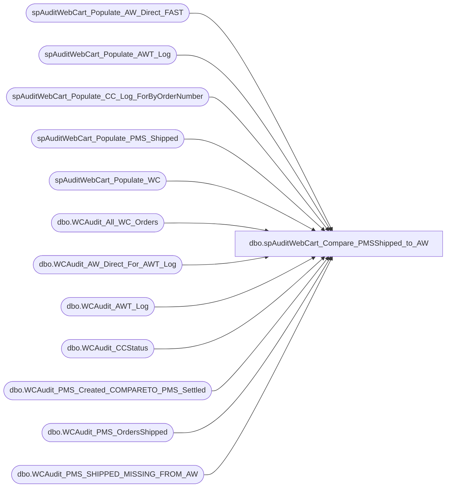

# dbo.spAuditWebCart_Compare_PMSShipped_to_AW

**Database:** dw  
**Server:** papamart  

## Architecture Diagram



## Table Dependencies

| Referenced Table |
|---|
| spAuditWebCart_Populate_AW_Direct_FAST |
| spAuditWebCart_Populate_AWT_Log |
| spAuditWebCart_Populate_CC_Log_ForByOrderNumber |
| spAuditWebCart_Populate_PMS_Shipped |
| spAuditWebCart_Populate_WC |
| dbo.WCAudit_All_WC_Orders |
| dbo.WCAudit_AW_Direct_For_AWT_Log |
| dbo.WCAudit_AWT_Log |
| dbo.WCAudit_CCStatus |
| dbo.WCAudit_PMS_Created_COMPARETO_PMS_Settled |
| dbo.WCAudit_PMS_OrdersShipped |
| dbo.WCAudit_PMS_SHIPPED_MISSING_FROM_AW |

## Stored Procedure Code

```sql
/*
DECLARE @FirstDate datetime, @LastDate datetime, @bReusePMSCreatedCompareToShippedTempTable bit,@bDeleteTempTablesWhenFinished bit
EXEC [spAuditWebCart_Compare_PMSShipped_to_AW] '1/1/06', '1/28/06', 1, 0, 0
*/

CREATE    proc spAuditWebCart_Compare_PMSShipped_to_AW
(@FirstDate datetime
,@LastDate datetime
,@bReusePMSCreatedCompareToShippedTempTable bit
,@bDeleteTempTablesWhenFinished bit
,@bShowDetails bit
)
as
-- DECLARE @FirstDate datetime, @LastDate datetime,@bReusePMSCreatedCompareToShippedTempTable bit,@bDeleteTempTablesWhenFinished bit
-- select @FirstDate ='1/1/06', @LastDate ='1/26/06',@bReusePMSCreatedCompareToShippedTempTable=1,@bDeleteTempTablesWhenFinished=0

declare @rowcount int, @bFilterDates bit

--##### PMS Shipped DATA #############################################################################################
--##### PMS Shipped DATA #############################################################################################
--##### PMS Shipped DATA #############################################################################################

	--##### Create queries.dbo.WCAudit_OrdersShipped ##################################
	IF (Object_ID('queries.dbo.WCAudit_PMS_OrdersShipped') IS NOT NULL) DROP TABLE queries.dbo.WCAudit_PMS_OrdersShipped
	
	if (@bReusePMSCreatedCompareToShippedTempTable = 0) begin
		--##### COLLECT PMS SHIPPED DATA #####################
		SELECT @bFilterDates=1
		EXEC spAuditWebCart_Populate_PMS_Shipped @FirstDate, @LastDate, @bFilterDates
	end
	else begin
		select 	PMS_Created_Site as sSite
			,PMS_Shipped_DateTimeShipped as dDateOrderShipped 
			,PMS_Shipped_OrderNumber as sProductionOrderNumber
			,PMS_Shipped_ProductionOrderID as uProductionOrderId
			,PMS_Shipped_TotalAmount as mProductionOrderTotal 
			,PMS_Shipped_ItemAmount as mItemAmount 
			,PMS_Shipped_ShippingAmount as mShippingAmount 
			,PMS_Created_ItemCount as iItemCount
			,PMS_Shipped_ProductionStatusCode as sProductionStatusCode
	 	into queries.dbo.WCAudit_PMS_OrdersShipped 
	 	from queries.dbo.WCAudit_PMS_Created_COMPARETO_PMS_Settled
	end	

	IF (Object_ID('queries.dbo.WCAudit_OrdersShipped') IS NOT NULL) DROP TABLE queries.dbo.WCAudit_OrdersShipped
	--select order_number as OrderNumber into queries.dbo.WCAudit_OrdersShipped from queries.dbo.WCAudit_WC_OrdersShipped
	select sProductionOrderNumber as OrderNumber into queries.dbo.WCAudit_OrdersShipped from queries.dbo.WCAudit_PMS_OrdersShipped


--##### AW DATA #############################################################################################
--##### AW DATA #############################################################################################
--##### AW DATA #############################################################################################

	--##### COLLECT AW DATA #####################
	EXEC [spAuditWebCart_Populate_AW_Direct_FAST] @FirstDate, @LastDate


--PART 2: ANALYSIS


--##### PMS SETTLED COMPARE TO AW Direct ##############################################################################
--##### PMS SETTLED COMPARE TO AW Direct ##############################################################################
--##### PMS SETTLED COMPARE TO AW Direct ##############################################################################
	IF (Object_ID('tempdb.dbo.#PMS_Shipped_COMPARETO_AW_Direct') IS NOT NULL) DROP TABLE dbo.#PMS_Shipped_COMPARETO_AW_Direct
	
	select --'PMS SETTLED COMPARE TO AW Direct',
		pms.sProductionOrderNumber as PMS_Shipped_OrderNumber
		,mItemAmount as PMS_ItemAmount
		,mShippingAmount as PMS_ShippingAmount
		,mProductionOrderTotal as PMS_TotalAmount
		,AW_line_void_flag
		,AW_transaction_void_flag
		,AW_OrderNumber 
		,AW_CCAmount 
		,AW_GCAmount 
		,AW_CCAmount + AW_GCAmount as AW_TotalAmount
		,AW_ReqToSettleDate
	into #PMS_Shipped_COMPARETO_AW_Direct
	from queries.dbo.WCAudit_PMS_OrdersShipped pms 
		left join queries.dbo.WCAudit_AW_Direct_For_AWT_Log aw 
			on pms.sProductionOrderNumber=aw.AW_OrderNumber
and (mProductionOrderTotal)=(AW_CCAmount + AW_GCAmount)
	order by aw.AW_OrderNumber, pms.sProductionOrderNumber

--select * from #PMS_Shipped_COMPARETO_AW_Direct

	/* ##### look for dup PMS orders - due to multi AW trans on an order ###############
		--### group by orderNumber because multi records if multi AW trans for a PMS orderNumber

		drop table #test

		select PMS_Shipped_OrderNumber, sum(PMS_TotalAmount) PMS_TotalAmount, count(*) trans
		into #test
		 from #PMS_Shipped_COMPARETO_AW_Direct where PMS_Shipped_OrderNumber in('2488174','2484759','2484716')
		group by PMS_Shipped_OrderNumber
		having count(*) > 1
		order by count(*) desc
		
		select *
		 from #PMS_Shipped_COMPARETO_AW_Direct 
		where PMS_Shipped_OrderNumber in (select PMS_Shipped_OrderNumber from #test)
		
		select * from #test
		
		drop table #test

		select AW_ReqToSettleDate, PMS_Shipped_OrderNumber, PMS_TotalAmount, AW_TotalAmount
		 from #PMS_Shipped_COMPARETO_AW_Direct where PMS_Shipped_OrderNumber in('2488174','2484759','2484716')
		order by PMS_Shipped_OrderNumber, AW_ReqToSettleDate
 
		select PMS_Shipped_OrderNumber, min(PMS_TotalAmount), sum(PMS_TotalAmount), sum(AW_TotalAmount)
		 from #PMS_Shipped_COMPARETO_AW_Direct where PMS_Shipped_OrderNumber in('2488174','2484759','2484716')
		group by PMS_Shipped_OrderNumber
	*/
	
--##### ANALYZE SUMMARY ##################################################################################
--##### ANALYZE SUMMARY ##################################################################################
--##### ANALYZE SUMMARY ##################################################################################

	select count(*) as 'All_PMS_Shipped_Count'
		,sum(mProductionOrderTotal) as 'All_PMS_Shipped_TotalAmount'
	from queries.dbo.WCAudit_PMS_OrdersShipped
	Where uProductionOrderId is NOT null


	select count(*) 'PMS_Shipped_In_AW_Count'
		,sum(PMS_TotalAmount) as 'PMS_Shipped_In_AW_PMSTotalAmount'
		--,sum(AW_TotalAmount) as 'PMS_Shipped_In_AW_AWTotalAmount'
		,AW_line_void_flag
		,AW_transaction_void_flag
	from #PMS_Shipped_COMPARETO_AW_Direct
	where AW_OrderNumber IS NOT NULL
	group by AW_line_void_flag
		,AW_transaction_void_flag

	select 'AW Direct for PMS SETTLED Orders'
			,sum(AW_CCAmount + AW_GCAmount) as AW_TotalAmount
			,AW_line_void_flag
			,AW_transaction_void_flag
	from queries.dbo.WCAudit_AW_Direct_For_AWT_Log aw 
	where AW_OrderNumber in (select PMS_Shipped_OrderNumber from #PMS_Shipped_COMPARETO_AW_Direct)
	--  	and AW_ReqToSettleDate >= '1/1/06' 
	--  	and AW_ReqToSettleDate < '1/29/06'
	group by AW_line_void_flag,AW_transaction_void_flag

--########################################################################################
--####################### PMS SHIPPED MISSING FROM AW ####################################
--#####	 USE TO INVESTIGATE PROBLEMS
--########################################################################################
	IF (Object_ID('queries.dbo.WCAudit_PMS_SHIPPED_MISSING_FROM_AW') IS NOT NULL) DROP TABLE queries.dbo.WCAudit_PMS_SHIPPED_MISSING_FROM_AW
	
	select --'DETAILS: PMS Orders Shipped NOT in AW',
		PMS_Shipped_OrderNumber
		,PMS_ItemAmount
		,PMS_ShippingAmount
		,PMS_TotalAmount
	into queries.dbo.WCAudit_PMS_SHIPPED_MISSING_FROM_AW
	from #PMS_Shipped_COMPARETO_AW_Direct
	where AW_OrderNumber IS NULL

	
	
--##### Analysis: PMS SHIPPED MISSING FROM AW #######################################################################
--##### Analysis: PMS SHIPPED MISSING FROM AW #######################################################################
--##### Analysis: PMS SHIPPED MISSING FROM AW #######################################################################
	
	--##### Build queries.dbo.WCAudit_All_WC_Orders ####################################
	EXEC spAuditWebCart_Populate_WC
	
	--##### Build #WebCartStatusOf_PMSShipped_NotIn_AW ####################################
	IF (Object_ID('tempdb.dbo.#WebCartStatusOf_PMSShipped_NotIn_AW') IS NOT NULL) DROP TABLE dbo.#WebCartStatusOf_PMSShipped_NotIn_AW
	
	select wc.SiteCode
		,wc.order_number
		,wc.order_create_date
		,wc.SendToUDADaily
		,wc.NeedsCreditAuth
		,wc.SendtoSettlement
		,wc.DateSentToSettlement
		,wc.SendtoSalesExport
		,wc.DateSentToSalesExport
		,wc.total_lineitems as WC_total_lineitems
		,wc.saved_cy_oadjust_subtotal as WC_subtotal
		,wc.saved_cy_total_total as WC_total
		,pms.PMS_TotalAmount
	into #WebCartStatusOf_PMSShipped_NotIn_AW
	from queries.dbo.WCAudit_All_WC_Orders wc
		JOIN queries.dbo.WCAudit_PMS_SHIPPED_MISSING_FROM_AW pms
		ON wc.order_number = pms.PMS_Shipped_OrderNumber
	order by SendToUDADaily desc,sendtosalesexport, sendtosettlement

	select count(*) as 'PMS_Shipped_NOT_In_AW_Count'
		,sum(PMS_TotalAmount) as 'PMS_Shipped_NOT_In_AW_PMSTotalAmount'
		,sum(WC_total) as 'PMS_Shipped_NOT_In_AW_WCTotalAmount'
		--,sum(WC_total_lineitems) as WC_total_lineitems
	from #WebCartStatusOf_PMSShipped_NotIn_AW

	--##### SUMMARY of orders not in AW #####################################################
	select case when SendToUDADaily IN (1,2) then 'UDA (House order)'
		when SendToUDADaily=3 AND SendToSettlement IN (0,1) AND SendToSalesExport=0 then 'Settle Pending'
		when SendToUDADaily=3 AND SendToSettlement=2 AND SendToSalesExport=1 then 'Export Pending'
		when SendToUDADaily=3 AND SendToSettlement=2 AND SendToSalesExport=2 then 'GC for return or Not Exported'
		else 'unknown status'
		end as  'PMS_Shipped_Orders_NOT_in_AW'
		,count(*) as orderCount
		,sum(PMS_TotalAmount) as PMS_total
		--,SUM(WC_total) as WC_total
		,SendToUDADaily
		,SendToSettlement
		,SendToSalesExport 
		--,SUM(WC_total_lineitems) as WC_total_lineitems
		--,SUM(WC_subtotal) as WC_subtotal
	from #WebCartStatusOf_PMSShipped_NotIn_AW
	group by SendToUDADaily, sendtosettlement, sendtosalesexport


if(@bShowDetails = 1) begin
--##### A: unsettled orders: PMS SHIPPED MISSING FROM AW ##################################################################
--##### A: unsettled orders: PMS SHIPPED MISSING FROM AW ##################################################################
--##### A: unsettled orders: PMS SHIPPED MISSING FROM AW ##################################################################

	--##### GET WC Orders NOT SETTLED ############################################################
	 select 'Auth or Settlement Pending DETAILS'
		,SiteCode
	 	,order_number
	 	,order_create_date
	 	,NeedsCreditAuth
	 	,SendtoSettlement
	 	,DateSentToSettlement
	 	,SendtoSalesExport
	 	,DateSentToSalesExport
	 	--,WC_total_lineitems
	 	--,WC_subtotal
	 	,WC_total
		,PMS_TotalAmount as PMS_total
	 	,SendToUDADaily
	 from #WebCartStatusOf_PMSShipped_NotIn_AW
	where SendToUDADaily=3 
			AND SendToSettlement in (0,1) 
			AND SendToSalesExport=0 


	
	--START: GET CC Log info on unsettled orders #######################################
	--##################################################################################
	DECLARE @SJ_StartDate datetime
	
	select @SJ_StartDate=min(order_create_date) 
	from #WebCartStatusOf_PMSShipped_NotIn_AW 
	where SendToUDADaily=3 AND SendToSettlement=1

	--### Create queries.dbo.WCAudit_CCStatus
	EXEC spAuditWebCart_Populate_CC_Log_ForByOrderNumber @SJ_StartDate

	--END: GET CC Log info on unsettled orders #########################################
	--##################################################################################

	--### Get Unsettled CC Details
	select 'Settle Pending CC DETAILS'
		,* 
	from queries.dbo.WCAudit_CCStatus 
	--where Original_OrderNumber =2498538
	where Original_OrderNumber in 
		(select order_number 
		 from #WebCartStatusOf_PMSShipped_NotIn_AW 
		 where SendToUDADaily=3 AND SendToSettlement=1 
		)
	order by SJ_OrderNumber, CC_Status
	
	--### Clean up
	IF (Object_ID('queries.dbo.WCAudit_CCStatus') IS NOT NULL) DROP TABLE queries.dbo.WCAudit_CCStatus

--END A: unsettled orders: PMS SHIPPED MISSING FROM AW ##################################################################
--END A: unsettled orders: PMS SHIPPED MISSING FROM AW ##################################################################
--END A: unsettled orders: PMS SHIPPED MISSING FROM AW ##################################################################


--##### B: Settled orders: PMS SHIPPED MISSING FROM AW ##################################################################
--##### B: Settled orders: PMS SHIPPED MISSING FROM AW ##################################################################
--##### B: Settled orders: PMS SHIPPED MISSING FROM AW ##################################################################


--##### What WC orders are qued for export? ##########################
--##### What WC orders are qued for export? ##########################
	select 'Export Pending DETAILS'
		,SiteCode
		,order_Status_Code
		,order_number
		,order_create_date
		,SendToUDADaily
		,NeedsCreditAuth
		,SendToSettlement
		,DateSentToSettlement
		,SendToSalesExport
		,DateSentToSalesExport
	from queries.dbo.WCAudit_All_WC_Orders
	where order_number in (select order_number from #WebCartStatusOf_PMSShipped_NotIn_AW WHERE SendToUDADaily=3 AND SendToSettlement=2 AND SendToSalesExport=1)
	order by SiteCode
		,order_Status_Code
		,SendToUDADaily
		,NeedsCreditAuth
		,SendToSettlement
		,DateSentToSettlement


--##### What WC orders are flagged as exported? ######################
--##### What WC orders are flagged as exported? ######################

	--START: GET AWT Log data ####################################
	--############################################################
	IF (Object_ID('queries.dbo.WCAudit_AWT_Log') IS NOT NULL) DROP TABLE queries.dbo.WCAudit_AWT_Log

	--### Create queries.dbo.WCAudit_AWT_Log
	EXEC spAuditWebCart_Populate_AWT_Log '1/1/1997', '1/1/2099', 0
	
	
	--##### Where Exported, what is batch and sent flags? #########################################
	IF (Object_ID('tempdb.dbo.#AWT_Log_OfMissingPMSShippedThatAreWCExported') IS NOT NULL) DROP TABLE dbo.#AWT_Log_OfMissingPMSShippedThatAreWCExported
	
	select *
	INTO #AWT_Log_OfMissingPMSShippedThatAreWCExported
	from #WebCartStatusOf_PMSShipped_NotIn_AW notAW 
		LEFT JOIN queries.dbo.WCAudit_AWT_Log awl 
		ON awl.Original_OrderNumber = notAW.order_number
	where notAW.SendtoSalesExport=2 AND notAW.SendToUDADaily=3 AND notAW.SendToSettlement=2
	--END: GET AWT Log data ######################################
	--############################################################
	
--START MOST USEFUL WHEN SOMETHING MISSING
	select 'Failed move? THE FOLLOWING IS: Unexported w\batch - BY BATCH.'

	select AWT_Date, sBatchID, Sum(mAmount) as TotalAmount 
	from  #AWT_Log_OfMissingPMSShippedThatAreWCExported
	where iAWTransID IS NOT NULL and bSentToAW=0
	group by AWT_Date, sBatchID
	order by AWT_Date, sBatchID
--END MOST USEFUL WHEN SOMETHING MISSING

	select 'Failed Move? THE FOLLOWING IS: Unexported w\batch - BY BATCH - BY SITE. '

	select SiteCode, AWT_Date, sBatchID, Sum(mAmount) as TotalAmount 
	from  #AWT_Log_OfMissingPMSShippedThatAreWCExported
	where iAWTransID IS NOT NULL and bSentToAW=0
	group by SiteCode, AWT_Date, sBatchID
	order by SiteCode, AWT_Date, sBatchID

	select 'Unexported w\batch - DETAILS. Failed Move?'
		,* 
	from  #AWT_Log_OfMissingPMSShippedThatAreWCExported
	where iAWTransID IS NOT NULL
	order by SiteCode, sBatchID

	select 'Unexported NO batch - DETAILS'
		,* 
	from  #AWT_Log_OfMissingPMSShippedThatAreWCExported
	where iAWTransID IS NULL
	order by SiteCode

--END B: Settled orders: PMS SHIPPED MISSING FROM AW ##################################################################
--END B: Settled orders: PMS SHIPPED MISSING FROM AW ##################################################################
--END B: Settled orders: PMS SHIPPED MISSING FROM AW ##################################################################
end --@bShowDetails

--IF (Object_ID('tempdb.dbo.#AWT_Log_OfMissingPMSShippedThatAreWCExported') IS NOT NULL) DROP TABLE dbo.#AWT_Log_OfMissingPMSShippedThatAreWCExported
IF (Object_ID('tempdb.dbo.#WebCartStatusOf_PMSShipped_NotIn_AW') IS NOT NULL) DROP TABLE dbo.#WebCartStatusOf_PMSShipped_NotIn_AW
--END Analysis: PMS SHIPPED MISSING FROM AW #######################################################################


--##### CLEAN UP ####################################################################################
--##### CLEAN UP ####################################################################################
--##### CLEAN UP ####################################################################################
if(@bDeleteTempTablesWhenFinished = 1) begin
	IF (Object_ID('queries.dbo.WCAudit_All_WC_Orders') IS NOT NULL) DROP TABLE queries.dbo.WCAudit_All_WC_Orders
	IF (Object_ID('queries.dbo.WCAudit_AWT_Log') IS NOT NULL) DROP TABLE queries.dbo.WCAudit_AWT_Log
	IF (Object_ID('queries.dbo.WCAudit_OrdersShipped') IS NOT NULL) DROP TABLE queries.dbo.WCAudit_OrdersShipped
	IF (Object_ID('queries.dbo.WCAudit_PMS_OrdersShipped') IS NOT NULL) DROP TABLE queries.dbo.WCAudit_PMS_OrdersShipped
	IF (Object_ID('queries.dbo.WCAudit_PMS_SHIPPED_MISSING_FROM_AW') IS NOT NULL) DROP TABLE queries.dbo.WCAudit_PMS_SHIPPED_MISSING_FROM_AW
	IF (Object_ID('queries.dbo.WCAudit_AW_Direct_For_AWT_Log') IS NOT NULL) DROP TABLE queries.dbo.WCAudit_AW_Direct_For_AWT_Log
	IF (Object_ID('queries.dbo.WCAudit_AW_Direct_For_CC_Log') IS NOT NULL) DROP TABLE queries.dbo.WCAudit_AW_Direct_For_CC_Log
	IF (Object_ID('queries.dbo.WCAudit_PMS_Created_COMPARETO_PMS_Settled') IS NOT NULL) DROP TABLE queries.dbo.WCAudit_PMS_Created_COMPARETO_PMS_Settled
end
```

