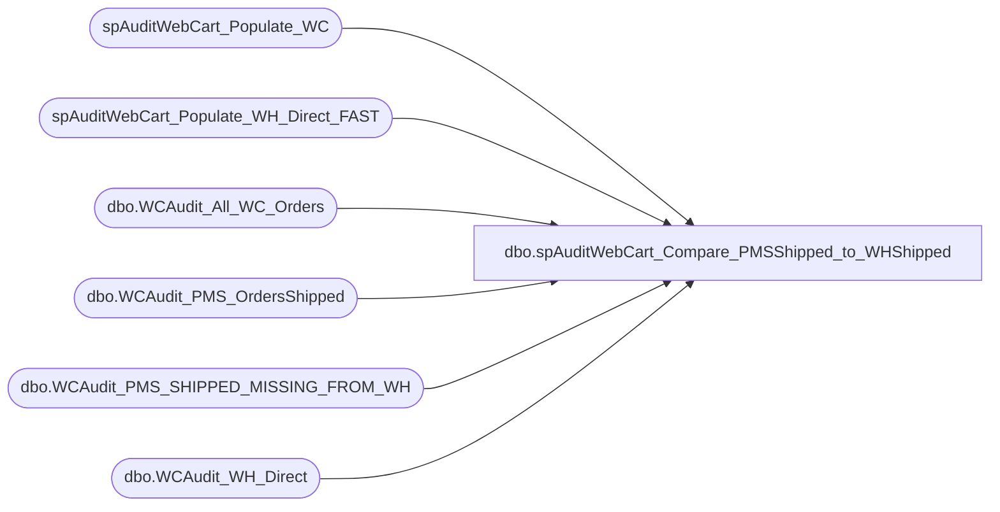

# dbo.spAuditWebCart_Compare_PMSShipped_to_WHShipped

**Database:** dw  
**Server:** papamart  

## Architecture Diagram



## Table Dependencies

| Referenced Table |
|---|
| spAuditWebCart_Populate_WC |
| spAuditWebCart_Populate_WH_Direct_FAST |
| dbo.WCAudit_All_WC_Orders |
| dbo.WCAudit_PMS_OrdersShipped |
| dbo.WCAudit_PMS_SHIPPED_MISSING_FROM_WH |
| dbo.WCAudit_WH_Direct |

## Stored Procedure Code

```sql
/*
DECLARE @FirstDate datetime, @LastDate datetime, @bReusePMSCreatedCompareToShippedTempTable bit,@bDeleteTempTablesWhenFinished bit
EXEC [spAuditWebCart_Compare_PMSShipped_to_WHShipped] '5/31/07', '6/1/07', 1, 0, 1
*/

CREATE    proc spAuditWebCart_Compare_PMSShipped_to_WHShipped
(@FirstDate datetime
,@LastDate datetime
,@bReusePMSCreatedCompareToShippedTempTable bit
,@bDeleteTempTablesWhenFinished bit
,@bShowDetails bit
)
as
-- DECLARE @FirstDate datetime, @LastDate datetime,@bReusePMSCreatedCompareToShippedTempTable bit,@bDeleteTempTablesWhenFinished bit
-- select @FirstDate ='1/1/06', @LastDate ='1/26/06',@bReusePMSCreatedCompareToShippedTempTable=1,@bDeleteTempTablesWhenFinished=0

declare @rowcount int, @bFilterDates bit

--##### PMS Shipped DATA #############################################################################################
--##### PMS Shipped DATA #############################################################################################
--##### PMS Shipped DATA #############################################################################################

	--##### Create queries.dbo.WCAudit_OrdersShipped ##################################
-- 	IF (Object_ID('queries.dbo.WCAudit_PMS_OrdersShipped') IS NOT NULL) DROP TABLE queries.dbo.WCAudit_PMS_OrdersShipped
-- 	
-- 	if (@bReusePMSCreatedCompareToShippedTempTable = 0) begin
-- 		--##### COLLECT PMS SHIPPED DATA #####################
-- 		SELECT @bFilterDates=1
-- 		EXEC spAuditWebCart_Populate_PMS_Shipped @FirstDate, @LastDate, @bFilterDates
-- 	end
-- 	else begin
-- 		select 	PMS_Created_Site as sSite
-- 			,PMS_Shipped_DateTimeShipped as dDateOrderShipped 
-- 			,PMS_Shipped_OrderNumber as sProductionOrderNumber
-- 			,PMS_Shipped_ProductionOrderID as uProductionOrderId
-- 			,PMS_Shipped_TotalAmount as mProductionOrderTotal 
-- 			,PMS_Shipped_ItemAmount as mItemAmount 
-- 			,PMS_Shipped_ShippingAmount as mShippingAmount 
-- 			,PMS_Created_ItemCount as iItemCount
-- 			,PMS_Shipped_ProductionStatusCode as sProductionStatusCode
-- 	 	into queries.dbo.WCAudit_PMS_OrdersShipped 
-- 	 	from queries.dbo.WCAudit_PMS_Created_COMPARETO_PMS_Settled
-- 	end	
-- 
-- 	IF (Object_ID('queries.dbo.WCAudit_OrdersShipped') IS NOT NULL) DROP TABLE queries.dbo.WCAudit_OrdersShipped
-- 	--select order_number as OrderNumber into queries.dbo.WCAudit_OrdersShipped from queries.dbo.WCAudit_WC_OrdersShipped
-- 	select sProductionOrderNumber as OrderNumber into queries.dbo.WCAudit_OrdersShipped from queries.dbo.WCAudit_PMS_OrdersShipped


--##### WH DATA #############################################################################################
--##### WH DATA #############################################################################################
--##### WH DATA #############################################################################################

	--##### COLLECT AW DATA #####################
	EXEC [spAuditWebCart_Populate_WH_Direct_FAST] 


--PART 2: ANALYSIS


--##### PMS SETTLED COMPARE TO WH Direct ##############################################################################
--##### PMS SETTLED COMPARE TO WH Direct ##############################################################################
--##### PMS SETTLED COMPARE TO WH Direct ##############################################################################
	IF (Object_ID('tempdb.dbo.#PMS_Shipped_COMPARETO_WH_Direct') IS NOT NULL) DROP TABLE dbo.#PMS_Shipped_COMPARETO_WH_Direct
	
	select --'PMS SETTLED COMPARE TO WH Direct',
		pms.sProductionOrderNumber as PMS_Shipped_OrderNumber
		,mItemAmount as PMS_ItemAmount
		,mShippingAmount as PMS_ShippingAmount
		,mProductionOrderTotal as PMS_TotalAmount
		,WH_Order_Number 
	into #PMS_Shipped_COMPARETO_WH_Direct
	from queries.dbo.WCAudit_PMS_OrdersShipped pms 
	left join queries.dbo.WCAudit_WH_Direct wh on pms.sProductionOrderNumber=wh.WH_Order_Number
	order by wh.WH_Order_Number, pms.sProductionOrderNumber

	
--##### ANALYZE SUMMARY ##################################################################################
--##### ANALYZE SUMMARY ##################################################################################
--##### ANALYZE SUMMARY ##################################################################################

	select count(*) as 'All_PMS_Shipped_Count'
		,sum(mProductionOrderTotal) as 'All_PMS_Shipped_TotalAmount'
	from queries.dbo.WCAudit_PMS_OrdersShipped
	Where uProductionOrderId is NOT null


	select count(*) 'PMS_Shipped_In_WH_Count'
		,sum(PMS_TotalAmount) as 'PMS_Shipped_In_WH_PMSTotalAmount'
	from #PMS_Shipped_COMPARETO_WH_Direct
	where WH_Order_Number IS NOT NULL
	group by WH_Order_Number

-- 	select count(*) as 'WH Direct for PMS SETTLED Orders'
-- 	from queries.dbo.WCAudit_WH_Direct wh 
-- 	where WH_Order_Number in (select PMS_Shipped_OrderNumber from #PMS_Shipped_COMPARETO_WH_Direct)
-- 	group by WH_Order_Number

--########################################################################################
--####################### PMS SHIPPED MISSING FROM WH ####################################
--#####	 USE TO INVESTIGATE PROBLEMS
--########################################################################################
	IF (Object_ID('queries.dbo.WCAudit_PMS_SHIPPED_MISSING_FROM_WH') IS NOT NULL) DROP TABLE queries.dbo.WCAudit_PMS_SHIPPED_MISSING_FROM_WH
	
	select --'DETAILS: PMS Orders Shipped NOT in WH',
		PMS_Shipped_OrderNumber
		,PMS_ItemAmount
		,PMS_ShippingAmount
		,PMS_TotalAmount
	into queries.dbo.WCAudit_PMS_SHIPPED_MISSING_FROM_WH
	from #PMS_Shipped_COMPARETO_WH_Direct
	where WH_Order_Number IS NULL

	
	
--##### Analysis: PMS SHIPPED MISSING FROM WH #######################################################################
--##### Analysis: PMS SHIPPED MISSING FROM WH #######################################################################
--##### Analysis: PMS SHIPPED MISSING FROM WH #######################################################################
	
	--##### Build queries.dbo.WCAudit_All_WC_Orders ####################################
	EXEC spAuditWebCart_Populate_WC
	
	--##### Build #WebCartStatusOf_PMSShipped_NotIn_AW ####################################
	IF (Object_ID('tempdb.dbo.#WebCartStatusOf_PMSShipped_NotIn_WH') IS NOT NULL) DROP TABLE dbo.#WebCartStatusOf_PMSShipped_NotIn_WH
	
	select wc.SiteCode
		,wc.order_number
		,wc.order_create_date
		,wc.SendToUDADaily
		,wc.NeedsCreditAuth
		,wc.SendtoSettlement
		,wc.DateSentToSettlement
		,wc.SendtoSalesExport
		,wc.DateSentToSalesExport
		,wc.total_lineitems as WC_total_lineitems
		,wc.saved_cy_oadjust_subtotal as WC_subtotal
		,wc.saved_cy_total_total as WC_total
		,pms.PMS_TotalAmount
	into #WebCartStatusOf_PMSShipped_NotIn_WH
	from queries.dbo.WCAudit_All_WC_Orders wc
		JOIN queries.dbo.WCAudit_PMS_SHIPPED_MISSING_FROM_WH pms
		ON wc.order_number = pms.PMS_Shipped_OrderNumber
	order by SendToUDADaily desc,sendtosalesexport, sendtosettlement

	select count(*) as 'PMS_Shipped_NOT_In_WH_Count'
		,sum(PMS_TotalAmount) as 'PMS_Shipped_NOT_In_WH_PMSTotalAmount'
		,sum(WC_total) as 'PMS_Shipped_NOT_In_WH_WCTotalAmount'
		--,sum(WC_total_lineitems) as WC_total_lineitems
	from #WebCartStatusOf_PMSShipped_NotIn_WH

	--##### SUMMARY of orders not in AW #####################################################
	select case when SendToUDADaily IN (1,2) then 'UDA (House order)'
		when SendToUDADaily=3 AND SendToSettlement IN (0,1) AND SendToSalesExport=0 then 'Settle Pending'
		when SendToUDADaily=3 AND SendToSettlement=2 AND SendToSalesExport=1 then 'Export Pending'
		when SendToUDADaily=3 AND SendToSettlement=2 AND SendToSalesExport=2 then 'GC for return or Not Exported'
		else 'unknown status'
		end as  'PMS_Shipped_Orders_NOT_in_WH'
		,count(*) as orderCount
		,sum(PMS_TotalAmount) as PMS_total
		--,SUM(WC_total) as WC_total
		,SendToUDADaily
		,SendToSettlement
		,SendToSalesExport 
		--,SUM(WC_total_lineitems) as WC_total_lineitems
		--,SUM(WC_subtotal) as WC_subtotal
	from #WebCartStatusOf_PMSShipped_NotIn_WH
	group by SendToUDADaily, sendtosettlement, sendtosalesexport


IF (Object_ID('tempdb.dbo.#WebCartStatusOf_PMSShipped_NotIn_WH') IS NOT NULL) DROP TABLE dbo.#WebCartStatusOf_PMSShipped_NotIn_WH
--END Analysis: PMS SHIPPED MISSING FROM AW #######################################################################


--##### CLEAN UP ####################################################################################
--##### CLEAN UP ####################################################################################
--##### CLEAN UP ####################################################################################
-- if(@bDeleteTempTablesWhenFinished = 1) begin
-- 	IF (Object_ID('queries.dbo.WCAudit_All_WC_Orders') IS NOT NULL) DROP TABLE queries.dbo.WCAudit_All_WC_Orders
-- 	IF (Object_ID('queries.dbo.WCAudit_OrdersShipped') IS NOT NULL) DROP TABLE queries.dbo.WCAudit_OrdersShipped
-- 	IF (Object_ID('queries.dbo.WCAudit_PMS_OrdersShipped') IS NOT NULL) DROP TABLE queries.dbo.WCAudit_PMS_OrdersShipped
-- 	IF (Object_ID('queries.dbo.WCAudit_PMS_SHIPPED_MISSING_FROM_WH') IS NOT NULL) DROP TABLE queries.dbo.WCAudit_PMS_SHIPPED_MISSING_FROM_WH
-- 	IF (Object_ID('queries.dbo.WCAudit_WH_Direct') IS NOT NULL) DROP TABLE queries.dbo.WCAudit_WH_Direct
-- end
```

