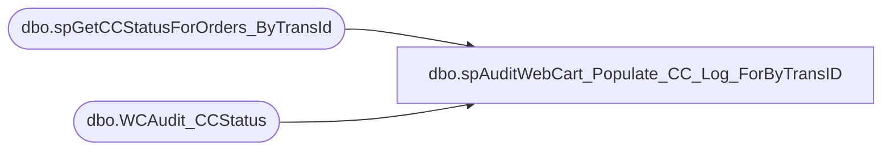

# dbo.spAuditWebCart_Populate_CC_Log_ForByTransID

**Database:** dw  
**Server:** papamart  

## Architecture Diagram



## Table Dependencies

| Referenced Table |
|---|
| dbo.spGetCCStatusForOrders_ByTransId |
| dbo.WCAudit_CCStatus |

## Stored Procedure Code

```sql
--Papamart.dw

CREATE     PROC spAuditWebCart_Populate_CC_Log_ForByTransID
(@SJ_StartDate datetime)
AS


IF (Object_ID('queries.dbo.WCAudit_CCStatus') IS NOT NULL) DROP TABLE queries.dbo.WCAudit_CCStatus

CREATE TABLE queries.dbo.WCAudit_CCStatus
	(CC_Status varchar(100) NULL
	,Original_OrderNumber varchar(50) NULL
	,SJ_OrderNumber varchar(50) NULL
	,sSerialNumber varchar(50) NULL
	,Amount_Total money NULL
	,Trans_Count int NULL
	--,CC_SettlementRequest_Date datetime NULL
	)
create index ix_CCStatus_Original_OrderNumber on queries.dbo.WCAudit_CCStatus(Original_OrderNumber)

INSERT queries.dbo.WCAudit_CCStatus(
	CC_Status
	,Original_OrderNumber
	,SJ_OrderNumber
	,sSerialNumber
	,Amount_Total
	,Trans_Count
	--,CC_SettlementRequest_Date
	)
exec BearWebDb.WebCart_Commerce.dbo.spGetCCStatusForOrders_ByTransId @SJ_StartDate
```

