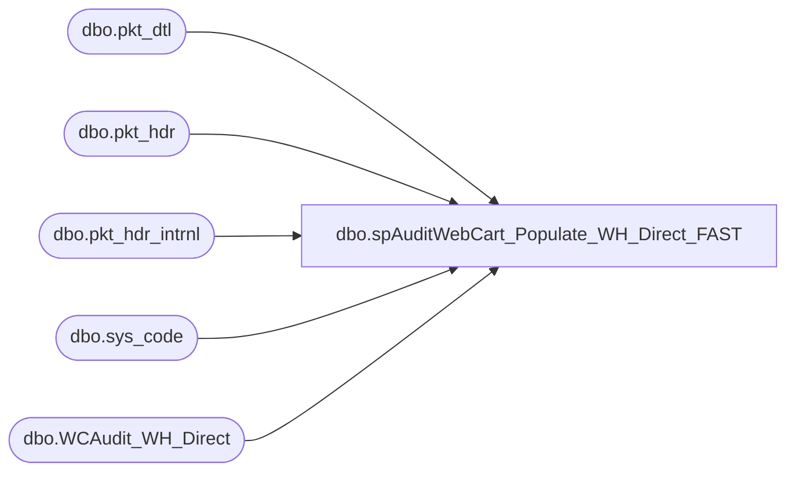

# dbo.spAuditWebCart_Populate_WH_Direct_FAST

**Database:** dw  
**Server:** papamart  

## Architecture Diagram



## Table Dependencies

| Referenced Table |
|---|
| dbo.pkt_dtl |
| dbo.pkt_hdr |
| dbo.pkt_hdr_intrnl |
| dbo.sys_code |
| dbo.WCAudit_WH_Direct |

## Stored Procedure Code

```sql
--exec spAuditWebCart_Populate_WH_Direct_FAST

CREATE     PROCEDURE spAuditWebCart_Populate_WH_Direct_FAST
as

-- CREATE TABLE =================================================================================
IF (Object_ID('queries.dbo.WCAudit_WH_Direct') IS NOT NULL) DROP TABLE queries.dbo.WCAudit_WH_Direct

create table queries.dbo.WCAudit_WH_Direct(
	WH_pick_ticket varchar(50)
	, WH_order_number varchar(50)
	, WH_status varchar(50)
	, WH_statusCode int NULL
	, WH_released_date datetime NULL
	, WH_shipped_date datetime NULL
	, WH_days_release_to_ship int NULL
)
create index ix_WHDirect_order_number on queries.dbo.WCAudit_WH_Direct(WH_order_number)


--##### CURRENT WH TABLE DATA #############################################################################

-- INSERT queries.dbo.WCAudit_WH_Direct(
-- 	WH_pick_ticket
-- 	, WH_order_number
-- 	, WH_status
--	, WH_statusCode
-- 	, WH_released_date
-- 	, WH_shipped_date
-- 	, WH_days_release_to_ship
-- )
-- SELECT pkt_ctrl_nbr as WH_pick_ticket
-- 	, left(pkt_ctrl_nbr, 7) as WH_order_number
-- 	, 'NA' as WH_status
--	, proc_stat_code
-- 	, convert(varchar(25), PKT_PRT_DATE, 101) as WH_release_date
-- 	, convert(varchar(25), create_date_time, 101) as WH_shipped_date
-- 	, DATEDIFF(day, PKT_PRT_DATE, create_date_time) as WH_days_release_to_ship
-- 	--,PKT_PRT_DATE as release_date?
-- 	--,SHIP_DATE_TIME as shipp_date?
-- 	--,PROC_DATE_TIME as PROC_date?
-- 	--,create_date_time?
-- from WMDB01.WMPROD.dbo.outpt_pkt_hdr --(nolock)
-- WHERE pkt_ctrl_nbr in (select pkt_ctrl_nbr from WMDB01.WMPROD.dbo.pkt_dtl where carton_type = 'WEB')
-- 	and proc_stat_code = 90 --status=invoiced/shipped
-- 	and pkt_ctrl_nbr collate SQL_Latin1_General_CP1_CI_AS 
-- 		IN (select sWHPickTicket from queries.dbo.WCAudit_PMS_OrdersReleasedToWH)
-- 

-- INSERT queries.dbo.WCAudit_WH_Direct(
-- 	WH_pick_ticket
-- 	, WH_order_number
-- 	, WH_status
--	, WH_statusCode
-- 	, WH_released_date
-- 	, WH_shipped_date
-- 	, WH_days_release_to_ship
-- )
-- select  ch.pkt_ctrl_nbr 	as WH_pick_ticket
-- 	, Left(ch.pkt_ctrl_nbr, 7) as WH_order_number
-- 	, sc.code_desc 		as WH_status
--	, ch.stat_code		as WH_statusCode
-- 	, '1/1/1900' 		as WH_release_date
-- 	, convert (varchar, ch.create_date_time, 101) as WH_shipped_date
-- 	--, DATEDIFF(day, PKT_PRT_DATE, create_date_time) as WH_days_release_to_ship
-- 	, NULL			 as WH_days_release_to_ship
-- 	--, ph.ord_type
-- from wmdb01.WMPROD.dbo.carton_hdr ch 
-- join wmdb01.WMPROD.dbo.sys_code sc  on sc.code_id = ch.stat_code
-- where sc.rec_type = 'S'
-- 	and sc.code_type = '502'
-- 	and ch.carton_type = 'WEB'
-- 	--ch.stat_code < 90 and 
-- 	--and datediff(dd, ch.ship_date_time, getdate()) >= 1
-- -- 	and pkt_ctrl_nbr collate SQL_Latin1_General_CP1_CI_AS 
-- -- 		IN (select sWHPickTicket from queries.dbo.WCAudit_PMS_OrdersReleasedToWH)
-- order by ch.pkt_ctrl_nbr,convert(varchar, ch.create_date_time, 101), sc.code_desc

-- 
-- 
-- INSERT queries.dbo.WCAudit_WH_Direct(
-- 	WH_pick_ticket
-- 	, WH_order_number
-- 	, WH_status
-- 	, WH_statusCode
-- 	, WH_released_date
-- 	, WH_shipped_date
-- 	, WH_days_release_to_ship
-- )
-- select distinct ph.pkt_ctrl_nbr as WH_pick_ticket
-- 	, Left(ch.pkt_ctrl_nbr, 7) as WH_order_number
-- 	, sc.code_desc 		as WH_status
-- 	, phi.stat_code		as WH_statusCode
-- 	, '1/1/1900' 		as WH_release_date
-- 	, convert (varchar, ch.create_date_time, 101) as WH_shipped_date
-- 	, NULL			 as WH_days_release_to_ship
-- from wmdb01.WMPROD.dbo.pkt_hdr ph 
-- 	join wmdb01.WMPROD.dbo.pkt_hdr_intrnl phi on phi.pkt_ctrl_nbr = ph.pkt_ctrl_nbr
-- 	join wmdb01.WMPROD.dbo.carton_hdr ch on ch.pkt_ctrl_nbr = ph.pkt_ctrl_nbr
-- 	join wmdb01.WMPROD.dbo.sys_code sc on sc.code_id = phi.stat_code
-- where --datediff(dd, ph.create_date_time, getdate()) = 1 and 
-- 	sc.rec_type = 'S'
-- 	and sc.code_type = '501'
-- 	and ch.carton_type = 'WEB'


INSERT queries.dbo.WCAudit_WH_Direct(
	WH_pick_ticket
	, WH_order_number
	, WH_status
	, WH_statusCode
	, WH_released_date
	, WH_shipped_date
	, WH_days_release_to_ship
)
select distinct ph.pkt_ctrl_nbr 	as WH_pick_ticket
	, Left(ph.pkt_ctrl_nbr, 7) 	as WH_order_number
	, sc.code_desc 			as WH_status
	, phi.stat_code			as WH_statusCode
	, '1/1/1900' 			as WH_release_date
	, '1/1/1900' 			as WH_shipped_date
	, NULL			 	as WH_days_release_to_ship
from wmdb01.WMPROD.dbo.pkt_hdr ph 
	join wmdb01.WMPROD.dbo.pkt_hdr_intrnl phi on phi.pkt_ctrl_nbr = ph.pkt_ctrl_nbr
	join wmdb01.WMPROD.dbo.sys_code sc on sc.code_id = phi.stat_code
	join wmdb01.WMPROD.dbo.pkt_dtl pd on pd.pkt_ctrl_nbr = ph.pkt_ctrl_nbr
where sc.rec_type = 'S'
	and sc.code_type = '501'
	and pd.carton_type = 'WEB'


--END CURRENT WH TABLE DATA #############################################################################


--select * from queries..WCAudit_WH_Direct
```

