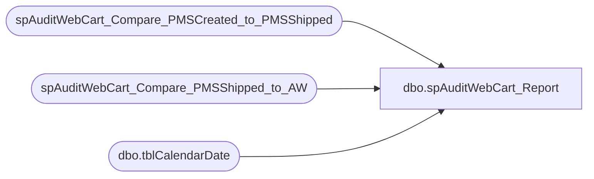

# dbo.spAuditWebCart_Report

**Database:** dw  
**Server:** papamart  

## Architecture Diagram



## Table Dependencies

| Referenced Table |
|---|
| spAuditWebCart_Compare_PMSCreated_to_PMSShipped |
| spAuditWebCart_Compare_PMSShipped_to_AW |
| dbo.tblCalendarDate |

## Stored Procedure Code

```sql
CREATE   procedure spAuditWebCart_Report(
@bUseFiscalWeek_InsteadOfMonth bit 
,@bUseCurrentPeriod_InsteadOfLast bit
)
as 

--declare @bUseFiscalWeek_InsteadOfMonth bit
--select @bUseFiscalWeek_InsteadOfMonth=1

--#####################################################################################
declare @this_Fiscal_Month tinyint, @this_Fiscal_Year smallint, @this_Fiscal_Week tinyint

select @this_Fiscal_Year=merch_year, @this_Fiscal_Month=merch_period, @this_Fiscal_Week=merch_week 
from Kodiak.BearHouse.dbo.tblCalendarDate 
where calendar_date=cast(convert(varchar(50),getdate(),1) as smalldatetime)

--select @this_Fiscal_Year, @merch_period, @merch_week


if (@bUseCurrentPeriod_InsteadOfLast=0) begin
	if(@bUseFiscalWeek_InsteadOfMonth=1)begin
		if(@this_Fiscal_Week = 1)begin
			set @this_Fiscal_Week = 52
		end
		else begin
			set @this_Fiscal_Year = @this_Fiscal_Year -1
			set @this_Fiscal_Week = @this_Fiscal_Week -1
		end
	end
	else begin
		if(@this_Fiscal_Month = 1)begin
			set @this_Fiscal_Year = @this_Fiscal_Year -1
			set @this_Fiscal_Month = 12
		end
		else begin
			set @this_Fiscal_Month = @this_Fiscal_Month -1
		end
	end
end

--select @merch_year, @merch_period, @merch_week


--#####################################################################################
declare @FirstDate datetime, @LastDate datetime

if(@bUseFiscalWeek_InsteadOfMonth=1)begin
	select @FirstDate=min(calendar_date), @LastDate=max(calendar_date) 
	from Kodiak.BearHouse.dbo.tblCalendarDate 
	where merch_period=@this_Fiscal_Month and merch_year=@this_Fiscal_Year
end
else begin
	select @FirstDate=min(calendar_date), @LastDate=max(calendar_date) 
	from Kodiak.BearHouse.dbo.tblCalendarDate 
	where merch_week=@this_Fiscal_Week and merch_year=@this_Fiscal_Year
end

select case @bUseFiscalWeek_InsteadOfMonth 
	when 1 then 'Report Fiscal Week'
	else 'Report Fiscal Month'
	end as UseFiscalWeek_InsteadOfMonth
, @FirstDate as FirstDate, @LastDate as LastDate, @this_Fiscal_Month as this_Fiscal_Month, @this_Fiscal_Year as this_Fiscal_Year, @this_Fiscal_Week as this_Fiscal_Week
--#####################################################################################
DECLARE @bReusePMSCreatedCompareToShippedTempTable bit
	,@bDeletePMSCreatedCompareToShippedTempTableWhenFinished bit
	,@bShowDetails bit


select @bDeletePMSCreatedCompareToShippedTempTableWhenFinished=0, @bShowDetails=0
EXEC spAuditWebCart_Compare_PMSCreated_to_PMSShipped @FirstDate, @LastDate, @bDeletePMSCreatedCompareToShippedTempTableWhenFinished, @bShowDetails


select @bReusePMSCreatedCompareToShippedTempTable=1
	,@bDeletePMSCreatedCompareToShippedTempTableWhenFinished=1
	,@bShowDetails=0
EXEC spAuditWebCart_Compare_PMSShipped_to_AW @FirstDate, @LastDate, @bReusePMSCreatedCompareToShippedTempTable, @bDeletePMSCreatedCompareToShippedTempTableWhenFinished, @bShowDetails
```

