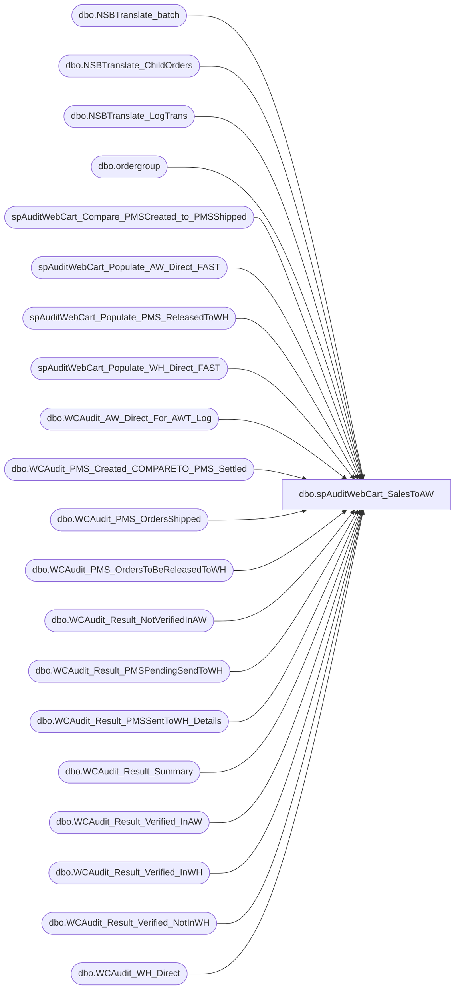

# dbo.spAuditWebCart_SalesToAW

**Database:** dw  
**Server:** papamart  

## Architecture Diagram



## Table Dependencies

| Referenced Table |
|---|
| dbo.NSBTranslate_batch |
| dbo.NSBTranslate_ChildOrders |
| dbo.NSBTranslate_LogTrans |
| dbo.ordergroup |
| spAuditWebCart_Compare_PMSCreated_to_PMSShipped |
| spAuditWebCart_Populate_AW_Direct_FAST |
| spAuditWebCart_Populate_PMS_ReleasedToWH |
| spAuditWebCart_Populate_WH_Direct_FAST |
| dbo.WCAudit_AW_Direct_For_AWT_Log |
| dbo.WCAudit_PMS_Created_COMPARETO_PMS_Settled |
| dbo.WCAudit_PMS_OrdersShipped |
| dbo.WCAudit_PMS_OrdersToBeReleasedToWH |
| dbo.WCAudit_Result_NotVerifiedInAW |
| dbo.WCAudit_Result_PMSPendingSendToWH |
| dbo.WCAudit_Result_PMSSentToWH_Details |
| dbo.WCAudit_Result_Summary |
| dbo.WCAudit_Result_Verified_InAW |
| dbo.WCAudit_Result_Verified_InWH |
| dbo.WCAudit_Result_Verified_NotInWH |
| dbo.WCAudit_WH_Direct |

## Stored Procedure Code

```sql
CREATE  procedure [dbo].[spAuditWebCart_SalesToAW]
(@firstDate as smalldatetime = null
,@lastDate as smalldatetime = null
)
as

-- SET QUOTED_IDENTIFIER ON 
-- GO
-- SET ANSI_NULLS ON 
-- GO
 
-- declare @firstDate as smalldatetime
-- declare @lastDate as smalldatetime


declare @today as smalldatetime, @daysBack as smallint
select @today = Cast(Convert(varchar(20), getdate(), 1) as smalldatetime)
select @daysBack = 45

if (@firstDate is null or @lastDate is null ) begin
	select @firstDate = DateAdd(day, - @daysBack, @today)
		, @lastDate = DateAdd(day, -1, @today)
end

---------------------------------------------------------------------
exec spAuditWebCart_Compare_PMSCreated_to_PMSShipped @firstDate, @lastDate, 0, 0, 0
---------------------------------------------------------------------

---------------------------------------------------------------------
--FINAL TABLE to query for the result
IF (Object_ID('queries.dbo.WCAudit_Result_Summary') IS NOT NULL) DROP TABLE queries.dbo.WCAudit_Result_Summary

create table queries.dbo.WCAudit_Result_Summary(
	DateCreated smalldatetime
	,Created int
	,Amount_Created money
	,Cancelled int null
	,Amount_Cancelled money null
	,BeingBuilt int null
	,Amount_BeingBuilt money null
	,NoShipPending int null
	,Amount_NoShipPending money null
	,Shipped int null
	,Amount_Shipped money null
	,PMS_PendSendToWH int null	
	,PMS_SentToWH int null
	,PMS_SentAndInWH int null
	,PMS_SentButNotInWH int null
 	,WH_Cancelled int null
-- 	,WH_Amount_Cancelled money null
 	,WH_BeingBuilt int null
-- 	,WH_Amount_BeingBuilt money null
	,WH_Shipped int null
-- 	,WH_Amount_Shipped money null
	,PendingSettlement int NULL
	,Settled int null
	,InAw int null
	,NotForAW int null
	,Verified_InAW int null
	,Amount_Verified_InAW money null
	,Verified_NotInAW int null
	,Amount_Verified_NotInAW money null
	,DupeTrans_InAW int null
	,Amount_Duped money null
)
create index ix_WebCartAudit_DateCreated on queries.dbo.WCAudit_Result_Summary(DateCreated)
---------------------------------------------------------------------


---------------------------------------------------------------------
--1. Get PMS data for created orders

insert into queries.dbo.WCAudit_Result_Summary
(DateCreated, Created, Amount_Created)
select --PMS_Created_Site as Site,
	PMS_Created_DateOrderCreated as DateCreated
	,count(*) as Created
	,SUM(PMS_Created_TotalAmount) as Amount_Created
	--,SUM(PMS_Created_ItemAmount) as ItemAmount
	--,SUM(PMS_Created_ShippingAmount) as ShippingAmount
	--,SUM(PMS_Created_ItemCount) as ItemCount
from queries.dbo.WCAudit_PMS_Created_COMPARETO_PMS_Settled
group by PMS_Created_DateOrderCreated --, PMS_Created_Site
order by PMS_Created_DateOrderCreated --, PMS_Created_Site
---------------------------------------------------------------------


---------------------------------------------------------------------
--2. Update final table with PMS CREATED ORDERS details

--pull PMS data for CREATED ORDERS into TEMP table
--Step 1 of 2
select PMS_Created_DateOrderCreated as DateCreated
	,PMS_Created_ProductionStatusCode as Status
	,count(*) as Orders
	,SUM(PMS_Created_TotalAmount) as TotalAmount
	,case when PMS_NoShip_OrderNumber Is NOT Null then 1 else 0 end as IsNoShip
into #createdDetails
from queries.dbo.WCAudit_PMS_Created_COMPARETO_PMS_Settled
group by PMS_Created_ProductionStatusCode
	, PMS_Created_DateOrderCreated
	, case when PMS_NoShip_OrderNumber Is NOT Null then 1 else 0 end
	--, PMS_Created_Site
order by PMS_Created_DateOrderCreated
	, PMS_Created_ProductionStatusCode 
	--, PMS_Created_Site


--pull PMS data for CREATED ORDERS into TEMP table
--Step 2 of 2
select DateCreated, Sum(Cancelled) as Cancelled, Sum(Completed) as Shipped, Sum(Released + Wait) as BeingBuilt, Sum(NoShipPending) as NoShipPending
	, Sum(Amount_Cancelled) as Amount_Cancelled, Sum(Amount_Completed) as Amount_Shipped, Sum(Amount_Released + Amount_Wait) as Amount_BeingBuilt, Sum(Amount_NoShipPending) as Amount_NoShipPending
into #createdDetails2
from (
	select DateCreated
	,case WHEN Status = 'Canceled' THEN Orders ELSE	0 END as Cancelled
	,case WHEN Status = 'Completed' THEN Orders ELSE 0 END as Completed
	,case WHEN Status = 'Released' AND IsNoShip=0 THEN Orders ELSE 0 END as Released
	,case WHEN Status = 'Wait' AND IsNoShip=0 THEN Orders ELSE 0 END as Wait
	,case WHEN Status IN ('Wait', 'Released') AND IsNoShip=1 THEN Orders ELSE 0 END as NoShipPending
	
	,case WHEN Status = 'Canceled' THEN TotalAmount ELSE 0 END as Amount_Cancelled
	,case WHEN Status = 'Completed' THEN TotalAmount ELSE 0 END as Amount_Completed
	,case WHEN Status = 'Released' AND IsNoShip=0 THEN TotalAmount ELSE 0 END as Amount_Released
	,case WHEN Status = 'Wait' AND IsNoShip=0 THEN TotalAmount ELSE 0 END as Amount_Wait
	,case WHEN Status IN ('Wait', 'Released') AND IsNoShip=1 THEN TotalAmount ELSE 0 END as Amount_NoShipPending
	from #createdDetails
 	) a
group by DateCreated

select * from #createdDetails2

--2. Update final table with PMS CREATED ORDERS details
Update queries.dbo.WCAudit_Result_Summary
set Cancelled=cd2.Cancelled, BeingBuilt=cd2.BeingBuilt, Shipped=cd2.Shipped, NoShipPending=cd2.NoShipPending
	,Amount_Cancelled=cd2.Amount_Cancelled, Amount_BeingBuilt=cd2.Amount_BeingBuilt, Amount_Shipped=cd2.Amount_Shipped, Amount_NoShipPending=cd2.Amount_NoShipPending
from #createdDetails2 cd2
join queries.dbo.WCAudit_Result_Summary wc on cd2.DateCreated=wc.DateCreated
---------------------------------------------------------------------


---------------------------------------------------------------------
--3. Update final table with WEBCART ORDERS settlement and AW flags

--pull PMS data for SHIPPED ORDERS into TEMP table
--Step 1 of 2
select PMS_Created_DateOrderCreated as DateCreated, order_number, sendtosettlement, datesenttosettlement, sendtosalesexport, datesenttosalesexport, PMS_Shipped_ProductionStatusCode
into #ShippedOrderStatus
from BearWebDB.WebCart_Commerce.dbo.ordergroup og
join queries.dbo.WCAudit_PMS_Created_COMPARETO_PMS_Settled ship with (nolock)
on ship.PMS_Shipped_OrderNumber = og.order_number
where order_number in 
	(
	select PMS_Shipped_OrderNumber 
	from queries.dbo.WCAudit_PMS_Created_COMPARETO_PMS_Settled with (nolock)
	where PMS_Shipped_OrderNumber is not null
	)


--pull PMS data for SHIPPED ORDERS into TEMP table
--Step 2 of 2
select DateCreated
	, count(*) as Orders
	, sendtosettlement
	, sendtosalesexport
	, PMS_Shipped_ProductionStatusCode as Status
into #CompletedDetails
from #ShippedOrderStatus
group by sendtosettlement
	, sendtosalesexport
	, PMS_Shipped_ProductionStatusCode
	, DateCreated
order by DateCreated, sendtosettlement, sendtosalesexport


--Update final table with PMS SHIPPED ORDERS details
select DateCreated, Sum(Settled) as Settled, Sum(inAW) as inAW, Sum(NotForAW) as NotForAW
into #CompletedDetails2
from (
	select DateCreated
	,case WHEN SendToSettlement in (2,3) THEN orders ELSE 0 END as Settled
	,case WHEN SendToSalesExport = 2 THEN orders ELSE 0 END as inAW
	,case WHEN SendToSalesExport = 3 THEN orders ELSE 0 END as NotForAW
	from #CompletedDetails
 	) a
group by DateCreated

--3. Update final table with WEBCART ORDERS settlement and AW flags
Update queries.dbo.WCAudit_Result_Summary
set Settled=cd2.Settled, inAW=cd2.inAW, NotForAW=cd2.NotForAW
from #CompletedDetails2 cd2
join queries.dbo.WCAudit_Result_Summary wc on cd2.DateCreated=wc.DateCreated
------------------------------------------------------------------------------------


------------------------------------------------------------------------------------
--4. Update final table with SHIPPED ORDERS Verified in AW details

	------------------------------------------------------------------------------------
	--update this table used by spAuditWebCart_Populate_AW_Direct_FAST 
	-- 			    and spAuditWebCart_Populate_WH_Direct_FAST
	IF (Object_ID('tempdb..#WCAudit_OrdersShipped') IS NOT NULL) DROP TABLE #WCAudit_OrdersShipped
	select sProductionOrderNumber as OrderNumber 
	into #WCAudit_OrdersShipped
	from queries.dbo.WCAudit_PMS_OrdersShipped
	


--COLLECT AW DATA
EXEC spAuditWebCart_Populate_AW_Direct_FAST @firstDate, @lastDate
------------------------------------------------------------------------------------


IF (Object_ID('queries.dbo.WCAudit_Result_Verified_InAW') IS NOT NULL) DROP TABLE queries.dbo.WCAudit_Result_Verified_InAW
select created.PMS_Created_DateOrderCreated as DateCreated
	, count(aw.AW_OrderNumber) as Verified_InAW
	, Amount_Verified_InAW = sum(aw.AW_CCAmount + aw.AW_GCAmount + aw.AW_SFSAmount)
	--, AW_transaction_void_flag --, AW_Line_void_flag
into queries.dbo.WCAudit_Result_Verified_InAW
from papamart.queries.dbo.WCAudit_AW_Direct_For_AWT_Log as aw
join papamart.queries.dbo.WCAudit_PMS_Created_COMPARETO_PMS_Settled as created
	on aw.AW_OrderNumber = created.PMS_Created_OrderNumber
group by created.PMS_Created_DateOrderCreated--, AW_transaction_void_flag


--select * from queries.dbo.WCAudit_Result_Verified_InAW  
--select * from papamart.queries.dbo.WCAudit_AW_Direct_For_AWT_Log as aw
--select  from queries.dbo.WCAudit_PMS_Created_COMPARETO_PMS_Settled

------------------------------------------------------------------------------------
--4. Update final table with SHIPPED ORDERS Verified in AW details
Update queries.dbo.WCAudit_Result_Summary
set Verified_InAW=aw.Verified_InAW, Amount_Verified_InAW=aw.Amount_Verified_InAW
from queries.dbo.WCAudit_Result_Verified_InAW aw 
join queries.dbo.WCAudit_Result_Summary wc 
	on aw.DateCreated=wc.DateCreated
------------------------------------------------------------------------------------


--===================================================================================
--7. 
--NEW WH STUFF STARTS HERE

	------------------------------------------------------------------------------------
	-- GET PMS RELEASED to WH ORDERS details
	EXEC spAuditWebCart_Populate_PMS_ReleasedToWH
	
	EXEC spAuditWebCart_Populate_WH_Direct_FAST
	

	IF (Object_ID('queries.dbo.WCAudit_Result_PMSPendingSendToWH_Details') IS NOT NULL) DROP TABLE queries.dbo.WCAudit_Result_PMSPendingSendToWH_Details

	select 	pms.dDateOrderCreated as 'PMS_DateCreated'
		, pms.sProductionOrderNumber as 'PMS_OrderNumber'
	into queries.dbo.WCAudit_Result_PMSPendingSendToWH_Details
	from queries.dbo.WCAudit_PMS_OrdersToBeReleasedToWH pms
	Where iProductionOrderWH_version IS NULL

	IF (Object_ID('queries.dbo.WCAudit_Result_PMSPendingSendToWH') IS NOT NULL) DROP TABLE queries.dbo.WCAudit_Result_PMSPendingSendToWH

	select 	pms.dDateOrderCreated as 'PMS_DateCreated'
		, Count(pms.sProductionOrderNumber) as 'PMS_OrdersPendSendToWH'
	into queries.dbo.WCAudit_Result_PMSPendingSendToWH
	from queries.dbo.WCAudit_PMS_OrdersToBeReleasedToWH pms
	Where iProductionOrderWH_version IS NULL
	Group By pms.dDateOrderCreated

	-- Update final table with PMS ORDERDS PENDING SEND TO WH
	Update queries.dbo.WCAudit_Result_Summary
		set PMS_PendSendToWH = PMS_OrdersPendSendToWH
	from queries.dbo.WCAudit_Result_PMSPendingSendToWH wh 
	join queries.dbo.WCAudit_Result_Summary wc 
		on wh.PMS_DateCreated=wc.DateCreated


	IF (Object_ID('queries.dbo.WCAudit_Result_PMSSentToWH_Details') IS NOT NULL) DROP TABLE queries.dbo.WCAudit_Result_PMSSentToWH_Details

	select 	pms.dDateOrderCreated as 'PMS_DateCreated'
		, pms.sWHPickTicket as 'PMS_PickTicket'
		, wh.WH_pick_ticket as 'WH_PickTicket'
		, Case when wh.WH_statusCode = 90 then 1 end as 'WH_Shipped'
		, Case when wh.WH_statusCode = 99 then 1 end as 'WH_Cancelled'
		, Case when wh.WH_statusCode NOT in (90,99) then 1 end as 'WH_InBuild'
	into queries.dbo.WCAudit_Result_PMSSentToWH_Details
	from papamart.queries.dbo.WCAudit_WH_Direct as wh
	right join  papamart.queries.dbo.WCAudit_PMS_OrdersToBeReleasedToWH as pms
		on wh.WH_pick_ticket = pms.sWHPickTicket
	Where pms.iProductionOrderWH_version IS NOT NULL


	------------------------------------------------------------------------------------
	-- GET PMS sent pick tickets veried in WH

	IF (Object_ID('queries.dbo.WCAudit_Result_Verified_InWH') IS NOT NULL) DROP TABLE queries.dbo.WCAudit_Result_Verified_InWH
	
	select PMS_DateCreated
		, Sum(WH_Shipped) as WH_Shipped
		, Sum(WH_Cancelled) as WH_Cancelled
		, Sum(WH_InBuild) as WH_InBuild
		, 0 as WH_TotalInWH
	into queries.dbo.WCAudit_Result_Verified_InWH
	from queries.dbo.WCAudit_Result_PMSSentToWH_Details
	where WH_PickTicket IS NOT NULL
	group by PMS_DateCreated


	IF (Object_ID('tempdb..#TotalVerifiedInWH') IS NOT NULL) DROP TABLE #TotalVerifiedInWH
	
	select PMS_DateCreated
		, Sum(ISNULL(WH_Shipped, 0) 
			--+ ISNULL(WH_Cancelled, 0)
			+ ISNULL(WH_InBuild, 0)) as WH_TotalIn
	into #TotalVerifiedInWH
	from queries.dbo.WCAudit_Result_Verified_InWH
	group by PMS_DateCreated

	-- Update final table with PMS sent pick tickets veried in WH
	Update queries.dbo.WCAudit_Result_Verified_InWH
		set WH_TotalInWH = WH_TotalIn
	from #TotalVerifiedInWH twh 
	join queries.dbo.WCAudit_Result_Verified_InWH wh 
		on twh.PMS_DateCreated=wh.PMS_DateCreated

	-- Update final table with PMS sent pick tickets veried in WH
	Update queries.dbo.WCAudit_Result_Summary
		set PMS_SentAndInWH = WH_TotalInWH
		,WH_Shipped = wh.WH_Shipped
		,WH_Cancelled = wh.WH_Cancelled
		,WH_BeingBuilt = wh.WH_InBuild
	from queries.dbo.WCAudit_Result_Verified_InWH wh 
	join queries.dbo.WCAudit_Result_Summary wc 
		on wh.PMS_DateCreated=wc.DateCreated

	------------------------------------------------------------------------------------
	-- GET Pick Tickets Verified Not In WH
	IF (Object_ID('queries.dbo.WCAudit_Result_Verified_NotInWH') IS NOT NULL) DROP TABLE queries.dbo.WCAudit_Result_Verified_NotInWH
	
	select PMS_DateCreated
		, Count(*) as SentButNotInWH
	into queries.dbo.WCAudit_Result_Verified_NotInWH
	from queries.dbo.WCAudit_Result_PMSSentToWH_Details
	where WH_PickTicket IS NULL
	group by PMS_DateCreated		

	-- Update final table with PMS sent pick tickets veried in WH
	Update queries.dbo.WCAudit_Result_Summary
		set PMS_SentButNotInWH = SentButNotInWH
	from queries.dbo.WCAudit_Result_Verified_NotInWH wh 
	join queries.dbo.WCAudit_Result_Summary wc 
		on wh.PMS_DateCreated=wc.DateCreated

--NEW WH STUFF ENDS HERE
--7.
--===================================================================================


-------------------------------------------------------------------------------------
--FIND MISSING TRANS
IF (Object_ID('queries.dbo.WCAudit_Result_NotVerifiedInAW') IS NOT NULL) DROP TABLE queries.dbo.WCAudit_Result_NotVerifiedInAW

select created.PMS_Created_Site as PMS_Site
	, created.PMS_Created_DateOrderCreated as PMS_DateOrderCreated
	, created.PMS_Created_OrderNumber as PMS_OrderNumber
	, created.PMS_Created_TotalAmount as PMS_Created_TotalAmount
	, created.PMS_Created_ProductionStatusCode as PMS_StatusCode
	, created.PMS_Shipped_DateTimeShipped as PMS_DateTimeShipped
	, created.PMS_Shipped_TotalAmount as PMS_Shipped_TotalAmount
into queries.dbo.WCAudit_Result_NotVerifiedInAW
from papamart.queries.dbo.WCAudit_AW_Direct_For_AWT_Log as aw
right join papamart.queries.dbo.WCAudit_PMS_Created_COMPARETO_PMS_Settled as created
	on aw.AW_OrderNumber = created.PMS_Created_OrderNumber
where aw.AW_OrderNumber is NULL
order by  PMS_Created_DateOrderCreated

--select * from queries.dbo.WCAudit_Result_NotVerifiedInAW 

--remove MISC from "Missing"
delete from queries.dbo.WCAudit_Result_NotVerifiedInAW 
where PMS_DateTimeShipped is null	--Cancelled, wait, ready, completed but not shipped


--remove UDA from MISSING
delete from queries.dbo.WCAudit_Result_NotVerifiedInAW 
where PMS_OrderNumber in (select order_number from bearwebdb.webcart_Commerce.dbo.ordergroup where sendtosalesexport=3)

/*
remove child orders from missing
  these children are rolled up into the parent in AWT 
  so, only the parents ordernumber will appear in AW but the lines for the child orders are there also
*/
delete from queries.dbo.WCAudit_Result_NotVerifiedInAW
where PMS_OrderNumber in (select childOrderNumber from bearwebdb.webcart_Commerce.dbo.NSBTranslate_ChildOrders)


IF (Object_ID('tempdb..#OrdersPendingSettlement') IS NOT NULL) DROP TABLE #OrdersPendingSettlement
--get orders pending settlement
select  created.PMS_Created_Site as PMS_Site
	, created.PMS_Created_DateOrderCreated as PMS_DateOrderCreated
	, created.PMS_Created_OrderNumber as PMS_OrderNumber
	, created.PMS_Created_TotalAmount as PMS_Created_TotalAmount
	, created.PMS_Created_ProductionStatusCode as PMS_StatusCode
	, created.PMS_Shipped_DateTimeShipped as PMS_DateTimeShipped
	, created.PMS_Shipped_TotalAmount as PMS_Shipped_TotalAmount
into #OrdersPendingSettlement
from bearwebdb.webcart_Commerce.dbo.OrderGroup  og
join papamart.queries.dbo.WCAudit_PMS_Created_COMPARETO_PMS_Settled as created
	on og.Order_Number = created.PMS_Created_OrderNumber
Where og.SendToSettlement = 1


IF (Object_ID('tempdb..#OrdersPendingSettlementByDay') IS NOT NULL) DROP TABLE #OrdersPendingSettlementByDay
--summarize orders pending settlement
select PMS_DateOrderCreated
	, count(*) as OrdersPendingSettlement
into #OrdersPendingSettlementByDay
from #OrdersPendingSettlement
group by PMS_DateOrderCreated

--Update final table with Orders Pending Settlement
Update queries.dbo.WCAudit_Result_Summary
set PendingSettlement = OrdersPendingSettlement
from #OrdersPendingSettlementByDay ps 
join queries.dbo.WCAudit_Result_Summary wc 
	on ps.PMS_DateOrderCreated=wc.DateCreated
--select * from queries.dbo.WCAudit_Result_Summary where 


--remove orders NOT SETTLED from missing
delete from queries.dbo.WCAudit_Result_NotVerifiedInAW
where PMS_OrderNumber in (select PMS_OrderNumber from #OrdersPendingSettlement)


--select * from queries.dbo.WCAudit_Result_NotVerifiedInAW


IF (Object_ID('tempdb..#NotVerifiedInAw_Summary') IS NOT NULL) DROP TABLE #NotVerifiedInAw_Summary
select PMS_DateOrderCreated
	, count(*) as CountNotInAW
	, sum(PMS_Shipped_TotalAmount) as AmountShipNotInAW
into #NotVerifiedInAw_Summary
from queries.dbo.WCAudit_Result_NotVerifiedInAW
group by PMS_DateOrderCreated


--Update final table with Verified_NotInAW
Update queries.dbo.WCAudit_Result_Summary
set Verified_NotInAW = CountNotInAW, Amount_Verified_NotInAW = AmountShipNotInAW
from #NotVerifiedInAw_Summary naw 
join queries.dbo.WCAudit_Result_Summary wc 
	on naw.PMS_DateOrderCreated=wc.DateCreated


--------------------------------------------------------------------------------------
--START-- Add dupe detection reporting

IF (Object_ID('tempdb..#dupeInAW_Step1') IS NOT NULL) DROP TABLE #dupeInAW_Step1
--get Un-Voided dupe order entries
select AW_Site
	,AW_OrderNumber
	,count(AW_OrderNumber) as [count]
	,AW_ReqToSettleDate 
	,AW_CCAmount 
	,AW_GCAmount
	,AW_SFSAmount
into #dupeInAW_Step1
 from queries.dbo.WCAudit_AW_Direct_For_AWT_Log 
where AW_transaction_void_flag = 0	--Only care about DUPES NOT VOIDED
group by AW_Site
	,AW_OrderNumber	
	,AW_ReqToSettleDate 
	,AW_CCAmount 
	,AW_GCAmount
	,AW_SFSAmount
having count(AW_OrderNumber) > 1	--must be > 1 or it is not an un-Voided Dupe
order by AW_Site, AW_OrderNumber, AW_ReqToSettleDate


IF (Object_ID('tempdb..#dupeInAW_Step2') IS NOT NULL) DROP TABLE #dupeInAW_Step2
--Get the AW trans no. for those dupes
select AW_Site, AW_OrderNumber, AW_TranNo, AW_ReqToSettleDate
into #dupeInAW_Step2
from queries.dbo.WCAudit_AW_Direct_For_AWT_Log AWT
where AW_OrderNumber in (select AW_OrderNumber from #dupeInAW_Step1)
order by AW_Site, AW_OrderNumber, AW_TranNo, AW_ReqToSettleDate


IF (Object_ID('queries.dbo.WCAudit_Result_DupesInAW') IS NOT NULL) DROP TABLE queries.dbo.WCAudit_Result_DupesInAW


--The next query is for DEV USAGE
--Get the AWT batch processing info for the dupes
select lt.sBatchID, b.bSentToAW, b.dTimeStamp, AW_Site, lt.iStoreID, AW_ReqToSettleDate, AW_OrderNumber, AW_TranNo, lt.iAWTransID
into queries.dbo.WCAudit_Result_DupesInAW
from #dupeInAW_Step2 s2 
left join BearWebDB.WebCart_Commerce.dbo.NSBTranslate_LogTrans lt
	on s2.AW_TranNo = lt.iAWTransID
inner join BearWebDB.WebCart_Commerce.dbo.NSBTranslate_batch b
	on b.sBatchID = lt.sBatchID
order by lt.sBatchID, AW_OrderNumber, AW_TranNo


/* MOVED TO DTS
--2nd level summary of dupes, by batch ID

select sBatchID, bSentToAW, AW_Site, iStoreID, count(*) 
from queries.dbo.WCAudit_Result_DupesInAW 
group by sBatchID, bSentToAW, AW_Site, iStoreID
*/


IF (Object_ID('tempdb..#dupesByCreateDate') IS NOT NULL) DROP TABLE #dupesByCreateDate
select PMS_Created_DateOrderCreated as DateCreated
	,count(*) as CountDupeTransInAW
	,SUM(AW_CCAmount + AW_GCAmount + AW_SFSAmount) as AmountDupeInAW
into #dupesByCreateDate
from queries.dbo.WCAudit_PMS_Created_COMPARETO_PMS_Settled CS
	join #dupeInAW_Step1 DUP on DUP.AW_OrderNumber = CS.PMS_Created_OrderNumber
group by PMS_Created_DateOrderCreated
order by PMS_Created_DateOrderCreated

--Update final table with PMS SHIPPED ORDERS details
Update queries.dbo.WCAudit_Result_Summary
set DupeTrans_InAW = DUP.CountDupeTransInAW, Amount_Duped = DUP.AmountDupeInAW
from #dupesByCreateDate DUP 
	join queries.dbo.WCAudit_Result_Summary wc on DUP.DateCreated=wc.DateCreated

--END-- Add dupe detection reporting
------------------------------------------------------------------------------------

/*
MOVED TO DTS

declare @sql as varchar(5000)
set @sql = 'select Cast(DateCreated as varchar(6)) as DateCreate
		,Cast(Created as varchar(6)) as Created
		,Cast(Amount_Created as varchar(9)) as [$_Created]
		,Cast(Cancelled as varchar(6)) as Cancel
		,Cast(Amount_Cancelled as varchar(9)) as [$_Cancel]
		,Cast(BeingBuilt as varchar(6)) as Build
		,Cast(Amount_BeingBuilt as varchar(9)) as [$_Building]
		,Cast(Shipped as varchar(6)) as Shipped
		,Cast(Amount_Shipped as varchar(9)) as [$_Shipped]
-- 		,cast(''|'' as char(1)) as [|]
		,Cast(ISNULL(Settled,0) as varchar(6)) as Settled
		,Cast(ISNULL(NotForAW,0) as varchar(6)) as NotForAW
		,Cast(ISNULL(InAW,0) as varchar(6)) as SentToAW
		,Cast((ISNULL(Settled,0) - ISNULL(NotForAW,0) - ISNULL(InAW,0)) as varchar(6)) as NotSentToAW
-- 		,cast(''|'' as char(1)) as [|]
		,Cast(ISNULL(Verified_InAW,0) as varchar(6)) as InAW
		,Cast(ISNULL(Amount_Verified_InAW,0) as varchar(9)) as [$_InAW]
		,Cast(ISNULL(Verified_NotInAW,0) as varchar(9)) as NotInAW
		,Cast(ISNULL(Amount_Verified_NotInAW,0) as varchar(9)) as [$_NotInAW]
		,Cast(ISNULL(DupeTrans_InAW,0) as varchar(9)) as DupesInAW
		,Cast(ISNULL(Amount_Duped,0) as varchar(9)) as [$_DupesInAW]
	from queries.dbo.WCAudit_Result_Summary 
	order by DateCreated DESC'

*/


-- exec master.dbo.xp_sendmail @recipients= 'brada@buildabear.com;'
-- ,@copy_recipients = ''
-- ,@subject = 'Basic Webcart Audit - 45 days rolling'
-- 
-- ,@width=180
-- ,@message = 'Source: Papamart.DW.spAuditWebCart_SalesToAW (DTS: AuditWebcart_SalesToAW)
-- Schedule:  5:30 AM Daily
-- results located at S:\IT Party Reports\WebCart\WebCart_SalesFlowAudit.xls
-- 
-- After opening the Excel sheet, you will need to right-click on the data and select "refresh" to be sure you have the latest data.'
-- --,@query = @sql


--exec queries.dbo.spWebCartToAWAuditSummary_Email

drop table #createdDetails
drop table #createdDetails2
drop table #ShippedOrderStatus
drop table #CompletedDetails
drop table #CompletedDetails2
dbo,spAuditWebCart,--papamart.dw

/*
DECLARE @RC int
DECLARE @AW_StartDate datetime
DECLARE @AW_EndDate datetime
DECLARE @iStore int
-- Set parameter values
EXEC @RC = dw.dbo.spAuditWebCart '1/6/06', '1/7/06', 13, 0
*/

CREATE  PROC spAuditWebCart
(@AW_StartDate datetime, @AW_EndDate datetime, @iStore int, @bIncludeAWArchive bit = 0)
AS
BEGIN

/*
Here is the basic process of webcart order processing:
Step 1.       WebCart Order creation (Daily web sales Summary report) à 
Step 2.       PMS import à 
Step 3.       Web shop fulfillment and shipping (order is now “shipped” status) à 
Step 4.       PMS updates “shipped” orders in WebCart DB to queue them for CC settlement à 
Step 5.       Post Production Service settles via SkipJack (and flags order as ready to export to Audit Works) à 
Step 6.       Post Production Service performs Audit works translation and sends data to Audit Works à
Step 7.       AuditWorks
Steps 1 thru 4 (order processing) are monitored by David Rice and steps 4 thru 7 (post production processing) by Brad Atkinson.  

This SP covers Steps 4 thru 7
*/

DECLARE @SJ_StartDate datetime, @SJ_EndDate datetime, @Report_StartDate datetime, @Report_EndDate datetime
Set @AW_EndDate=dateadd(dd,+1,@AW_EndDate)

--The day the order was settled
SET @SJ_StartDate=DATEADD(day,-90,@AW_StartDate)--to get deferred ship
SET @SJ_EndDate=DATEADD(day,90,@AW_EndDate)	--15 days should be enough to get the settlement, right?


-- CLEAN UP TEMP TABLES =================================================================================
IF (Object_ID('tempdb.dbo.#Level1_AWT_Log') IS NOT NULL) DROP TABLE dbo.#Level1_AWT_Log
IF (Object_ID('tempdb.dbo.#Level1_CC_Log') IS NOT NULL) DROP TABLE dbo.#Level1_CC_Log
IF (Object_ID('tempdb.dbo.#Level1_AW_Direct_For_AWT_Log') IS NOT NULL) DROP TABLE dbo.#Level1_AW_Direct_For_AWT_Log
IF (Object_ID('tempdb.dbo.#Level1_AW_Direct_For_CC_Log') IS NOT NULL) DROP TABLE dbo.#Level1_AW_Direct_For_CC_Log
IF (Object_ID('tempdb.dbo.#Level1_PMS_WebShopOrdersCreated') IS NOT NULL) DROP TABLE #Level1_PMS_WebShopOrdersCreated
IF (Object_ID('tempdb.dbo.#Level1_PMS_WebShopOrdersShipped') IS NOT NULL) DROP TABLE #Level1_PMS_WebShopOrdersShipped

--=======================================================================================================
--Create Level 1 TEMP Tables

CREATE TABLE #Level1_AWT_Log
	(
	ID int IDENTITY (1,1)
	,iStoreID int
	,AWT_Date datetime
	,sBatchID varchar(50)
	,iAWTransID int
	,Original_OrderNumber varchar(50)
	,mAmount money
	,iUnits int
	,bSentToAW bit default 0
	)    

CREATE TABLE #Level1_CC_Log
	(
	ID int IDENTITY (1,1)
	,iStoreID int
	,CC_SettlementRequest_Date datetime
	,SJ_OrderNumber varchar(50)
	,Original_OrderNumber varchar(50)
	,mAmount money
	)

--EVERY AW Transaction (Unique by AW.Transaction Number which is equivelent to SJ.AWTransID)
CREATE TABLE #Level1_AW_Direct_For_AWT_Log
	(
	ID int IDENTITY (1,1)
	,AW_Site varchar(50)
	,AW_TranNo int
	,AW_OrderNumber varchar(50)
	,AW_ReqToSettleDate datetime
	,AW_CCAmount money
	,AW_GCAmount money
	,AW_Archive bit
	)

--EVERY CC Charge with SJ order number or SJ TransID that was used to request settlement
CREATE TABLE #Level1_AW_Direct_For_CC_Log
	(
	ID int IDENTITY (1,1)
	,AW_Site varchar(50)
	,AW_TranNo int
	,AW_OrderNumber varchar(50)
	,AW_ReqToSettleDate datetime
	,AW_CCAmount money
	,SJ_ID_UsedForSettleRequest varchar(100)
	,AW_Archive bit
	)

CREATE TABLE #Level1_PMS_WebShopOrdersCreated(
	iStoreID int
	,sSite varchar(30)
	,dDateOrderCreated datetime
	,sProductionOrderNumber varchar(50)
	,uProductionOrderId uniqueidentifier
	,mItemAmount money
	,mShippingAmount money
	,iItemCount int
	,sProductionStatusCode varchar(50)
)

CREATE TABLE #Level1_PMS_WebShopOrdersShipped(
	iStoreID int
	,sSite varchar(30)
	,dDateOrderShipped datetime
	,sProductionOrderNumber varchar(50)
	,uProductionOrderId uniqueidentifier
	,mItemAmount money
	,mShippingAmount money
	,iItemCount int
	,sProductionStatusCode varchar(50)
)
--=======================================================================================================

--=======================================================================================================
--Populate Level 1 TEMP Tables
--EXEC dbo.spAuditWebCart_PopulateLevel1_AWT_Log @AW_StartDate, @AW_EndDate, @iStore
--EXEC dbo.spAuditWebCart_PopulateLevel1_CC_Log @SJ_StartDate, @SJ_EndDate, @iStore
--EXEC dbo.spAuditWebCart_PopulateLevel1_AW_Direct @AW_StartDate, @AW_EndDate, @iStore
--EXEC dbo.spAuditWebCart_PopulateLevel1_PMS_Created @AW_StartDate, @AW_EndDate, @iStore
EXEC dbo.spAuditWebCart_PopulateLevel1_PMS_Shipped @AW_StartDate, @AW_EndDate, @iStore

if @bIncludeAWArchive = 1 begin
	EXEC dbo.spAuditWebCart_PopulateLevel1_AW_Archive_Direct @AW_StartDate, @AW_EndDate, @iStore
end
--=======================================================================================================


-- RETURN DATA===========================================================================================
--select '#Level1_AWT_Log', * from #Level1_AWT_Log order by AWT_Date
--select '#Level1_CC_Log', * from #Level1_CC_Log order by CC_SettlementRequest_Date --Original_OrderNumber
--select '#Level1_AW_Direct_For_AWT_Log', * from #Level1_AW_Direct_For_AWT_Log
--select '#Level1_AW_Direct_For_CC_Log', * from #Level1_AW_Direct_For_CC_Log
--SELECT '#Level1_PMS_WebShopOrdersCreated', * FROM #Level1_PMS_WebShopOrdersCreated
SELECT '#Level1_PMS_WebShopOrdersShipped', * FROM #Level1_PMS_WebShopOrdersShipped

-- START: COMPARE #Level1_AWT_Log to #Level1_CC_Log =============================================
-- THIS IS VERY TOUGH BECAUSE IT IS A LOOSE CONNECTION
	/*
	-- MISSING 
	select '#Level1_AWT_Log LEFT JOIN #Level1_CC_Log ON Original_OrderNumber',* 
	from #Level1_AWT_Log awt 
		Left join #Level1_CC_Log cc 
		on awt.Original_OrderNumber=cc.Original_OrderNumber
	WHERE awt.mAmount <> cc.mAmount
		or
	 	cc.mAmount is null
	order by AWT_Date, CC_SettlementRequest_Date
	
	-- MATCHES
	select '#Level1_AWT_Log LEFT JOIN #Level1_CC_Log ON Original_OrderNumber', * 
	from #Level1_AWT_Log awt 
		Left join #Level1_CC_Log cc 
		on awt.Original_OrderNumber=cc.Original_OrderNumber
			--and awt.mAmount = cc.mAmount -- THIS WON'T MATCH IF A GC TENDER IN ORDER UNTIL FIX IS IN AWT LOGGING
	order by AWT_Date, CC_SettlementRequest_Date
	*/
-- END: COMPARE #Level1_AWT_Log to #Level1_CC_Log =============================================


-- CLEAN UP =============================================================================================
IF (Object_ID('tempdb.dbo.#Level1_AWT_Log') IS NOT NULL) DROP TABLE dbo.#Level1_AWT_Log
IF (Object_ID('tempdb.dbo.#Level1_CC_Log') IS NOT NULL) DROP TABLE dbo.#Level1_CC_Log
IF (Object_ID('tempdb.dbo.#Level1_AW_Direct_For_AWT_Log') IS NOT NULL) DROP TABLE dbo.#Level1_AW_Direct_For_AWT_Log
IF (Object_ID('tempdb.dbo.#Level1_AW_Direct_For_CC_Log') IS NOT NULL) DROP TABLE dbo.#Level1_AW_Direct_For_CC_Log
IF (Object_ID('tempdb.dbo.#Level1_PMS_WebShopOrdersCreated') IS NOT NULL) DROP TABLE #Level1_PMS_WebShopOrdersCreated
IF (Object_ID('tempdb.dbo.#Level1_PMS_WebShopOrdersShipped') IS NOT NULL) DROP TABLE #Level1_PMS_WebShopOrdersShipped


end
```

